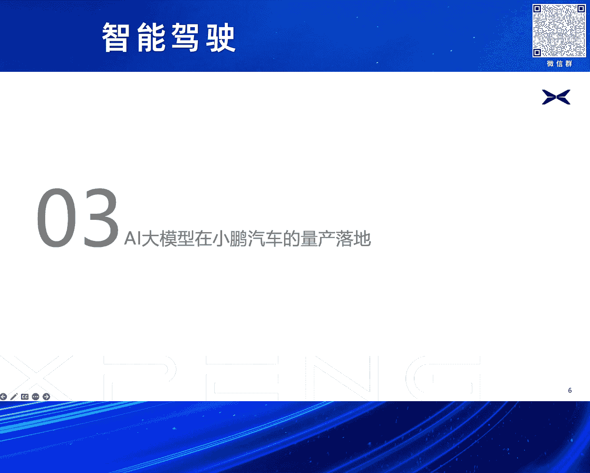
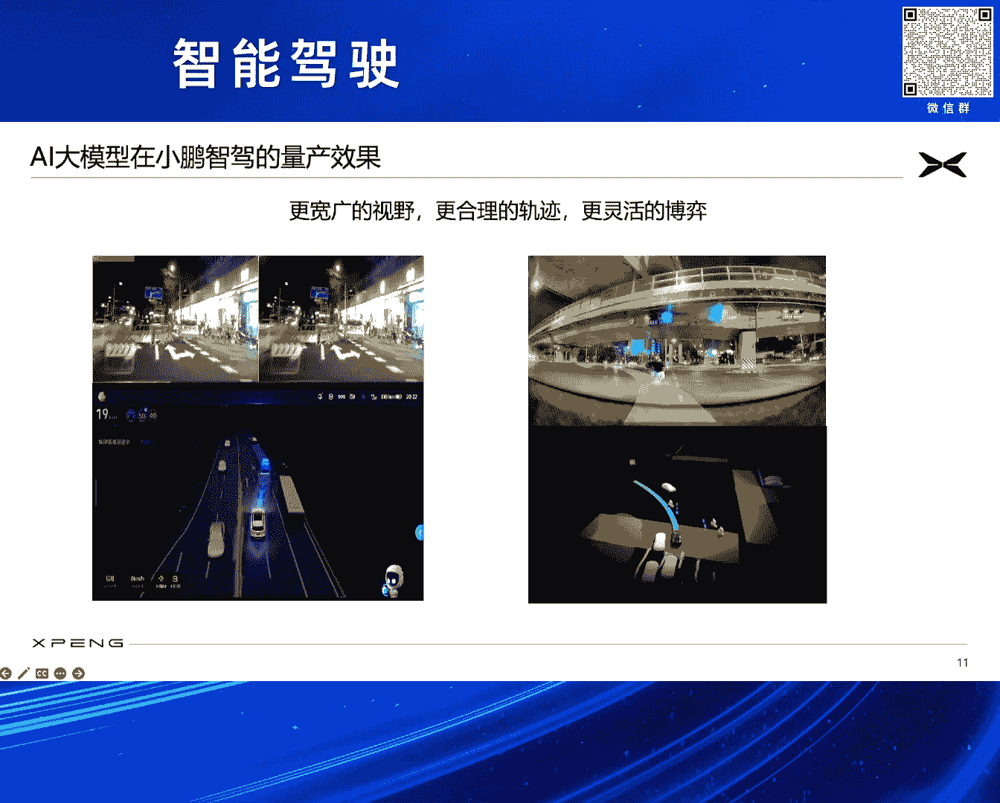

# 2024北京智源大会-智能驾驶 - P3：小鹏汽车AI大模型量产实践：马 君 - 智源社区 - BV1Ww4m1a7gr

感谢这个法网主任，感谢黄院长黄教授，感谢各位嘉宾领导，还有各位朋友们能够在这里，大家怎么说呢，欢聚一堂吧，因为咱们做自动驾驶的，或者做汽车行业怎么说呢，今年的一个最热最热的词就是卷，卷得很辛苦的。

所以希望今天下午能利用这个场合，大家能够放开那些正在很着急，还在回的工作消息，能够不再受到什么各种各样，来自客户的领导的压力，我们能够在一起谋划一下未来，就是看看现在大模型人工智能技术。

到底给我们支架行业，给我们汽车行业，能够带来什么样的变化，所以在此呢，有一些包括小鹏汽车的思考，一些我个人的思考，在这里跟大家集中报告一下，这篇报告的题目叫做，小鹏汽车AI大模型的量产实践。

后面我会有一部分实际上，就是紧扣我们小鹏汽车已经量产的技术，跟大家做一个报告，那么第一部分呢，首先先谈第一个课题，就是我们为什么要去把，AI大模型和汽车放在一起，那么我们要做这个事情的原因是什么。

其实有一个很明确的结论，已经写在这个topic里面了，就是我认为AI大模型给汽车行业，带来了一个历史性的重大机遇，这页材料呢是之前咱们汽车工程学会，曾经组织过一个大模型的研讨会。

当时邀请我去做这个论坛的主席，当时我的一个引导发言，在这里也跟大家再同步一下，就是我们可以看到，现在AI大模型的成功，它的实质是什么，是技术驱动市场，技术使能行业，这样的事情我们回顾。

整个人类的科技发展史，我们总在讲工业革命，工业革命到来之前，资本市场或者用户是毫无觉察的，而是由一些技术的驱动，一些行业的革命，突然间就改天换日，就做了一个特别大的革新，目前呢我认为。

AI大模型有很明显的，传递的这样的迹象，我们可以看到，Chai的GBT问世这才多久，Sara问世这才多久，已经可以看到翻天覆地，每天都有大模型，在各个行业的一些突破，现在基本上所有的巨头。

都已经进入了AI大模型行业，我右边，我在这页PPT左边，列了一些图标或者一些icon，这个不重要，因为我知道这个与会的，来自很多行业的朋友，很多公司朋友，都有非常优秀大模型产品。

这里要列可能得列上百个以上，这列不下来我就只是举了几个，这个并没有任何排位的意思，只说我们可以看到这些大模型，它们现在在各个行业的，发展过程中，其实实质上它创造了，从AI集群。

到整个行业赋能的一个全链条，全行业的想象空间，尤其大家注意一个信号，之前AI大模型，可能离普通用户还比较远，普通用户想的什么呢，我产品经理能不能让，AI大模型给我出一个PD，我是个designer。

能不能帮我出一页的，这个渲染图等等，大家对这个AI大模型，还有一个隔，一个隔阂，这隔阂就终端，之前的这个终端，大家要靠浏览器，再怎么去启动一个，进一个网页或者微信，打开一个助手很费劲。

但最近苹果做的一件事情，就是Apple Intelligence，这个story大家都知道，包括现在可能网上，有各种各样的评论，但我从另外一个视角，去解读这个事情，就是AI大模型会真正的。

向用户可见的终端去touch，这意味着什么，每个人看到AI大模型，和AI大模型，获得一些一手的，直接交互的几率，会不断增高，这种增高会不断传染到，其他行业，那我们再去考虑，用户手里的终端什么。

是手机 是电脑，Pad 尤其手机，那么用户个人，或者是到一个家庭，或者一个组织，最常使用的终端什么，就是我们汽车，所以说现在整个AI大模型，在手机行业开始爆发，我们可以看到，这样的事情。

我认为也会在我们汽车行业，快速爆发并复制，第三点呢，刚才的包括像这个，梁总经理啊，包括像这个法旺主任，黄教授都提到了，现在整个国家呢，对于AI大模型，也非常关注，现在很多这种，示范应用都已经跑起来了。

国家的标准体系，也已经开始启动建设，所以现在可能是一个场合，我们站在国家的角度，站在全行业的角度，考虑一下，AI大模型怎么去负能，尤其AI大模型的核心，我刚才也说过，就是能够使技术，真正把市场驱动起来。

那么再来看一下，AI大模型给我们，汽车行业，尤其智能驾驶领域，带来的负能是什么，这个有一句话，我放在这里就是，它带来了我们走向，全场景无人驾驶的，一个历史境遇，为什么呢，首先我们从技术特征。

AI大模型的技术特征，最重要的是自回归，基于提示词，和上下文的这些技术特征，长序列的理解，长序列的automation机制等等，这些其实和人类，司机驾驶车辆的观测行为呢，它的行为模式是非常接近的。

它具备一个，迁移到自动驾驶场景的，一个天然优势，第二点大家都知道，所有的AI大模型，都具有一个非常神奇的，智能涌现的能力，这个能力其实可以看到，现在在智能驾驶行业上，也有一定的体现，所以我们可以看到。

后面在我的报告中，也会讲到，我们小鹏也发现了，AI大模型上车之后，会出现一些非常非常，可能我们现在用规则，想象不到的一些，非常漂亮的操作，所以这样的话，那么在我们整个，这个智能驾驶的行业。

这个AI大模型，已经有了一些优秀的论文成果，包括去年李教授的，这个CVPR的best paper，包括现在，包括小鹏在内，我们一些企业的一些量产探索，所以我们认为，AI大模型在汽车行业落地。

已经具备了学术基础，以及工程路径，尤其工程路径很重要，因为我一直是在小鹏汽车，做自研做量产，所以说我们特别在乎，任何一个技术，最终如何落地在汽车上面，好，那么既然前景这么美好，那么肯定是有挑战。

那么AI大模型，在汽车行业量产的挑战是什么，这里面我大概就讲了六个点吧，没有落列很多文字，因为每一个方面拿出来，可能半个小时都讲不完，我个人认为，现在AI大模型，在汽车上面去做呢，要有两点，第一点呢。

必须能做到前桩量产，第二点必须能做到，整个工具链，所有链条的全场景应用，什么叫做前桩量产，我们车上跑的，并不是一个超级计算机，也不是一个什么什么的云，我们车上跑的是车规级的，算力和芯片和它的预控制器。

它的算力其实目前来看，还是非常有限的，现在AI大模型，随便一个模型，以随便一个网络，它的参数就是多多少个B，这个听起来是很吓人的，那么在汽车上如果想尽快落地，一定要对AI大模型，适配在汽车上的车规级的。

算力和预控，芯片和预控，要做对应的裁减，要做对应的优化，第二块呢，就是先进网络在车端的部署适配，我们搞那么多的网络和结构，我们在车上去部署，那么第一个问题，算子那些operator支不支持。

整个这个结构支不支持，这个车端上的硬件，它的各种各样的，它的这个延迟delay latency行不行，那么如何把它部署上去，其实里面有大量大量的工程诀窍，有大量的大量的坑要去填。

第三点就是有限性能系统的总体调优，现在可能大家在多少年前，或者包括现在吧，一遇到一个算力问题，如果说是推理算力，都会问多多多个t多多多个t，这只是深度学习的推理算力，所有人可能都忘掉了。

我们还有CPU的算力，忘掉了我们还有内存带宽的限制，忘掉了我们还有传感器，忘掉了我们还有各种各样的接口，我们的PCIE我们的以太网，我们的这个网络结构，节点发现等等，这是一整套的东西。

所以说我们实质上来讲，是在车上一个性能有限的系统，要做一个总体调优，尤其对于我们主机厂，我们要做到前桩量产，我们还必须做到成本可控，不能把最昂贵的最理想的，硬件全堆在车上，一定要有取舍。

这其实也在考验一个工程能力，那么它的全链条全场景应用呢，主要有几块，第一块就数据自动标注，以前在两D的这个世界的时候，当时就做了简单的分类，人工画个点描个框很简单，这个tick打完了，当时成本也可接受。

现在在大模型，见到的全是长序列，既然是一个长序列的一个视频，那么就存在一个问题，我们的标注怎么办，所以我们必须有非常好的，全自动标注能力，不然的话，这个是没有办法把它跑下去的，我们小鹏内部有个实践。

就我们之前在我们那个第一版，最早最早上Transformer上，XNet的时候，我们当时做了一些，全自动标注的尝试，可以把2000人年的标注量，缩短掉16。7人天，标注效率提升了4万5千倍。

所以说如果后续我们还想，消费海量的这些clipse，这些AI大模型，我们的所有的全自动数据标注，必须做得非常的solid，非常的踏实，大家也知道，对于一个计算机深度学习系统。

ground truth is everything，第二点呢，我们需要非常高效的，质算训练的基础设施，其实我们可以看到，现在质算中心，可能大家现在各种各样的原因，把一些地缘政治的原因，卡都变得很火热。

但是呢，说到底呢，做AI大模型的训练，我们也需要一个，有一定的算力支持，不管是所谓的万卡怎么样，但其实真正做起来，它有时候不是那么夸张，就是同样是把多尔张卡拿过来，你怎么让这张卡，很好的集联在一起。

如何把它的网络的带宽，放到最大，延迟打到最低，如何更好的训练你的AI infra，让AI infra做到最棒，这面其实有大量的高效，TU的措施，这就是我提的一个最重要的点，就是我们质算基础设施。

不要总是去拼有多尔张卡，还要看我们的效率有多高，最后一块就是我们，真正把这个AI大模型，推到汽车上，我们可能也需要，有一个自动化的仿真验证，以及分步骤的工程验证，因为毕竟，尤其对于小鹏来讲。

我们是主机厂，我们并不是一个算法公司，我们所有的一切都是奔着量产，好 现在跟大家来报告一下，AI大模型在小鹏汽车的，量产落地的情况，先说第一个，就大家可能也知道，我这边没有写，跟大家简单也报告一下。

小鹏汽车的自动驾驶的，一个量产过程，我们在2020年1月份的时候，就已经向当时全量的用户，推送了高速自动，高速领航驾驶，或者叫做高速自动导航辅助驾驶，就是我们的Highway NGP功能。

这个是在2020年的1月份，就已经全量推送了，2022年的9月份，就已经向广州，那已经是相当于两年前了，广州推送了城市NOA功能，然后在2023年，去年的Q4的时候，我们也向全量的用户，去推送了我们的。

无头化的XNGP功能，在今年的1月1号，我们当时向243个城市，开了我们的XNGP功能，应该是当时整个业界，开程最多的，然后在这开程的过程中，我们可以看到，刚才大家也都提到了，就说自动驾驶。

总而言之需要考虑，它的成本可控，它的节奏可控，我们总需要，除了在不断地开程，拼工程拼迭代的时候，我们需要从一些本质上，去解决自动驾驶的问题，现在随着这个技术的进展，我们也意识到。

我们需要从手写的规则代码，进化到AI大模型，所以我们把以前，串联的感知规划控制，这样一个串联的传统线条，现在小鹏的汽车的量产汽车上，我们已经把它进化到了，基于神经网络的经验知觉。

就是我们的XNet XBrain和XPlanner，那么跟大家解构一下，现在我们的整个XNet XBrain，和XPlanner，这样的话我们一个，大模型网络的一个情况，就是现在它其实是在一个并行。

它在并行在一个网络里面，我们可以认为，这是一个端到端的，三位一体的网络，它仿生了司机的，眼睛大脑和小脑，他们这三个网络呢，各司其职又协调一体，可以让这些复杂场景，就像我说的，体现出自动智能。

这个大模型的一些涌现能力，它可以像人的肌肉记忆一样，它通过一些长序列的Rotation，可以得到一些最完美的路径，可以很自如地破解一些，Counter Case，我们可以先看一下，我们的XNet。

XNet呢，大家都知道，这个BEV Transformer，现在都可能大家耳朵里面，都快磨出茧子了，在去年3月31号的时候，我们就向全网的客户，全量推送了，OTA推送了，当时我们的XNTP 1。0。

当时我们的XNet，就已经上了车，我们XNet在去年，3月底上车的时候，应该是国内第一个，基于BEV+Transformer，这里为什么要强调+Transformer，因为当时有很多的BEV实现。

包括我知道，现在的一些BEV实现，都通过LSS做的，当时能做到Transformer的，应该只有小鹏汽车这一家，做了一个量产，在当时硬件的很多算子，可能支持还有限的时候，我们用了大量的工程手段。

把它做出来了，所以说我们的XNet，在有XNet这样的一个基础之上，我们在今年对XNet，又做了更大更大的一个扩展，包括更长的感知距离，我们可以看到，我们现在的感知的这个范围，已经提升到了之前两倍以上。

可以达到1。8个足球场面积，那么大，包括如果从分类来讲的话，我们有50+以上的目标物的分类，同时我们的战剧网络也上车了，后面有个demo，大家也可以看到，我们可以做通用障碍物的检测，所以它某种意义上。

我们做到了一个全知，360度无死角，大范围的一个视觉感知，基于大模型的深度视觉感知，然后我们的Xplanner，现在来讲的话，就我们之前有很多，大家知道PNC很难，Counter Case剪不完。

刚才梁总也提到了，那么我们现在用Xplanner来上线，我们通过深度学习，通过大模型来做路径规划，所以通过我们Xplanner，现在上车效果来看，我们可以看到前后顿挫，减少了50%，速度卡死的减少。

减少了速度卡停，对吧，微停或者各种各样的这种，导致自车被卡死的情况，减少了40%，我们的安全接管减少了60%，再提一下我们的Xbrain，就这个其实是非常重要的一个点，就是场景识别。

和一些特定的语意识别，因为我们现在在，尤其在咱们中国道路环境，可能是整个世界范围内，最复杂道路环境，我们有常见的交通标志标线之外，除了常见的红绿灯之外，我们还有隧道，有高架桥，大家知道其实做自动驾驶。

骑车以前在定位的时候，有一个传统性的难题，进入隧道的定位丢失，隧道场景的不识别，高架桥上和高架桥下的不识别等等，这些我们都可以通过Xbrain，做场景识别，可以把它找出来，同时我们还要注意。

在中国现在很多城市，我们的基建非常发达，我们有潮汐车道，有特殊车道，有待转区，还有各种各样的路牌文字，这些的话我们需要做识别，所以我们就是通过，像Xbrain Xnet Xplanner。

这样的一个三个这样的大模型，都实现了一个，端到端三维一体的网络，我目前就是做了一个评估，我们把我们现在整个的，支架能力可以提升两倍以上，当然这是一个很含糊的词，证明要去拆，可以用很多指标去拆。

但其实这个并不重要，核心的就是，通过我们的工程实践，也验证了之前，我跟大家报告的一个推断，就是端到端的大模型，给人工自动，给整个自动驾驶，或者智能驾驶的产业，带来一个非常非常强大的，量产的历史机遇。

那我们再来看一下，大模型上车就结束了吗，不结束，大家都知道，所有的模型它都需要生长，就像我们训练小朋友一样，从小要培养它，所有的大模型，它都需要有一个迭代，小鹏汽车这边，我们也是在努力做一个。

整个自动驾驶，或者支架一个迭代，我们都可以，目前可以做到两天迭代一次，如此算下来的话，我们支架能力在18个月，可以提升30倍，包括我们现在对这，三维一体的网络的联合训练，我们现在学习的人工的。

人类驾驶的进化，已经超过10亿公里，然后我们的clipse，包括我们每天新增的这样里程，都可以达到，将近10万公里的水平，这些数据都还是，相对比较老的数据，这应该已经上个月的数据，或者上上个月的数据了。

我们现在的数据，还在每日这样增长之中，同时之外呢，我们除了做这种视频训练，这主要是把模型训练好，大家都知道，我们需要进行推理，训练只是第一步第二步推理，推理怎么去检查，我们核心很明确。

第一点是自动化的仿真测试，第二点就是叫做实车验证，因为小鹏汽车，我们是一个非常严肃的主机厂，我们所有东西，一定要经过大量的实车验证，所以我们现在的实车验证，已经超过了646万公里。

覆盖了全国1972个城市和区县，这样大面积的实车验证，也得益于我们高度自动化，或者高效的一些，测试工具链的支持，可以保障我们的泛化能力，是经得起考验的，同时的仿真呢，就更不用说了。

我们大量的这个仿真的系统，自动化仿真，我们的仿真的积累，已经超过两亿多公里等等，我们包括我们对仿真的一些，核心场景的模拟，包括我们对这种，专业场景的模拟，这都是多少多少个万，这些数字我就不容易地念了。

然后这还有一个很有意思的东西，刚才讲的都是推理能力，其实大家都知道，AI大模型，还有一个特别有意思的，就是生成能力，生成是大模型，生成是根本，那么就存在一个问题，我们有一些特别特殊的场景。

路上很少的场景，我们怎么给它采出来，这经常是一个问题，我们经常采不到，采不到怎么办，那么可以造啊，现在有AI大模型，大家也可以看到，像Sara这样的能力，所以说在小鹏汽车，我们有一个技术叫做。

Anything in Anything的一个技术，这个近期应该，应该这个应该在网上，可能已经开源了，它的一些research paper，然后应该也在投，最近期的某一个会议，后续应该如果这个论文。

如果有正式的发表的话，大家可以进一步去check它的消息，它其实就是在生成，通过这样生成式的模型，在动态视频中，插入任意动静态的，强语意或者弱语意的物体，包括像人，包括像突然出现的婴儿车。

或者一个垃圾袋等等，然后同时要真实模拟光照，阴影 材质 色调等元素，密不罕见的counter case，所以这下面就是我们这个，Anything in Anything的一个demo，可以看到就是说。

我们其实在这方面，我们这样的技术，我们也引入到我们整个的，仿真工具链里面，或者是在事实考虑，引入到我们的训练流程等等，这也取决于这个项目的，下一步的迭代和发展，我们希望把这个大模型的能力。

在除了在推理端，在真正实车的路径端，在实施自动驾驶的，这个端到端的这一方面，能够在整个生成方面，counter case和仿真方面，也能够发挥作用，下面跟大家汇报一下，我们AI大模型。

在小鹏支架量产效果，所有汽车看到这是两个case，其实有很多这样的视频，因为这个太大了，我就不拿过来浪费大家时间，就可以看到我们的汽车，在这种复杂的夜间的环境中，这种窄路上面，可以360度无死角的去。

实时感知所有的运动物体，静态障碍物，还有这些通用障碍物，我们可以看到，这里面有我们的站距网络，比如像这左边这张图，这会儿就站距网络，已经被检测出来，对我们整个自车的可行驶路径，进行一个感知层面的表达。

同时我们的X Planner，也可以规划出非常漂亮的路径，比如大家看右边这个图，我们再做一个左转，它是一个非常擬人化的，左转有大量的逆行的这种，电动车啊，汽车啊，像我们过来，我还在一个立交桥下。

场景非常复杂，但是我们通过大模型能力，做出一个非常自然，非常流畅的左转路径，做总结来说，爱大模型通过我们在实际实车量产，这都是已经我们已经量产的技术，可以看到它在感知的视野，轨迹的合理性，以及博弈方面。

都具有非常非常强大的一个优势，可以是一个跨越式的进展，然后除了刚才提到的我们的行车之外，爱大模型其实现在全方位，赋能我们小鹏的其他一些支架能力，比如我们的AI驳车，我们现在也是做了全球首个量产的。

离车驳入和迎宾出库，我们对于一些通用障碍物的识别，如果你要离车驳入的话，那么如何去保证更好的安全性，包括如何对车位更好的感知等等，对所有的路径的规划，驳车速度提升，包括我们的AI代驾。

这里要讲一下AI代驾，AI代驾是我们整个来讲的话，可能小鹏汽车现在唯一一个大规模量产的，在主机上面量产的技术，现在很多的产业界的朋友友商，他们都是在做这样的城市OA，但我们小鹏除了我们的XNGP之外。

我们还保留了AI代驾这样一条线，它其实我们考虑到用户的习惯不一样，用户会千人千面有需求，尤其有些特别难的小路，可能客户的习惯怎么去选择，它会做出一些可能通过深度学习，需要积累大量的数据才能学出来的东西。

所以这通用化和泛化性其实是有挑战，所以我们允许让客户自己开一遍，然后把它记一下来，通过一些云端的对客户习惯的学习，通过一些大模型的加持，可以让这条路线走得很漂亮，我们现在已经可以。

这AI代驾已经为每个客户，可以允许他支持记10条路线，每条路线的长度可以达到100公里，所以就意味着一个客户的一个旅程，基本上可以由AI代驾全部都辅助起来了，同时我们现在基于现在我们大模型的加持。

我们在未来的OTA也会对客户，这个更新我们V2X NGP的最新版本，会保证在第三季度的时候，全国都能开每条路都能开，可以让我们的安全接管，我们的违规卡死，各种各样各种一些其他车违规，导致我们的卡死。

不是我们的违规卡死，就我们经常可以遇到他车停在那里，成为障碍车，会保证这些方面的整个的这个KPI，都会有大幅度的提升，同时我们认为，AI大模型可以提高更大的机会，就像说我们刚才也跟大家报告过。

我们的AI大模型一直在迭代一直在演进，那我们相信在2025年的时候，我们通在AI大模型的加持下，我们可以在中国实现类L4级的智能驾驶体，因为说到L级主要有大量的规则，章程安全考虑等等。

就我们只说它的能力，可以达到一个非常拟人的一个地步，然后同时我们在海外，在进行对应的一些技术测试，我们也希望因为我们小鹏汽车也在出海，希望我们能够我们把我们的支架技术，带到国外去带到海外去。

能够共同促进这个行业的发展和繁荣，下面再跟大家快速报告一下，就是我们AI大模型的另外一个应用领域，就是AI天机，就是我们在最近的这个全量发布的OT里面，已经把AI大模型应用在了智能座舱的领域。

所以说已经实现了全球首发的全域的大语言模型，在智能座舱上的落地。

我们可以看到就是我们现在的AI天机小P，以前大家都知道小鹏汽车，我们的语音助手叫做小P，其实这个有点异曲同工之处吧，就是像苹果那边，它把它的Siri通过大模型进行加持。

但这个事情其实我们在之前520正式发布的时候，也做了，我们现在的小P里面也经过了我们合作伙伴，和我们一起共研的一些在云端一些大模型，及车端一些离线大模型的加持，可以实现百科全书用车管家小P创作。

包括对前方的目标物体识别，各种提醒等等各种引人动作等等方面的一个全方位的提升，这个的话也是我们在座舱领域的一个使用，这里面有一个小P的一个demo，因为这不是说，对我们并没有搞一个特别酷炫的东西。

而说就是从客户的普通的场景来看，理解客户想要干什么，这样的话就是通过以上的这几块，可以看到我们在AI大模型，在我们的智能驾驶到智能座舱，都有了大量的这个量产，已经量产，它不是计划量产，已经量产的实践。

那么可以看一下我们正在做的是什么，大家可以知道，就最近小鹏也有我们一个新带来的一个新的物种，就是我们的猫娜03，猫娜的M03，这样的一个智能纯电的非常漂亮的先辈轿跑，在这里其实也是借这个场合打一个广告。

我们有一个新的车型马上要上市，我们也希望通过这些车型，能够做这个AI自驾骑车的全球开创者及普及者，我们相信在大模型的加持之下，整个智能驾驶领域会就是这个相当于，获得了一个跃升的一个非常重大的历史机遇。

我们愿意和产业行业的同仁一起共同携手努力，把我们这个国家我们行业做的科技发展水平，和用户使用体验再推上一个台阶，好 谢谢大家，谢谢大家。

謝謝大家。