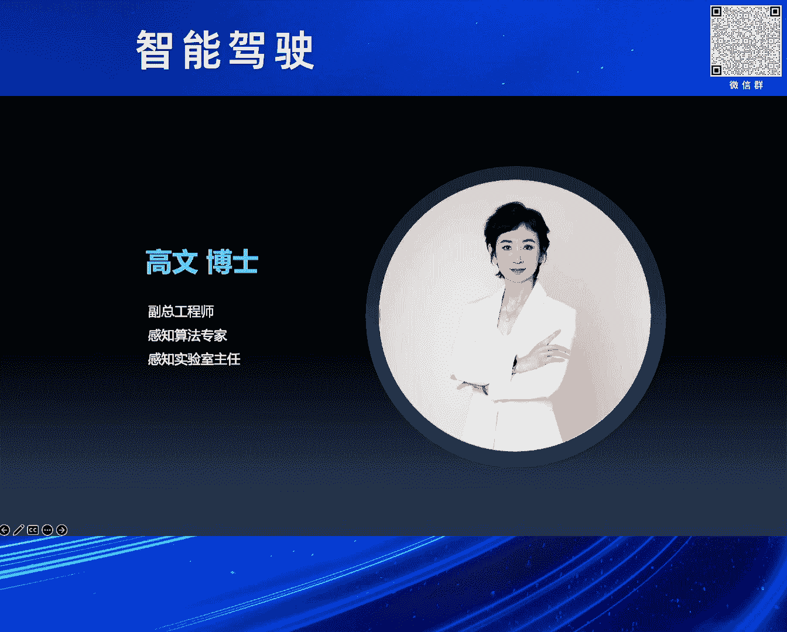

# 2024北京智源大会-智能驾驶 - P4：比亚迪智驾与智舱开发工作实践：高 文 - 智源社区 - BV1Ww4m1a7gr

首先感谢刘主任的介绍以及组委会的邀请。

很高兴与大家相聚在致远，刚才首先黄教授先讲了人类对于驾驶任务的完成。

刚才也说了人类是先有了完整的一个认知，然后经过特殊的50小时的训练，就可以在没有训练过的道路上完成驾驶的任务，然后同时又说了大模型思维在制驾的作用，以及对未来的展望。

然后法旺主任刚才也有对智能驾驶汽车的产业应用的，现状以及方向进行了同步，然后梁总和马总在长安汽车和小鹏的相关的制驾，还有AI大模型的实践进行了分享，然后很高兴今天由我带来比亚迪在制驾和座舱。

开发工作方面的实践分享，从1876年奥托发明了网复活塞式四冲程内燃机。

到1985年本次发明了世界上第一辆汽车，再到1886年戴姆勒成功发明了世界上第一辆四轮汽车，汽车从诞生之初它的使命是代步工具，那么经过了138年的发展，汽车的产品属性增加了很多。

其中有两个最重要的就是安全和体验，那么它的使命也变成了兼具智慧的有温度的伙伴，下面我将从三方面进行相应的分享，第一部分感知传感，我们和车作为一个整体要感知什么呢，大概分为三个方面。

第一个是环境方面的感知，感知道路交通标识障碍物交通参与者等东京态的目标，做到看得清环境，第二是自身的感知，自车的位置速度方向位姿，以及驾驶员和乘用车乘车人的生理和心理状态。

动作手势语音空气等做到看得清自己，第三是物联感知，实时的路况道路信息行人信息等等，车路云看得清交通，那么说到感知就不得不说一下传感器，以摄像头为代表的视觉传感器，GNAS还有V2X的定位传感器。

以及激光雷达毫米波超声波雷达的雷达传感器，以及麦克风压力还有嗅觉的感官传感器，以及惯性测量单元，还有脚编码器等等，这些姿态传感器共同构成了感知传感链。

车载摄像头从市场角，谱段等多方面的多方向的发展，以提升探测距离弱光环境的适应能力，以及动态响应的速度，从弹幕的基础识别，演进到了双目的立体测距，再集成红外成像应对夜间的场景。

到引入视线相机快速捕捉动态变化，逐渐增强智能驾驶的感知能力。

毫米波的发展，从发展的里程碑和技术的里程碑，两个角度上来讲，发展的萌芽期可以从追溯到1940年，开始于实验时，主要应用于军工领域，开发期从上世纪80年代，各国积极投入研发，尤其是欧美普及期。

在毫米波雷达进入了应用阶段，中国起步虽然比较晚，但是现在已经逐渐的国产化，技术里程碑共经历了7代的迭代的过程，工艺上从碳化砷到褶化硅，再到锡毛丝的进化，性能越来越优集成度也更好，体积越来越小。

重量越来越轻，从测距测速加上水平角的3D，再到测距测速水平和俯仰角的4D，再到测速测距水平俯仰角，再加上抗干扰的4。5D，角度的分辨率越来越高，抗干扰能力也越来越强。

激光雷达利用脉冲激光的飞行时间，进行物体距离的探测，从20世纪60年代，休斯实验时研制出了世界上第一台激光器，到80年代加入了扫描机构，一直到2005年，第二届无人无人车挑战大赛上。

参赛车辆上出现了360度的，多线数旋转式激光雷达，以及5个单线激光雷达的方案，在2007年第三届无人车大赛上面，7只完赛队伍中，有6只都搭载了64线的，这种旋转式的激光雷达，激光雷达自此一战成名。

到2017年，全球第一款车规级激光雷达量产交付，是一个4线的一维转进的方案，2022年国产的半固态激光雷达量产，价格也逐渐的走下了神坛，激光雷达正在向千元内迈进，同时功能上进行了相当的细分，有前视补盲。

然后还有这种像素级空间分辨率的，高线数长距的激光雷达，经过了这20年的发展，从光场生成方式到收发单元的，技术路线也趋于收敛，但是Flash固态，还有OPA以及FMCW等技术。

也仍在蓬勃的发展，第二部分，智能驾驶功能以及相应的趋势，智能驾驶从定位感知规划到通信技术，都进行了全面的革新和技术的更迭，从减少驾驶负担到逐渐释放双手，技术的每一步进步。

都是向着更安全，更智能的方向迈进了一大步，智能驾驶技术以预防为主，通过全天候监控和即时响应，为用户编织出一张无形的安全网。

D-PILOT智能驾驶辅助系统，以天神之眼为设计理念，安全为设计初衷，依托先进的电子电器架构，和全站自研能力，为自驾提出整车系统级解决方案。

实现整车全场景的陪伴辅助和救助，以安全为核心。

结合电机云年等控制技术，做到起步制动更平稳。

大曲流弯道更丝滑，全场景的智能领航。

全球独一无二的一四方驳车，行业领先的窄道通行，双速驳车模式，以及断头路驳车等，为用户带来了极致舒适和极致安全。

行业上普遍理解的，L3有别于L2的功能要求，而安全要求是控制的冗余，仰望U8一四方，不但实现了控制冗余，而且还实现了机械冗余，一四方概念车是行业首款，无制动装置，无转向柱结构，无转向电机的汽车。

实现了驱动制动和转向三合一，行业首次实现，车辆在传统制动和转向系统，都失效的情况下，仍具备制动和转向的能力，体现了强大的一四方机械冗余能力，超越了L3级别的冗余要求，因此仰望U8成为全球首款。

具备L3技术底座的量产车。

最后智能显示为增强安全，以及车内娱乐和人机交互，带来的新方式，舱内的显示屏，从最开始的仪表，演进到了中控副驾，后排空调，还有车门旋钮上面等等，这些是从体验出发的，那么补充驾驶视野的盲区的，透明A柱。

以及减少视野遮挡，增强夜视感知效果的电子后视镜，以及避免驾驶员视线，从前方行驶切换到中控，增加驾驶风险，以将显示信息投影到，驾驶员前视区的HUD显示，与现实相结合带来的AI导航，增强显示。

以及多功能补盲的，都是极致安全的体验，全息投影显示技术，在紧急情况下，将虚拟方向盘和其他操作设备，投影到必要位置，驾乘人员在全息空间操控汽车，确保车辆的安全，让主驾副驾，以及后排空间共享平步。

让欢乐与喜悦，在家庭之间传递，完美兼容手机生态，让车载应用不再困难，实现人车手机互联，让交互不再存在隔阂，通过3D显示技术，打造沉浸体验，让汽车成为用户的第三生活空间，混合实现技术。

打破现实和虚拟的边界，给用户带来前所未有的科幻感受，从未来科技駛入现实，1995年的益智片霹雳游侠，片中的Kat，不仅像很多电影里的车一样，无坚不摧，同时会说多国的方言，和多国的语言和方言。

陪你悲伤和快乐，可以完全接管汽车自动驾驶，是一个兼具智慧和温度的伙伴，那段每周日两集的益智片，不仅打开了我们的想象，和对未来的无尽憧憬，也教会了我们正义和勇敢，创造霹雳游侠里面的Kat。

是很多人儿时的梦想，那时没有物联网，那么在霹雳游侠Kat的自动驾驶，有温度的人机交互，对环境的感知追踪，营造的立体的多维感官监测。

以及氛围提醒，与现在的物联网联相结合，这将是梦想的升级版，汽车不再是以硬件为主的，工业化产品，也是一个自学习，自进化自成长的，软硬兼备的智能化终端，心有所信方能远行，让我们汽车人一道共同努力。

创造美好的明天，谢谢大家，(掌声)。

