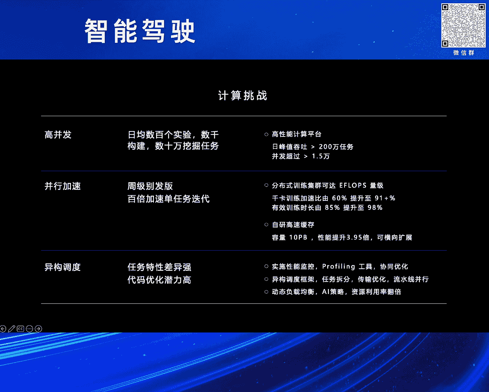

# 2024北京智源大会-智能驾驶 - P5：自动驾驶大规模应用的挑战及展望：白宇利 - 智源社区 - BV1Ww4m1a7gr

首先感谢组委会的邀请。

然后也感谢刘卢恩的介绍，各位下午好，然后我是来自蔚来人工智能平台的白羽丽，很开心，今天下午有机会跟大家一起交流，自动驾驶聊一聊大规模应用下的挑战和展望，对，可能我这个风格跟其他前面几位有点不太一样。

然后还是比较偏向于说量产的工程落地，没有那么学术，然后时间也比较简短，然后我先简单介绍一下蔚来汽车和蔚来智能驾驶，蔚来汽车是一家全球领先的电动汽车品牌，我们致力于为用户创造愉悦的生活方式。

对，蔚来智能驾驶，我以下的时候称蔚来智驾，旨在解放精力，减少事故，提供安全放松的点到点智能驾驶体验，在2023年，汽车界最权威的安全测试机构，UrnCAP 启用了新规，其中主动安全新的摆语相的场景之下。

蔚来智驾也表现出色，然后助力于蔚来成为首个达成五星安全评估的汽车品牌，下面我也介绍一下整个蔚来智驾的组成，主要包含里面四个部分，包含感知系统，车端超算，核心的算法，以及整车平台，在这里边。

我们要着重的时候介绍两块，一块是大家刚才也提到的感知系统，在蔚来的整个感知系统里面是拥有33个高性能传感器，分辨率是一个非常高的一个状态，而且全系标配了激光雷达，另外是说在车端的超算。

蔚来也是第一家在车上边是全系标配了四颗OrionX的芯片，然后算力总量达到1016T，第二代整车平台NT2。0，我们全系标配了这个配置，不光在当前，包括在现在。

都可以说是重新定义了量产车的智能驾驶的系统，树立了高端支架的新的标准。

接下来我想介绍几个蔚来支架的一些时间点，可能有些同事是并不太清楚的，我们在2021年的1月，蔚来发布了NT2的首款车ET7，其实标志着蔚来从走向了全站自研智能驾驶的一个新的时代。

2022年的4月ET7上市，我们仅仅用了一年多的时间就交付了智能驾驶的功能，同年的9月，然后我们在NOP+在高速的场景里边是也开始了交付，在2023年的10月份，NOP+从高速拓展到城区到4月。

全域的领航辅助，我们就向所有的NT2的车主全量推送了，所以从一个全量推送的过程，我们仅仅花了6个月，而特斯拉的FSD整整花费了三年的时间，当然我们还在持续的更新。

也不断的在优化着我们智能驾驶的技术和它功能体验，既然今天要讲大规模应用的挑战，我们首先定义一下大规模是什么，我在想大规模主要是有两个方面的含义，一个是说在使用规模上面，另外的就是在功能范围上。

首先说从用户量上面，在我们第二代平台用户量从2022年的8万，2023年的15万，然后介尔的时候到现在2024年的时候，预计的时候应该远超于30万，基本上我们每年翻一翻。

第二的话是说从覆盖的范围和区域上，我们在2022年的话，ET7在中国交付，同年其实我们既在欧洲完成了交付，那2023年2024年我们进一步的时候，也拓展到欧洲多个国家，然后包括也有新增的中东的地区。

那再次的时候我们在聊的是里程，从2022年高速城块，然后大概是36万公里，那到2023年10月份，我们发布城区的时候，目标是68万公里，那如今我们可以全域的领航辅助，这个可用里程已经超过了140万公里。

最后我们要讲的是车型和平台，那在2021年以前我们的NT1的平台，那也是经典的在未来的886的车型，到22年我们新增了NT2，然后在这里边的时候，我们现在9款在售的全系车型。

都已经更新到了第二代的车载平台上，那24年我们搭载的NT3的自研平台的，这个未来第二品牌乐道也将开始交付，对，那这些都是从我们讲说这个量和维度上边，那我们说从功能上边，未来支架体系。

那我们也在这里边开始支持多个车型，然后新老平台的三代平台的同台，多个国家多个区域上的功能交付，挑战其实非常大的，那我们去看说从功能规模，从最简单的功能，独立功能到我们后边复杂的，更融合的系统。

例如我们经常谈到的AEB，就是自动紧急制动的这样的功能，到我们发展到现在的NOP+，全域领航辅助的功能，那从最开始数据每秒钟的时候，百这个百兆币的这个大小，到现在的时候，我们可以每秒产生的数据。

10G大币对，那10G大币每秒相当于什么呢，一秒钟看完两部4K的电影，那我们端测的算力也是，急剧的在增长，从最开始的时候，可能大家都知道的时候，比如说那可能都小于，这个实体套，这个10TB的这样的算力。

到现在，那在整个未来的，未来的车载上面是近有，这个千体，就是上千TB对，在这个算力规模之下，其实跑一个100B的大圆模型，都绰绰有余，那我们的这个车载平台，是完全有能力来去支持的，那从研发任务。

那以前的时候研发任务，可能小到几十项，对吧，大到上，现在大到上百项，从最开始，那我们感知上面的时候，在车辆行人障碍物的检测，到现在，大家开始去聊这种GOA，AES，然后MAI这种复杂的融合系统。

那其实从功能上面，都是一个大幅的这个提升，对，那从评测任务，最开始的时候呢，小到几百，现在大到上万，从不光是这种评测的种类多，那验证的里程的时候，也是要求的，逐渐的时候去增加，说到这里呢。

大家可能会想说，这么大的规模，这么多的场景，这背后需要有哪些挑战，对吧，然后我们以及怎么来去支持，这么大的这个场景的变化，那接下来的时候，我将跟大家一起的时候，去深入探讨说。

那在未来，我们是怎么应对这样的问题的，对，我给后边的时候，分为这么几，这部分挑战的时候，分为几块的时候来去讨论，主要是分为计算，那数据和成本，我们先说一下这个计算的挑战吧，对，那未来自动驾驶研发。

每天要进行数百个实验，数千次的构建，数十万次，这个数十万个挖掘的任务的执行，那这些都与这些高并发的任务，都说都需要一个非常强大的计算平台来去支持，那我们自己自研的高性能计算平台，能够支撑什么。

两百万次任务的这个日间峰值的吞吐，并且可以支持说顺时顺时的并发的时候，超过1。5万个节点，那大家也在讲说，天下武功唯快不破，从发现问题到解决问题，到解决问题，发布这个版本，那更短周期的迭代。

是我们一直优化的目标，那为了解决这个超大型任务的性能瓶颈，我们自己也设计并研发了一套大规模分布式的训练集群，计算集群吧，那在这个集群里边的时候，我们可以做到单任务量级的时候是超过一Flops的。

那我觉得这个行业里边时候，大家也都可以知道说，具体总量我就不讲，但是这个集群一定是在支架行业里面是top规模的，当然在规模之外的话，我觉得前面的时候像小鹏同事也提到了，说那规模在规模之外。

其性能和稳定性是这里面非常重要的，那我们在这里边的时候，整个训练集群性能也是非常好的，那以我们在云端这个空间大模型，world model的千卡训练任务为例，那我们能做到训练加速比的时候达到91%。

有效的训练时长的时候大于98%，当然为了支持这样高性能的训练集群，我们也需要上下游的组建上面的支持，为此的时候我们也有这样的自研的，我们认为说缓存的系统，那以缓存系统为例的话，那我们可以做到横向的扩展。

性能的时候能超过同类商业的这样的，存储软件的这个将近四倍，那整体在支架的研发任务差异是非常大的，然后又在不同的硬件上面跑，如何让它们都能高效的合理的运行，也是需要花费巨大的时间来去优化的。

那我们可以通过性能优化，profiling工具啊，包括这种协同优化，那我们可以通过实现这种异构的调度，任务的拆分，传输的优化，包括这种流水线并行，然后多方面的努力，那我们都可以去动态的去把这个。

这个负载均衡做好，大幅的提升整体的这个有效利用率，当然强大的算力的值只是一方面啊，那没有大量的数据的支持，计算其实就无从谈起，那支架的场景的话，我愿意给它简单分成三类的数据吧。

那一类的时候我们称之为训练数据，然后呢，一部分的时候我们称之为这个验证数据，还有部分称之为反馈的数据，对于训练的数据呢，随着这个自动驾驶的发展，每年对数据的需求都是几十倍的增长，那在三这三年以来的时候。

那我们就近万倍的增长，那量产车上面的海量数据，海量高质量的数据呢，那我说在未来支架的，是未来支架的这个护城河，那每秒钟产生pb级的数据，让我们从来不担心这个数据的供应，但是如何通过自动化的产线。

自动化的标注，对吧，能使得这些数据参与到云端的模型的训练和功能迭代之中，那是要面临的难题，对为此的时候，我们其实在这里面也建立了五百多种标准化的标准工艺，然后一百多条自动化的产线，通过云端的世界模型。

参与到这个自动化流程之中，将整个标注的这个自动化效率的时候提升到三个就以上，那第二块的时候，我在讲的时候是验证数据，像刚才前面的同事也讲到说，那其实对于整车上面的测试是一个非常复杂的。

对于尤其对于软件测试，大家传统的测试模式，最终功能还是要上实车验证的，那方法大多数呢，是通过这种自建车队，那而如今，那我们认为说有多版本快节奏的，并行验证的需求之下。

那区区的几百辆车的话是远远不能满足需求的，那为此的话，我们NOP+，我以这个为例吧，就是我们在开城拓路里边，那一般情况下是要一个城一个城的开，然后开完之后的时候用这车去验证，但是我们可以结合自有的车队。

车上面的时候一块Opren的芯片，用这种群体智能的方式，未来在未来在这里边的时候，用非常快额外的这一颗芯片呢，用群体智能规模化优势的时候，大批量验证了这些道路的可用性。

原定于这种三个月要去验证的NOP的开城拓路的任务，那我们缩短到这个更短的这个时间就能完成，在在这个之在这里呢，当然我们也要强调一下说，那在这个我们认为说大规模十万辆级规模的这种并行测试任务。

对于平台压力是什么呢，那我们需要说能在小时级别，就在这里面我们能做到四个小时级别，这种十万规模的车辆，98%的任务下发的成功率立刻能展开这种测试的任务，数据验证也无需回传到云端。

那大幅的去提升这种验证的效率和这个数据成本，这个这个数据传输的成本降低，对那我们群体智能可以同时支持150万的验证任务的并行，并行测试，那每日可以验证的里程数超过1500万公里，最后要讲的是反馈数据。

那量产车每天能产生数百万条的接管事件，潜在接管事件，那但是如何去有效的时候去完成筛选和压缩，将最有价值的数据上传到云端，并且通过这种自动化的分析，然后是数据闭环里面时其实最关键的一步。

那我们通过车端复杂的这种价值筛选算法和换存机制，将万分之一最有价值的数据上传到云端进行分析，并且在这里边的时候我们去通过5%以上的自动的分解率，然后能去促使反馈迭代的这个数据飞轮真正的能去运转起来。

当然行业总会调侃说这个未来的研发成本高，但我们实际上在研发过程中的时候还是非常在意这个成本效率的，因为我们知道说长期主义需要建立在短期成本可行性上的，因此我们说在研发上的巨大投入并不是无节制的支出。

而是说对长期技术布局的重要的一个要求，那面对着说这种百倍的算力的需求，我们打通了说这个车端边缘计算的能力，使得端云的总算力达到260亿ops，这个算力规模相当于什么呢。

相当于100个分布式的千卡的计算集群，那通过我们车端的计算和筛选生命周期的管理，那我们通过车端的缓存和数据压缩的技术，可以大大的减少数据回传量，降低这里边的流量成本，另外呢，我们在讲说。

制架的研发周期性很强，波动很大，碰到发版的时候，大家一定都遇到过说这种资源上的这个波峰，那未来人工智能平台在规划之初就是一个混合云的架构，那我们在自研的这个计算中心之外，也加设了多个这个混合云的节点。

能通过弹性的上云，分时的定价，来去优化这个调度，有效的将这个波峰波谷能控制到10%以下，最后呢，我们要讲说研发任务的种类多，节奏快，如何去平衡这种研发交付和资源的有效利用，解决资源占用高。

但是利用低的这些问题，那我们通过多维的成本分析的工具和运营机制，有效的将研发价值和资源利用率的时候去做了关联，通过运营机制，那我们每年能在这里边时优化这个研发运营成本是数千万元，在这里面我要表达的是。

就是很大程度上然后做相同的事情，用一倍的成本跟用一半的成本，那它是完全不一样的研发体系，对于研发成本的在意，本质上是对技术上边的，我们认为更高的要求，谈完了这个挑战，我们也可以展望未来。

那用在脚踏实地的同时，我们也仰望星空，自动驾驶的发展也充满了无限的可能，接下来呢，我愿意分享几个关键方向的一些看法，包括端到端的大模型，全站的AI平台。

以及群体智能技术，就第一点的话呢，端到端大模型大家听的很多，但是呢，它不是什么灵丹妙药，如果以目前的这个模型架构上，只能做到70分，那你无法通过说把这个端到端大模型上了车，然后就能做到100分。

因为这说明说你现在的工程效率还远没有，使你的模型架构达到上限，问题还很多，其次呢，现在的模型架构转换也无法实现这个大跃进，并不是一夜之间的时候就能完成的任务，在我看来，要去做端到端大模型。

需要满足以下几个关键的先决条件，首先是说数据飞轮，大家讲这个数据飞轮讲的很多，但落地效果好的寥寥无几，飞轮真的转起来了吗，里面核心的就是说数据验证体系的自动化率，然后呢。

我认为说在这里边是至少要能达到三个九以上才能飞吧，对吧，在各个模块上面也是，那尤其大家在讲端到端之前的时候，硅空是不是能全面的模型化了，对吧，然后感知是不是可以上BEV Transformer去量产了。

地图是不是可以实现有图无图的自由的切换，那另外的时候我们在讲大模型，我们更愿意给它定义为云端的环境模型，云端的世界模型，那在这里边，模型架构和研发方式的转变需要有初步能去初步验证。

并且把模型应用到研发和验证流程之中发挥作用，最后的时候我们要讲签卡集群，包括我刚才看说有同事引用了马斯克的一个推特，然后呢我最近也在看，在6月4号的时候，马斯克在社交媒体里面讲了一件事情。

就是特斯拉在部署英伟达芯片，想要部署英伟达芯片来去使用它，但是呢，那没有地方，然后他们就放置在仓库里面，后来呢，特斯拉也在这个新的德州工厂里面开了这个新的空间，用于容纳五万片H100的芯片。

用于FSD的训练，那五万片H100，对大家来讲是听起来很疯狂，那我们说如果想要去做端到端大模型，一万块一百总是需要的，那在这里边，如果你不能做到签卡级别的并行训练，那万卡的训练基本是不可能的。

那举我前面的例子，在我们优化之前，签卡的训练，签卡训练的有效时长的时候只有85%，加速比呢，只有60%，那考虑考虑这种故障率和加速比，万卡的真实性能在这乘上去的时候就只有1200卡不到了。

那但是有效的训练时长提升到98%，加速比提高到91%，这样才有可能扩展到万卡，大概的时候也能做到一个这个八九千卡的这样的规模，我们才能才能去使用它，那毋庸置疑，在数据量足够大的情况之下。

算力也足够充足的情况之下，端到端模块联合优化是有可能整体去提供系统功能，和体验上限的，但是正如千卡和万卡的例子一样，如果没有很好的工程化的这个效率和质量，端到端带来的这个研发链路的简化。

避还这个避还效率的红利，其实都会被低效的工程效率去吃掉了，对。

那后边的时候第二块的时候，我要讲AI平台，那在不仅在这个智能驾驶的这个大背景之下，最近我们也看说大语言模型也出圈了，对，那AI平台开始更多广泛的去关注和讨论，那随着这种基础模型的能力的通用化。

那我们也看到了一个机会，就是全站的AI研发平台的可能性，那全站的AI平台，我理解不仅仅可以支持自动驾驶的研发任务，最近我们还支持了集团之内的，那像Nomi也就是未来内部的智能座舱的助手。

还有内部的NeoGP的应用平台，客服专属群，那正如我们可以跨平台，跨地区多车型的这种模型产线交付一样，那实现了85%以上的模块的复用度，让我们也成为国内第一个可以跨州量产自驾的汽车企业。

在2022年的3月，国产我们在国内这个量产的ET7交付了自研的NeoGP的功能，在同年的9月，然后我们自驾的算法就上线了欧洲的这个ET7，并且建立了功能安全，智能安全等大规模的量产的能力。

这也得益于说我们有高度可以复用的全站的AI能力，对，全站AI的平台统一管理，去优化数据，AI技术，应用的整合，提升了效率，并且降低了它的整个研发成本，才能真正实现我们所谓的ML Ops。

大家也应该知道说，ML Ops在绝大多企业落地的时候，其实并不是都不是特别好，因为一个好的研发工具，在我们看来不仅仅要适应于企业内部的研发流程，还应该去适应于它的不同的阶段。

生搬硬套的去把这些工具强塞给这个企业的AI研发里面是不太现实的，那在我们去设计AI的全站的平台，特别是注重它的灵活性和适应性，能确保说在满足各阶段的需求，就像是说建一个高效的一个引擎。

各个部件可以完美的配合，可以有效的最大限度上面提升它的性能和效率。

在2023年9月未来第一次的未来科技日，然后我们第一次介绍了群体智能的技术，那群体智能是未来智能驾驶技术未来发展的重要的方向，未来群体智能具备强大的计算能力，达到67亿ops，那能够每秒处理2。

1pp的数据，通过优化这种并发和实验，一定程度上我们实现了真正的车匀一体化，进行分布式的验证和协同学习，也正如我前面提到的，那在AEB的道路验证，NOP+这种全域领航开程拓路。

包括世界大模型的数据迭代上，那群体智能都发挥了其强大优势和无限的潜力，它让我们量产的功能可以持续的高效的迭代，不断的为用户提供更安全更舒适，更加个性化的支架功能体验，就像说在赛车队的赛道上。

可以通过协同的作战实现最佳的战绩，那我们量产车队也可以通过这种协同学习，不断的进步和提升，我们也相信在不远的将来，那我们自己的自研芯片进一步的去整合，去定制这些功能和能力。

以推动智能驾驶和通用AI的技术的发展，让我们去设想，那自驾的汽车在没有自驾的同时，其余时间也是可以进行推理计算的，那通过闲时附用，将算力共享给其他智能应用，就像分布式的云一样，那这将为整个智能驾驶。

乃至整个人工智能行业带来巨大的算力的提升，那真正的实现车联网和云计算的结合，那我今天的分享就到这里结束，那感谢大家聆听，最后的时候我给大家一部小小的影片，让大家感受一下，说我们在未来如何去做智能驾驶。

包括他们的结果是怎么样的，感谢大家，欢迎下一位，请，请，领航开始，请，请，请，请，请，请。

即将开始领航换电，请，请。

请，请，请。

请，请，请，请，请，请，请。

请，请。