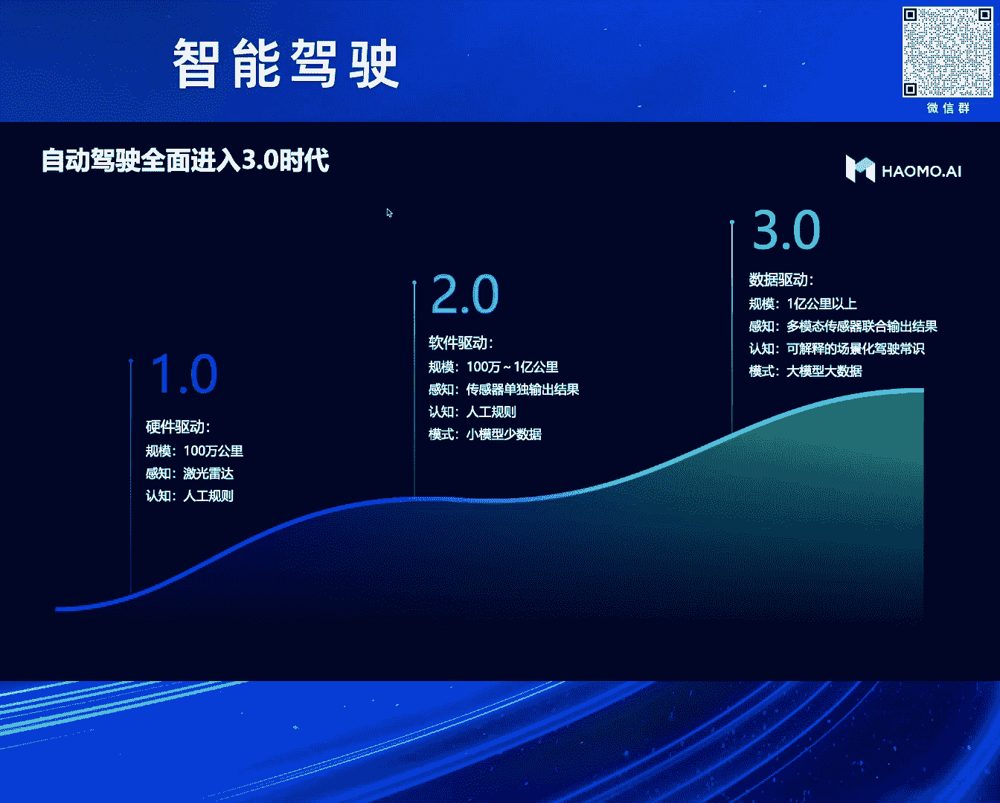
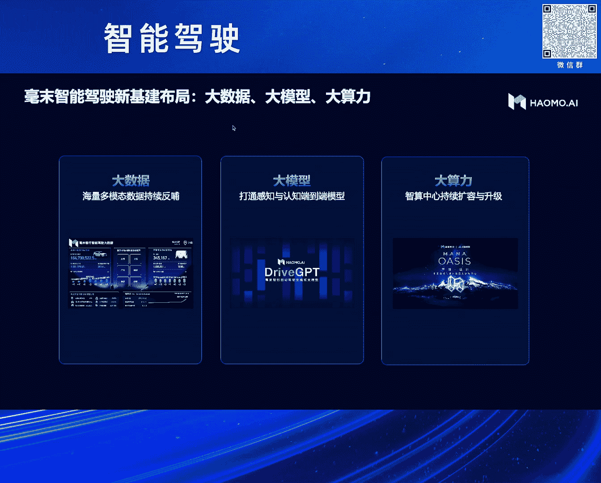
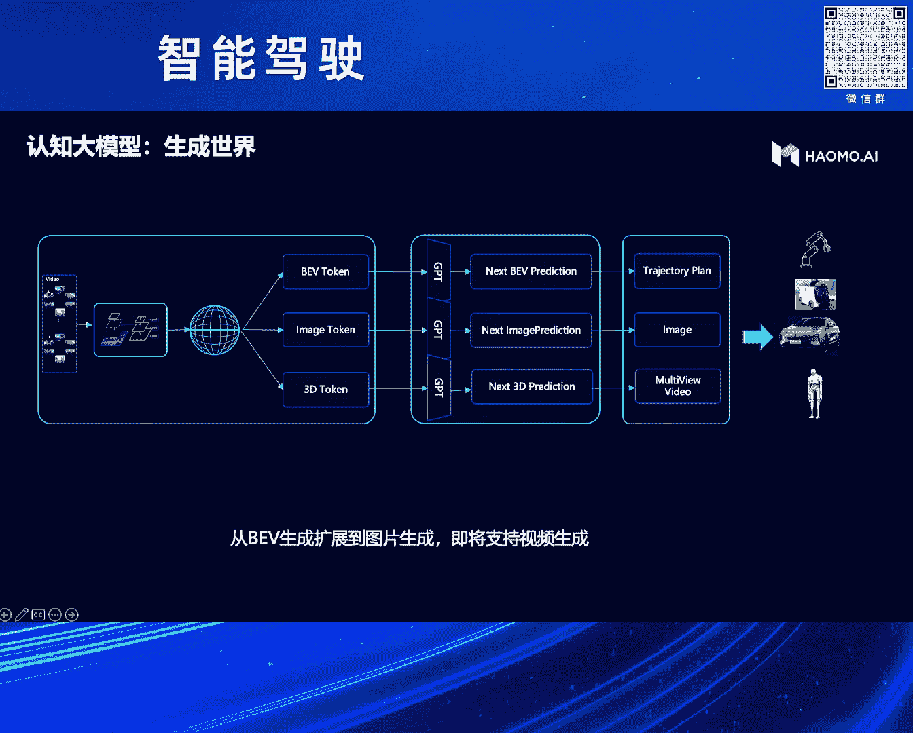

# 2024北京智源大会-智能驾驶 - P6：自动驾驶3.0时代，大模型重塑汽车智能化路线：贺 翔 - 智源社区 - BV1Ww4m1a7gr

感谢法务主任感谢资源的邀请。

今天有机会能给各位嘉宾分享一下我们在自动驾驶大模型方面一些实践经验，我觉得刚刚法务主任有一点说的我非常的赞同，前面几位主机厂四位讲了很多，修了很多肌肉，做了很多牛逼的东西，但是好像讲的不够透彻是吧。

我们作为供应商，我们就把最刚和最底层的东西全部抛出来了，尤其我们过去几年在整个大模型方面探索中遇到的一些问题，走过的一些弯路也一并贡献出来，希望能对大家有一些启发或者帮助。

我们根据过去几年整个自动驾驶发展的这么一个历程。

把整个自动驾驶的技术的演进路线分为了三个阶段，第一个阶段我们称之为一个硬件驱动，大家主要是靠堆积工雷达，第二个阶段其实现在绝大部分公司肯定是属于第二个阶段，就是用一些小的数据 小的模型去解决杆子。

认知到决策规划的问题，接下来我们判断是说未来是一个3。0，我们称之为数据驱动，它的核心特点就是大数据 大双点 大模型，其实刚刚很多前面的老师也讲到了这一块，那么在3。0时代我们更应该去做什么呢。

刚才讲到三个关键词，大的数据 大的模型 和大的算力，那么今天会主要跟大家分享一下，我们整个的大模型到底是怎么做的，以及这个大模型我们怎么样去做我们整个的数据系统，然后算力这一块我们在这就不详细讲了。

因为这个我们之前已经讲过很多次了，那么大模型这一块其实去年也是在智原的会上，我们公布了我们当时的自动驾驶的大模型的，我们称之为 现在可以称之为1。08倍，当时我们是业界应该是第一家。

使用生成式技术来做自动驾驶大模型的这么一个方案，为什么我们会走到这条路呢。

我们现在先留一个悬念，最后我们可以给大家回顾一下我们整个的研发的历史，以及我们怎么样是走上了这条路来的，那么这条路我们选中了通过生成式方式。

而且是通过BEV生成的方式来解决自动驾驶问题，那么在研发的过程中，我们也发现了很多的问题，开始我们可能把这个问题想得简单了，我们觉得，因为我们大量的量产车在外面开，在全国各地开 汇传各种各样的数据。

我们天真地就以为说我只要有大量的这样的数据，然后把它看到的世界表达成一个BEV的视图，然后通过生成式的大模型，把未来的BEV生成出来，我只要能把未来的BEV预测出来，我自动驾驶的任务就解决了。

那么实际上在训练的过程中，我们花了大概有半年的时间吧，训练的过程中遇到了很多的问题，这些问题主要包括两个，第一个是说，因为你采用的数据是量产汇传的数据，它有它先天的优势，就是右边的。

也有它先天的弱势 就是左边的，它先天的弱势在于说，因为你不可能用量产车来汇传海量的视频数据，这个成本是比较高的，我们没有办法去承受这么高的成本，所以我们汇传的是感知的结果，当然也会汇传一些视频数据。

这些数据肯定是在，特定的处罚条件下才会出来，所以我们汇传的海量的数据基本上是感知的结果，然后有了感知的结果，有了实际的驾驶动作之后，我们就可以把这两个合在一起，做生成式的学习，但是我们很遗憾地发现。

我们在量产车的数据汇传的感知结果其实并不完美，对于我们后面去做那种，想要学一个非常牛的老司机的这种，驾驶决策出来是有很多的限制的，比如我这样举了一个非常非常常见的例子，这基本上哪都能碰得到。

就是我们在城里头车开到，进入城市以后的时候，我们会发现城里的车道线其实并不那么清晰，因为它经常磨来磨去就磨没了，尤其是在光照条件，比如立光这样的环境下，它根本就可能，传统的感知技术可能做得不够好。

它汇传的车道线就不好，那你基于这样不好的感知结果，再去虚拟后面的那支决策，其实就会有先天不足，它的好处就是说右边确实我们看得到，这是我们真实的数据，我们的车卖出去之后，是在全国各地开的。

也就是说它的数据的分布，确实非常非常的好，有地域的分布，然后我们把这些数据拿出来，又重新看了一下它的场景的分布，其实也是非常非常好的，就是各种各样的场景你都能预计得到，那么这个数据非常好的，是一个好事。

同时我觉得也是一个巨大的挑战，刚才大家也讲到了说，特斯拉训这个端端端的大模型，花了差不多一百亿美金，那我们作为一个小公司，很显然不可能干这样的事，所以我们想到的是说，面对这么复杂的场景。

你要训出一个特别牛的老司机，你真正的降低成本的方式在哪里，人家花一百亿美金，你能不能花一亿人民币，这个挑战是比较大的，那么具体怎么做的呢，我们先把这个任务定义清楚，我们到底要干嘛，这是我们训完1。

0之后，遇到这些问题之后，我们重新去思考了一下，这个自动驾驶大模型，究竟应该去干什么事情，我们把它分成了三个阶段，第一个阶段就是说，根据我们之前对量产车回程的，感知的效果不好的这么一个大的问题。

我们觉得第一步，我们应该首先需要做一个通用的感知能力，为什么叫它一个通用的感知能力呢，这个跟我们传统的，就是我们之前在车上已经卖出去的，这些量产的感知对比，它是一个完全不一样的东西。

我们传统的感知大家都很清楚是吧，是基于标注来做的，我标了实类物体，那我就只能识别这实类是吧，我没有标过的它就没有，那也就不能回传，所以我们希望做到的通用感知是说，它能跟我们能的感知一样。

它具备二D的能力，也就是它能够看到图片是吧，它具备三D的能力，它能够理解上面的空间，同时它还能够加上时序，变成一个四D的东西，最好它还能够识别万物，它不是一个只能够看懂图片纹理的，它能够识别万物。

知道这是什么东西是吧，跟我们能的感知是一样的，然后有了这样完美的感知之后，你后面的第二步，我觉得做起来才是有价值的，那第二步我们希望做到什么呢，我们希望是说在你有能类的感知之后。

能够做到一个能类的价值决策，那么能类的价值决策，跟我们传统的价值决策有什么差异，它的差异我觉得最主要体现在，我们大模型和小模型的一个很大的差异，我们希望这个价值决策是具备世界知识的，也就是我们能够看懂。

或者理解这个世界背后运作的规律，这是一个我们称之为世界知识，能够看懂各种各样的驾驶场景，而不是能为了去定义各种各样的场景，以及定义各种各样的静态的规则，能够具备这种推理的能力。

我觉得这样才是真正具备一个老司机的这么一个能力，然后这两个都做好了之后，我们才有机会去把它们俩拼在一起，去做多多多多的训练，来提升整个全链条的这种全局的最优先，所以我们在前面尝试过半年之后。

就把我们整个的技术路线调整为这三个目标，那基于这样的目标，我们整体的那个架构的设计，大概是分为这么一个阶段吧，左边是我们的那个杆子大模型，它实际上你可以简单地认为它是一个4D的Encoder。

就是为了把我看到的世界，把它Encoder到一个4D的空间里头去，然后右边是我们的那只角色，这样我们只画了一个BV的生成，就是我们有了对这个世界的完美的认知之后，接下来就是我怎样能够把我这个看到的信息。

把它编码 传递下去，让下游的那只角色能够知道，我看到的世界长什么样子，并且我能够怎么样去利用好，我看到的这些信息，来做出很好的驾驶决策，这是我们整体的架构，那么刚才讲到我们怎么样去。

降低我们整个训练的成本，我记得我们当时应该是在2022年，我们去建我们的自创中心的时候，我们大致算了一下，如果我们要去做覆盖全国的，各种各样的场景case的训练，这种视频，比如说100万个Clip。

当时我们还不敢想有1000万个Clip，100万个Clip覆盖各种各样的场景，我们要去把它训练起来的话，我们当时算了一下 至少要1万卡，这个很显然我是要不拿这么多钱的 是吧，那怎么办，我们想到一个办法。

就是我们能不能去借助外界，已经训练好的这种大模型，别人帮我们用他的卡，把这个事情已经训练好了，我把它里面的东西挖出来就可以了，这是一条现实可行的，降低我们训练成本的道路，所以我们在整个的。

这种驾驶大模型里面引入了两个外挂，那么在港资大模型里面，我们引入了一个动摩态的大模型，它的目标就是实现刚才我们讲的，识别万物，因为我们在这个图片编码的过程中，可以很容易地借助外部的动摩态大模型。

去对齐我们的文本的特征，这样就相当于说我这个东西不但能看懂图片纹理，也能够理解世界的万物，它是什么东西 是吧，然后在后面那个，我们讲到在内置决策里面很重要的一点就是说。

我们如果要训出一个像能力一样的老司机，它的必要条件就是它具备世界知识，是吧 你能够看懂能力世界，你才能够像能力世界一样去开车，是吧 你拿一个小狗小猫，你再怎么训 它也训不出老司机出来 是吧。

小狗小猫也会开车，我觉得我前两天刷了一个视频，就是这个小狗在开车，我觉得挺有意思的，它不可能像能力一样看懂能力的世界，它能够看懂交通标志吗 是吧，它能够看懂我们的路牌吗，很显然是不行的。

那么这些信息在哪里，其实大语言模型里面都已经有了，我们的任务是说能不能把这些信息从里面赚出来，我们利用好就可以了，那么通过这样的设计，我们就有信心说我们只用几千块卡，就能把这个事情搞定，这也是我们。

我觉得国内的企业，在创意有限的前提下，可行的这么一条路线，那么具体我们看一下左边。

我们整个的港资大模型大概是怎么做的，我们真的是把刚破的都给拉出来了，左边是我们的那个，最左边是我们的那个摄像头的数据，直接输入进来，输入进来之后，我们首先会有一个自监督的图片编码器。

我们会把图片里面的文理特征全部提取出来，也就是得到一个二维的编码，那么二维的编码之后，它是一个图片的特征嘛，我们会跟外界的动画大模型去对齐，也就是对齐完了之后，它就具备了识别万物的能力了。

然后接下来我们会给它进行一个升维，变成了三维空间，加上时序，实际上就是四维空间，那我们怎么去做这个事情呢，我们是用视频的下一帧预测，因为我们这个左边输入来的，其实不是图片 而是视频，它是一个序列。

我只要能够让这个模型去预测，我下一帧图片长什么样子，跟我的帧子去做对比，如果它能够预测对的话，那这个模型一定是三维的，因为在这个过程中，我这个车已经往前开了一段距离了，所以我们通过这种方式来预测。

我们通过乐福的方式，把图片的下一帧给渲染出来，然后跟我们的真实图片去做对比，强制让这个模型学会了我们的四维空间，那这样的话我们就真正做到了，像我们刚才讲的，像我们的能力一样，它具备能够看到二维图片。

看得到三维空间，具备时序，而且能够识别万物，然后我们就通过这种方式，就得到了一个4D编码的空间，这个我们认为，至少在现在看起来，是我达到了我们所谓的完美感知的这么一个结果。

我们可以看一个我们的demo，这是我们实际的车上回程的一个数据，上面两个视频，上面那个是前视，下面那个是后视，因为地方有限，就放了两个，然后我们的模型可以输出这些东西，左边是三维重建之后的结果。

这里面是有两个图的，一个是，上面那个是从上往下看。

也就是两看图的视角，把它拍扁了其实就是BV图，然后下面那个图是一个前视视角，它在三维空间里面是可以改变你的视角的，然后当然也可以做雨衣的分割，也可以实现光流 实现深度，如果跟雷达结合起来。

就可以实现去做4D的制动标注了，然后右边我们也给了一个非常复杂的场景，这是一个保定的一个入口，非常复杂的一个场景，我们可以看到，我们在一个模型里面可以把，分割 雨衣 光流 深度全部搞定了。

刚才我们也讲到了，我们交互GPU-T1。0是做的BV的生成，我们还是沿用了这套思路，但是我们会把前面的那个输入换掉，之前我们训练效果不好的原因，我们分析下来是说，我们杠子的结果是从量产车上回来的。

而量产车的杠子是基于传统的白名单的标注方式来做的，也就是说它有世界上90%的东西它是看不到的，它也当然无法回传，所以我们把它换成了我们现在的完美杠子，然后有了这个完美杠子之后。

我们把这个4D空间把它偷坑化，也就是说刚才看到那个3D空间把它拍扁了，变成BV，再把它偷坑化，偷坑化完了之后再丢进去，让它去生成未来的BV，这样的话它生成的效果就会比原来好很多，同时我们刚才讲到。

我给它引入一个外挂，这个外挂就是大的语言模型，我们可以把我们港资模型看到的世界丢给这个大的语言模型，让它来告诉我你看到的东西是什么，然后你能不能给我一些驾驶的建议，相当于说我们在副驾驶座坐了一个陪驾。

一个老司机，它可以给你去解释你看到的世界是长什么样子，你应该采取什么样的决策，通过这种方式我们能够大规模地降低我们训练的费用。

又快速地使我们上面这个模型紧收敛，这也是我们一个实际的例子，我们找了一个比较复杂的路口，这些路口的标牌肯定都是人类世界的，我们要看出这些东西，如果纯粹采用自动驾驶的数据，这个训起来是非常非常困难的。

因为你没有能力去标注上面这个标牌到底是个什么意思，但是你借助大语言模型的时候，你会发现这个事情很容易就解决了，当然这里面还是有一些问题，比如说他对汉字的理解可能不是特别好。

但是对于这种标牌的理解还是相当不错的，各种各样的符号他的理解还是可以的，我觉得可能比很多的女士会懂得更多，我们今年又把这个任务进行了一些扩展，我们去年做了BEV，坦白讲这个思路我们走过了，有一定的效果。

但是不够好，如果大家还想尝试我觉得也可以，但是我觉得我们现在接下来真正，我们称之为自动驾驶基础模型的应该是下面两个，我们现在第二个已经做完了，我觉得就是刚才你讲的，我们具备图片生成的能力。

我们现在是可以把中间的4D的空间把它解码成图片的图片，然后用GPT的方式去生成我们下一帧的图片，而且是多V的 是个环式的图片，这个任务看起来好像不难，但是实际上你真的去做你就会发现很难。

因为我们跟Solar去对比就发现了，Solar为什么在自动驾驶行业里面没办法用，首先它是单式的 它只有一个摄像头，我们自动驾驶都是环式 只有一圈摄像头，所以它没有办法搞定这个事情 这是第一步。

第二步是说它没有办法做到时序，或者说物理空间上的 三维空间上的一致性，这个问题我们留到了第三条路，我们现在正在做 这个难度是比较大的，比如说我们在生成图片之后，我们更希望的是说。

我们应该不是生成一个图片，图片是我们看到的一个表象而已，也就是这个现实世界在我们眼睛里面一个投影而已，那我们真正的世界是怎么样的，是个三维的 是吧，那我能不能直接把我们刚才编码的4D空间。

把它变成3D的token，然后用GPT的方式来生成未来世界的3Dtoken，也就是我们未来世界，这个车往前开了两米之后，这个未来世界的3Dtoken会变成什么样子，这个才是我们真正要解决的核心问题。

这个问题解决了之后，你才有可能去渲染出来多V的，保持空间一致性的，持续一致性的这种视频出来，这个视频才对我们这种架势是有价值的，你可以用来做训练 可以用来做测评，如果没有这个东西我觉得都是很困难的。

至少我目前没有看到有合适的技术来解决这个问题。

我们也可以看一些我们现在实际的一些demo，这是我们早期做的那个BEV生成的这么一个效果，这是车上传回来的几个视频，左边是实际的BEV，就是我们杠子的结果把它拼成一个BEV。

然后这个模型会把这个左边的BEV图输进去，那这个模型来预测未来的BEV会长什么样子，其实我觉得通过这种方式，已经可以解决自动驾驶的很多的问题了。

这是我们多V的图片来生成的效果，其实图片来生成的效果已经非常地好了，基本上如果不提示的话，肉眼是很难分清楚哪些是生成的，哪些是假的 是吧，哪些是真实的图片，其实只有文字在这里面是落马。

除了文字之外 别的我觉得你很难看出来，就是这里面生成的文字都是落马，这个现在确实还是一个比较难以解决的问题，就是任何的这种生成技术，目前在生成文字上，我目前还没有看到说能够生成一个交通标志牌。

能够符合我们真正的像能写出来的汉字一样，现在还没有，包括我们现在的那种交通标志牌，包括我们现在广告牌，生成的那种文字其实都是落马，这个目前还没有解决，我们还在公关中，视频那一块还没有，非常抱歉。

我们希望下一次能给大家带来多V的环视视频的生成，接下来就讲到数据了，我们刚才讲的是我们整个的核心的大模型的制作，在这个大模型的上车之前，就目前而言我们现在大模型上车还是比较困难的。

刚才也看到我们引入了多么太多大模型，引入了大语言模型，那参数量都很大，这个想要放到车上去短期内还是比较困难的，那么在上车之前，我们主要是用这个大模型来，赋能我们云端的整个的工具链。

这是我们整个的那个毫无做的那个，MALA的数据智能体系，我们从整个的数据的采集，到数据的管理，数据的标注，数据的筛选，数据的标签化等等，底层都是通过大模型来支持的，有了大模型之后。

你会发现传统的这种对数据的管理的工作，就会变得像我们跟其他GPT交互一样，非常的简单轻松，大幅度提高你的效率，我们可以看几个例子，这是我们去从我们的海量的那个图片里面，比如110的图片。

你要去找出一些color case，比如六个灯 走过八码线，传统的方法你是很难去找的。

比如传统我们打标签，你不可能打这样的标签，那有了这种大模型之后，因为它可以对这些场景做一些文字的理解，这样的话你可以输任意文字，非常复杂的文字，它都可以去理解，然后非常精准地把你想要的图片找出来。

这是有了大模型之后，对整个数据筛选的这么一个体效。

同样我们还可以去定向地生成数据，比如说我们可以画几条车道线，它就可以基于这几条车道线来生成各种各样的数据，包括比如晴天的 雪天的 雨天的 雾天的都可以，当然你也可以画比如说环岛 可以画弯道，都是可以的。

我们还可以对我们采集到的数据做一些风格的迁移。

比如说我们采集到的一张数据，我们可以把它编成不同的天气，不同的光照 不同的纹理，这样来丰富我们场景的数据，这次有了大模型之后，我们可以对驾驶的场景做一些解释。

我们可以看得出来，它对这种复杂的场景它还是有一定的理解能力的，它可以告诉你，虽然说这个可能还没有达到我们的预期。

说实话还没有达到我们的预期，但是它能够把交通里面的一些核心的元素已经告诉你了，通过这些从这个场景中提炼出来的一些驾驶的解释，我们可以用这些驾驶解释来做很多的工作，比如说我们丰富这个场景的特征。

能够帮我们的PM去分析各种各样的场景，能够对这个场景进行剧烈筛选等等，这是我们一个实际的case，就回到了最早我们看到的这个case，那么有了大模型之后，我们这个case是怎么去解决的。

传统的杠子肯定是这么差的，那么有了这个大模型之后，我们首先会去检索同样的场景，比如说你输入一段话，叫什么城市里面的这种模糊车道线，它就会把所有的模糊车道线检出来，如果数据量够了，那么没问题。

你直接去选就可以了，如果数据量不够，我们还可以去做数据生成，你输入一个parameter就可以了，它就可以按照你的方式生成各种各样类似场景的数据，然后用这些数据快速地去选，就能够快速地解决这个问题。

最后我给大家分享一下，我们整个的自动驾驶大模型的研发的历史，走过的一些弯路，其实我们从2022年就开始去做这个事情了，为什么我们会做这个事情呢，其实也不是说什么，完全就是路径依赖。

因为我们原来是干互联网的，在干互联网的过程中，其实这个东西已经用了很多了，互联网里面用强制风暴已经用了很多年了，我们到了自动驾驶领域，自然也会想到是说，这个自动驾驶领域的任务其实跟机器翻译没什么区别。

我输入的是一段，一个序列，图片序列，输出的是一段驾驶动作，就是个机器翻译问题，所以我们最早就把强制风暴弄过来了，然后训练一个模型，训练完之后发现，这个任务其实比机器翻译要难得多得多。

所以我们就把这个任务稍微简化了一下，就是我们把杆子的结果，就是把图片干掉了，我们能不能用杆子的结果来训练，这样相对来说稍微简单一点，于是我们就引入了类似于Bot这样的模型。

就是我们把我们量产车回传的海量的数据，因为它是对齐的，就是它有杆子的结果，也有司机的驾驶的动作，我们对齐之后，就得到了 天然地得到一个派对，那么我把司机的驾驶动作mask住。

让这个Bot来预测司机的驾驶动作，这个训练的模式跟Bot是完全一样的，训练完了之后确实效果比，原来我们直接用图片训练要好很多，但是这个模式其实也是有问题的，就是我们把这个驾驶的动作的发生的原因。

可能搞得稍微有点错误，最后我们发现这个任务其实跟GPT是更像的，为什么这么说呢，因为我们真正的老司机，它不是基于我现在看到的，也就是不是基于我现在的感知结果，来做出驾驶决策的。

它更多的是基于对未来的预测，我未来这个世界可能会发生什么变化，比如说我旁边那个车会不会突然加塞，基于这些未来的预测来采取我驾驶动作的，所以这个预测就是一个生成，所以我们很快地就把整个的技术站。

从Bot切向了GPT，通过这种生成的方式，生成BEV的方式，来解决驾驶决策的问题，这就是我们最开始讲到的，我们叫GPT-1。0，然后做完之后我们就发现，在你的感知结果不够完美的前提下。

你这个驾驶决策再怎么训都训不好，你不可能在你看不见的时候做出一个好的驾驶动作，所以我们就提出了要做一个完美的感知，这个完美的感知其实，也是我们应该是在二三年初的时候提的，当时这个任务也是相当的艰难的。

但是经过我们一年左右的时间吧，确实这个事情我们还是搞定了，就是我们通过一个模型就能够解决二地 三地 四地，包括识别万物这样的一些结果，然后今年我们会把这两个模型，拼到一起做一个多多多的训练，这意思是说。

从完美的感知到完美的内置决策，能够让自动驾驶的大模型像老司机一样，去识别万物，去看懂我们各种各样的非常复杂的能力的世界，去理解各种各样的驾驶场景，然后做出像能力一样的驾驶的决策。

我的分享就到这，谢谢大家，谢谢大家，謝謝。

