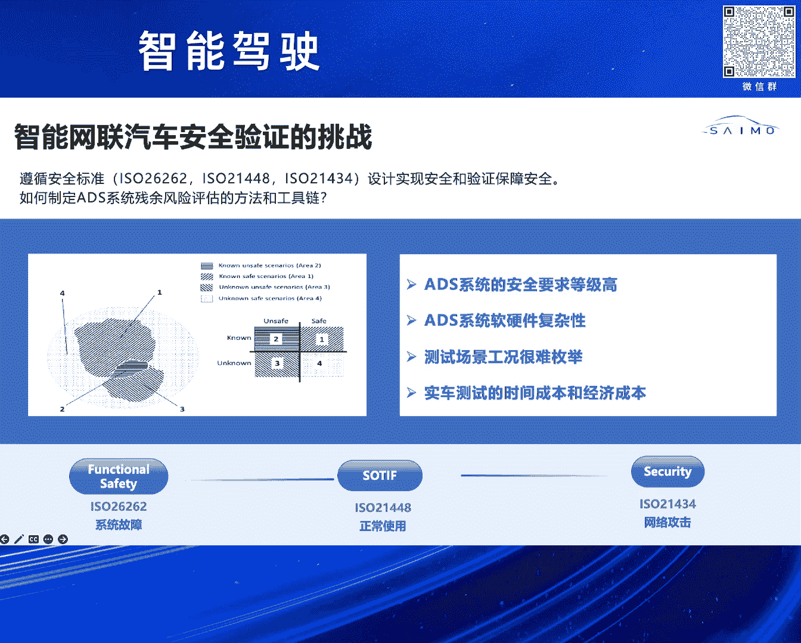
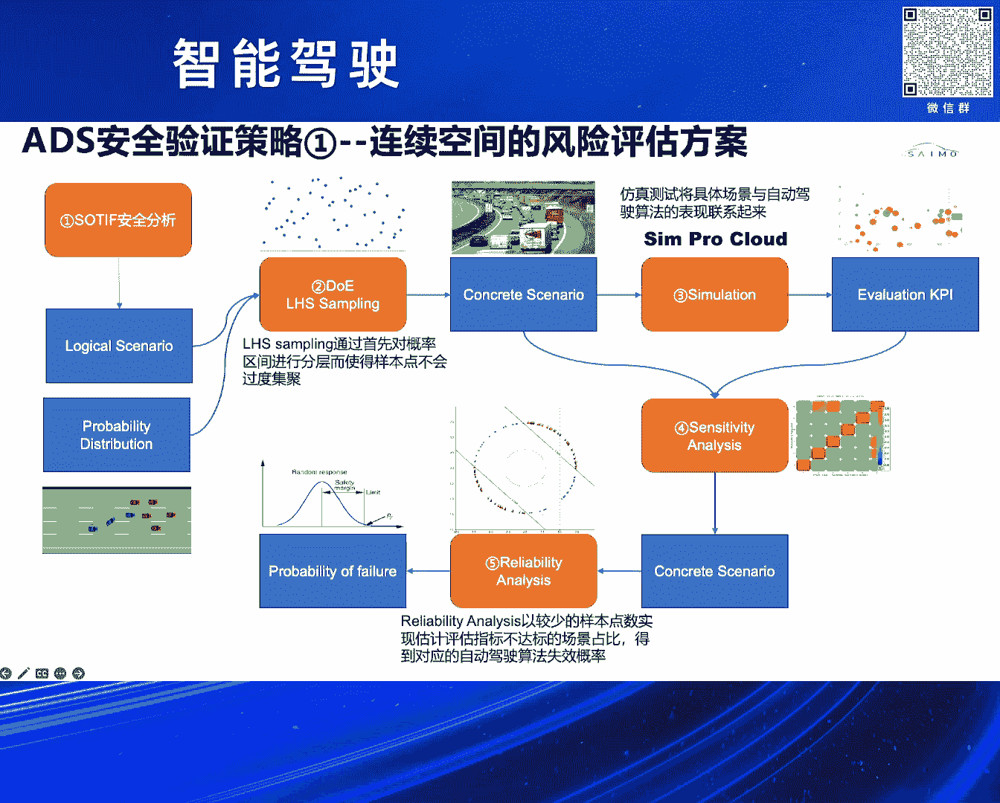
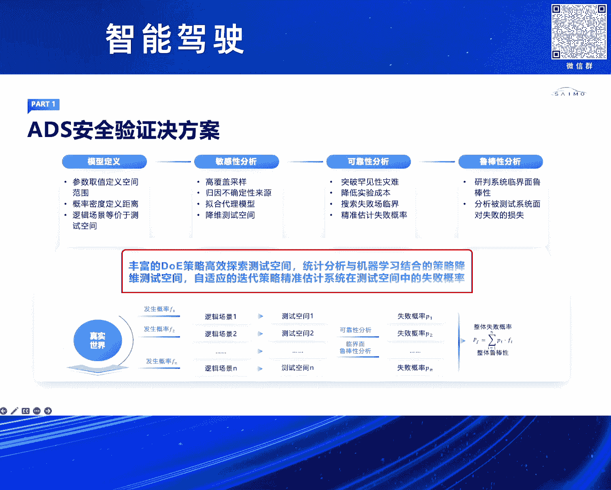
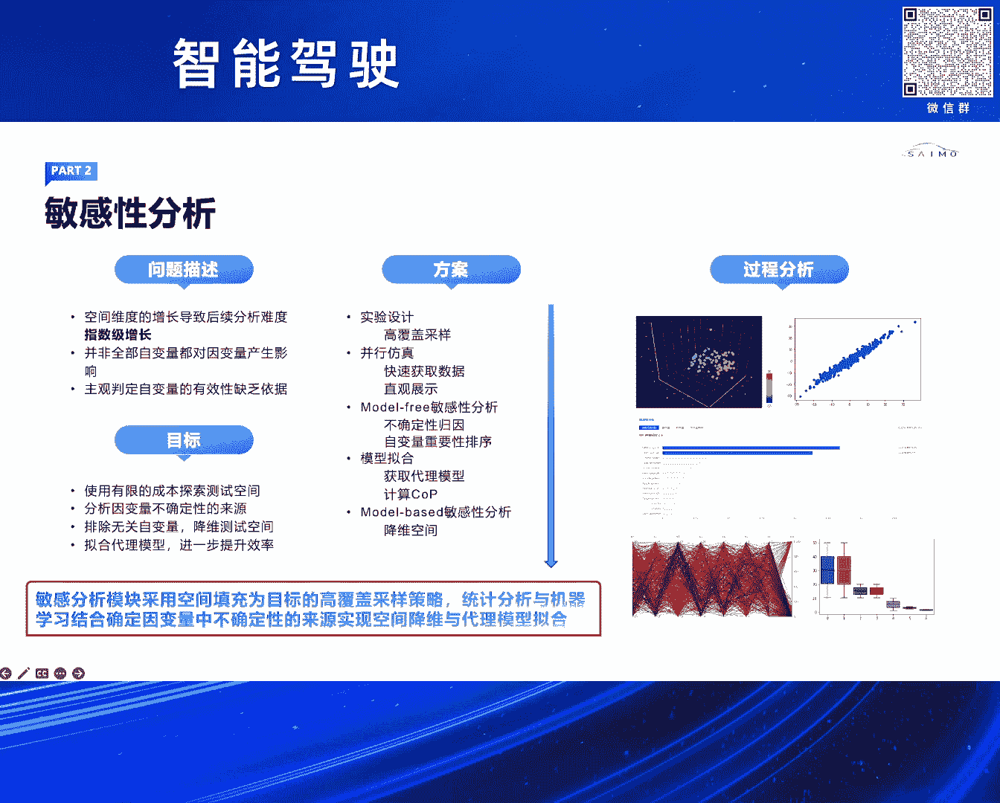
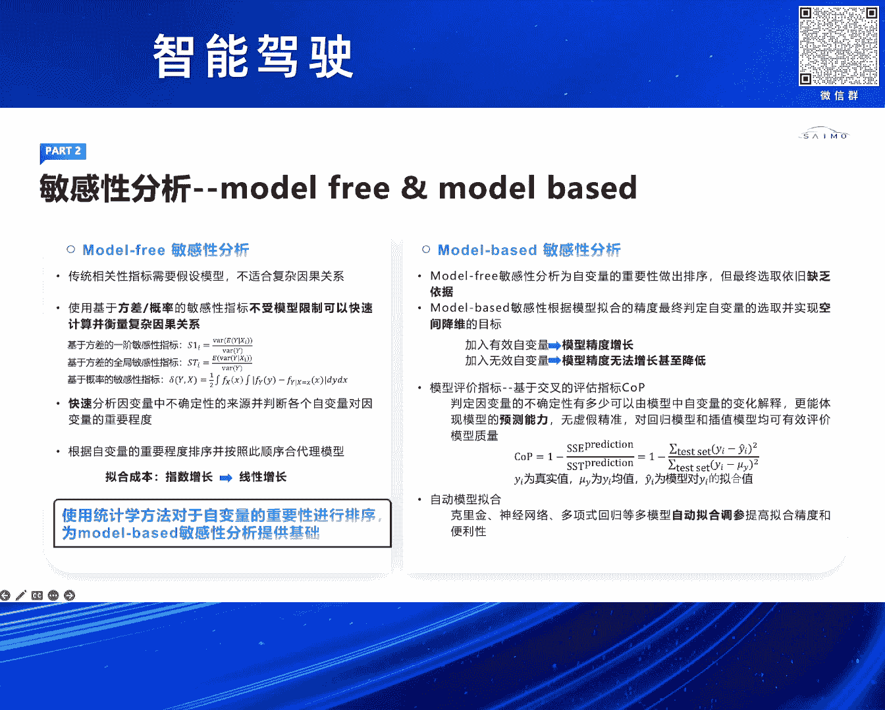
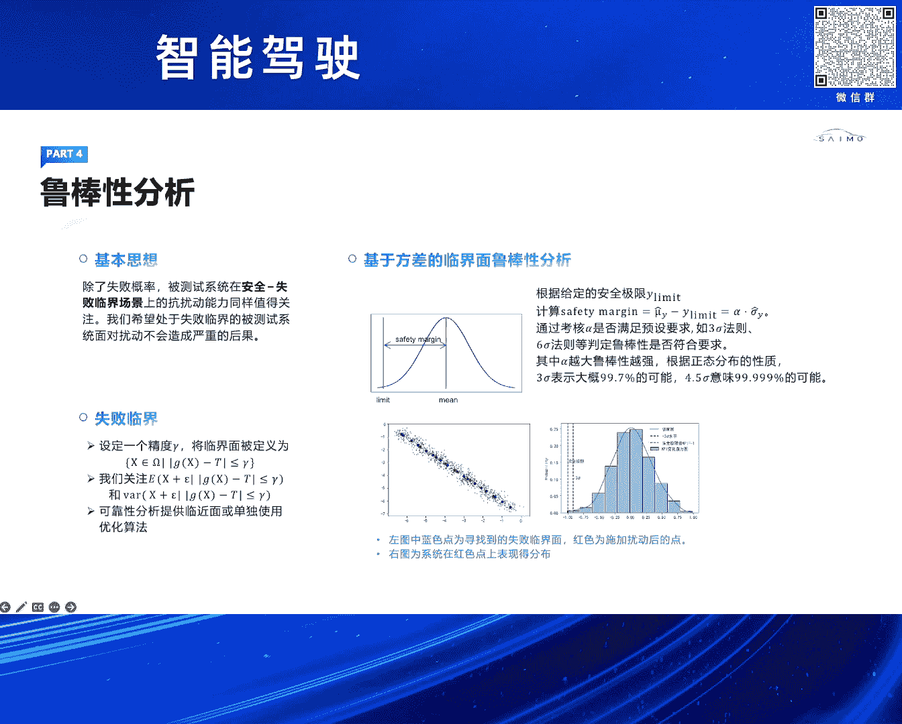

# 2024北京智源大会-智能驾驶 - P7：智能网联汽车安全验证策略和仿真工具链：杨 强 - 智源社区 - BV1Ww4m1a7gr

尊敬的法网总人尊敬的各位嘉宾，大家下午好，刚才几位嘉宾讲了很多算法的迭代。

包括引路大模型，来提高我们整个自驾系统的安全性，包括它的性能，接下来我要分享一下赛姆科技，在自驾系统的安全验证方面的一些思考，和我们解决方案，首先我要简单来谈一谈，自驾系统安全存在哪些方面的挑战。

我们知道随着L3以上等级，这种驾驶对安全责任认定的不一样，我们自驾系统如何去通过设计，实现我们的安全，包括通过验证，保证我们的安全，有一系列要求，比如说我们说功能安全对吧，这个R6 R6 R6。

其实它有什么问题，就是我们对于一个系统内部的，据它的哈娜分析，我们可以把它的硬件的随机性失效，和系统性失效可以解决，它要解决的问题是，我们这个系统本身内部没有问题，那网络安全呢对吧，通过网络安全的话。

我们通过相关的安全设计，我们知道这个自驾系统它是个连网的，对吧，那么可能存在外部的攻击，这个R1448我们要解决，不要受到外部攻击的这种风险，还有一个就是我们叫做预计功能安全。

这个预计功能安全它要安全分析和设计，要解决的问题就是说，当我们这个系统内部足够安全了，但是在我们系统设计层面，它有一些天然的这一些系统的缺陷，比如我们一些感知传感器，它对一些这种光照。

或者说我们对一些识别的范围有缺陷的话，如何来验证这个领域的一个安全，同时我们自驾系统它的软硬件非常复杂，我们很难通过分解各个模块，把这个安全给解决，另外的话就是说我们知道，这个自驾我们说它安全验证很难。

一个很重要的就是说它的常委问题，或者说我们很难通过一种有效的方法，我们去媒举这个测试场景，我们知道我们做这个软件或硬件测试，我们很多这种测试都是可以，它是确定的，所以我们是非常好的可以去确保它的安全性。

那自驾这个系统的话，它一个很大的挑战就是说，工况不确定性很难媒举，我结合这个IR-448对吧，它里面在这个安全验证的领域，提出了一个非常重要的问题，就是说如何去制定这个ADS系统。

残余风险这个验证的方法和这个工具链，这里来介绍一下我们赛姆科技，在这个自驾系统的安全验证，这个策略方面的一些思考，我们都知道基于场景的这个测试方法，是一种有效的验证自驾系统的安全性。

但是如何去构建这个场景，变得这关重要，我们讲这个ADAS的话，通过我们这种专家经验对吧，或者我们通过手工搭建的话，我们认为基本上是可以，确保它IR-2这种安全等级的。

但是上升到IR-3以上的这种测试的话，我们很难通过手动搭建场景，包括通过这种专家经验，能去制作一个非常全的有效级，所以我们需要寻找一套方法，如何去解决这个场景的问题。

我们借助于这个SOTIF的这个四象线分析，对吧，它里面就比较关注的就是对于这个，危险场景的这个怎么来验证，我们如果对已知的危险的场景，我们认为我们可以把它放在一个，IR-2范畴里面。

我们基本上可以确保的，但是对于这种未知的风险场景，怎么来验证它呢，对吧，其实它就很难去找到这些边界，那我们的一个思路就是说，我们把这个对自驾系统的测试验证，把它转化到一个测试空间探索的领域。

其实测试空间探索在我们很多，比如说航天航空，这些领域的话其实应用是比较多的，测试空间对吧，我们又可以去再细分一下，就是叫做连续空间和离散空间，怎么理解这两个概念，对吧，这个连续空间的话。

我们就说它是有边界的，举个例子，在我们今天这个话题当中，对吧，虽然它很大，但是我们总归能在一定的范围当中，就限定它的边界，那还有一种是离散的，就离散的话，你很难通过建模去找到这个系统的边界，对不对。

那针对这两种不同的测试空间的话，就是我们的方案就是说，针对连续的，我们要去通过我们的SOTIF安全分析，去定义一个这样的逻辑场景，这个逻辑场景我们认为它带边界，就是一个在一个这样的空间当中。

然后再结合我们的安全，我们的测试空间分析工具，去生成一些距离的场景，后面我们会具体展开来讲，所以说的话，在测试空间当中，我们会去找到我们关心的那一些样本点，然后通过统计来论证我们的风险。

那我们的理解就是说，在给定边界的条件下，基于我们的方法的话，我们是可以有效的去量化的评估，我们整个系统安全的，这是第一个，第二就是离散的空间，离散相对于我们连续来讲，就是无法去定义它的边界。

你很难去通过这种建模的方式，来做到这种风险评估，那我们的方案就是说，通过构建大规模的AI的交通流，来做这种随机测试，所以总结来讲，我们把测试空间分为两大方面，制定相对应的验证策略。

和我们的仿真工具链，我们先来看一看对于离散空间，我们如何来进行风险的评估的方案，我们在我们的这张PPT上讲的话，我们第一首先通过SOTIF安全分析，安全分析的话就是，它可以构建一个这样的逻辑场景。

我们讲SOTIF分析的话，其实分为两大块，一个是我们的安全分析跟我们的验证，有一些我们在安全阶段，比如说我的系统上，有些性能的局限，我们直接修改我们的系统，就可以去规避一些风险。

但是有一些我们是无法去调整系统方案的，这时候可能存在潜在的危险，这时候我们的安全工程师，就会把相应的这些我们说危害的话，给到我们仿真工程师，但是我们在安全分析阶段，需要输出一个逻辑场景。

你可以把它理解成，一个有待边界的空间，比如说它结合我们仿真里的话，我们叫逻辑场景和我们的参数的分布，当我们拿到一个这样的逻辑场景以后，我们就要进行采样，我们在统计当中，采样的话我们有很多种方法。

我们知道像比如说，从均匀采样的话蒙德卡罗，它的采样的密度会很高，它的覆盖力也很高，但是它有个问题，你要对一个高维度空间，进行一个非常好的覆盖的话，它的采样样本点是很高的。

即使我们基于云端大的并发的仿真测试，我们的测试结果也是，证明是不可行的，所以我们希望找到一种好的DOE，我们叫实验设计，我们通过少量的样本点，来去对空间进行覆盖，同时我们可以通过这些样本点。

对整个系统的失败概率进行估算，我们DOE完了以后，我们就会基于逻辑场景，生成我们的具体场景，这时候我们就会做我们的仿真测试，结合我们云端的仿真大算力平台，当我们有了这些仿真的数据以后。

我们会做参数的敏感性分析，就我刚才提到的，我们对一个高维度空间，你去采样，在功能上是不可行的，我们要先降维，敏感性就是消除那一些，对我自家系统影响不高的因子，敏感性分析完了以后。

我们会再进入到我们下一轮的仿真测试，这时候我们就是做我们的可靠性分析，可靠性分析它最终要解决的问题，就是说通过我们对系统的失败概率，你可以认为它是碰撞，对吧，或者我们TTC违反，来去估算出我们自家系统。

它未来的失败的一个概率，我们知道从失败概率的角度，如果说我们一个系统，它的失败概率是一个10的，-4之方-5之方，我们认为它是不够安全的，但如果一个系统，它的失败概率是一个10的-7之方，甚至更低。

我们认为未来，如果在仿真当中，我们可以达到这个级别的话，我们认为它未来在实测的路程当中，基本上这种功课也是不会发生的，整个就是针对这个方案的话，就是我们对于联系空间，我们认为我们是有一套。

从我们数学上可以认证的，在结果我们的工程应用上的话，可以去给出一个量化的风险的评估的一个指标，结合我们刚才讲的整个的一个验证的思路，我们分为几大块，首先就是我们就模型的定义，模型的话。

我们理解就是它是一个逻辑场景，借助于我们SOLIDWORKS分析的工具，当我们有了这样的一个逻辑场景，定义好这样的测试空间，我们做敏感性分析，敏感性，刚才讲的我们高采样，包括我们会去，你和一些代理模型。

对我们参数进行一些分析，敏感性分析完以后，我们就会做可靠性分析，可靠性分析就是，要对我们一个高位的联系空间下，我们要对所有的失败率，都要进行一个覆盖或者搜寻，我们要做的事就是要有效的去找到，这些失败率。

对整个系统，安排一个失败概率的估算，我们做完可靠性分析以后，我们会再做一个叫鲁邦性分析，鲁邦性分析是干嘛呢，对吧，当我们在前一阶段，已经对这个系统的一些临界面，或者说就是说它可能存在。

这个失败风险的区域，我们进行了这个测试验证，我们增加脑洞，看一看我们整个系统鲁邦性怎么样，所以通过我们这个敏感性可靠性，鲁邦性分析，来对整个给定的一个，我们从ODD分析下来给定的一个区域。

一个空间进行一个安全验证，最后我们会有一个失败概率的，这样的输出，具体展开来讲的话，我们敏感性它主要做什么，对不对，其实它通过我们这个，比如说我们首先要DOE实验的设计，接着我们用仿真。

在我们用敏感性分析，其实分为两个阶段了，我们第一个我们叫Modal Free，的一个这样的敏感性分析，这个阶段的话，我们就是要去对相关的，敏感性的参数进行一个排序，但是它并不去决定。

这个参数是否会影响我们，对整个自驾系统的一些KPI的影响，我们做完第一，Modal Free的敏感性分析以后，我们会进入到第二个环节，就是我们讲的Modal Based的一个验证。

这个我们会结合我们那些，机器学习的算法，最终会选取那一些，我们叫做对整个自驾，这个影响的那些这个场景的因子，比如说我们这个前车的，离我们的距离啊，我们的速度啊等等，这里我们重点强调就是说。

我们会基于我们的这个，敏感性分析算法，我们通过比较低的这个样本点，对我们整个空间进行填充，来结合这个基于统计，和机器学习的方法，来确定这一些这个，这个应变量当中不确定的这个因子，对我整个这个空间的影响。

这里讲了两个这个阶段，我刚才也讲到对不对，我们第一阶段的话就是通过我们，统计的一些分析，来找到我们这些这个，应变量它的一些这个优先级，第二个我们叫Modal Based。

Modal Based的话我们会去，它要解决的问题就是说，当我去在增加我这些，应变量的这个过程当中啊，它对我们整个结果影响的这个，影响是多大，如果我们认为，当你去加入新的这个影响因子。

或者是我们场景的这个，一些这个定义的时候，它的这个模型的精度在增长的话，我们认为这种参数是我们比较关注的，反过来如果说我们在增加一些场景，或者因子的时候，它整个我们叫，基于我们COP这个。

定义这个模型这个精度的这个指标，如果它是下降的话，我们认为这种指标是没有用的，对吧，所以敏感性分析就是说，经过这一轮的这个敏感性分析下，就是我们会去得到，这个比较重要的这些这个场景的参数。

为我们后面的这个仿真测试，做一个降维的准备，可靠性分析，可靠性分析的话，就是说刚才我们讲的对不对，就是我们希望，就是说通过对这个测试空间，这个失败率，这个失败我们要强调的是，所有的失败率我们都要搜寻到。

通过这，搜寻到失败率以后，我们通过我们样本里的设计，来通过这个，我们的结合的仿真测试，对整个系统它的这个，失败概率进行一个估算，我们传统的方法，我们可以基于比如说我们叫做，蒙德卡罗采样，对不对。

但这种采样刚才我介绍了，它是样本点比较多，我们知道对一个，一个比较成熟的系统，我们认为它的这个失败概率，基本上在10的一个，-60方或者-70方，这个还要比较小，但是如果说基于蒙德卡罗采样的话。

基本上我们认为它是，我们叫做这个，维度的一个灾难，你很难去通过这个，工程上去通过这个测试验证，得到一个这样的这么大的一个，采样样本点，所以反过来就是我们如何来去，解决对这么，这么低的失败概率的一个。

这个数值的一个评估呢，对吧我们叫做，可靠性分析算法，这里我们罗列了几种，就是说我们现在目前这个，常用的这个可靠性分析算法，第一个我们叫，方向性采样对吧，就这个在这个左上角这个图，就是我们会。

对整个高位空间不同的方向，我们进行采样，然后可以对，各个维度进行这个，失败率的一个搜索，还有一种我们叫做重要性，知识硬的这个重要性采样，就是通过我们不断的迭代，通过我们上一轮的结果，来搜寻我们下一个。

它可能存在的失败率，这样的话我们就会对整个，前空间进行一个这个。

全面的覆盖，这里我们可以看看，我们这个做了一个实验，就做了对比，就我们做了一个这个测试函数，可以看就是说，我们这个测试函数的话，它的失败概率在一个10的，这个-7字方，如果说我们看到这个表，这个表格。

就是我们在前面的话，当它失败概率是比较，比如说我们在大概10的，-3字方的话，对吧，其实基本上就是，基于我们的可靠性分析算法，和这个蒙德卡罗采样，基本上这个维度，大概在两个维度，对吧，但是也是比较大了。

我们看最下面的话，对吧，如果说我们这个系统，它的失败概率在一个，10的-7字方的话，我们可以看到，因为我们的这个采样方法的话，就是可靠性分析算法的话，大概就是可以，5000次左右仿真。

就可以把这个概率的，给这个估算出来，但是如果，基于这个蒙德卡罗，这种采样方法的话，它就达到这个6700多万次，所以通过数字对比，我们知道，我们在这种情况下，我们对于这个失败概率的估算，我们可以达到。

4个数量级的这个提升，这个是非常高的，非常高的，所以这个也是我们这个，可靠性分析算法，非常重要一个特点，就是它在，我们尽量去估算出，我们整个系统，它未来可能这个失败的概率，同时我们的效率是非常高。

乳邦性，乳邦性的话就是我们去增，在我们可靠性这个作完以后，我们已经搜寻到，这个失败率的这些零界面，我们通过增加这一些脑洞，来看它的一个，一个我们叫Safety margin。

如果它的这个Safety margin，如果落在一个，比如说这个6S 对吧，我们认为它乳邦性很好的，或者我们说3S，这样来对我们，这个整个系统，在未来就是可能，存在的一些脑洞，它的安全预，在什么范围。

我们进行一个这样的，统计分析，那基于我们刚才讲到的，我们这个，我们叫测试空间分析工具，对吧，我们的敏感性分析，可靠性分析，还有乳邦性分析，这个理论的这个，建立前提下，我们制定了我们整套的，仿真工具链。

首先是我们的那个，安全分析工具，那个Safety Pro，这个的话就是说我们，它一个很重要的输出，就是说当我分析完了以后的话，我们会输出一个逻辑场景，这个场景的话，会给到我们这个，云端的仿真平台。

云端仿真平台的话，我们会结合我们的这个叫，测试空间分析工具，这个可以理解成，它会制作我们这种测试策略，对吧，包括我们说对它这种采样，DOE，那当我们这个，进行了这个采样，DOE以后的话。

我们会做很多具体场景，再给到我们云端的，这个仿真平台，这是我们要大算力，我个人的理解，未来我们对这个，L3以上的自家系统安全，这个大规模并发的，这个云仿真平台，是必不可少的，一定要我们有这个。

非常强大的这个，仿真测试能力，那整个仿真测试云平台的话，基于我们这个，SYNPRO自研的这个仿真引擎，我们这个仿真引擎，我们会达到这个，最高1000赫兹的仿真，同时我们的传感器的话，我们能覆盖。

毫米波 激光，Camera 物理传感器，对不同的光照，包括它的一些这个，噪点等等，我们都会去做这个，这个仿真测试，然后再结合我们一个，自研的这个，27自由度的动力学模型，做一个闭环的这个仿真测试。

我们仿真测试，会输出一个这个仿真结果，这个结果再会给到我们的，这个测试空间分析工具，来做我们这个，刚才提到的，这个可靠性跟乳方性分析，就用这个结果的话，对吧，我们再返回到，我们的安全分析阶段。

看看我们这个结果，比如说我们的系统测下来，在这个ODD下，我们这个潜在的风险，我们评估下来，如果它是失败概率是，10的负4之方，说明我们在安全阶段，还重新进行这个，一个系统的设计，对吧，但是如果我们说。

仿真的结果，是一个10的这个负7之方，那我们认为在这个场景下，你是足够安全的，所以整个这套，这个工具链的话，就是说，我们都已经在云端集成，也目前的话，也是在我们，多个主机厂客户的话，商业落地使用。

另外就是说，我们两款核心的这个工具，我们的安全分析工具，Safety Pro，包括我们的仿真引擎，SIMPRO，已经通过了我们这个，公路安全，这个Azure D等级的认证，那为什么要做这个事情呢。

就是我们知道这个，这个仿真了，对吧，包括我们在做公路安全的时候，它对这个，你的工具链的，自信度是有要求的，我们通过采用车规级最高的，这个G262，Azure D等级，这个要求的这个流程，来去。

对我们整个系统的可靠性，包括这个自信度。

进行一个验证，好的，就是刚才就是我们讲了，我们在第一个维度，对于这个，连续空间下，我们如何对系统，进行一个这个安全的这个评估，接下来我们来讲这个，对于离散空间的这个风险评估，离散的话就是相比于我们这个。

这个连续程序空间，它很难去，通过我们数学的方式，建立一个模型，对它进行求解，对吧，那更多的就是说，我们不知道它的边界在哪里，我们的一个，一个这个解决方案的思路，我们要引入这个随机交通流，对吧。

随机交通流，那当时我们在做整个方案的时候，我们也在思考，就是说这个，随机交通流应该如何来构建，我们是采用这个传统的，基于这种规则的这个模型，来去生成这个交通流，还是说我们要通过这种数据驱动的。

那我们的这个理解是，基于传统的这一些，这个交通流模型，它是比如说，有些是第三方国外的，对吧，就是它很少有我们中国内地的，这个交通的一些这个规则，所以他们那些，基于传统的这些便道啊，对吧，我们的跟车啊。

这种模型啊，是很难去，跟我们真实的这个交通流模型，交通流啊，进行一个这样的这个逼近的，所以我们认为，基于这个，应该构建，基于我们中国实际交通流数据的AI模型，对吧，构建我们宏观交通流和微观交通流。

那我们的方案呢，对吧，就是首先我们要去，采集这一些宏观的交通流，和微观交通流，那基于这个数据训练我们这个AI模型，那再结合我们这个，云端的这个，仿真平台做一个闭环的测试验证，这可以看到对吧。

首先我们是要去，去采集我们这一些宏观微观的这个数据，比如我们对某些城区也好，或者高速公路也好，对不对，那基于这个模型，我们会对这个宏观交通流数据做预处理，包括我们的微观交通流，这个进行预处理。

再给到我们这个AI交通流，那我们这个AI交通流的话，其实也是包含两个方面，一个是我们的宏观的，一个是微观的，这简单讲一下，宏观微观有什么区别呢，就是宏观的话，就对我们整个城区不同道路的，它的一些交通流。

比如说我们车流的密度，车流的速度，包括我们的一些这个流量，进行一个这样的预测，未来的预测，那微观的话就是对我们一个单车，它的在这个一个复杂的这个情况下，它的一些表现，对吧，当我们前车有前车的时候。

你是要去变道，还是说要去超车，还是要减速，是要解决这个维度的问题，当我们把我们这个交通流，这个确定出来以后的话，我们再结合我们在云端的这个解决方案，我们叫做加上我们虚拟城市，虚拟城市的话。

就是它可以理解成，跟我们这种数据孪生啊，是有点类似的，我们要采集这些高精度的这些，这个地图对吧，那在这个地图之上，我们要去构建这一些，高拟幀度的这种模型，我们知道就是说，对于23以上的这种自驾的验证啊。

对我们刚才我们在第一阶段，我们要做的是，这个在给定区间下，它可能是一些这个片段式的这种防针，但是我们说对于这个城区的这个，这个自驾系统的话，对吧，它除了我们在那些比较这个确定的，这个公共设施验证环境。

我们还要在这种连续的空间下，进行测试验证，那我们这个交通流模型啊，就是要解决这个问题的，对吧，当我们有了这个比较一个大的这个地图，我们这个真实道路是，是这个这个这个这个一致的。

同时我们也引入了我们的这个，AI交通流模型，再结合我们云端的防针平台，来进行一个测试验证，这时候我们就可以介入我们大量的，这个自驾的算法，进行一个闭环的这个防针测试验证，这里可以介绍一下我们做的这个。

AI的宏观交流模型啊，对吧，它就是结合了我们基于这个道路拓补信息的，交通流动态以及这个非线性的一个这样时空，这个图神经网络，我们为什么选择这样的一个时经，这个这个时空的图神经网络呢。

首先就是说我们这个图神经的话，就对我们这个道路拓补啊，是比较这个吻合的对吧，第二就是我们在这个宏观交通流上，它有这种时间跟空间的概念，通过构建一个这样的这个模型的话，我们会对未来的一个这个时间节点。

某一个路段的宏观交通流进行模拟，整个模型的话可以看到对吧，我们就我们的输入的话，就是说我们的地图信息，包括我们这个宏观交通流数据，那我们整个主干网络的话，就是基于时空的这个图神经网络。

我们就引用了四个这个主干网络，因为它每个模型缺优缺点不一样，对吧，我们都会同时来确定它们，也同时它们会推理，然后在这个这个这个，推理阶段的话，它会输出我们这个四个模型，不同的这个对宏观交通的预测数据。

那结合我们这一个staking算法，这个算法的话其实就是一个后融合，那最终来给出我们这个宏观交通流，对我们特定道路的一些这个，它的交通流的一些流量密度，速度的一个预测，那微观交通流的话，对吧。

我们刚才讲其实就是要，你可以把它理解成是一个驾驶员模型，但是它是一个数据驱动的，是我们一个本地数据驱动的一个，训练出来的一个模型，整个网络的话对吧，我们可以分为几大块，就是第一是我们叫光山化。

第二就是我们这个主干网络，那整个这个主干网络，我们也是基于这个BV+Transfer，这样的一个架构的，后面就是我们这个，包括我们这个编码跟解码器，最后我们会有一个多模态的一个，输出的模型。

我们输入的话就是我们这个地图，包括我们这个行车的一些数据，那光山化就是我们就是把这个，把我们这个，比如说我们地图的拓扑，包括我们车辆的在车道线上的一些朝向，它的一些这个，跟地图的一些夹角等等。

作为这种光山化，给到我们这个模型，再到我们这个，Encode的这个，这个Encode的器里面，这里面就是我们会提取，我们那些比较重要的特征，那么解码器呢，解码器我们这边加入了我们，对一些这个。

矢量的这些数据，比如说我们车辆的类型，对吧你是卡车还是轿车，包括我们这个车辆的这个，一些数据，对车辆你的一些行驶的一些速度，加速度等等，那最后对吧，我们会输出一个多模态的一个这样的，这个预测。

这多模态怎么理解，就是我们这辆车对吧，在这个交通路口，我们是要去执行，还是左转还是右转，它会多给出一个概率，我们会找到一个，这个最高概率的这个预测，我们认为是它比较好的一个，行驶轨迹。

那最终的话我们就发现这个模型，就是我们训练完了以后，它还是对有一些工况，这个推理是有些误差的，我们会加入一个这个，后优化的一个这样的模块，来对我们整个，微观交通路模型进行一个优化，基于我们这个。

AI交通流的模型的这个设计，我们针对这个，我们讲这个离散空间的测试验证，我们整个防征攻击链，我们可以看到对吧，在我们图的这个左边的话，结合了我们这个，基于我们真实采集数据训练的，AI交通流模型。

再结合我们这个虚拟城市，对吧，虚拟城市，我们对特定城区的一个测试验证，来给到把这个海量的交通流数据，输入到我们的SIMPRO的一个，这样的这个防征节点，这个节点的话对吧，那我们重点强调一下。

就是我们知道，当你数量集很大的时候，对吧，你这个你这个，几千个几万个数据之后，你用单引擎的话，包括你的这个，对于传感器的这个设置，这个计算，你的性能是不够的，那我们采用了一种分布式的仿真，分布式仿真。

我们把我们在传统意义上，传感器在我们仿真引擎内部，我们把它移到我们的节点上面，对吧，在每个节点上面，我们去计算我们主车周边的一些，感知的信息，那再结合我们的评估，这样我们就可以达到。

就是我们通过一个仿真引擎的节点，然后再把我们计算量比较大的，就是分解到我们在，并行仿真当中，每一个容器当中，它的这个计算量，这样我们会做到，这个实时的仿真，同时的话对吧，我们可以去做。

这个多任务的一个这样的这个并发，我们每个任务的话，我们会，目前的话我们的性能可以做到，5000加的交通车加100的主车，可能大家觉得，哎呀，怎么你们是性能，交通只能支持5000，对不对。

有些传统的这个基于规则的话，它可能几万甚至10万的，这样数据，但是我们强调的是，通过这种AI训练的这个模型的话，它在推理阶段还是有很多这种，需要优化的地方，这也是我们目前重点在推进的。

包括我们在这里面做了很多种，大量的这种并行计算的优化，那最终我们整个这个自驾平台，这个自驾这个系统，AI系统验证的话，我们会做到实时的这个分析。

可以去提及这些关键的NG场景，这里有一张图，可能这个有点小，就是我们把我们三星目标云端部署的，这个结合我们的AI交通旅游和虚拟城市，还有我们整个云仿真的一个并行的平台，那个数据展示在里头。

我们就可以做到非常好的，这个连续的一些城区的这个测试验证，这对于我们在而善业上的这个城区的验证，是非常重要的，总结一下就是说我们就是针对这个整个。

预警空调安全提出的对于这个，未知的这个，未知的危险场景的测试验证，我们通过对空间的划分来去进行这个测试验证，好的，谢谢大家，谢谢大家。

谢谢大家。