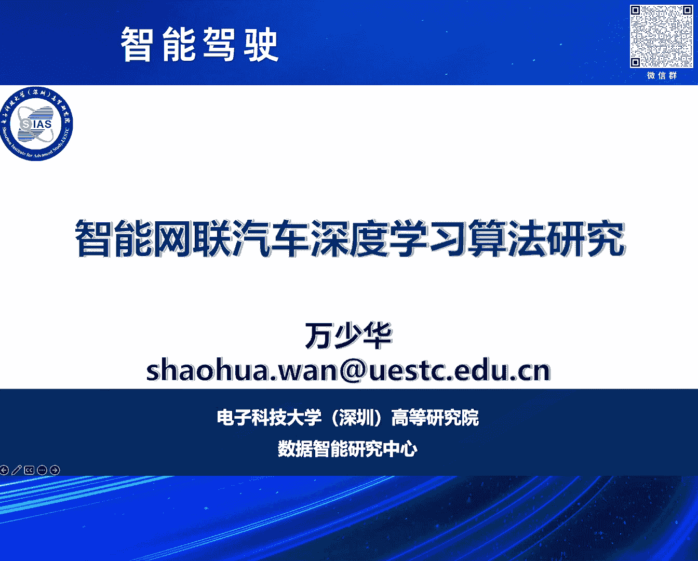
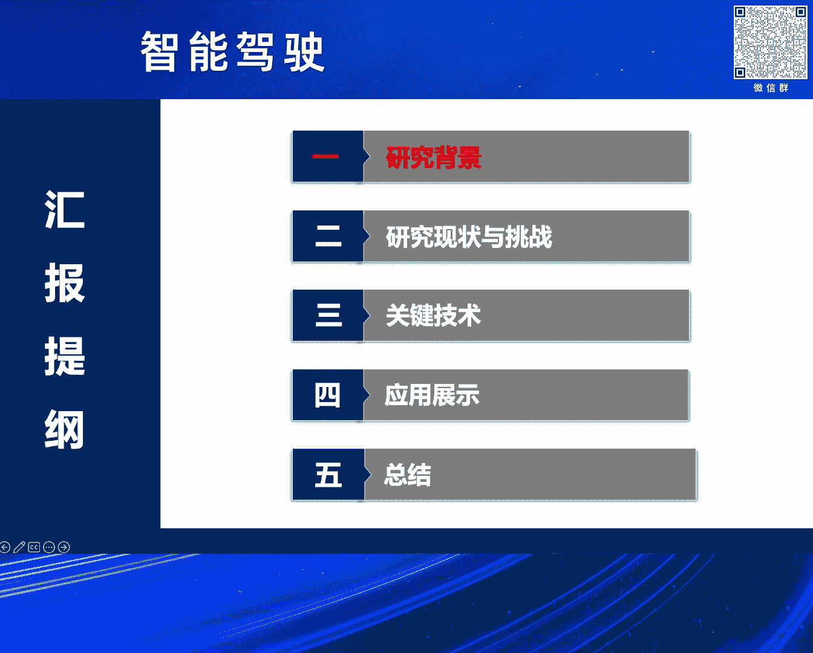
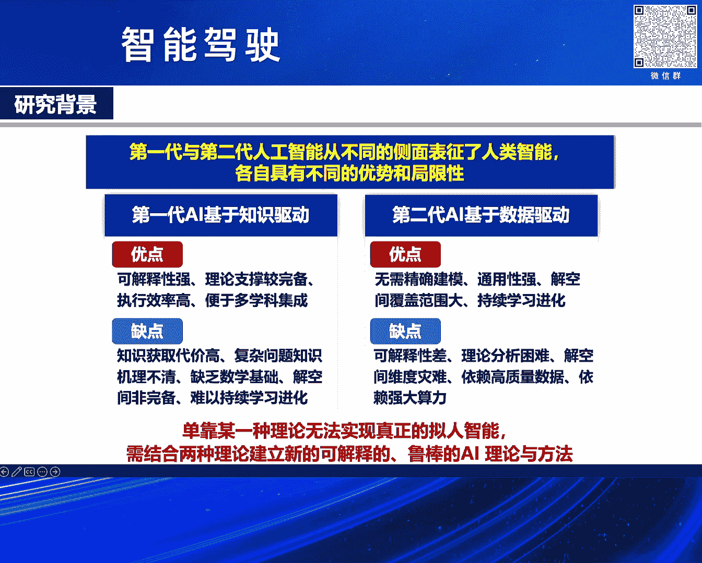
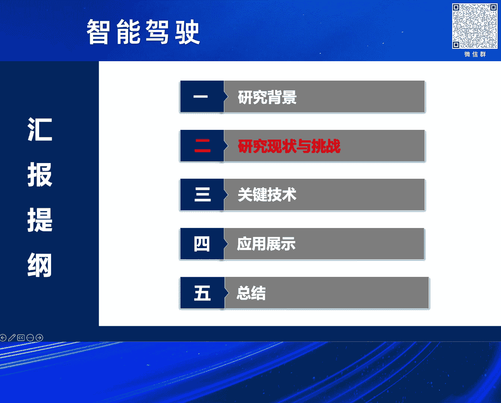
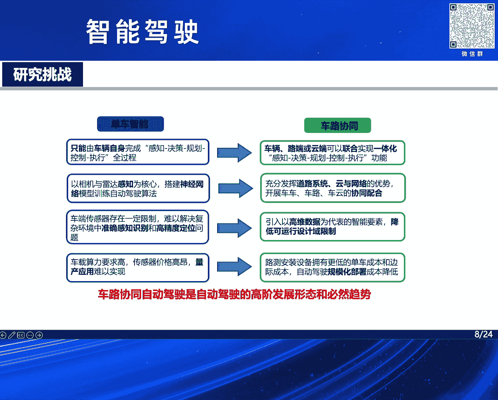
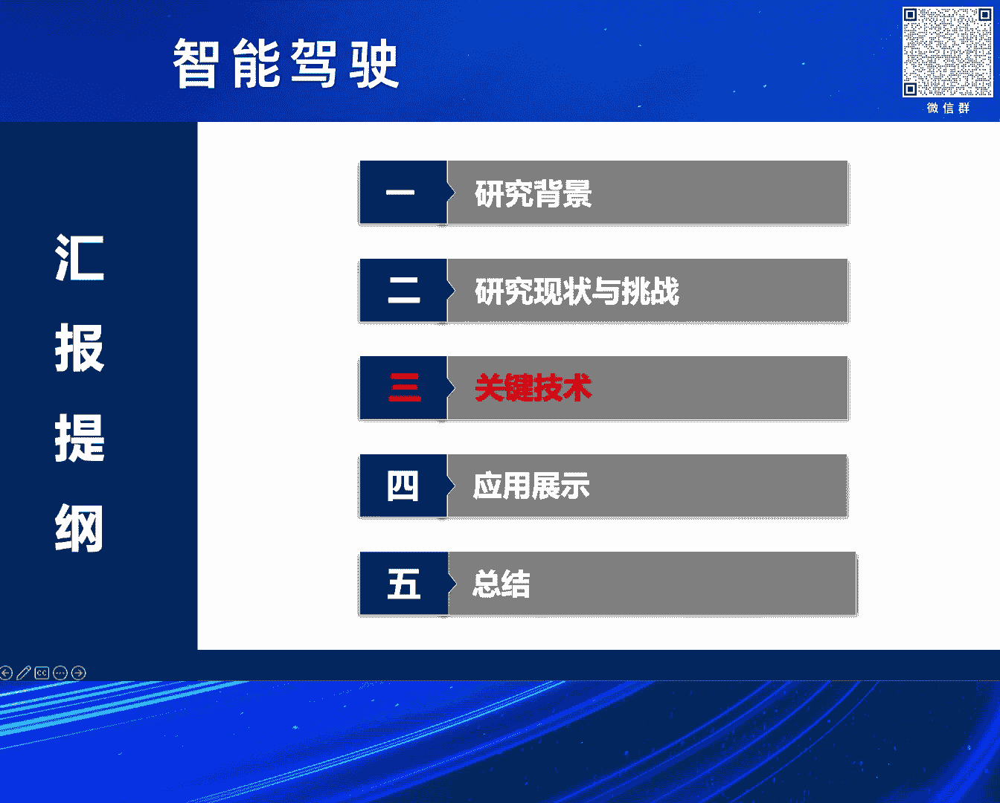
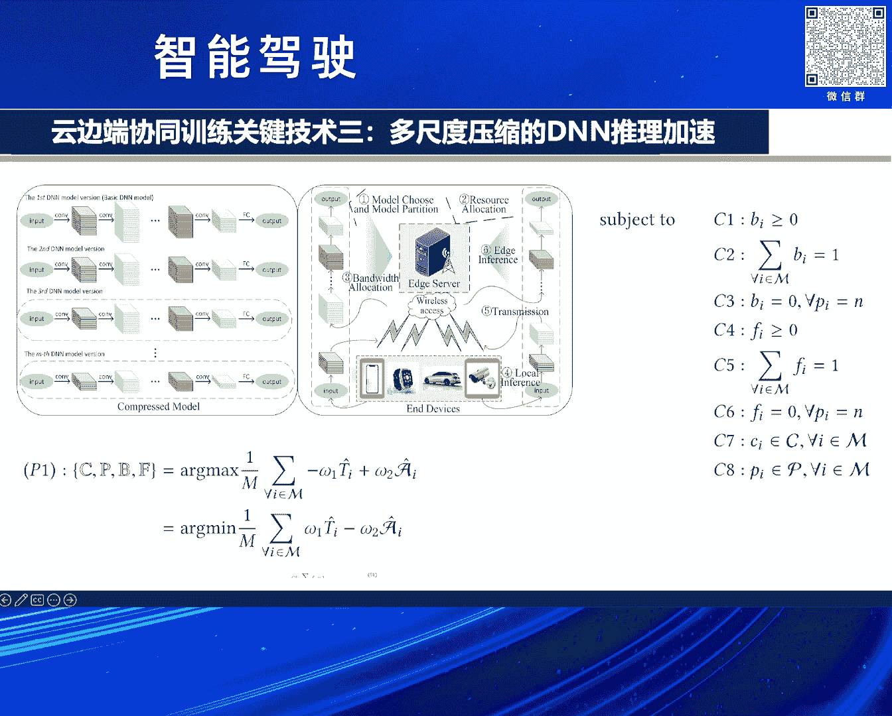

# 2024北京智源大会-智能驾驶 - P8：智能网联汽车深度学习算法：万少华 - 智源社区 - BV1Ww4m1a7gr

大家下午好。

感谢法网主任的邀请，感谢组委会，使得我们有这样的一个交流学习的机会，向更多的企业界的朋友能够学习，以及能够产生更多的碰撞的机会，产生一些火花，然后我是来自电子科技大学的万绍华。

然后先介绍一下我们高等研究院，我们是在深圳实验的一个深圳的市的20+8，就是低空经济人工智能，还有高度地铁化的发展，应运而生，那么我们是电子科技大学的二级学院。

我们数据智能研究中心目前是从日本回来的人夫纪工程院的院士，然后是带领我们，我们一共有八个正高级的教授，然后六个国家级的人才，然后有八名博士后，三十名博士和一百三十名硕士。

然后我们主要研究机器学习人工智能，然后相关仍然是做数字人机器人，然后情感积散，我们也就希望这一个既做理论的研究，也做产学营，然后跟大家汇报的体刚就是包括研究背景，然后研究的现状和挑战。

然后我们的一些实践就是科学研究，然后最后是应用展示和总结，然后这是人工智能驱动车电网通感散，是实现智能驾驶的第一个根本保障，那么随着通感散技术的发展，那么无线通信和网络向更高的移动性和更复杂的场景。

去延伸，那么这一个像人计算和人工智能，使得智能网络汽车的计算，就是走出智能的座舱，然后这一个，就使得提供了更高的可靠性，大带宽低延迟的传输的通信，然后像B-RAN计算，就是使得降低的延迟。

然后使得我们的服务体验能够做到强实时，然后右边的是车路协同，我们最近也在讲大模型，那么大模型的车轮协同的部署是必然的趋势，它能够把这样预训好的这些模型，卸载到病院那里降低延迟。

然后可以能够提供一些电子化的，就是场景的微调的电子化的服务，和个性化的服务，以及不需要把这些数据上传到云端，来降低隐私泄露的风险，那么智能驾驶是一个必然的趋势，那么我们看看人工智能。

第一代和第二代的人工智能，它都是从不同的侧面，表征了人类的智能，然后又各自具有不同的优势，也有自己的一些局限线，那么单靠某一种理论，某一种无法实现真正的理人的智能，我们需要结合理论进行新的可解释的。

鲁邦的AI的理论和方法，我刚才注意到我们下面一个要讲的，刚好是数据驱动加知识驱动的相结合。

那么再看看解决民生问题，就是交通的安全，我看每年就有交通的事故，以及交通的拥堵，我自己也常常也注意到，就是像特斯拉，它把白色的汽车判当为蔚蓝的天空，所以导致这一个事故，还有骨骼的事故，那么我们更加可靠。

更加安全，更加节能，和更加舒适的智能驾驶是必然的趋势，然后全球也在仔细地推荐，就是说随着百年未有之大变局，那么自动驾驶系统的核心和技术，已成为全球战略的制高点，像中国制造2025和2035的软件规划。

也确定了智能驾驶为智能制造的核心的战略的内容，像我最近也刚刚注意到，就是今年6月份，就6月初，工信部联合其他的三个部门，也就是说智能网络汽车的准入，和道路管理规范的适应型通知也刚刚发布。

然后好像有我们在这里确定了九个联合体，包括比亚迪还有长安广汽，还有这些联合体，加速推动智能网络汽车的高质量的发展，然后像美国，像欧盟和日本都也在积极地推荐，然后下面是我们面临的一些研究的现状和挑战。

那么百度我们知道它专注路侧的感知，因为感知是提供信息的基础，我们希望能够做到全方位多视角和多模特的感知，像中国联通它是基于移动避难计算，用新的架构，像华为是基于VectorX。

就是Vector2 Infrastructure，就是包括路人网络还有路侧的基础设施的一种新的部署，实现了多场景下的应用。

然后车路协同它的实现需要分阶段的推进，它不可能一蹴而就，其中感知任务在车路系统中具有重要的地位，因为它是提供信息的基础，就是车路的协同感知，那么下面是我们学术界关注车路系统，系统感知的一些研究。

我们看一下单车制冷面临的安全性，和润血涉及于经济性以及成本方面的挑战和问题，首先说安全性，因为单车制冷在一些比较特定的场景下，辅助的驾驶系统有应对不足和失效的风险，安全性有待提升，车辆润血涉及于。

像我们刚才有同事也提到，雨天雾天雪天的恶劣的天气场景下，的肠胃场景鬼滩头的这种现象，也是感知了有些人是在提升，最后一个就是为了做到全方位，就是多视角多模特融合的感知。

我们需要部署更多的传感器和高性能的通信设备，来增加感知的性能，这样就自然导致在车辆的成本的增加，然后我们看看单车制冷和车路系统，单车制冷就是说在车辆本身，用车自动的感知规划决策和控制。

执行的全过程搭载神纪网络，进行一个自动驾驶的算法，然后车路系统它就是实现车路云一体化，实现感知决策的一体化，然后充分发挥道路路侧云和云计算，和一个协同的配合，那么加入单车制冷和车路协同。

它并不是一个完全的非合，就彼此对立的二元的对立的，它们都有彼此的优势，也彼此的不足之处，然后它们是这两种技术的，这一种融合应该是未来的趋势，车路协同它是能够实现自动驾驶的上限。

在车路系统中仍然也需要单车的制冷，然后这是我们研究的一些，准备的研讨的一个科学的问题，就是高移动性高动态性的动态的拖扑，然后车单的异构大海量的数据，那么需要实现通讯计算的，形成的一个人体的体系架构。

然后我们需要多模态就是多视角，然后准确的精准的感知，然后复杂的深度学习模型的可解释性，比如说它的轻量化，它的模型的分割，还有模型的压缩，这是真正的技术，研究最后一个就是，面向数据时效和缓存卸载。

因为我们要低延迟，高可靠强实时，我们希望把一些服务，比如说一些顺利好的日顺利的模型，能够卸载到路侧，或者避软的服务器，来降低延迟，然后下面就是我们的一些研究的工作，第一个工作就是关于感知的。

就是不良听器条件下的感知技术，就是基于多模态融合的，未知听器条件下的单刀单的自动驾驶，那么我们针对什么问题呢，主要是针对不良听器条件下的，多元异构数据来融合，然后多阶段的自动驾驶，它有存在这些误差累积。

那么我们提出来单刀单的多模态的，增强的新的架构，我们在最右侧可以看到，它有两个输入，一个是二维的RGB的图像，一个是B1V的图像的融合，然后我们经过底认模式，通过零和映射就是弹性结构。

这是我们提出两个方法，还多出的注意力机制，以及CNN来融合多模态的数据，来获得一个更加可靠的，一个驾驶的环境的感知，然后在右侧还有两个输入，就是一个是路点和速度，速度就是用来感知车辆的。

实际的速度的控制，那么路点是用来入侧车辆的轨迹，以实现高阶的导航引导，那么路点的输入，我们输入的是一个控制的面列，输出的最后是来对车辆进行一个控制，那么实现了天气条件下的各种自动的驾驶，然后可以看到。

我们刚才提到的，这个多宁和的映射和弹性的结构，就是来提高这种融合的鲁邦性的表征，就是避免在不良天气条件下的性能的下降，或者特征的丢失，来提高这种鲁邦性，然后经过宁和映射，然后弹性结构。

还有一个多次的规律化机制，一个多次的注意力机制，然后最后形成一个宁和特征下，分两部分向反馈，就是RGB的feature和BEV的feature，然后第二，我们在仿真气动自动驾驶性能的算法进行评估。

来在各种变化的场景下，对模型进行一个印证，然后这是我们做的实验，就是我们的baseline选择的是一个transfuser，然后它也是两种传感器模式，一个是激光的底轮和一个RGB的图像。

跟我们这个方法是非常类似，我们提到了三个性能的指标，一个就是Driver Score，就是用来后面的Route Completion，就是完成的距离和完整距离的几乎，和后面的每公里的违章数的几何的平均。

然后Rc就是我们用自动驾驶的完成的路线的距离，和总的路线的距离的百分比，然后IRS就是每公里的违章数，比如说创哄灯，比如说违填，比如说和人的车辆的刮蹭等等，就是来做一个验证，再分别在不同的区域。

就是Tang01到05的进行一个验证，我们可以看到我们前面的数据都有些性能的优势，这个细节我就不展开，然后第二个感知技术就是进入互学系的语无挑剔下，就是技术知识的不良情绪条件下的交通目标的强化识别方法。

然后又是在恶劣的情绪条件下，物体的检测不可避免，尤其是很多的研究它集中在两个方向，一个就是区域的检测和语意的分隔，但是他们没有考虑到这两个任务之间的相互的作用。

我们提出的CEM基因就是互学系的执行度增强互图网络，来相互的激励，能够提高各自的任务的一个鲁邦线，然后我们可以看到在双任务，就是语意分隔和边界的区域检测，然后完成的一个执行度增强模块。

它将特征任务转换为图空间，来提高各自任务的鲁邦线，然后降低了OG的空间的特征的损失，然后我们使用Intergraph来推理了古籍任务之间的差异，使用Intergraph来推理了提取模块的高级特征。

最后我们做了Citiescape开源数据集合，46个Citiescape数据集中，做性能的验证，达到了大概IOU的交变比80%左右，性能在物体的条件下它的扰动是低于1%，然后大家可以看到。

这是我们做的刚才提到的Citiescape和FocusCitiescape的数据集上的一个验证，我们可以看到黑帖子的平均的准确率，最后右边的就是平均的交变比，我们都是占有优势的。

下面就是我们在FocusCape数据的可视化效果，有误的情况下衰减系数，然后我们看一看我们的性能的波动情况，第三个工作就是关于复杂城市环境下的交通因素，比如说车辆的识别。

然后这个地方我们根据城市的复杂环境，就是有些比较复杂的基础结构，我们也是改进了YOLO模块，然后加入了通道的注意力机制，然后做了实验。

从YouTube可以看到我们引入了High Resolution模块，代替来加入到YOLO中，然后我们可以看到低分辨率的网络特征，和高分辨率的网络特征，它是并行的连接，来降低低分辨率网络特征的优势。

然后我们也是做了实验，就不展开，然后我们在Cityscape数据集和我们自制的数据集上，做了性能的对比，对比的就两个，一个是误解率和一个是漏解率，然后第四个工作就是我们的一个关于交通流量的一个预测。

我们看到就是针对的问题就是单一的深度学习方法，命令着一个过了以后的风险，我们使用动态的全职以后，两种模型提高模型的日色坚度和放火能力，其中就是用到了RSTM模型和SAE的模型，的这个联合。

然后我们可以看到就是做一个实验的验证，我们这边可以知道就是MSE它是一个，越小就表示我们的预测值和真实直接的差距是越小，所以看到我们的数据是最小的，然后下面就是。

人兵单协同的顺利的关键的技术，我们第一个提出的就是，就是联邦学习，就是带来的高通信的开销为高隐私数据带来一个巨大挑战，主要就是为了压缩通信量，就是降低模型更新的频率和size，来压缩通信的成本。

特别是跨中心的模型的顺利的时候，我们可以看到联邦学习的它一轮的通信的冷次，包括了一个下行和上行，完整的一个冷次还有这个聚合，那么下行的话就把参数服务器的模型参数，下载到车单。

然后上行就是把车单的模型参数，上传到参数服务器，这是决定了通信的成本的大小，然后聚合的话就要等待所有的车单，要需要等待所有的车单的参数的传输完，才能进行融合，我们提出来这个车载并让联邦学习。

然后在这个地方我们用到的几个策略，就是本地顺利的策略，减少通信冷次，部分客户单参与规则，阅书上传时间和一个聚合策略，最后我们验证了这个就是通信的成本，然后以及收链的速度快慢。

第二个就是我们也是进入增强顺利的DNN的，一个计算的下载，也是为了能够顺利的减少顺利通信的成本，提高快速的输入，然后这个地方我们提到的增强顺利，就是它有一个下载的三法，一个灾难性遗忘问题。

那么模型需要重新顺利的提高准确线，然后我们这里就是提到一种增强顺利的方法，这个就是我们在几个对比的算法，就是关于random就是随机的，就是随机的下载和local的，就是直接在这个车单进行计算。

然后griddy就是团体的算法，就是说它是一个最好的输出，但是它有一个问题就是它的执行时间非常的长，然后我们就像DDTL它是一个baseline，然后我们在进行一个宁赫的优化，既考虑到这个延迟。

也考虑到这个能量，然后当这个beta=0的时候，那就是对这个延迟的一个优化，当beta=1的时候，就是对这个能量的一个优化，第三个就是我们提出一个多尺度压缩的一个DN推理的加速。

因为这个冰软环境的动态线，就是车段的动态线和这个中单车的多压线，对DN模型的这个划分提出了一个重大的挑战，我们希望将这个问题进入一个混合整数宁赫优化的问题，宁赫优化有几个模型的选择，包括任务是延迟性的。

延迟敏感性的任务，还是计算比较重的任务，以及模型的分割点，以及贷款资源的资源的分配，来根据任务属性最大化的推理准确性和延迟之间的一个权衡，我们可以看到就是说，我们在云端有一个cloud。

有一个offline一个离线的顺利，还有在edge的online一个顺利，然后edge end进行，然后这个就是我们可以从左图可以看出，就是不同的准确性和计算复杂度的DNN的一个。

深度神经网络的一个不同的版本，就是版本的选择，然后右边的123就是我们需要做出的一个具体的决策，比如说这一个版本的选择，这一个就是资源的分配，然后456就是说在这些，根据这个决策的一个执行的一个结果。

然后把它优化的这一个就是PE的这样一个问题，然后受到一些约束，我们优化的问题，不表示考虑所有的这个它的这个服务的请求，比如说我们刚才提到的，这是计算量重还是这个延迟敏感性的，还是这个模型的选择。

还是资源的分配等等，就是说做一个动态的一个宁赫的一个优化，还有贷款，然后这个实验就不说了，然后最后就是我们提出了这一个就是一个模型的分割，因为在资源的这个受限，我们讲大模型，在这个车单平软。

但它的资源不管是计算还是存储都是受限的，在这方面去部署大模型是吧，它这个计算密集的这个DNN是非常的困难，是那么我们这一个模型的划分，已经现在受到广泛的关注，但是它并没有，但是很多的研究它没有考虑到。

这一个最优分割点和这个计算资源的分配，而变化的这个问题，我们针对这个问题，考虑到DNN模型的最优分割点，计算资源的分配，而这一个变化的问题，我们提出DNN模型的划分的计算卸载策略，然后针对这一个就是。

针对这一个就是说，就是这个迭代次数和这一个，就是这一个惯性权重，作为这个反馈参数来改进这个粒子群的这个算法，然后实验表明我们的这个和基训相比，我们的这一个整体的延迟都有提高，然后这个是模型压缩。

就是轻量化技术，轻量化技术是这个大模型的，我觉得这个它的这个落地的一个支点，然后我们提出来这一个就是改进了，这个云冰那里的一种分布的训练架构，然后我们改进了YOLO模型。

就是用这个Dense block，Dense block，然后在这个Dense block之间加了这个两个，这个Marked Plane就是持花层，然后来这个减少特征的这个丢失。

然后我们将这个我们视频的分析任务。

来这一个转移到这一个B软件，然后我们可以从这个实验结果可以看到，就是说然后这个是IKLC，然后后面是Speed，我们可以发现经过这个模型压缩后的这一个，这一个它的它这个准确率。

它的准确率是这一个有所下降，但是它的这一个就是它的这个，就是仅次的这个速度，它是它可以看到这个Speed是有非常好的提高的，然后我们最后的就是深度学强化学的计算泄子，这个又考虑到这一个就是时并。

高动态性的车辆和这个泄子任务的这个数据依赖性，它的高泄子泄子带来一些巨大的挑战，我们构建了这个车流系统计算泄子模型，然后提出这一个考虑这个响应时间，和这个能耗的这个优化问题。

提出这种移动感知和相关任务的泄载方案，就进入深度强化学习的这种泄载的这种策略，不展开说了，然后第二个就是车流系统计算泄载的这个关键技术，第二就是深度强化学习，就是这个车辆的高移动性和这个资源的可用性。

我们仍然缺乏能够支持低延迟和这个高可靠性的，这个Intelligent就是这个智能的网络服务的一个简单的解决方案，我们提出的这个就是任务泄载和这家任务泄载的方案。

表述为一个受预约数的马尔科夫的这个决策过程，因为深度强化学习它能够就能够对一个解决，就是感知决策顺序的这种问题，所以我们把它最后这一个就是提出这种最优的任务的泄载策略。

发现我们的实验就是说能够对延迟有26%的改进，然后这一个整体的这个可用性资源可以提高到42%。

然后最后一个就是基于计算泄载的这个资源分配，我们由于这个车辆网络的这个资源的负载的不均衡，然后自然又受限动态自然的需求，我们提出来这一个提出来这个就是多目标的这个资源分配。

我们把它优化为这一个一个多目标的优化问题，然后我们开发一种这个非支配排序的遗传算法的这个，这个这种来解决这个多目标的资源分配的优化方案，不展开了，然后这一个可能是没时间是吧，还有五分钟是吧，可以这一个。

就是看看可不可以放一下，这是我们对于这个感知场景的这一个做的一些测试，感知场景的一些，然后这是在这个校园做的一个实测成果的一个展示，然后最后就是总结，就是我们面向智能驾驶驾驶这个现实场景的需求。

我们就是对复杂场景天气调节不良天气条件，就是雪天雨雾天多模特的融合感知，车路云系统训练的高效就是高效训练和这个推理加速，以及计算就是深度强化学习的计算线材，这三个方面的关键技术展开了这个研究。

然后未来的智能驾驶是吧，能够希望能够多模特的融合，就是全视角，然后多模特这一个还有多智能体的融合，提高这种更加精准的这种感知能力，然后车路协同进一步就是大小模型的这个协同。

就是然后包括大小模型的这一个相互的一个知识的，这一个就是一个协同吧，最后就是就是希望能够就是结合并软，计算能够能够就是更加轻量级的实时的模型，能够这个部署和落地。

最后我们就是是在这一个我们的国家自然科学基金，和这个深圳市重点基金的这个对本研究的支持，好谢谢各位谢谢，<b>(掌声)</b>。

