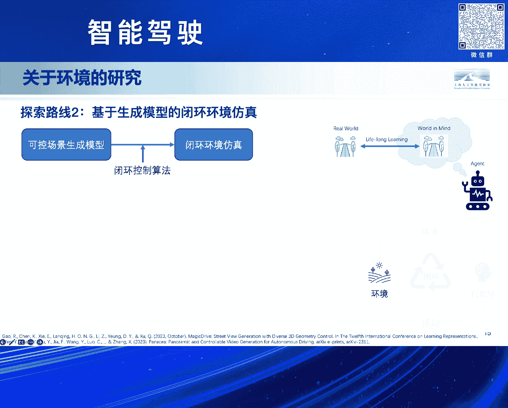
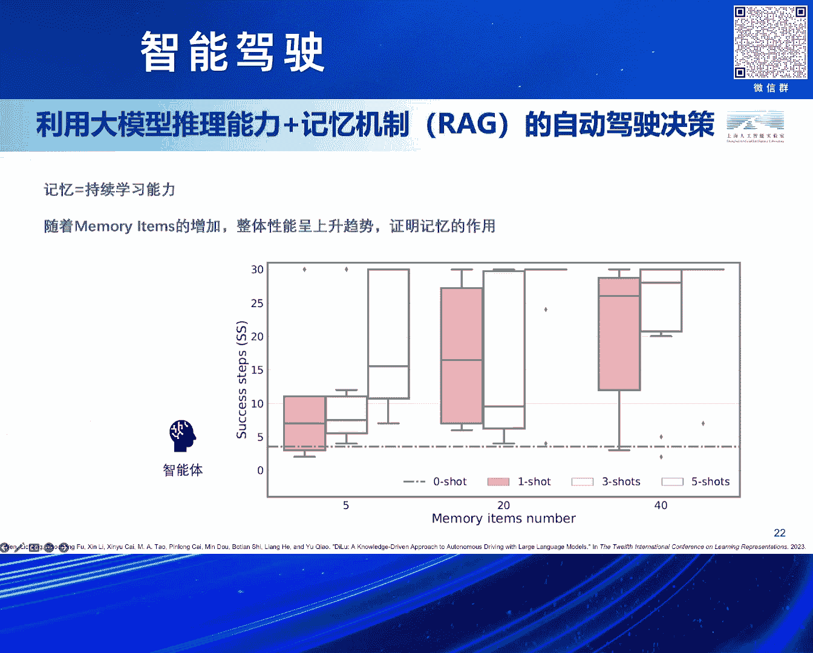
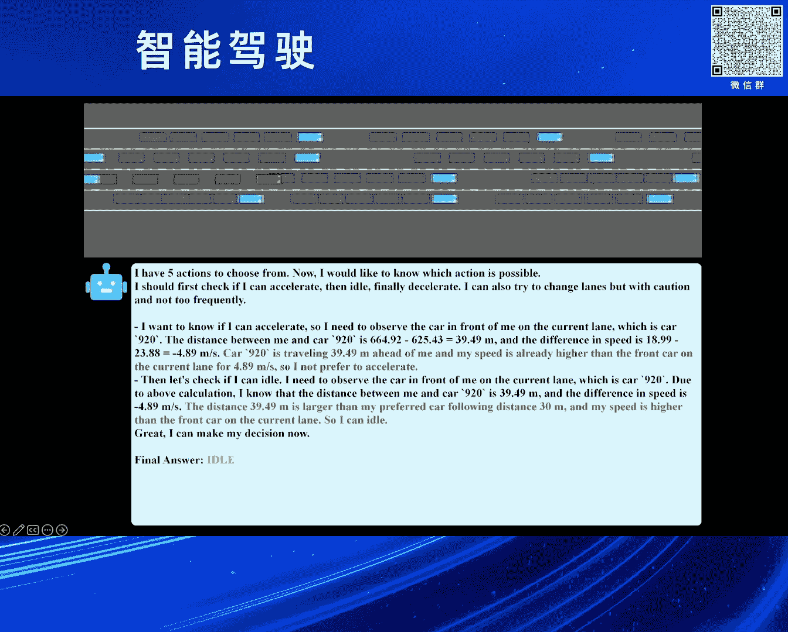

# 2024北京智源大会-智能驾驶 - P9：从数据驱动到知识驱动——自动驾驶新路径：石博天 - 智源社区 - BV1Ww4m1a7gr

好的。

感谢刘主任，然后也感谢之前各位前辈带来的精彩的演讲，其实说我压轴着实是不敢当，因为我其实21年刚刚博士毕业，然后就加入到了上海人工智能实验室，然后其实我们本身是一个科研机构。

所以我们研究的一些内容可能会偏发散，偏一些不同于大家常见的一些技术路线，我们可能会愿意做一些这种初步的一些探索，所以接下来就我来很荣幸介绍一下我们团队的一些研究工作，今天的主要的话题叫做。

多方材大模型和知识驱动的自动驾驶，其实这个故事早在38年前就已经展开了，其实自动驾驶在就大概快40年前，在86年的时候，CMU的Navlab他们其实推出了一款原型的系统。

已经能够大概去实现一个由机器代替人类驾驶员去开车的这样一套系统，后来到了95年左右，他们的第5代系统成功实现了一个壮举，就是完全由自动驾驶的系统操纵，然后横跨了美国，但是其实整个的过程中。

差不多有98%左右的路线是由算法来去接管的，当然其中有2%左右的场景还是由人类的驾驶员来完成的，但其实直到了30年之后的今天，其实最后的这2%可能到现在也没有真正得到完全的解决。

所以其实可能是我觉得一个原因，可能现在数据驱动的方法也逐渐的去达到一个瓶颈，就是在预期大家的LE L2这样的一个迭代的过程，可能LE的阶段我通过加更多的传感器，然后达到了L2，我再通过增加更多的数据。

然后实现L3，然后让它适应更多的场景，然后来达到L4甚至L5的级别，但实际发生的情况就是我在L2的阶段，我可以通过增加更多的数据，但仿佛有一面墙一样，它能总是实现到L2。999。

总感觉像是离L3存在这样的一个瓶颈，究其原因其实之前很多前辈也都介绍了，主要的一个原因就是因为存在各种各样的counter case，这些counter case，它不但是一些我们在路上罕见的。

甚至还有很多是我们可能一辈子都不会见过一次的数据，比如说像以下展示的这些，其实甚至都是真实的路上发生的情况，所以我们作为一个研究的团队，所以我们在探索是不是有一条新的技术路线能够去缓解这个问题。

所以我们在探索，是不是通过这种技术路线能够实现L4再到L5的这样的一个进化，所以我们主要是从人类学习驾驶的一个角度出发，我们认为可能如果真的有这样的一条新路线，它一定具备这样的几个特征。

就是泛化性自监督和持续学习的能力，围绕着这几个观点，我们认为现在的巨型智能技术和自动驾驶相结合，最后实现一个知识驱动自动驾驶，可能是我们为这个路线起的一个名字，其实最开始其实像铁军教授也介绍到了。

人类学习开车的一个过程，其实这句话是LeCun在20年左右在他的一篇文章中提出的，说为什么一个青少年他只需要大概摸20个小时的方向盘，就可以学会开车这件事，而且对于大部分人来说。

他在很多这辈子从来没有遇到过的场景，他在第一次遇到的时候也能有一定的能力去解决这个场景。

所以其实这是一个很有意思的一个问题，我们认为可能之前的很多方法可能遇到的困境，就是这种数据驱动它泛化性的一个难题，对于数据驱动的方法来说，它通常是我在固定的一些场景上训练，我规定好了它的输入输出形式。

这个任务的定义就限制了整个的它的能力的上限，比如说如果是传统的感知模型，我在目标检测的阶段，我一般应该不会定义出一个目标检测模型，检测路上是不是有架飞机。

但是知识驱动的方法就不太一样了，因为它通常是用这种跨域的知识的能力，比如说现在的这种多模态的大模型，或者是一些这种预训链的技术，它首先具备对某些通用场景的通用的物体的理解能力。

并且这个能力可以通过比较低的成本，迁移到一个真实的环境中，所以可能就能够完成一些之前数据驱动很难想象的事情，这个是我今天早上去用GVT4试了试，就刚才的那张图片，我直接问GVT4是描述一下这个图片。

到底发生在什么场景，场景中有什么异常，如何避免出现危险，我应该怎么做，其实能看到这种结合了Open Domain的这种知识的，经过预训链的这样的一个通用的视觉模型，其实确实对这种特殊出现的场景。

还是具备一定的理解能力的，所以其实我们如何去构建这样的一个知识驱动自动驾驶，我们更多的是从这种巨神智能的视角，来看待自动驾驶这件事情，所谓的巨神智能，其实很关键的就是两点，一个是环境，一个智能体。

一个智能体它在环境中去实现探索，然后去把从环境中去进行感知，然后智能体会自主的在环境中去进行探索，然后整个的过程，其实很重要的一点，就是能够在一个闭环的环境下去完成的，它能够基于自己的好奇心。

或者基于自己的知识积累的能力，能够在里面不断的运转，所以其实我们团队的研究，也基本上围绕着环境和智能体这两个方面去展开的。

首先对于环境来说，我们现在想训练这种自动驾驶的算法，最好用的环境就是真实的世界，所以在真实的世界中直接训练，要么不闭环，要么就不安全，不闭环，就是我可以去预先采集好很多的数据。

这种方式它是一种开环的训练，或者测试的方式，它不一定能真实反映你这个模型，在现实的世界中它的运转的效果，要么就不安全，这个肯定的，我一个没有任何训练经验的自动驾驶算法，扔到城市中。

让它自己去积累驾驶经验，其实这是个非常危险的事情，所以我们一直在去研究。

有没有可能去构建一个这种虚拟的环境，构建一个对真实世界近似的刻画，因为这种刻画的真实程度，其实决定了agent，它脑中形成的世界观的这样的一个认知的上限，围绕着这一块，我们又有两条不同的技术路线的探索。

就是围绕虚拟的环境，第一条技术路线，就是我们基于神经渲染和结晶仿真，我了解到可能，据我自己的认知，可能我们团队算是非常早期，去从事这方面的research的研究，就在Nerf的。

甚至在Nerf刚出来的时候，我们其实就有一些相关的布局和探索，整个这套技术路线，它大概就是三个部分，一个是重建，然后泛化，然后再生成，所谓的重建，就是我用真实世界的数据出发，我去对它去用神经渲染的技术。

去做三维重建，然后我能够把它前后颈解我开，我对里面的一些交通流，我可以利用一些交通流的生成工具，我可以编辑，让它创造出一些，真实世界中不存在的交通流，但是交通流它也很逼真。

它可能是一些counter case，但可能更像是这种，人开出来的counter case，然后我们再把它去用，神经渲染的技术，去渲染生成出来，这里其实展示了一些，我们中间的一些阶段性的成果。

然后我们其实提出了一套，叫做NeuralSim的开源框架，目前也是在GitHub上是开源的，它是一个前后颈解偶的，其实这个你highlight一下，就是很多友商的算法，其实很多它还是针对背景为主。

对于前景，甚至动态物体，其实都不是能非常好的处理，因为我们其实采用了一套，不是Nerf的技术，我们是用SDF的表征，它的一个特色就是说，Nerf我可能能做出，这种视觉的三维重建。

然后我渲染的相机可以比较真实，但是因为Nerf并不能真实的，去建模出一个物体它的表面，我们现在有一套新的技术，然后来实现它的表面的重建，能够同时对这种动态，静态，前后颈的物体，实现解偶和三维重建。

并且因为我们有这种表面渲染，所以我们可以很容易的去，用各种各样的传感器去进行仿真，比如说Nerf可能仿个图像，仿个相机，这个是可能是它的一个能力的上限了，但是我们还可以去仿出。

这种不同型号的激光雷达等等，这样的一些功能，对，然后这块是我们的，神经渲染的一块，就是重建和神经渲染的研究，第二块我们也做了一个，叫做LimSIM的一个，开源的高一致性的交通流仿真工具。

它也是一种从数据驱动的角度出发，然后能够从真实数据中，去学习到很多，不同驾驶风格的一些交通流仿真，然后它也能支持多车复杂的博弈，最终我们将刚才的NeuralSIM，和LimSIM两个平台相结合。

我们就构造了我们一套，基于神经渲染的，端到端的仿真引擎，叫做OASIM，然后它其实能够，就是右下角，其实我们做了一个非常简单的界面，因为我们是一个研究机构，其实没有什么工程师，基本都是一些学生。

大家自己写的一些简单的界面，然后我们也很少有这种，非常真实的数据，所以我们从Color中仿真，去get到了一份数据，然后我们从这份数据出发，我们可以去，通过编辑出一些不同的交通流，并且让它仿真生成出来。

而且这里展示的，其实全是神经渲染，重建和泛化生成的结果，对，然后刚才介绍的是，基于神经渲染的技术路线，它其实是一个相对比较长的技术路线，我先重建再泛化再生成，其实这个技术路线，我们在探索的过程中。

发现有很多问题，比如说重建对于数据质量，要求非常高，可能对于很多量产的实际的情况，你得到这个数据，可能能够用来重建的数据就非常少，然后再加上整个的链路太长了，然后我们所以也同时在探索，第二条技术路线。

就是我们有没有可能，用生成模型的技术，来实现这个B环的仿真，本质上其实非常简单的一个架构图，就是我们可以用一款，可控的生成模型，这个所谓可控生成模型，就是我给定一个layout，比如说路网的结构。

加上自车踏车的结构，然后我再结合生成模型，就把它作为输入，然后生成模型，就可以给我生成一张图片，同时我们在配合上，我们刚才提出的，LimSIM的B环控制的算法，把这两个相结合，我们就能够形成一个。

纯粹的，基于生成模型的，一个B环仿真的引擎，可控的生成模型，其实不限制它到底用哪个，包括像现在比较热点Magic Drive，还有Panacea等等，各种研究上，比较成功的一些，基于layout。

可控路网生成的，这样的一些工具，围绕着这些工具，我们其实做了一些简单的尝试，比如说这个是一个连续帧的生成，本身这个模型，其实不是一个，基于视频生成的模型，还是基于单帧图像生成的模型。

但是我们所给出的路网，其实是由我们的仿真器，仿出来的，像之前很多的这种生成的算法，然后他们更多的是，基于一个ground truth的路径，然后我去重新的再把它生成一遍，但是现在我们可以去编辑。

生成出一些新的场景来，对，然后这里有一个，我们做的一个简单的demo，然后介绍了一下，我们之前的这样的一些结果，首先其实我们。

除了刚才介绍的一些以外，我们也有非常多的一些其他的研究，比如说4D的自动化标注，所以这里展示的完全就是，算法真正标出来的，实际的跑出来的结果，所以可能会有些瑕疵，我们可以去实现，完全自监督跨域的。

就是这种一个model free的，一个4D自动标注的算法，然后它能真的去把这个场景中，去进行，然后标注的同时，其实也是在做对应的3D重建，包括我们能获取到它的深度，以及最重要的就是表面发酵量。

其实基于nerf的方法，它是很难绘制出一个，表面光滑的这种表面发酵量，我们把各种各样的序列，去做3D重建之后，我们其实就能得到一些。

这种序列的场景库，我们可以比如说挑其中的，一个场景库，我们去做一些编辑，这个是真实的数据，但是因为我们对它，进行强化景结构的重建了，假如说我们现在可以删除，场景中的一些，某一些特定的类的物体。

比如说把人删掉了，或者去编辑一些车辆，增加或者删除一些车，这个时候我还可以去，比如说在路上，增加更多的车辆，然后创造出一些，这种真实世界中，也不存在的一些场景，比如说让场景，变得更危险一些。

或者说有这种右边的一辆车，去来变车，这种特殊的一种情况，同时我们也做了一些，简单的探索，就是说改变一下，它的这种Daylight，然后其实后面这个。

就是展示的时候，我们也具备一定的，这种场景的生成能力，我们在给定这种场景的情况下，我们可以去基于这个路网，去生成各种各样新的数据。

最终我们能够让这个数据，变得越来越丰富，包括能够拿它，用来去做自动驾驶算法的训练，或者说去把它做成一个，闭环仿真的测试的，这样的一个，或者是一个闭环仿真的引擎。

这个就是我们这两块的，关于环境这一块的工作，除了环境以外，我们还有一个很重要的，一个研究的方向，就是对于agent的研究，就是怎么去利用这种智能体，去实现自动驾驶的任务，我认为可能自动驾驶的。

智能体刚才提到的这三点，一个就自监督，高翻滑性和持续学习，它为什么重要呢，自监督主要指的是，它需要有这种自我反思的能力，而不是凭借一些外部信号，去进行反馈，这个其实对于这种大模型。

或者说大规模的数据来说，是非常重要的，因为现在有的开环的方法，我无论是自动标注，还是人工标注，本身本质上，你也都是需要有标注，才能进行的，但如果我们有一套算法，它部署到这个模型中，自己跑。

自己发现自己哪里做的对，哪里做的错，我可能就不再需要去有人工标注，从而实现一个自监督的效果，第二点就是高翻滑性，我们认为可能一个这种算法，需要具备一些推理的能力，它不是简单的去对。

所有我采集到的已知的场景，去做记忆，因为其实如果大家就是做这种优化，或者说是继续学习的一些，有背景的同学，大家应该都知道，任何这种optimization based model。

它肯定会有这种以往灾难的问题，所以大家想要去通过，采集更多的counter case的数据，来解决counter case的问题，counter case它天然，现在的这种基于学习的方法。

天然的就要记那些常见的case，我要忽略掉那些counter case，因为对于很多算法来说，counter case反而是一个异常，我counter case做好了。

我可能common case做的就不一定好了，所以其实这里面存在一个矛盾，所以我们认为，可能如果简单的去记这些，input output的pair可能还不够，还需要让模型具备一定的推理能力。

第三点就是我们可以基于，前面介绍的反思和推理能力，来克服这些遗忘灾难，实现一个经验的持续积累，其实整个的过程，就跟人类开车的，或者说甚至不只是开车，就巨神智能在日常，完成各种学习任务过程中。

很类似的这样的一种模式，我们管这个模式，其实叫做这种知识驱动自动驾驶，然后这里其实我们介绍了一个，关于知识驱动自动驾驶，壁环训练的一个研究框架，是一个偏这种high level的一个框架。

它首先能够从环境上去进行感知，然后感知到这个场景之后，我试图去理解这个场景，并且做出一个plan，然后这个plan，它在执行之后，它可能会有两个结果，一个就是成功了，一个就是没成功，成功了。

它就作为一个成功的经验，我有一种模式把它保存下来，失败了，我要求有一个模型自己，或者一些外部的模型，能够自动化的去，让它去进行一些反思，并且让它重新生成出一些成功的，告诉它如果怎么做。

有可能就能避免刚才的这些事故等等，这些信息也会被保存到memory中，在下一次遇到每一次遇到这个场景，我先从我的memory库中，我去query，是我是不是曾经遇到过类似的场景，如果遇到了。

我当时是怎么做的，我结合当前场景的一些特殊性，加上一些之前的经验的泛化性，结合到一起，让它做出一个决策，这种方法其实就有可能能去，进一步提升它的模型的性能，然后其实刚才有提到说。

我们整个过程需要让agent，具备一个能够去做推理，能够去做决策等等，这方面的一个能力，其实之前我们有尝试过，用一些传统的方法，现在大模型其实出现了，我们发现大模型刚好是可以作为。

这样的一个模块来嵌入进去，这个的话是我们在ACLIR-24的一个工作，这个工作其实进行的比较早，其实投的比较晚，然后它应该算是我们第一个，能够用知识驱动的方法，去把大模型跟自动驾驶相结合，去进行决策的。

然后的这样的一个研究，它本质上跟刚才说的架构是非常相似的，只不过它中间所有的进行推理，进行决策的模块，是由一个大圆模型来执行的，然后刚才有介绍的说，这样的一套系统，它的一个重要的特色。

其实是在于持续学习的能力，我们认为可能记忆，它就能体现，它是不是具备持续学习的能力，比如说我们可以通过一些机制，人为的设置它记忆的上限，然后我们发现随着记忆的上限的增加，整体的性能。

其实是呈现一个上升的趋势的，也就是说明它在积累经验的过程中，这个经验其实是切实有效的，然后这里有一个简单的例子，因为我们这个其实做，是一篇非常早期的一个文章，那个时候其实还没有很好的这种。

甚至那个时候还没有VMM的一些工作，能用的VMM，所以我们更多的是，只是关注于这个，基于这个绝对真实的，ground truth的这些感知的结果，然后加上我们一个简单的仿真引擎，然后去让大模型去针对。

现在的这个场景，去给出一个自己的评判，并且最后给出一个final answer，就是决定我要加速减速还是换道，目的就是想要在这个场景中，能够尽可能的不断的开下去，比如说我们的这个实验最后发现。

模型刚开始放在这个环境中，它可能开个几十帧就撞车了，然后当执行到一定程度之后，你发现它可能开几个小时都不会撞车，这个是我们做的一个，非常难以的一个探索，对，然后其实在这个工作之后，很自然的就是我们。

可以对它有些改进，就是我们最新的一个工作，这个工作其实比较新，上个星期其实才挂到Rkype上，然后它是一个结合了，现在的快慢系统的，自动驾驶闭环学习的框架，它的一个主要的一个特色，就在于。

其实我们又进一步的去思考人，去进行决策的过程，会发现人的脑子中，其实分成大概两个系统，一个叫做这种heuristic process，就是，这个启发式的系统，它更像是一个肌肉记忆，或者说这个叫什么。

就是一个非常快的这样的一个系统，然后在遇到一些特殊的，遇到一些场景的时候，我很多的情况下，我可以下意识就做出一个正确的决策，但是有很多的时候，我可能光靠下意识的决策，还是不够的，肌肉记忆也是会出问题的。

比如说在我们遇到一个，从来没有遇到过的场景，这个时候人可能就会有一个，更加理性的一个系统，叫做分析系统，然后这个系统它相对来说比较慢，但是它能够有比较强的推理的能力，我们这篇工作的一个特色之一。

就是把这种快慢系统结合到一起，去实现一个，能够像人一样去对这个场景，去做知识积累的一个过程，除此之外，我们也弥补了之前那篇工作，只能基于绝对感知的结果，来做的这样的一个缺陷，然后我们也设计了一个VLM。

来去让它去，专门针对驾驶的场景，去做一些理解的这样的一些能力，然后具体来说，就是如果是在进行场景理解的话，其实很关注的一点，就是我们要关注，专注于周围的重要事物，其实像普通的这种传统的一些方法。

如果我只是去对场景做个描述，它的描述可能会非常的广泛，然后可能跟实际的，我想用的结果，并不是非常的match，它可能你给它一个交通的场景，让它描述一下里面有啥，它可能说今天天气真好。

然后天上有小鸟在飞之类的，跟交通没关系的场景，所以我们用一小部分的数据，去合成一个专门针对自动驾驶场景，很有价值的一个数据集，它会关注于这几类信息，比如说语义标签，就是关注场景中的危险的物体。

比如说红绿灯，比如说基础设施，交通标志牌，还有一些运动的物体，然后会对它们有一些特殊的标注，然后我们去用这样的一小份数据，去SFT一个开源的感知模型，其实我们就是用的一个千问的模型，其实规模也非常小。

然后在这个场，然后我们甚至整个SFT的数据也非常少，其实只有差不多1万帧左右的，就是1万个这样的pair，11k的这样的一个pair，然后最后就能实现，针对每一个感知的输入。

我能给它产生一个跟我自动驾驶，非常相关的场景描述的，这样的一个功能，对，然后就是关于刚才介绍的快慢系统的，这样一点，我们认为可能首先，就对于自动驾驶一个场景来说，我们先让快系统去做一次推理。

在当前这一帧的场景做一次推理，这次推理因为它速度很快，但是它可能会出错，如果出错了，对应的系统，我们会有给回到慢系统，让它去生成出一些，你为什么出错，你下次怎么做该正确的，这样的一些决策。

我们会不定期的去，把这些慢系统生成出来的这些数据，用来再去调整快系统，然后最后就能够发现，在绝大情况下，我调用快系统都不会出错，只有在很少情况下，我需要调用慢系统的时候，再来调用一次慢系统。

然后再来生成新的经验，整个这样的一套pipeline，一个最大的好处就是，它能够实现真正意义上的，我把模型部署到一个虚拟环境中，它就一直跑，它自己可以给自己积累经验，而不需要针对每一帧人去总结。

它哪里做对了，哪里做错了，同时也不存在像这种感知，像这种人工编写规则等等的，这样的一些非常麻烦的一些事情，我们其实做了一些很简单的一些实验，然后主要就是这种，在特定的数据集上。

首先第一点就是左边这个表格，我们尝试了，在针对驾驶场景优化之后，我们其实超过了GPD4的，就是用GPD4来去做我们快慢系统，然后它本身没有对自动驾驶场景，进行优化，但是我们大致拿了11K的数据。

对自动驾驶场景去优化了一下，发现只用一个千万1。5，这样的一个非常小规模的模型，不是千万，就是千万一个小的一个模型，然后就能达到跟GPD4一样的效果，然后同时我们也探索了，跟数据驱动的方法相比。

因为驾驶的经验是自监督B环形成的，所以对于监督的数据要求是非常低的，比如说像这个表格中展示的，上面的有些结果，其实它的性能是非常好的，但它是建立在海量的人工的标注的，基础之上。

可能要几百万帧的这种数据来去训练，但我们其实整个系统，真正拿来去训练模型的数据，其实非常少的，底下的表格，我们也验证了另一个关键的点，就是犯法性，我没有探索过说在我们实现这种跨域。

比如说像Kala仿真引擎中，我们用除了某一个城市以外的数据，去在这些城市里面让它跑，去积累经验，得到的模型，我们直接把它放到一个全新的城市，它之前都没有跑过，然后让它来直接去运行，发现它的性能是不会。

虽然会有一些下降，但是性能不会一降到底，让它彻底的不work，说明我们学习到的知识，是具备一定的犯法性的，为什么，其实是因为我们整个知识的表征，都是用这种类似于语言的这种方式，来表征的。

其实我们回过头来，就去看我们学到的很多知识，它基本都是一些这种红灯亭，绿灯亭，车离你太近了，你需要踩个刹车之类的，这种级别的知识，这种知识，其实它是一种放置四海皆准的。

而不是去overfit到某一个场景下，所以这个是我们认为，它能同时具备犯法性的，和闭环测试能力的一个主要的原因，然后还有我们也要验证一下，它是不是具备持续学习能力，我们可以发现，比如说看右边这个图。

我们随着反思的次数的增加，随着我们在场景中跑的轮数的增加，整体的平均的成功率，也是能够呈现一个不断上升的趋势的，对，但是实际上在应用的场景中，因为也不能说完全达到100%的准确性。

主要也是因为我们现在的这种视觉的模型，也是一个临时的方案，其实它没有非常完美的解决好，对于交通场景的感知理解能力，后面有一个非常简单的case，然后这个场景特殊是在于，它是别的两个物体撞车了。

然后我们可以通过这个模型，让它能发现了别人撞车了，然后我们自己来做出一个判断，就是觉得我需要先减速暂停一下，看看是不是有什么问题，然后当这个问题解决了之后，我再往前走，就是我们觉得可能这种场景挑出来。

是一个相对比较counter case的场景，对，然后最后的话再介绍一下，今天的一个结论，我们认为可能现在是一个很关键的一点，就是从开环走向闭环的一个节点。

因为有无穷无尽的counter case的存在，所以我们想要通过采集海量的数据，用这种开环的方式，来去逼近闭环的模式，其实是比较困难的，所以我们提出了，可能现在可以从数据驱动的方法，走向知识驱动。

因为为了解决这些counter case，我们就需要让模型，具备这种自监督的推理和反思能力，所以它同时我也认为自监督泛化性，持续学习，是实现知识驱动自动驾驶的基石，包括自监督。

它能够在无人工标注的情况下，来对环境实现一个交互和反馈，来实现最终的自我反思，而泛化性，就是利用它的推理能力，能够对未见的场景去举一反三，最终持续学习，就是能够同时利用推理能力和反思能力。

来实现闭环的这种持续学习，能够不断的对场景的理解，去不断的去增长。

它对场景理解的能力，对，然后最后的最后就是做一页的广告，就是介绍一下我们团队，其实我们是上海人工智能实验室，智能交通平台组，我们目前的研究方向，也都是专注于知识驱动的自动驾驶的，技术路线的探索。

主要追求把AGI和巨神智能的一些相关场景，应用在自动驾驶的领域中，然后想要去探索这一些比较新的路线的，一些可能性，我们团队其实非常的年轻，就是21年7月刚刚成立，然后目前有30名左右的成员。

其实一大半还是实习生，然后目前大概取得过7项的评测的冠军，包括像微波网Open Data Site，它的3D离线模权检测，其实我们差不多已经霸榜第一名，已经有一年多的时间了，然后在一些学术的会议期刊上。

发表了大概60多篇论文，然后有30多项专利，参与到了一些这种团标。

国标，国际标准的资深专家组的工作，对，然后这个就是我今天主要要介绍的内容，然后其实因为如果大家对我们这边的研究方向，因为我了解可能今天来的有很多，也有一些学生或者有些老师，如果有一些优秀的学生。

老师也愿意推荐到我们这边，因为我这边可能后面会有一些读博的名额，也欢迎大家来跟我有线的交流，好，感谢各位，【掌声】。

