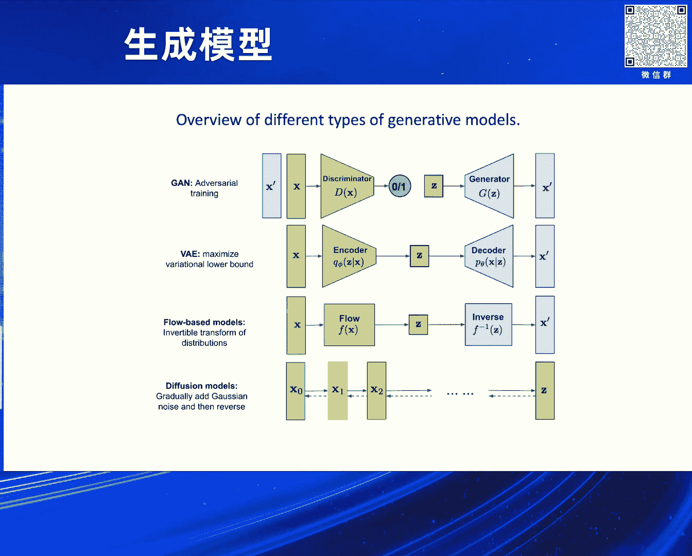
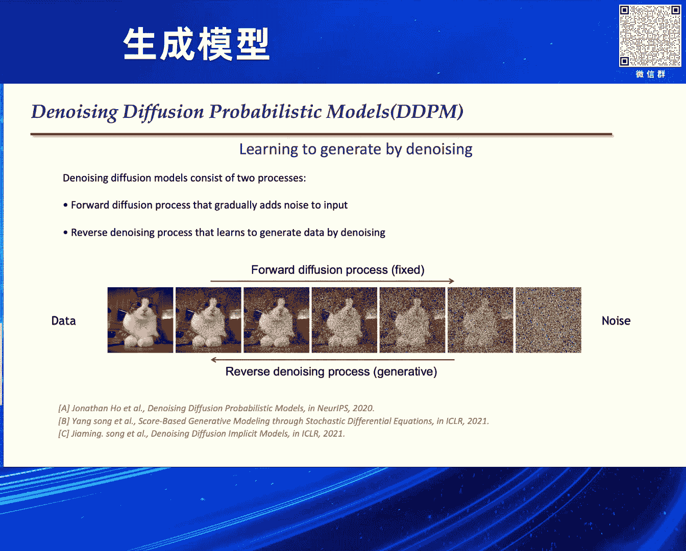

# 2024北京智源大会-生成模型 - P3：Visual Autoregressive Modeling Scalable Image Generation via Next-Scale Predicti - 智源社区 - BV1DS411w7hz

非常感谢李老师邀请我来做这次分享，非常荣幸，本次分享的话给大家带来我们最新发表的工作，微距Auto-Aggressive Modeling Scalable Image Generation。

via Next-Scale Prediction，这个工作是我们今年4月份发表的一个新的工作，是一个全新的基于一个语言模型的一个图像生成的框架，对，本次的分享的话分为五个section。

第一个section的话是我们介绍深度生成模型，包括debution model 包括language model，对，第二个的话是我们借鉴来自于language model的一些成功。

然后吸取一些language model的一些成功经验，来帮助我们做视觉生成做得更好，包括一些经典的一些方法。

tokenization next-token prediction和scaling law，对，第三个section的话我会介绍就是经典的image tokenization，包括就是VAE。

我们来探讨离散和连续的token之间的一个关系，对，第四个section我们会正式介绍我们VR的工作。

Visual Autoregressive Modeling Next-scale Prediction，最后的话是会沿着我们这个VR这个框架。

来探讨T2I和T2V和Unified Multi-Modality Model之间的关系，对，首先我会开展第一个section的介绍，首先的话就是现在的话主流的一些生成模型，包括视觉生成模型。

包括早些年2020年之前的Gantt，包括现在大家都非常非常关注的VAE或者VQVAE，就是刚刚Ross介绍的一些，就是时空patch，或者一些时空的spatial temporal token，对。

第三个的话是flow-based model，最后的话是从2011年开始，OpenAI提出来的一个Diffusion Bizkine，开始大火的Diffusion Model。

包括Jonathan Hong的一个DTPM，或者宋阳老师的Score-based Model，就是这个Diffusion Model，对，然后Diffusion Based Model的话就是。

我们可以看到这个landscape，就是包括前些年大火的Gantt，现在的话大家更多的关注到Diffusion Model，然后包括后面我们能看到一些，Auto-regressive models。

包括Energy-based models，包括VAE，对，然后Diffusion Model的话，大家都应该比较清楚了，我这块就不会再去赘述了，包括就是这里面的一些有名的工作，包括DTPM。

包括宋阳老师的Score-based Model，包括嘉敏老师的DTIM的一些加速方法，对，然后我们重点会围绕着AR model，或者是Language model来介绍，我们做的一系列的一些。

就是我们探讨的一系列的一些方法，和一些从Language model借鉴的一些insight，首先我们来说一下，像DBT或者AR model是怎么训的，第一个的话就是我们一般来说。

AR model的话是需要一个tokenization，包括BPE，或者是类似word piece，第二的话就是我们基于tokenization，做next token prediction。

第三个的话就是，我们会去基于这种pre-train的model，去做一些instruction tuning，最后的话会有一些human feedback，来做一个IOHF，对，然后。

首先的话就是我们会从刚刚的，一些Language model的一些经验的话，我们可以看到tokenization，next token prediction和scaling law。

有了scaling law之后，我们结合next token prediction之间多的方法，可以去把model scaling up，包括scaling up model size。

包括scaling up computation，对，然后我们可以看到就是说，Language model最重要的一个部分，就是tokenization，包括BPE 包括word piece。

它主要的目的就是说，我们把人类的一些语言，因为人类的语言是一些理算化的信息，包括我们写的字 我们说的话，都是理算的，我们可以把这些理算的语言，分词之后把它映射到一些token ID。

有了token ID之后，我可以通过一个，就是这种自监督的next token prediction，然后基于这个crossing copy，和最大色函优化，去优化这整个model。

然后我再把整个model scaling up起来，包括我们用更多的一些算力，对，最后一点就是我刚刚说的，就是BPE的tokenization，或者word piece这种，其实都是语义空间上的。

那跟试卷机视觉不一样，试卷机视觉的一些VQ VAE或者VAE，它更多的是一些试卷机视觉，底层的一些信息，low level的一些信息，但是NLP里面的这些tokenization。

更多是包含一些语义信息，对，所以包括我们所有的视频生成，或者图像生成，包括未来的一些动模态，其实我们都更多的希望是，视觉和语义更多的是做一些衔接，所以这也是语义视觉，目前没有出现出。

没有涌现出这种具有涌现能力的，这样的大模型的一个因素，对，然后我们回到language model这一块，然后它pretraining的话，是更多的是通过next token prediction。

是从大规模的这种文本的数据里面，去学习知识，这是pretrain阶段，从而的话它pretrain阶段之后，它可以学到大量的这种语义知识，因为我们已经把这些文本的token，映射到token ID了，对。

然后，并且token ID之间是有一些，分布之间的关系，对，第二点就是通过pretraining，它可以做到in-context learning，有了in-context learning之后呢。

我们就可以transfer到一些open task上，比如做一些fuel short，或者是做一些相关的一些，novel task generalization，这也是跟视觉非常不同的一个地方。

因为所有的，我们在语言处理语言里面的一些任务，全部可以通过语言来描述，通过语言来表述，但计算机视觉不是这样，对，因为计算机视觉有一些离散的任务，一些连续的任务，离散的任务包括一些detection。

包括一些，就是checking或者是一些，持续的一些离散的任务，对，那连续的任务就包括一些segmentation，或者是一些flow相关的一些任务，对，有了这一点的差异呢，那就来源于。

就有了另外一个很大的区别，就是语言这边可以通过一些unified的方式，因为它语言都可以生成，可以用来做生成，又可以用来做理解，有了这个语言的桥梁之后，就可以unified的生成和理解。

但就按视觉做不到，对，然后基于这几点优势，那就有了AM的一些scaling up，和scaling load这一些现象，对，然后总结一下的话就是说，为什么就按视觉没有出现相关的一些工作。

那主要总结一下刚刚的原因，第一个就是语言是一些人类，一些已经通过几千年的规律，就总结出来的一些规律，它具有高度的一些语意，和一些信息密度比较高，但就按视觉的话是没有这样。

就按视觉里面它具有更多的一些context，语言的话是一维的前后关系的context，就按视觉的话包括一些二维的，包括spatial temporal，还有三维的或四维的。

然后另外就按视觉有更多的一些模态信息，包括我们已知的视频图像的pixel，包括点云 或者包括红外，对，然后NLP里面就是语言这边的话，可以更多的通过一个。

这种cosol的pre-tuning的方式学习到语意，但就按视觉的话目前还没有被探讨的极致，因为就按视觉的很多语意，很多信息可能在底层而言没有语意，因此基于这些极大的不同。

所以language model能够通过这样的一个方式，能够做到一个，就是scaling up的一个非常不错的效果，对 但就按视觉这边，生成这边更多的是，比如说我们已知的T2i T2v，或者是一些。

unified的一些理解的任务，都没有统一做到一个，在tokenizer space上做到统一生成和理解，对，有了这些之后我们就不见得在想，就是如何能够去借助这样一些视觉的。

一些特有因素或者特有的一些本质，去学习ALM这边，language model这边的一些先进经验，包括tokenization，或者是做一些semantic压缩，包括我们去做一个。

基于这种cosol的来做一个，scaling up的pre-tuning，包括就是基于tokenizer space的一个，生成和理解的统一 对，然后首先第一，tokenization是最重要的。

我也会介绍图像里面的tokenization应该怎么做，首先图像领域就是，大家有个路线之争，就是离散和连续的tokenization，到底是哪个效果好，目前来看的话是，通过diffusion条路线来看。

更多的是连续的效果会更好一些，但是这个离散的最近又出现了非常多的新工作，对，但这些都落不开一个工作，就是VAE，VAE的话是2014年提出来的，在iClear上发表的一个工作。

值得一提的是它也是拿了今年的，iClear的test of time的一个最佳奖项，就是 对，然后VAE的事实上就很简单，其实就在空间上加入了KL散度约束，KL散度约束，然后使得它能够学习。

就使得它的从AE的一个没有随机性的这样的东西，变成了VAE可以去采样，具有随机性的这样的一个生成模型 对，然后有了这个VAE之后就衍生出来了，另外一个比较有名的工作。

它就是stable diffusion的前身，就是Latent Diffusion Model，Latent Diffusion Model就是在VAE的一个。

这样的一个Latent space上进行Diffusion，然后它其实借助了强大的这样一个连续的VAE的表示，做得非常好 对，那，可以看到Diffusion的话，目前所有的工作。

包括Latent Diffusion，就包括DIT Diffusion Transformer，全部是用到了这种VAE，尤其是连续的VAE上面进行一些，Diffusion的一些模型的训练 对。

那我回到了我们刚开始说到的，就是我们希望是通过Language Model来做，那Language Model典型的就是现在的，一个AR的Language Model。

就是Auto Regressive Language Model，对，然后这一块的话，就是OpenAI 2020年有个工作叫做，叫做Image GPT或者叫IGPT，它是在一个像素空间上做那个。

做AR的回归的训练 对，然后它的做法就是直接是在像素空间上，进行一个像素的剧烈，然后直接是基于GPT Style进行自回归的训练，然后以及或者是。

或者是基于BERT Style的进行Mask Language Modeling，然后它不仅做了生成，也做了一些下游任务的一些Linear Evaluation，对。

它当时更多是做成了这样一个Pretraining的办事，并没有考虑更多的生成效果，对 这是第一点，第二点的话就是它当时，因为在2020年其实当时的显卡的算力的限制。

还有就是Infra OpenAI的Infra和Tether的限制，所以它并没有在大规模的数据集上进行Pretraining，更多是在一些ImageNet，或者是一些比较小的数据集上。

比如说CIFAR上面进行验证，所以它的计算量，所以它的话当时因为计算量的问题，所以它只能生成一些相对低清的图片，比如说64x64的这样一个图片，第三点的话就是，在当时还没有先驱者。

进行一个模型Scaling Up，包括在视觉上进行Scaling Up的这样的一个验证，也就没有验证Scaling Low能够推动后续的发展，对，虽然OpenAI是推出了GPT系列工作。

但是在IGP上面它并没有Follow Up这个工作，导致这个工作出来之后，其实在领域内虽然有一定的影响力，但是并没有相关的一些更好的工作或者改进，对，然后回到我们刚刚说的Tokenization。

它的Tokenization其实就在像素空间上进行剧烈，其实并没有太多的语音，对，然后有了这样的一个想法之后，其实Tokenization最主要的一点，其实就是要。

尤其是Language Model Tokenization，其实就是要把连续空间的一些特征，就映射到一个Token ID Space上，很自然的想法就是VQVAE。

VQVAE就是将输入数据映射到一个理算的Codebook，这些Codebook就是可以去更新的，对，这样的话就是VQVAE，在Latin Space做了Quantize之后。

可以得到一个具体的Codebook ID，有了这样的一个Codebook ID之后，相当于我一个图像就可以编码成不同的一个，一系列的Codebook。

这个过程就和Language Model这块的BPE，或者WordPiece基本是等价了，但是有近乎等价，我为什么说近乎呢，因为它可能语义上可能还差点意思，对。

有了这样的一个Tokenization之后，那我们就有了Language Model的一个优化的可能性，因为我们可以把图像从连续的空间上，去映射到一个理算的Codebook上。

那我们就可以通过一个Colossal Entropy Loss，以及最大次数去优化它，对，所以我们这块就回到刚刚的Landscape，我们可以看到，其实在前面的一些。

比较受关注的一些Diffusion或者GAN前面，大家受到比较关注，但是在后面一个远处的地方，其实有Auto Regressive Models，渐渐地受到大家关注，对，那这块就要介绍一下一个。

一个比较有名的工作，对，这个工作就是VQGAN，VQGAN是2021年CVPR的Aurora，对 这个工作有几大的影响力，首先它是第一个基于Image Tokenization。

加Auto Regressive Transformer，来生成图像的一个工作，当然它没有做T2I，是做Class Condition生成，然后它基于这个框架呢，它就能够生成一个非常高清的。

比如720x1080，或者是1080x1920这样的一个图像，并且它可以做，就是这个模型可以做下游任务的，一系列的，就是Inpainting Outpainting，或者是一些，就是。

就是Super Resolution相关的一些，一些下游任务验证，具体做法其实比较简单，就是说，它其实做了一些，我们可能认为比较工程上的一些优化，首先第一点，就是之前的，就是VQVAE更多。

就是它在Generator这个部分，用的是一个PiSORCAM，这部分的话，就是VQGAN就把它换成了一个，Transformer GPT-2的架构，对，第二点呢，就是说它的Discriminator。

加入了一个GAN Loss，然后同时，就是Perception Loss，替换成了一个重建Loss，对，那这样的话其实，第一它改善了一个，就是VQGAN，这个话改善了一个，就是，VQVAE生成画质。

因为VQVAE生成画质的部分，有一部分明显的糊的现象，对，所以加入了这个GAN Loss之后呢，它其实，它的生成画质会有明显提升，第二点呢，就是它的，从PiSORCAM换成了。

这种AR Transformer这种架构，从而的话就基于这些优化，改进了Encoder Decoder，同时改进了这个Generator的Transformer，使得它的生成有非常大的一个提升。

但值得一提的是，它其实，VQGAN并不是一个，Long Range的这种AR Model，它更多是一个Slide Window的，这样一个，基于Slide Window Attention去生成。

基于当时算力的因素，所以它更没有去做这种，Long Range的AR的序列生成，就是现在语言模型这块，其实大家都应该，可以关注到一些开源的语言模型，都可以做到非常长的Context Length。

但是其实受限于当时的环境，VQGAN它只能做到一个，Slide Window里面生成，那这就有个约束，使得它生成图像，其实不能够很好的Consistency，对，并且它很难去，就是比如说左上角。

能够去和右下角去进行一个，一系列的一些优化，过 对，当时的话是在一些，悬殊Benchmark上做了一些验证，包括Class Condition的这种，ImageNet的Benchmark，可以看到就是。

ImageNet上的FID的话，它其实得到了一个，明显的一个提升，几乎接近于一个，比较早期的Diffusion的Base Model，对，包括如果它加了一些，Reject Sampling之后。

它的FID可以达到一个，6。59这样的一个效果，对，已经快超越了一些，Vanilla的Diffusion Model，另外一个工作就是一个，DiffMath的一个工作。

对 这是来自DiffMath当时研究员，就是于嘉辉老师的一个工作，这个工作其实就是说，我看到了语言模型的一个，Scaling Up的效果，那我是不是可以直接Scaling，VQGAN这种框架。

很显然是可以的 对，它框架也比较简单，就是基于一个Image Tonalization，VIT的VQGAN，加上一个Auto Regressive Transformer，这个工作其实，其实就是。

很 就是典型的，有点像OpenAI的风格，就不停地堆算力，堆模型Size，堆数据，然后模型架构很简单，就是这个Tonalization，加AR这个路线，那这跟Language Model。

几乎一模一样了，对，在 这个工作是在2022年的，上半年提出来的，在这个CharityPT，受到大家关注之前，在当时那个年代，有人去Scaling这个T2I的Model，或者视觉生成Model。

是非常难得的，所以这个工作我认为，是一个非常旧的 没事的工作，对 它也是第一个，把T2I上Scaling到20B的，这样的一个Model，并且是把T2I做到，非常Work的一个工作。

当时呢 它就是 也是，超显的思想，它用了一个MOE的Model，去做到这个20B的，这样的一个VIT，或者是一个AR Transformer的架构，然后它用了也是MOE的这样Model，对 那谁的。

它文章中做了一些Ablation，所以它Model Size变大，它效果会越来越好，并且可以做到一些，Text Rendering的效果，所以我认为这个工作，是在当时的思想非常超显。

对 它具备了现在我们能看到一些，Language Model，一些非常多的一些优势，包括MOE，包括一些Scaling Up，在2022年的上半年的当时，对，然后有了我们刚刚说的。

就是Toggle Animation，包括视觉的VQVAE，包括一些Language Model，Scaling Up，包括一些相关的工作之后，我们就在想，那这个事情，对视觉这块一定要Follow。

这个AR这条路线吗，其实AR这个东西，对视觉来说适用吗，其实我们也在内部不停地去探讨，或者思考这样的一个想法，就有了我们这样的一个工作，Visual Autoregress Modeling。

Next Scale Prediction，对，语言模型像GBT Lama或PALM，它是BPE之后经过Next Token Prediction，对 然后像PARTY这种，它简单的就是一个。

就是VQVAE Toggle Animation之后，也是跟语言模型一样，自上而下 自左到右的这样光山顺序，但Language Model，是用自回归的方法来预设Next Token。

那是因为语言有先后顺序去分，因为语言是一个EV的Context，但视觉其实并不是这样，因为视觉我们看东西，它是一个整体的，或者是整体到局部的这样一个过程，所以我们就在想，传统的图像自回归。

使用一种不符合人类直觉，但是符合一些计算机处理的顺序，自上而下，组行扫描着光山顺序来预测图像Token，这个真的合理吗，其实这个地方可能要打个问号，对，那我们就在想，就像PARTY这种。

就是我们刚刚说的一个，Language Model的AR，AR Autoregress，这样的一个生成的框架，那其实我们能看东西一般都是，我们从看东西会看到一个整体的东西，然后慢慢走近。

我们会看到这个物体，或者是一个图像的整体到一个局部的这样细节，类似逐步放大的一个过程，这是比较符合人类直觉的这样一个过程，同样的 人类在感知图像或者绘画时，往往都是先概览全局，再深入细节，这种由粗到细。

由整体，把握整体到局部精条的思想的话，是非常自然的，有了这样的一个想法之后，那我们就在想，能不能我们在，就是能不能我们同时借鉴，Language Model Use Tokenization。

加AR的方式去融入，基准性视觉的一些特质，包括我们刚刚说的，从整体到局部的思路，那我们逐步放大这种思想，那就有了我们这个，Visual Autoregressive Modeling。

这样一个想法的初步，它就是说，我们可以去逐步地去看这个图，从慢慢地把图像看整体，逐步放大这样的一个过程，然后我接下来会介绍，具体来说我们是怎么做的，首先的话就是，我刚刚说了，其实框架的话。

其实像这个AR的框架，其实主要有两个组成，一个是Tokenization，第二个的话是，第二个是它的一个AR Transformer，那自然的我们也是一样的，那Stage 1的话，就是我们需要有一个。

Multi-Scale的Image Tokenization，为什么要Multi-Scale呢，因为我们是从一个整体到局部的，所以这个Tokenization，必然是它把握的一个，单识度到多识度上的。

一个整体的一个描述，对，那第二个Stage就是说，我们会有一个，就是GPT Style的，像Auto Regressive，这样的Model，来生成这样的一个。

Multi-Scale Image Tokenization，或者Multi-Scale的这样的VQ Tokens，然后我们去逐步生成，这样高纤的这种Token，然后最后通过一个。

Tokenization Decoder去还原出来，对，那具体来说的话就是说，我们现在有两个Stage，那第一个Stage就是说，我们会有一个，我们需要对图像进行一个。

多识度的这样的一个Tokenization，那就是说我们对图像，我们先把它一个，就是需要转化成一个多识度的，这样的一个离散的Token Map，那比如说它是一个，比如说就是，从大概七到八个词录上。

举个例子，然后它有七到八个词录上，分别做Tokenization，那这样的话它有一个多识度的Token Map，然后这是第一步，第一步离散编码，第二步的话就是，我通过一些就是。

Codebook转化成连续的，这样的一个Facial Map，然后统一插制到，就最大分辨率上去求核，然后求核后的Facial Map，通过一些就是。

Tokenization的一些Decoder去重建图片，并且通过重建，感知和对抗的三个Loss，就我刚刚说的一个，Reconstruction Loss，Perception Loss。

和Gain Loss来混合训练，训练这样一个Multi-Skill的一个，一个VQVAE，那有了第一步之后，那我们就是在想，如何在视觉空间上去自回归的生成，那很简单，我们一般第一步呢。

是通过一个起始Token，去测出一成一的Token Map，如左上，就是，这部分一样，就是我们首先得到一个，一成一的Token Map，随后每一步呢，VR都会基于历史的所有Token Map。

去预测下一个更大尺度的Token Map，这种Cost to Refine的思想，对，那有了Tokenization之后呢，训练阶段就可以使用，标准的一些交叉商的损失，损失Loss。

来监督这些Token Map的概率预测，然后采，对，这样的话我们就可以看到，逐步流程就是我先生成一个，第一个Token一成一生成一个，二成二的这样的，或者四成四的Token Map。

然后再生成九成九的这样的一个Token Map，注意的是，它是一个每个Scale上，是一个并行生成的，但是在Scale上，它是一个Costal的Attention，对，那测试阶段的时候。

我就可以通过采样得到Token Map，结合一些VQ/VAE的Decoder，进行连续化的这种，连续化之后差值修核，再通过Decoder，随后生成完整的一个图像，当然里面有很多细节，包括我们借鉴了一个。

Residual Transformer，就是RQ Transformer，或者RQ/VAE的思路，对，包括我们借鉴了一些，就是DIT的一些架构上的一些经验。

对，然后可以看我们在标准的Benchmark上的一个结果，首先我们可以看到就是，标准的Class Condition ImageNet Benchmark上，我们测试了不同的Model Size的结果。

随着不同的Model Size的结果，Scaling之后，我们的FID是逐步稳步地下降的，并且我们的这个FID是达到了，达到了SOTA比之前的，所有的Diffusion Based Model。

Mask Prediction Based Model，AR的Transformer Based Model，都是达到了更好的FID，并且我们就是几乎快接近Validation的FID，这是第一。

第二的话我们在标准的ImageNet，512x512的这样的一个，Class Condition Generation上，达到了也不错的一个效果，对 也比之前的Masked Git。

或者DIT的这种FID达到更优，值得一提的是我们的VAR的框架，就是会比传统的这个，就是Vanilla的这种AR框架，在FID上几乎提升了一个数量级，对。

这第一点就是我们达到SOTA的Performance，在ImageNet Benchmark上，对，第二点我们比SOLA的，SOLA的Base Model会更好，对，第三的话就是我们会。

我们是一个非常非常快速，因为我们Step比较少，所以我们实测的话在1024x1024上，我们如果优化得够好的话，可以到一到两秒，升成1024x1024这样的Model，对。

然后我们也和SOLA或者Stable Diffusion的，这个Base Model DIT做了对比，可以看右上角，在我们的一个Benchmark上的一个FID，包括我们左上角的话。

和一个就是它的一个不同的Model之间的一个，就是FID和，FID和速度的一个对比的一个表，我们可以看到经过Scaling Up之后，VR可以达到一个FID，当然最新的结果我们会更好一些，对。

毕竟理论上的一个FID的下限，要1。78，显著优于DIT当时的效果，就是2。1，对，第二就是我们的速度更快，VR的话只需要不到0。3秒，就可以生成一个256x256的图像，速度的话是当时的一个。

Vanilla的DIT的45倍，在512上更是DIT的一个数量，以及它的一个速度，第三的话是我们有更好的Scaling的一个能力，如左图所示，DIT在大模型增长到3B 7B之后，出现饱和现象。

无法靠近FID下限，对，所以然后我们做了一个VR上做了一个，Scaling Up的实验，包括它Scaling到一个20亿的参数，性能不断地提升，对，另外一点就是我们有更高效的数据利用。

包括刚提到VR的话需要，350个epoch就能超过，DIT的1400个epoch的效果，对，然后我们也验证了AM上的一些Scaling Law，对，我们在验证上的错误率。

就是验证了Token的错误率和Cross Entropy Loss，随着，就是我们Scaling Up模型的一个size，和这个计算量之后，可以得到可预测的下降，这可预测是指我们呈现密率关系。

或者Log数据的限制关系，限制关系的话就是，限制相关系数达到非常高，对，同样的我们去做了一个，刚刚是一个量的分析，我们也做了一些定性的分析，我们可以看到左上角或者右边这个图可以看到。

随着我们不停地Scaling Up，就是从左到右是Scaling Up Training Compute，从上往下是Scaling Up Model Size，我们可以看到就是，我们的从横轴往右。

竖轴往下的话我们的Model，我们的生存能力会得到逐步的提升，当然右下角是最好的，点击Case就可以看到这个脑电波图，对 我们不停地去训更久的Model，包括Scaling Up Model Size。

这个效果会达到，肉眼可见的提升，对，最后我们这边也做了一些，Zero-Shell的Generalization，当然这是一个初步的实验，我们可以在一些Class Condition的。

训好的VR的Transformer，在不通过任何微调的基础上，去繁华到一些生存的任务上，包括一些Impending， Outpending，和一些Class Condition的Editing。

这是一些初步的实验，对，然后我总结一下，就是说我们使用了一个多尺度自回归的方式，和基于Next Scale Prediction的这样，构建了一个全新的生存框架，为视觉的自回归算法提供了一种新的思路。

对，第二的话就是VR模型的Scaling Lock，和Zero-Shell Generalization实验验证，来学习大语言模型所具有的一些优秀特质，对，第三点的话是我们视觉自回归模型的性能突破。

使用这种典型的GPT风格的自回归的方法，在图像生成中首次超过了这种强大的Depression Model，包括DIT，最后就是因为，如果我们看原来VR的所有的代码。

包括VQ-Togonization和Auto-Regressive Model的训练，来推动离散空间上表示的，视觉自回归或者自回归范式的学习进步，因为我们知道现在VAE或者VQVAE的这种社区。

其实做得不是很好，所以我们希望推动离散的空间，表示的这样一个社区的优化，可以看到我下面给了一个示意图，我们一张图从Cost to Refine生成的时候，主物变得高清。

这是一个在离散空间上去VQ-Auto-Regressive，也就是视觉自回归的这样一个Demo，然后从一开始一个Togon到后面的16x16的Togon，然后我们也对比了VR和AR和Diffusion。

以及Master Key的方法的一些比较，可以看到就是说，AR本质上是这种Next Togon Prediction的话，学习数据内部的某种分布或秩序，文本它天生是从左到右的这种因果顺序。

从而达到了数据和算法上的一次性，催生了ARM这样一个极大的成功，但是图像或者图片并不这样，图像自上而下 数行扫描的顺序，其实并非图像的这种最自然的顺序，所以我们感知，我们看图像或者看文绘画的时候。

是按照这种由粗到细，由低频到高频的逻辑顺序，这是比较合理的，因此VR观察到了更好的性能，和更合理的生成速度，更完备的Scaling Law，然后我们也VR克服了一些，AR图像生成的一些犯话问题。

比如说根据图像的下半部分，来补全的一个上半部分，因为它在训练的时候没有这样的Setting，然后我们也和Diffusion Model做了对比，可以看到VR的Noising的方式更加直观可解释。

因为它是一个模糊到清晰，低频到高频的这样一个过程，第二就是Diffusion，Diffusion的话就是可以做更多的一些，就是Diffusion的一个拟合。

VR的话它的学习会比Diffusion会更加高效，因为它只需要大概七分之一的Epoch，然后和ARM类似，VR的话是一次向前同时训练所有的时间步。

但是Diffusion的话是每次训练一个Time Step，所以的话就是说，VR和Diffusion都是这种多步Refine的机制，然后修复过往时间步的错误，但是AR的话生成之后它没有办法Refine。

在这样的一个框架下，可以看到VR和AR，和Diffusion和Masked Git，然后我们来看一下Masked Git的区别，VR的这种从Cost to Refine的这种方式。

它的Schedule更加直观可解释，是通过小尺度到大尺度，但是Masked Git是使用滩星的算法思想，然后VR和Diffusion的话都允许这种Multi Step的Refine。

来修复过往时间步的错误，但Masked Git是不然的，然后VR和Masked Git都有一些类似的，就是它的一个速度是很相近的，但是VR的话更加接近Language Model。

会对VR的一个Language Model的统一，会走向更近的一步，同样的就是我们把我们的一个Demo，也开源了，包括Model和Checkpoints也开源了，到目前为止。

大概现在已经有3700个GitHub Start，可以看到就是在我们开源之后一个月，其实就已经长了，GitHub Start长得非常多，这块是一个二维码，大家可以关注扫描。

然后另外就是VR开源之后得到了非常，领域内的很多专家的关注，他们给我们发邮件，或者是通过各种方式联系到我们，希望关注我们VR的下一步，后面的话我又会介绍。

我们VR现在也在Follow最新的T2i的Model，并且我们希望把Model Size，Scaling到更大，最后一个Section我介绍一个，我们未来可能会做的一些工作。

包括Text to Image，包括Text to Video，包括一些我们走向，因为基础图和纳兹亚选，走向未来统一的这样的Multi-Modality Model，然后我们从现在的一个视觉生成。

到动模态的这样一个智能来看的话，就是语言目前已经能够去做生成和理解了，但是视觉这块其实可以看到，其实它已经分得比较远了。

包括就是Visual Understanding和Visual Generation，现在都是不同的Model来做，对 现在Visual Understanding的话。

更多的是一些基于Language Model的动模态语言模型，Visual Generation更多的是通过Diffusion Model，这里也列了一些代表性的工作，包括就是上面是典型的一些语言模型。

LAMA或者GBT系列，或者比较早期的全区的序列，然后可以看到就是，但是视觉这块呢，其实现在有一些出现了一些统一的工作，走向统一的工作，像Emul或者是Next CPT。

它是把Diffusion Model和Language Model，连接在一起来做的，然后包括就是，左边的话就是一些，动模态的一些理解类的一些工作，包括GB4V或者LAMA。

对 比较早期的话是Flamingo，对，然后我们在想就是说，有了这样一个统一的Toggle Identation之后，那我们其实走向统一是一个必然的趋势，我们在一个理想的空间上可以做Cochain，对。

包括这个Next Toggle Prediction，或者是Next Scale Prediction，可以通过Toggle Identation的方式，就是走向统一，对，然后我们可以看到就是。

最新的GB4O，它是可以做到，类似Modality的这种输入和类似Modality的输出，可以看到它生成图像已经非常丝滑了，大家推测。

它可能是第一个或者是类似Modality的Toggle Identation，可能是理想空间上的一些表示，从而的话它能够做到一个，统一的这样的一个Toggle Identation上，一个动模态的生成。

对，这是我们能看到的一个，一个仪式的这样的一个证据，那另外一个就是说，最新的Meta发布的一个Chemron，对，它就是第一，应该是我们能看到的第一个，在一个Pre-Tune阶段。

它不再是在Language Mode做Next Token Prediction，而是对视觉和Language Mode分别做了Toggle Identation之后。

分别做Next Token Prediction，这个Next Token的话包括，图像Token或者文本Token，去Call Tune，那它讯出来的这种语言模型，或者动模态模型不仅具有语言模型能力。

还具有生成模型能力，方法非常简单，就是比较，有点就是，众见无疯的这种感觉，对，可以看到右边这个Demo，它其实能在对话中生成图像，也能理解图像，也能做到自来语言的生成和理解，对。

基于这些我们就在想就是说，既然我们有了刚开始说的，就是有了Token Identation之后，这个Token Identation如果是离散的。

那它就能够Language Mode Call Tune，然后Join Tune，然后去达到一个更高的天花板，当然前提是，我们算力是非常非常足够的，因为Chemron这个实验它其实，一个实验的话。

大概3B还是7B的Model大概需要用，大概需要用1000块HV板，对，然后最大的Model的话用了4000块HV板，对，然后距离时长是没有透露，对，所以我们可以看到未来，多模式模型。

或者这种统一的模型，走向这种离散的Token Identation的，这种Pre-Tuning，我感觉是一种必然的一种趋势，它在未来也许能达到一个像，纯生成上理解上能达到最优的同时。

能在生成上能够比肩Diffusion这种离散的，Diffusion这种连续的这种表示，对，这是我个人的一些看法，对，然后我的分享就到这了，对，谢谢大家，然后对，好，我们感谢这个江颜老师。

非常非常精彩的报告，我们还是留一点点QA的，好的，谢谢您的分享，我有一个稍微偏技术细节一点的问题，就是您刚刚说那个VR是每个scale都是，每个scale是并行去预测的，但是Transformer里面。

像GPT这种一般都是预测下一个Token，我不太清楚这个并行去输出多个Token，这个是怎么做到的，其实这个就是类似Cast Token，你去直接去预测。

它并不是说Next Token Prediction去做的，就是像BERT这种多个Token并行的，它们之间可以相互看到，并没有存在着上下文的这种前后关系，也就是说在输出的时候是加了类似于。

Query Token或者Mask Token这种，对，你可以这么理解，对，但在时间上它是一个Costal的，对，行，好，谢谢，好，那我们还有一个问题的时间，老师你好，我之前我有一个问题就是说。

VAR它相比于LDM它一个显著的区别就是，它把图像建模成了一系列不同尺寸的，Token之间的联合分布，而LDM是在空点图上的，它那个Token之间的联合分布，那就是在这样不同尺度的情况下。

就是说比如说Country Night的那种，谷歌图的引导控制生成，我们在这种不同尺度下的引导的话，就有这方面的探讨吗，其实是在VR出来之后，有一个Follow Up的工作，是有的。

我发现了有一些基于VR做一些，Country Night或者是做一些Editing相关的工作，会后的话可以发你看一下，对，但不是我们组做的，好的，我们会有中场休息吗，没有是吧，我们要不就继续吧。

我们就继续吧，好我们再次感谢江熠老师精彩的报告，我们现在时间，那好最后一个问题，最后一个问题真的最后一个问题，老师我想问一下，就是因为您刚才我刚刚听您讲那个VR，我感觉非常非常的那个。

就是特别的感觉有价值，因为它是在那个自回归式建模上，感觉是大概是击败了Fusion，感觉特别是像DIT这种模型，感觉还是特别有前景，然后老师我想问一下，就是你后面有没有考虑在这个视频生成方面。

去进一步的去探索你这个VR的这个架构，对是这样就是，我觉得就是你说的，就是是我们正在下步可能要做的一个方向，对，因为长视频生成是大家目前比较关注一个问题，就是目前长视频的话，它可能Token序列会很长。

你没有办法再塞到一个，就是即使你可能用Sequence Paradise的方式，用几千块卡去做，但是可能有些场景下，你可能需要生成几个小时，或者更长的视频，这种情况下你就可以通过一些AR或者是。

这种方式来做，或者VR这种方式来做，或者Language Model的方式来做，会更加make sense，嗯嗯嗯，好谢谢老师。

