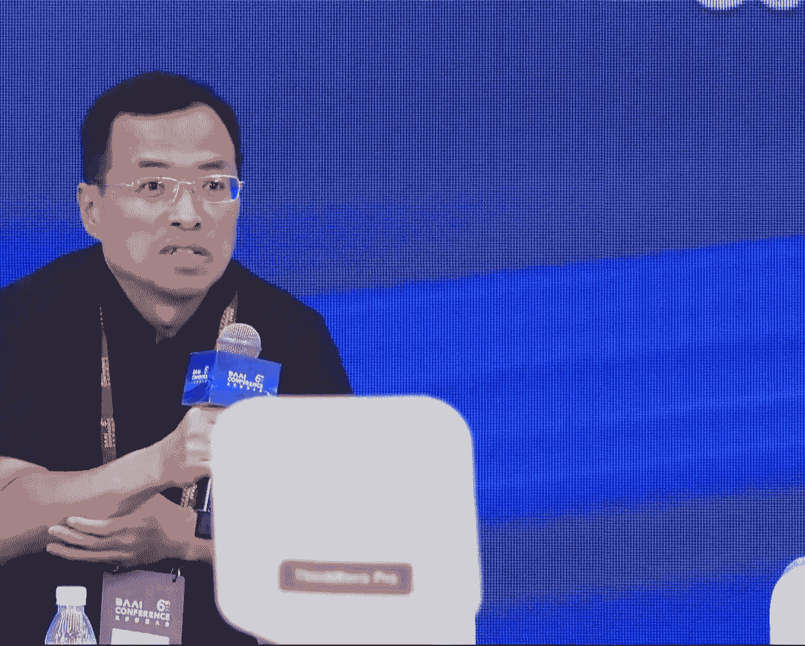
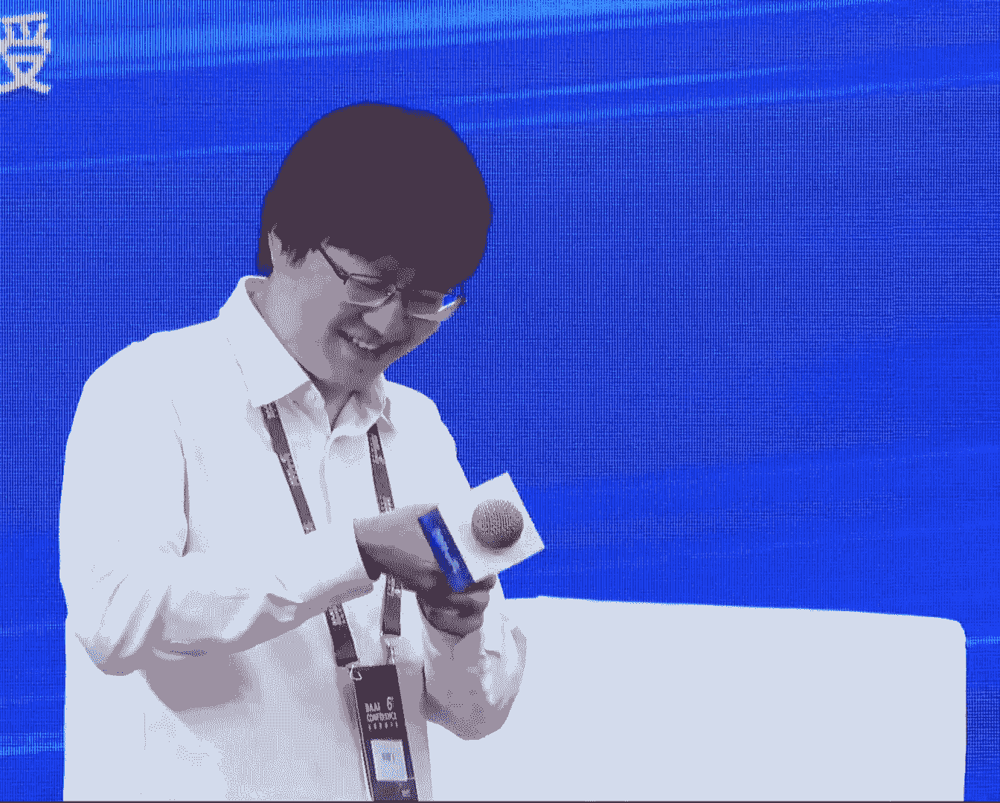

# 2024北京智源大会-生成模型 - P6：圆桌讨论 - 智源社区 - BV1DS411w7hz

好 我们今天这个报告coverage还是比较全，这个文本图片和视频模态都覆盖了，那难得也这么多同行聚在一起，探讨一些本质一点的问题，对 我们之前也准备了几个问题，首先就一上来可能就是一些灵魂发问。

首先是这个范式的问题，我们现在至少有两种范式，这个扩散和这个自回归，还有很多可能登上舞台的范式，比如说Mamba，然后那后面这个范式会怎么样转变，想请这个各位老师谈一下看法。

或者各位嘉宾也可以结合自己的领域，谈一下这个看法，对 我想要不从咱们按报告，就按报告的顺序，从老师开始，这么难的问题，这个范式方面我只能说通过我的经验吧，这个肯定不是杰料。

我自己做多么泰大模型做的特别多，里面理解模型，就是输入是多么泰的，但是输入是文字的，在这个做的过程中间，我们同时也其实特别想把，世界的深层结合进去，反正发现特别困难，所以这种我觉得。

至少如果从有一个统一的大一统的多么泰大模型的话，我们想深层的部分如果，如果是比如说都是一个transformer，或者什么样的话，反正至少下一阶段我感觉还是有点困难，明白，这是我的经验啊，不是结论。

明白，对对，我们多收集一些输入，对，姜老师您的看法是什么样，我的看法是在算力相对没有那么多，或者是model size没有那么大的情况下，我比较倾向于就是扩散模型，可能会能快速达到一个还不错的效果。

那随着算力的增加和model size增加，我是比较相信AR的这条路线能够达到一个更高的天花板，当然前提是它的codebook做的足够好，对，包括它的那个，嗯。

这个tokenization的话可能是一个视频和图像的联合建模的，对，包括它的codebook，就是高纬空间上的会表示的更好一些，对，这是我的看法，这样的差异在什么，来自于哪呢。

为什么就是这个scale会成为一个，我的意思是说，就是，因为那个就是AR这条路线的话就是，它，就未来的话它的scaling的空间会比diffusion会更高一些，对，那随着就是它的。

随着算力的增加和model size增加的话，就是它的，就是后面会追赶上diffusion在某个节点，并且表现出更好的效果，嗯，好的明白，所以我感觉，这也是很有意思的观点，对，邓老师有什么看法，嗯。

谢谢，我其实也不是相关领域的专家，就抛砖引玉一下，就是如果从文本的这个角度来说，其实这一直是NLP还有ML这个领域的一个，大家关心的就是怎么做生成文本对吧，这个事情其实做了这么多年了，在深度学习的时候。

就最开始应该是RNASTM这种，到现在呢可能就是以transformer为这个主流了，基本上主流了，那其实它的学习的这个机制，本质上大家还是以自回归为多，autoregressive为多。

然后架构上也现在，transformer为主流，但是其实这两方面其实也有新的挑战呀对吧，其实你从学习的目标上，现在其实我关注到有这个BFN，这样它也可以做很多。

就是Base-in-Flow Network对吧，它也可以做这种离散的数据的这个建模，包括之前有什么Diffusion Burst，还有就是类似的，就是应该是有很多就是建模上。

大家其实也在尝试不同的手段，模型架构上更不用说了，就是像Mamba还有这个，前两天看到这个新闻是，RN又重出江湖了什么的，就是在架构上我想大家肯定也会接着探讨，因为transformer它这个复杂度。

还有它就是为了解决它高复杂度，大家用的这些trick，虽然说发展的很多了，但是如果说我们真的能把它这个推翻的话，其实你这些trick其实都没有必要了，就是我如果能真的搞一个线性的这种。

这种机制这种模型的话，对所以我觉得其实，当然你要证明这件事情也很难，因为因为Scaling-Nor这个问题，你必须搞到那么大规模之后，别人看到东西可能才会白硬，但是我觉得正因为有这些不确定性或者质疑。

就是大家才有去做这些东西的机会，不然大家都看到了之后，那又可能会比较卷，对吧，对好谢谢，黄先生有什么看法，好这个我也是一个自己的想法，不一定对，就是我最早思考这个问题的时候。

就是从纯数学的那些角度或者怎么样，然后发现其实没有什么结果，就是虽然刚才那个谷老师质疑了，这个Diffusion是最大自然的这个，但我之前一直是从最大自然的角度去理解它的。

对然后如果你认为它差不多在做最大自然的话，其实它和自会规其实真的很像或者很相关，然后或者说之前有很多人说什么压缩及智能，其实从戏剧论角度各个角度去理解，它都有压缩的这个感觉，你做最大自然估计都是在压缩。

所以然后包括就是我们也做一些Transformer和Diffusion的结合，如果你相信Scaling的这个能力有可能来自于Transformer的话，所以这个事情说不好，然后但是这是数学那纯数学。

所以我怎么也想不明白，为什么比如说视觉的模型现在都这么小，做不大对不对，为什么就比如说像Diffusion那些像文道图，我们都是在10亿左右，然后扩大之后效果不明显，所以它解释不了这个问题。

它一定是一个，我觉得跟数据或者跟工程或者是跟，我不知道一些knowledge就很相关，然后从这个角度去想，你的其实变量很多，它不光是Diffusion和自会规的变量。

其实还有语言和图像它本身模态的这个变量，对然后我们最近有些尝试，然后我除了刚才之前提到Basin Float Network，它是一个连续化的Diffusion之外。

我们也做一些Mask Diffusion，就是很离散的，但他们都是Diffusion model去做语言，然后现在有些进展，比如在GP2大小上，其实没有比Transformer差得多。

所以在它可能是一个Scaling开始探索的起点，所以从这个角度来讲，可能还有很多的可以研究的空间，也有可能是一个很负面的，就是发现语言上你也不能Scaling up，那就是自会规了。

对不对那就是自会规了，对但也不是很确定，对好我基本上就是有一些这种看法，对，好的，顾老师有什么观点，对我也谈一下我的看法，其实跟我今天talk讲的一样，我觉得这个什么范式其实不重要。

根本问题是我怎么做信号拆分，当我把language你拆分成一个一个token的时候，它天然就适合用Auto Regressive Model来做，当你把这个image拆分成了这个。

Noise Intensity的这个，每个condition on这个，噪声更小一点的情况下，你天然就应该用Diffusion来做，因为这个你每一种，这个拆分方式你其实会带来自己的。

Inductive Bias，然后你每一个自己的这个范式，其实也有自己的Inductive Bias，当你的这个范式的Inductive Bias。

跟你的拆分方式的Inductive Bias一致的时候，那你自然就有些好的结果，所以我觉得这个，个人的看法我觉得这个问题其实，不是那么重要的问题，重要的问题是，我们真的想清楚了怎么拆分。

自然而然就会有更合适的这个，范式的出现 对 谢谢，对 我感觉这个郭老师的这个，看法也是比较犀利 对 就是，确实是两个是有Inductive Bias，包括我想就是像姜老师的VR做的很成功。

是不是也有这个，刚才也讲了对这种视觉的层次化的这种，Inductive Bias的考虑，所以或许这是一个指引下一步的这种方向，好 那我们的第二个问题，可能探讨一下Scaling Loss。

就你们刚刚的报告都出现过Scaling Loss，对 我一直有一个特别想不明白的事情，比如说我们的语言它在Scale Up的时候，大家现在对它的能力的提升是有一个刻画，比如说它增加了这种推理的能力。

增加了Word Knowledge，增加了比如说去做数学题的能力，但是我们比如说这个视觉的模型，不管是图的还是视频的，它这个模型大了以后，确实生成的图片质量变好了，FID也变好了。

但是就是它具体发生了什么，到底大的比小的是强在哪了，怎么去更进一步的去刻画这个，它的能力的提升，以及有什么问题是Scaling可能解决不了的，就这个问题想跟几位嘉宾探讨一下，对。

我想想我们这次按什么顺序，反，对，我们再反过来，好，对 好，行 没问题，这个我，我上来就是暴论，我觉得这个，呃，我觉得，呃，这个Scaling Law和刚才那个还不太一样。

Scaling Law是基于这个范式来存在的，就是我，所以我猜这个我们现在主要想讨论一下，Diffusion Model相关的Scaling Law，对。

我觉得这个Diffusion Model没有Scaling Law只有一个原因，是大家没有一个好的Evaluation Metric，我们来想想Language Model为什么有Evaluation。

Language Model为什么有这个Scaling Law，是因为这个有一个很天才的人站出来说，这个压缩剂智能，所以我们用这个NLL Loss，Negative Log Likelihood。

我们就能衡量你的这个，Language Model的Training，这个Inference的这个Performance，是吧，然后呢它又有这个等价性，诶，所以更好了。

我们直接把这个Subtask直接做一个Average，诶 我的这个NLL，这个Negative Log Likelihood的Loss，就可以用来度量我们的这个Performance到底怎么样。

到Diffusion Model这个出问题了，你没有办法度量，你有啥办法度量，第一就是我今天也提到这个，这个如果你按Diffusion的方式做拆分，你的这个Importance你其实是不知道的。

你不知道到底谁比较重要，所以你不知道怎么把这个每个，每个Subtask的这个Negative Log Likelihood来进行加权，所以这个首先这边这条路记了，第二条路这个你用什么，你用FID。

FID的问题就更多了是吧，你首先你FID你到底用什么抽Feature，你抽Feature带来多大的Bias，第二你FID做的这个高斯假设是吧，你这个那么复杂的数据分布，你真的能满足高斯假设吗。

你这个度量一阶局二阶局，这个说出来都好笑，所以我都不知道到底用什么这个Evaluation Metric，所以我觉得主要问题在这儿，当我们能把Evaluation Metric搞定。

这些问题其实就迎刃而解了，对，对，您的那个个人简介里面，写着您做那个Evaluation，那个是啥呀，是跟这个有关的吗，这个没有没有关系，对我自己其实也在做一些这个。

深深模型的一些这个质量评估相关的一些事情，对这些事情我都挺感兴趣的，对我这个也不代表我研究出来了是吧，明白明白，好的好的，好，李老师有什么看法，好，这个，对对其实我这个问题还挺超出我的知识范围的。

因为我其实接触大的真的很少，就我可能做的都非常非常小，或者是在大的上面做一些加速之类这种，很前期的工作，我自己是这样去感受的，就是从，你如果从生成的这个任务上来讲。

就是其实理想上它是有一个非常非常好的生成模型，它能够去一方面达到最好的like you，另外一方面同时达到最好的视觉效果或者人的感知，这个是有的，然后但是确实有evaluation的很多问题。

导致我们没有办法去量化它到底走到了什么程度，但从那个，我从比如从总细观从概率角度去讲的话，每一个模型，不管包括GAN或者包括之前我们淘汰的一些模型，它其实都是一致的，一致是什么意思。

就是如果有无穷的数据，有无穷的优化的能力和无穷大的模型，它原理上就是会收敛到光处state distribution，对不对，所以从这个角度来讲，从那个极端上来讲，大家都有skilling了，对不对。

所以我们关心的是什么呢，关心的是在我们现在的资源下，或未来一段资源的情况下，大家的这个load的曲线，或者所谓的是超线性还是什么线性，或者次线性是什么样的一个性质。

然后这种情况下就跟其实谷老师刚才说的很有关系，就是你换metric，你的load就可能不一样，对不对，然后你考虑不同的这种data的这种modality，它可能load又不一样，所以从这个角度来讲。

它会非常非常复杂，然后我们imperially现在感受，就是自物规的这个特性是最好的，对，所以这就是我的这种看法，然后但是呢，怎么才能，就是是不是这就是对的，也有可能就是这样的，然后或者说如果没有的话。

我们怎么发现，比如说diffusion有可能哪个地方没做对，或其他的还有更新的，那这个我觉得就很困难，就是我也没有一些什么，一些好的这种指导能够让我去意识到是什么样的东西，但我确实同意很多谷老师的看法。

就是所谓的skin load，它会和metric有很大关系，然后和我们现在处的这个所谓的data的regime，就比如说或者model size的regime，比如说是在百亿到千亿之前，会怎么样的。

这个有很大的关系，它是一个应该是一个非常非常复杂的，然后我们imperially只能看到的一个非常非常狭隘的一个地方，对，然后大家也不太会，有钱的人也不会太去乐于去探索其他的。

它会强化自强化我们对自活龟的这种印象，因为大家会从这个角度去做比较安全，对，这就是我的看法，刚谷老师和李老师分享的，其实有几个点我是特别的同意，就是从metric还有从一些mortar的角度。

其实是这样，我个人其实在这一块没有特别多的理解，就diffusion的scaling node，但是我有一些这个经验性的看法，然后也想听听各位的想法。

我发现可能是不是图像的diffusion model，或者是文道图的diffusion model上，它的scaling node里面，我的tuning flow是最有用的，不是说框架图片就有用。

而是说我要加一些，就用一些高质量图片好像就够了，然后框架tuning flow，然后是不是这个，我现在也比较关心就是这个，比方说文道视频这样的一个场景里面，那你这个它里面我们到底想把性能拉上去。

比方说就是人的视觉性能，最后人的观感，那我们到底应该在哪些方面投注，倾注比较大的这个资源，到底是标数据呢，还是搞显卡来串，其实这些我也一直在思考，我也不太懂，可以如果后面几位老师有想法的话。

也可以帮我解答解答，我就这些 谢谢，我说一下我看法，就是前面几位老师说已经比较多了，包括那个metric 对，然后我说一下我看法就是说，我认为所有的生成和理解任务，都是围绕着人的。

就是所有的任务都是人定义出来的，对 包括就是生成和理解，包括视频中的，所以我认为语义是最重要的，那语义怎么来呢，就是如果还是通过人来，所以我认为Diffusion Model的Pretuning。

它实际上语义相对就是原模型要差很多，对 所以我认为原模型的语义才是未来，所以我觉得我的看法就是，语义是最关键的，如果Diffusion未来如果能够。

Formulation出一套Pretuning语义的这套框架的话，也许它将来会是一个比较完美的框架，但就现在而言的话，就是围绕着我们这些人的所谓的一些概念，或者视频中的一些场景，包括文字渲染。

包括一些相关的一些Task，这些都是最关键的，然后这些语义才是最重要的，对 这是我看法，黄老师，我要谈谈我的认识，其实我部分观念跟李老师很认同，因为我做动模态做了好久，做了四五年。

我是觉得语言跟视觉的这两个东西。

差别其实特别大，我成天在思科它们之间的差别，比如说我最近做了很多事，就是比如说我们的大模型，把语言的MLE，就是套到动模态这边，就会发现它的效果很差，其实很差的，很多时候就是因为这个模态变化导致的。

你看起来好像Token化是一样的，按你的观点都一样，但是它就是不一样，然后比如说，你语言模型的换解，我觉得还好吧，但是在视觉这边它又特别严重，就导致我们很多时候比如说。

要把那样动模的大模型用到跟摄像头结合呀，它是在一些比较严肃的场景，你的识别力不准，或者换解比较严重，别人根本不会让你去试的，所以我觉得视觉这个模态是特别奇怪的一个模态，我也懵懵懂懂有一点感觉。

但是我也说不清楚，我是觉得吧，语言我觉得它是人定义出来的，它是个离散的，甚至我觉得不科学的说，基本上可以穷尽，但是好像视觉吧，它是个连续的，如果从比如说假设背后有个物理的东西能表示清楚。

它可能能用一个物理的模型表示出来，所以它需要的参数量可能不需要那么大，但是呢，你这么理解好像觉得，Scandal不是那么严重的一个问题，但实际上发现在应用的过程中间，又发现视觉这个东西。

特别容易出现各种极端的情况，就是，可能就是，它的那种什么Bad case又特别多，导致应用各种困难吧，所以我也不知道，就是懵懵懂懂感觉到了，它可能，Scandal在这个视觉的模式上，好像不是那么严重。

但是好像把它做好我也不知道怎么做好，比如说，好像做视觉的人特别讨论吧，比如说VIT那个模型，他们把它加大好像没有太大的意义，就是没有表现出很好的效果来，就是说你可能，费了很多事，它提升很有限。

这个软硬到现在也没搞清楚，这是我的经验哦，又不是结论，我感觉刚才的一些看法都很有启发性，我自己也懵懵懂懂，当然我自己也没真正做过大的scale up，但是从大家模型的结果来看，我觉得好像。

能力的提升还是有一些刻画，比如说当年做Gan的时候，大家可能在追求这种，一些consistency，比如说你生成一只狗，这只狗到底是不是两只眼，或者是它有八只眼，当时大家是做不到的，后来包括那个SD3。

大家看到了一大堆那个奇怪的case，它理不理解这个事该长什么样，然后到最近这些视频的模型，大家开始谈论说它的一个什么物理规律，它知不知道这个物理规律长什么样，然后今天我又看到了那个。

那个叫Dream是吗，刚看完那个视频生成，然后说它那个合影，OpenAI的那几个人的合影，然后它变成视频以后，这个合影里的人就开始打架，然后说这个社会学规律。

我们说如果它是作为一个world model的话，它可能会有一些理解，就是说这几个人前一秒还在微笑合影，下一秒它该不该打架，就是我感觉3号还是能有一些客观，你好像观察到就是scale up以后。

它3号它能学到，然后这个幻觉我总感觉可能，有可能是大圆模型scale up也不一定能解决的问题，但你说这个视频里面或者图像里面，它有没有幻觉，就比如说，对 就是可能人的这个期待，就比如说你大圆模型。

你问他中国这个球队是哪年得到世界杯冠军的，然后详细描述这是怎么夺冠的过程，他如果给你输出一个夺冠过程，你说这个是不好的，这是事实性的错误，然后但是你这个视频模型，你喜欢生成一些什么宇航员骑着马。

反而大家觉得这是好的，我感觉这其实也是幻觉 对吧，对，还多一个题，对，我就简单插一句，我感觉幻觉这个事情可能，就是伴随着这种概率的，它就与生俱来的，就相当于就是说，你给他一个什么样的一个条件的输入。

哪怕他没见过，他也要把1的概率分配到后面的所有token上，对不对，所以从这种情况下，他就一定会有这种不好的这种情况出现，包括我们早先基于学习理论，不也是这个金字盖离正确吗，所以从这个角度来讲。

你扩大会缓解你的幻觉，但是它可能还是会存在，所以可能会有一些，比如卢老提到有些严肃的场合下，我们可能还是很难去用，对，所以即使是图或者视频也有这种情况，那感觉这还是个比较重要的问题，对，是的。

感觉现在这个方面研究其实还是比较少，对，我们预设的这个时间还有10分钟，我还准备了一个问题，但是我也想听一下，对 就是排一下有没有什么问题，有没有人能帮忙递个话筒，或者我来递吧。

其实就像老师们刚才提到这个幻觉问题，然后我想问一下说，可不可以利用说思维链，然后去，提供一些结构化的推理路径，然后引导模型，产生一些扎实和实质性的输出，就是刚才提到这个幻觉效应，然后去利用思维链。

然后去引导模型，产生一些扎实和事实性的输出，包括这种有没有一些，就是说方向的应用，简单回答一下就行，其实我也不是这个方面专家，但应该是有相关的工作，那个在benchmark上能证明它把。

就是通过思维链或者是一些，这种prompt的手段，可以缓解这个幻觉的问题，然后我记得我们上海交通大学，清源医院的刘鹏飞教授，他也做了这个，事实性检查的一些工具，也就是说借助这些辅助的外部工具。

我觉得幻觉肯定是，一定程度上我们，很多可以消除掉的，对，是 谢谢，我多说一句，我感觉就是你思维链这些，它其实相当于就是，输入不同的条件，然后让它去用，对应的条件模型来回答你，虽然都是一个模型。

但是你的prompt，这个条件的改变，会让你后边的条件概率，有一个显著的改变，所以它会有区别，然后你合适的prompt，可能会激发它合适的预料的能力，比如说什么，我之前上课经常举例子。

就比如说谢瑶人在美国刚下飞机，如果你输入这个prompt，它显然会用知乎的预料，去相关的这种东西去回答，它会激活那个地方，然后你用一些其他的，可能激活其他的，所以这会有区别，然后呢。

但它可能会在某些特定的任务上，你用特定prompt，它应该会有好的表现，但somehow，魏建德会有一个universal的，好的一个东西，它一定会对所有的任务都会好，这可能是比较困难的，对对对。

但anyway，就是很多现在这种探索，我觉得也都是有意义的，比如思维链或其他的一些，对，当然可能我们还缺乏一些，就是更深的理解吧，对，对，好，也谢谢这个问题，还有没有什么，听众们想讨论的问题，好。

我们还有几分钟时间，我们再稍微简单的讨论一下吧，反正因为我们做研究，我们还是想关注这个，有什么问题还没有被解决，所以可能现在比较，哦 有一个，哦 好好好，我想我们现在实际上，在研究这个问题当中。

我们肯定是没有你们那么高端，也没有你们那么基层，但是我就在应用层，在十几年前我们已经在筹划，怎么样要，结合思维链写出一篇授课稿，我要给大家讲一个课，思想政治教育课，那么那个稿子我以往有模板。

有十几二十篇好的模板，有些是讲故事的，有些是讲道理的，有些是举数字来跟你说话的，一 我的性格是什么，我这个人就喜欢讲故事，我这个人就喜欢讲哲学，那么你就选你的模板，选了模板的时候，但是最新的势力。

它要根据我的思维链来走，势力要换，不断地要换，那这样我在半个小时之内，人机结合 人机互动，我要写出一篇，很有感染力的授课稿，这个思维链要是跟着我走的，它不论是说你这个大模型，你想我几个条件。

除了什么就是什么，如果我们现在，就是说这几天我们已经，进行了一些训练，但是大模型那个，可能还达不到，但是就是它怎么样，跟着我结合起来，就这个，不 问题。

我现在就是，如果是有需要，我们马上肯定就能，课项目就能立起来，这个问题是说，怎么做这种，这个人在环路的这种生成，是 我不知道，我理解的是正确的吗，反正这个问题，我可能就说，现在大模型它写出来的东西。

就是说大语言模型，写出来的东西，你说 多一幅画，写一篇小说，它没有标准，但是我要讲课的时候，我是部队出来的，我还是为了，我就是讲思想政治，要比课课出来，它现在这个信息，瞬息万变了，变得很多了，人的大脑。

它处理不了这么多信息了，我们最早给下面讲课的时候，我是占据信息的，绝对的主动权，我拿一张参考消息，它没有，我就可以跟它讲，现在下面听课的，都比我掌握的信息要快了，那么证明，我就要怎么样。

迅速地按照原来一些，好的讲课稿，说白了就是，就凭装新酒，装进去，在我喜欢的模板之下，写出一篇稿子出来，感谢您，您用一句话，能不能提一个问题，谢谢，您一句话，谢谢您提一个问题，就是您一句话。

总结一下您的问题，然后方便我们理解，然后我们是不是再回答还是什么，对，一句话就是要跟着我的思维，协助我，写出一篇，很生动的，思想政治教育授课稿，我总觉得这是一个，常上下闻的问题，就是我想着。

之前有一个叫，世界模拟的那么一个英勇，说一堆小人，他们在一个小镇里面，然后让他们去互动，然后每个人他有自己的记忆，他记得自己说过什么话，然后他跟别人说过什么话，他自己的背景是什么样，然后他这样的话。

他就能生成得更加，符合这个人的特点，然后我总觉得这位老师的问题，可能是一个常上下闻的问题，就如果我们有Infinite Lung的，Context Lens，那我就能把你，你出生以来所有的。

发生跟世界发生交互的内容，都记起来，放到你的常上下闻里面，然后再去继续生成，他可能就是，像你说的这个什么，符合要求的这种思想政治课，对 之前好像有一个数字分身，我不知道是谁的CEO，跟自己数字分身对话。

是一个个性化的GPT，把他的所有采访访谈写过的书，都输给GPT训一下，然后他就来模仿自己，就跟自己对话，好像有一个那个，Video可以看一看，但我忘记叫什么名字了，对对对，对 好。

那当然还有几个更深层的，我不方便在这说，我下来以后，我还可以再跟你们讨论几个更，更实际的，我们可以还线下可以交流，好 线下 谢谢，好，我们，对 我们还稍微有个三五分钟，这样我们再在这个，再跟讨论一个。

各位老师好，就是，我这边的，就是两个问题的话，我是从应用的角度来提的问题，就是第一个的话是，因为我们在找一些那个场景嘛，就是现在这个口散模型的话，就是我们有这样一种场景，就是想在比如说我。

我要在一件T恤上 对吧，我要印上一个，比如说是，圆周讨论这样四个中文字 对吧，但是现在的很多模型的话，我看它是，就是我们去找这样的模型，就没有好像，我不知道，可能是我不知道 对吧，但是我就想请问老师。

各位老师就是，我如果要达到这样一个效果，我，是已经有现成的这个技术了，还是说有什么途径去，找到这样的一个，这样的一个模型 对吧，这是第一个问题，您能再重复一下，要达到什么样的效果，对 就是很简单。

比如说，我要在我的这个，我说出一个提示 对吧，我要在我这个T恤上，打印出圆周讨论四个字，这个口散模型里面就是那个，比如说SDXR嘛 对不对，这个文文线上，文森图，就理解是文森图。

因为就是我看最新出那个SDXR，对吧，它其实是可以支持英文，还我这支持的挺好，但是中文其实是没法支持的，然后对Chatty TV，它其实也基本上是不支持这个东西的，其实其实大力三做的真的很不错。

那个现在Stable Diffusion 3，这个相对于SDXL在这方面提升也很多，然后我们有些同事在这边，其实也做过一些很不错的一些探索，但他们做的是这个专用化模型，大部分走的技术路线是。

有一个这个Foundation Model，然后在Foundation Model的基础上做Post Training，就拿这些字专门做Post Training，然后然后Train到这个专用化模型。

其实做的结果还可以，就是要自己训练个专用模型是吧，对是的，就是不能在现在开源的预训模型上，其实是达不到的对吧，开源有的预训模型也还可以，比如Stable Diffusion 3也还不错。

但是中文是我试了一下好像是不行的，因为它刚不是开源出来了吗，对对，我不知道郭文老师有没有试过这个问题，我其实没有试过中文，那个但也可以理解，这个中文数据量毕竟相对少一些，也是boss一些。

这是因为是他训练的时候，这个语调的问题是吧，对我觉得是的，谢谢，还有一个问题的话是，就是现在这个ST它对这个就是位置是不是，也不是太敏感，比如说我想在这，一张图就是说我想生成一张走下脚，对吧。

我走下就生成，就是生成一只小狗对不对，就是我的提示语对吧，我走下就生成一只可爱的小狗，那这个的话基本上我试了一下，也很就是现在这个这些模型，基本上都很难做到这个事情。

那这个的话是有没有什么解决的一个途径，对那我回答一下，那个对我觉得这些这个Foundation Model之所以做不好的原因，还是因为数据量的缺缺，他们的这个Decomposition，对不对。

他们的这个Disentanglement做的不够好，所以针对这些问题，我我自己认为Generator的这个最最简单使用的解法，就是做Post-training，你不管是用REL的方式做。

还是用这个其他类似SFT的方式来做，就collect这笔data，然后这个对着它再tune就好了，就是还是就是去训练自己的专业模型是吧，对是的，好的，就是现在是这个就是。

Karen在这方面有做的比较好的吗，还是说都是还是在自己去训练，因为这个我觉得它其实是一个通用的一个，应该是个通用的需求对吧，而还不是说一个行业，说专业行业的需求还是什么的这个。

对因为因为这个这个这个其实，其实这个问题其实很多，这个你说这个position也是问题，你说这个一些什么一致性也是问题，然后包括您说的这个字体都是问题，对就是一个Generator模型。

这个拟合不了这么多复杂的数据分布，其实也是可以理解的，因为你看像我们做Language Model，其实也不是这个真的一个模型，它就把everything都做好了。

有人这个针对读读论文去做了一些fine tune，针对这个其他一些task做了一些fine tune，我觉得在目前阶段是可以理解的，对所以目前阶段呢，我觉得这个做一些specific model。

是一些相对更靠谱的路，对，好的谢谢，好我看我们的时间也差不多了，我们还是有一些这个。