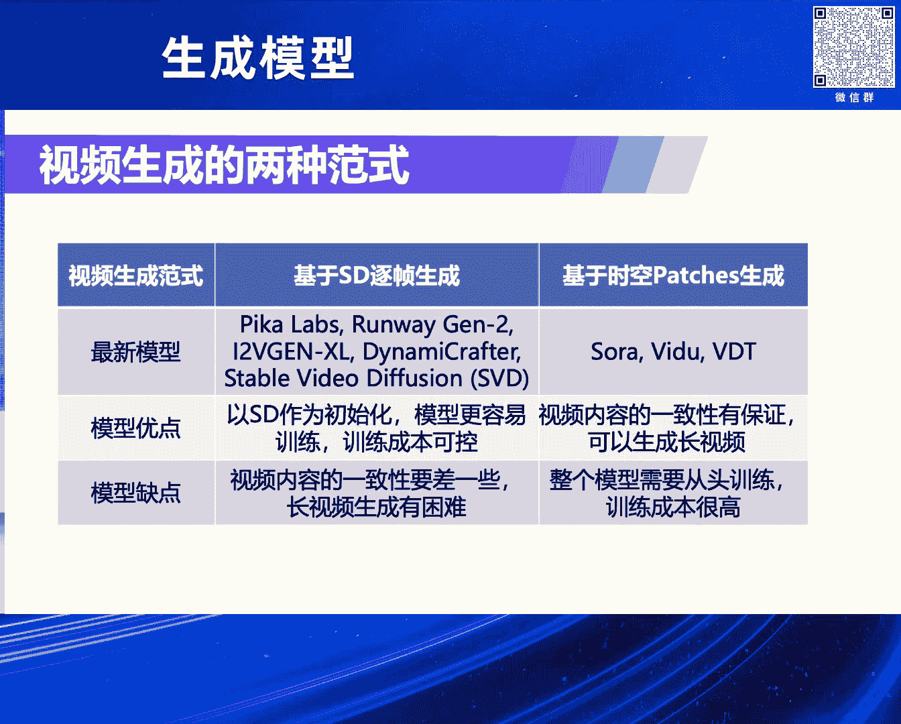

# 2024北京智源大会-生成模型 - P2：视频生成前沿进展：卢志武 - 智源社区 - BV1DS411w7hz

感谢李老师的介绍，也非常荣幸来这儿做一个报告的分享，我今天主要介绍一下我在视频生成上，自己的一些探索吧 或者一些思考，这是我今天报告的分四部分吧，先讲一下视频生成为什么这么难，目前大家是有哪几种想法。

是怎么去研究它的，我总结的有两种方法或者思路吧，分别介绍一下最新的进展，最后对未来一年，它应该怎么去发展我做一个预测，下面我先介绍第一部分吧，视频生成相对于图像生成肯定困难很多。

这个原因也是很显而易见的，因为什么呀，视频我们可以看成什么呀，是多帧的图像生成，它要考虑一个时间维度，所以从这个角度的话，肯定视频生成比图像生成难得多，它最容易出现的一个问题是什么呀。

视频生成内容 一致性没有保证，这个一致性又可以体现成很多方面，比如说它故事连不连贯，或者里面的一个人，他是不是一直是那个人的ID，或者那个人虽然ID是一样的，但是他的动作可能不连贯也有可能。

这个是我用Cyborg V2D Fusion，应该是目前比较好的开源模型生成的两个例子，大家可以看到这两个例子里面，你说右边那个男的是吧，他脚应该是一会三只脚一会两只脚，这个肯定是有问题的。

左边这个小女孩的脚也是一会有一会是没有的，第二个视频生成面的挑战肯定是什么呀，它消耗的资源实在太高了，生电资源肯定是消耗特别高，就算是我们说推理的话，它其实资源也是相对很高，比如说我们生成一张图片。

现在可以做到一秒之内就生成出来，比如说5。2乘5。2，如果你生成一个比如说切20P的一个高清的视频的话，门槛机的高清的视频，你生成比如说几秒，比如5秒不多吧，5秒乘以比如24是吧，乘以24一百多帧是吧。

你要一下子把一百多帧生成出来，一个是说时间长，另外一个主要是它耗的显存太多了，很多时候甚至都装不下，所以我们很多时候为什么不能生成那么长，其实就是因为什么呀，我们要保证它的连续性，所以一定要是吧。

最好是把一个视频一下子生成出来，但是你一下子生成出来的话，它占的显存又太多了，所以是一个矛盾的问题，第三个视频生成，我觉得最难的就是什么呀，它就是做口控生成方面的，就是图像的口控生成。

已经研究的特别透彻了，特别是在Control-Lite的加持之下，我觉得已经几乎可以商用了，但是视频生成我觉得应该困难很多，原因也是显而易见的，因为视频里面有很多额外的一些因素要考虑。

比如说我们都知道视频有镜头的概念，我们的镜头从各个不同的角度去拍的话，这个画面是完全不一样的，然后还有什么呀，视频里面人物的角色的动作，他做不同动作的人完全是不一样的，总之吧，视频要做到的口控生成。

考虑到额外的因素特别多，所以它也变得很困难，是不是很困难，当然了，视频生成本身都没做好，这个时候考虑口控生成是不是太谣软了，我觉得也不是，我后面会举个例子，其实也可以研究这个问题的，好。

我刚才讲了一下视频生成，我总结了三个主要的挑战，虽然它很困难，但是我们都写着传的嘛，肯定是一般的是越困难，我们就越要上，所以也是有特别多的研究者去研究这个问题，我个人的观点，我认为什么呀。

就是说把所有的这种研究，大概可以分两类，第一类是什么呀，基于SD就是Step Diffusion，当一个底座，用竹针生成的思想来做，然后在生成的过程中间，后面再去考虑它的连续性的问题。

还有一个就是说比较彻底了，我把整个视频当作一个整体，就是一起生成，不是竹针生成出来的，我把一个视频当作一个3D的表示，它一下子出来，这样对它的好处就是什么呀，它生成的内容肯定连续性是没有问题的。

但是它的坏处就是什么呀，它没有一个预训链，所有的训练都得从头开始，这样肯定对我们要求特别高，你的3D要求特别高，然后第一个方式比较有代表性的，就是Pica、Runway，还有阿里、腾讯的一些开软的模型。

甚至Step Diffusion，这家公司开软的视频的模型，至少有三个是开软是可以用的，还有基于第二种方式，我把它叫做时空part，或者整个视频一起生成出来，这种方式的话，它有比较有名的Sora。

还有神树的V2，还有我们自己的一个VDT，我做这个报告的时候，可能是一个月之前，一个月之前我尽量的已经把这些的报告进去，但是视频的发展实在太快了，比如说过去一周，它一下子出来四五个，所以我也没法加进来。

是吧，反正比如说你下一周可能又出来了，没办法，但是万变不离其宗吧，他们的套路肯定是，要么是在前面这个方式里面，要么就在后面这个方式里面，好吧，然后后面这个方式的话，也有两种。

一种是结合Diffusion，叫Transformer的优点，就是所谓的DIT的这种架构，还有一种是纯Transformer，就是自回归的架构，目前来就是目前，发展的早的。

但是体现的效果好的还是DIT架构，我觉得，然后完全Transformer自回归的架构，目前我觉得不是那么多吧，虽然有一些，但是也不好说它以后能成主流吧，只是有个苗头，但是还没有证明它自己。

所以我主要还是都是介绍基于DIT架构的，好 我们先看第一个方式，基于SD主政生成，它的一些最新的进展，我们看一下，第一个就是皮卡，皮卡在去年是吧，我记得是不是去年，也是曾经停火的，它也融了。

好像最近也融了一轮，就说明投资人还是认可它的，因为它是个必然模型，它的技术报告都是很简洁，没有透露它的模型细节，我们就把它，它做了一个纹身3D的一个加速器，我们列在这儿，大概的思想就是什么。

它跟纹身3D模型的这样一个模型，它设计了一个加速的办法，它把它，在这个生成的过程中间，引入了一个滑动窗，然后滑动窗里面的计算，是可以用多张显卡，并行计算的，然后设计了一个预值，就是说怎么看这个滑动窗。

可以进到下一个iteration里面，这个预值尽量的节省，是吧 计算量，回到视频生成本身，我们觉得我们推测，反正它自己大概也是这么默认的，它应该是基于一个预设链的SD模型，然后加上额外的时间围上的建模。

所以我们就觉得它应该还是，基于SD逐帧生成，然后后面再补上时间围的建模，右边是它的一个效果，第二个比较好的模型，就是Runway的Gene2，Gene2实际上它的技术细节也没有公开。

我们这列的是它的Gene1的技术细节，Gene1是它的技术细节公开了，它本质上是一个视频编辑的模型，我们可以看到，是不是 是一个视频输入进来，然后我们可以输入一个图像，或者输入一个一单文字。

去对它进行修改，它整体的架构还是一个DFusion的架构，Stepper DFusion的架构，只是它额外加了一个什么，我的视频生成，就是输入进来以后，我们会提取它的深度信息，深度信息我们觉得是。

相当于是一个3D的信息，这样我们就保证说，我编辑以后的视频跟软视频，这样的深度信息是保持一致的，好 因为什么Gene2的技术细节没公开，我们就追究一下Gene1的技术细节，这是里面它最重要的。

两个时间为建模的一个改动，一个是什么呀，就是时空的这种，就是残长模块吧，还有一个是Attention的模块，它的改动其实思想也特别简单，就是在传统的，就是2D的转机后面紧接着一个什么呀。

就是一维的时间的转机，红色的部分我看一下，这个地方，这个就是时间为的，就是这个地方，就是每个二维的转机后面，跟着一个一维的时间的转机，然后Attention是什么呀，你是 就是，这是什么呀。

这是视觉二维的Attention，然后后面跟一个什么呀，时间维度上的一维的Attention，这样它就什么呀，我本来是一个Step Diffusion，只能生成图片的，但是我加上时间维度以后。

它就可以对时间进行建模，这样就可以生成视频了，刚才是两个必然模型，主要是去年提出来的，然后剩下我介绍三个开软模型，一个是阿里的这个模型，我觉得阿里还是很有诚意，它不仅视频生成的模型也开软了。

它多么大模型，比如强温VL也开软了，我觉得这个是对整个领域的发展，还是很大的促进作用，至少强温VL我知道很多人是在用的，然后阿里这个视频生成模型，它其实本质上是一个图文生成视频的模型。

它把整个视频生成分成两阶段，第一阶段是一个什么呀，我们给一张图片，它经过Clip模型，经过一个Detailed Encoder，然后一个Generated Encoder，反正就是各种Encoder吧。

尽量地把这种输入图片的信息提起出来，然后丢到我们的Step Diffusion里面当条件，然后生成什么呀，它就生成一个448×256，就是分辨率，然后32帧的视频出来，但是这个是个低分辨率的。

所以它加了第二阶段是个高分辨率的，把刚才生的视频，当作是输入，输入到我Step Diffusion里面来，然后同时再加一单文本当条件，继续把它的分辨率提升上来，比如到720P了。

这样就变成一个高清的视频了，然后它的论文里面说了，它的底座是什么呀，是Step Diffusion，实际上是SD2。1，这是它论文给的几个例子，通过它的例子，我觉得它的效果应该是比前面两个模型要差一点。

大家可以对着看一下，然后这就是全新的Karon的模型，我觉得应该对这个领域的发展也是很重要的，它本质上是基于它们前面有一个叫文生视频，叫做Videographer这样一个模型。

把它改造成一个图文生视频的模型，上半截就是它的文生视频的模型，下面这个夹的就是把图像能夹进去，图像多一个条件输进去，最后把它改造成一个图文生视频的模型，它的论文也说了，它的底座也是SD2。1。

这是它在论文里给的一些例子，至少在这个例子上它说，我感觉它应该是比Picard，比Jim2，比Runway的要好，不不不，就是比Ali的那个模型要好一些，最后我们重点介绍一下。

就是Stable Diffusion这一家公司提出的视频的模型，它把它叫做Stable Video Diffusion，我们后面简称SVD，这个模型，它是有论文的，我主要是讲它为什么。

这个模型可以说是开软里面图生视频最好的模型，最好的开软模型，比腾讯那个也好一些，我觉得它的软硬主要有两点，一点是什么呀，我们都知道，这种基于Stable Diffusion的模型是什么呀。

它其实都有一个什么，一个VAE，就是所谓的压缩的一个模型，它是一个Encoder Decoder，压缩完了，在硬空间里面，我们是用Stable Diffusion做生成，所以SVD为了保证。

为了保证尽可能的把时间信息考虑到，所以它把VAE里面的Decoder部分重新训练了，然后在训练的过程中间，把时间的因素已经考虑进去了，这样它生成的视频的连续性会好一些，这是一个改动，另外一个改动。

它也跟Runway一样，它也加了时间的模块，一个是什么呀，那个残插的模块转机，一个是Attention模块，它都把时间加上去了，但是它跟Runway的差别是什么呀，它是把整个模型从头训练了，从开头训练。

但是其他的几个模型，只是动了它，就是说新加的那一部分，就是刚才，就是时间尾上的那一点东西，但是前面的东西都没动，所以从这个角度，我觉得它的效果肯定是会好一些，这是我们用它的模型生成的两个例子。

看它人像的细节，然后它的动作，我觉得都还可以，连续性也没问题，这是它的论文给的一些评测的结果，它甚至比，是通过人评价的，是比Gym2和Pica都要好，这是把我们第一种方式的最新进展都介绍完了。

我们现在介绍第二种方式，我觉得把它叫做时空Party生成也好，或者叫整个视频整体生成也好吧。

反正大家明白什么意思就行了，好，这个里面有代表性的工作，或者大家为什么这么关注视频生成，肯定是要归功于OpenAI，是它当时在1月份还是3月份，我不记得了，提出了SORA模型。

SORA模型它里面很重要的几步，我们简单地介绍一下，它第一步就是把整个视频，因为我们要整个视频生成，所以它要把整个视频表示成什么，时空的Party，要做压缩，所以它专门训练了一个Vico VA1网络。

把视频压缩到一个什么，低维度的空间里面，然后在这个低维度的空间，把视频把它分解成3D的这种Party，那就是每一个小块，我们可以把它看成一个Token，所以就可以把它丢到Transformer里面。

我们只要把这个视频表示成Token序列的话，那当然可以把它喂到Transformer里面去，第二个就是它的架构到底是什么，宏观上它自己说的，它肯定是一个Cosm模型，它可以接受输入在造成的Party。

或者加上条件，训练模型以后去预测干净的Party，就把它重构出来，它说最重要的是它采用了DIT的架构，就是Diffusion Transformer的架构，这种模型其实也不是说。

就是什么呀 最近才出来的，其实在前面，当然李老师他们也做了一个类似的工作，后面也马上会讲，我觉得这个架构其实大家都想到了，然后这个架构它说在很多方面，验证了它的扩展性，这个事情也是很重要的。

然后这儿给了三个例子，一个就是他说，最基础的计算量，中间是一个四倍的计算量，然后右边是一个32成的计算量，这个大概说的什么意思呢，其实就是说的什么呀，这种大模型的扩展性，或者是我们所谓的什么呀。

Scalene，Scalene，只是说它这儿是体现的角度不一样，我们知道嘛，Solar这个模型里面，它肯定有很多模型上的设计，你采用不同的设计，你到底依据是什么，然后OpenAI通过它的实验证明。

我的设计只有一种做法，我只要什么呀，我这个模型的架构的设计，让它的训练的代价变高，或者计算量增大的话，它这种的效果就会好，所以我们可以看到，随着它模型的架构的改动，它耗的计算量，乘以4倍乘以32倍。

然后它就越来越清晰，然后这个狗的动作越来越连续，第二个工作就是神书的维度，这个背后肯定是有，我觉得李老师是吧，应该是起了很重要的作用，我觉得应该是按照，神书的维度，这个维度，它应该是，我觉得应该是。

按李老师自己的说法，应该是比DID还早，我给你宣传一下，就是这个工作，这个工作，思想我讲一下，我讲了不太多你可以纠正，它的思想就是什么呀，我们都知道Cyber Diffusion。

它背后有很重要的一个模型叫ULAT，但是ULAT是一个转机的模型，李老师他们想了，能不能改成一个Transformer的模型，所以他们就说能不能设计一个，UVIT，LAT就是转机嘛，ULAT。

LAT是一个CN的模型，他说能不能改成一个VIT的模型，我们知道，视觉表示里面很重要的两个模型，一个是CN一个是VIT，Vision Transformer嘛，最后李老师他们做了实验，证明说。

类似ULAT的设计，他们说发现时间步，以及就是，这个地方，时间步以及Context，就是文本输入这些东西，如果当做Token丢进来的话，这个效果会很好，同时类似ULAT有一些，长就是，我们知道。

深度学习里面很重要的一个模型，叫Restletty和凯明他们做的，它里面最重要的一个思想就是跳转连接，就是说他们就会发现，李老师他们证明，如果能够很合理的设计这个长的，跳转连接的话。

这个整体的效果也会很好，然后申述他们基于这样一个，ULAT的模型，在很大的一个数据体上，生了一个叫ULAT的模型，然后后面，我觉得应该是他基于这个ULAT的模型，基于把它，扩展到视频上去训练。

最后就走到，V2模型吧，我觉得应该是这个思路，这是他们公开的，前面 我记得是上一个月，他们给的一些例子，我觉得效果还是挺不错的，最后介绍一下，我们自己的工作吧，我们这个工作，首先我声明一下。

因为我是高校的老师，我们能做的，有的时候，很无赖的一个事情，类似前面所有这种做法，其实我们，2022年底我们就想到了，所以我们就去，我们就去做论文嘛，因为高校老师三历都是特别有限，一定要理解。

我们的情况就是这样，我们其实完全想到类似的做法，所以我们就去做，但是我们因为三历有限嘛，只能在一些写书设计上去验证它，这是我们当时，探索的一个过程，我们探索完了以后，把这整个工作。

也把它放到一个很有名的，叫阿卡夫的网站上面，所以我们2023年5月份就放到网上去了，严格来说，我们这个工作应该是比SORA早很久了，早很久，回到我们的工作本身，我们当时可SORA没出来。

我们就想到了两个重要的事情，第一个是什么呀，我们说能不能，视频生成也是视觉生成嘛，当时比较主流的还是基于扩散模型来做，但是我们说能不能结合扩散模型，跟Transform模型的优点，来做这个事情。

所以我们说，将Transformer的技术应用到，基于扩散的视频生成里面，第二个就是什么呀，我们提出了统一的时空研码进行建模，这样保证它把视频生成里面，所有的情况都能覆盖到，这是主要的很多例子。

然后我们这个工作，也很新，就发表在我们这个所谓的，我们这个领会的顶会叫Ecklnir，如果再晚一点，我觉得就发不了，三分期好一点，要是再晚，比如说如果Ecklnir再中不了，那就完蛋了。

就只能放在Archive上了，这是我们模型的一些细节，跟SORA类似，SORA视频的压缩，这是我们压缩的模型，因为要考虑3D有限嘛，做了一些简化，然后中间的这个架构跟SORA是一模一样的，然后里面的。

Transformer模块，跟SORA，有一点点差异，就是什么呀，我们是把时空的Attention是分开的，这个软硬也是很简单，这样做的话，我们消耗了3D会小很多，我们没有别的软硬。

我们其实知道放在一起肯定更好，所以我们跟SORA的差异，一个就是在，就是什么呀，注意力极致的处理上，我们采用了通常的把它分离的方法，这个时候很多是在显存3D有限下的，一个Tradeoff。

但是SORA是将时空合并，它直接用3D的，注意力去做这个事情，所以它的效果肯定是要好一些吧，当然耗了3D也会大，另外一个我觉得这个倒不是本质的区别，我们当时，因为也是3D有限，我们只考虑了图像生成视频。

没有考虑文本，因为文本肯定是需要的，数据量更大更不容易出效果，没有别的软硬，就是这一点点软硬，图生视频跟文生视频比，我觉得软体上没有什么差异，但是文生视频，实际上要更大才能出效果，我们当时在2023年。

把那个论文放到网上的时候，我们那个论文里面其实也有这些例子了，并且我们专门为这个论文做了一个网站，这些例子当时就放在了，那个网站上，你们可以去查得到我们有一个German Github上的一个网站。

里面这些例子，其实都放在里面去了，并不是说后面SORA出来以后，我再补这个实验，没有的，是当时就有的，所以我们当时其实已经发现了，类似这种什么呀，就是说用时空patch去生成视频，它其实真的是可以。

对简单的物理规律进行建模，这里面其实包含很多种不同的，物理上的一些运动的模拟，它其实都不是线性的运动，是加速运动，那我刚才说了，我们因为是高效的团队嘛，其实手头的3D其实特别有限啊。

那视频生成又是特别消耗3D的一个事情，一个工作，所以我们，我们结合我们的实际情况，做了一个折中，我们可以在一个垂直上把它做好，垂直上要做到什么呀，能，能突C，其实特别难，突C的用户能接受是特别难的。

所以我们在我们的模型上面，继续加了一些东西，比如说我加了一些人脸的控制，可以保证它生成的过程中间，人脸不要动，然后还加了一些人的骨架的控制，保证它的动作生成比较自然，然后这些细节，我们就不讲了。

太邪书了，大概就是加了这些人脸的控制，然后人的骨架的控制，最后我们生成了这样一个效果，至少你看它眨眼，还是比Stable，SVD或者是腾讯，这个模型，这两个是开软里面最好的两个模型。

我们还是比它明显的要好一些的，我们这所有的条件，都是一致，我们跟爱时科技做了对比，跟那皮卡也做了对比，跟ROMA也做了对比，你们可以看到我们的效果是明显比他们要好一些的，当然这个也不是特别公平。

因为毕竟我们是专门真的垂日优化过的，但是也能看出一些问题吧，这个就是我们继续优化以后，把它稍微做了一点后期处理，这样我们尝试着，把这些视频卖给普通的用户，这两个视频应该是卖掉了，就是我们拿到这儿了。

当然大家不要泄露出去，因为可能那个人要告我的话有问题，我主要是想证明什么呀，我们其实有的时候，虽然我们每个人都是可以一堆的包软，比如说三粒有限啊，或者各种数据不够啊，你可以扯一堆理由啊。

但是如果你坚定的选，你选一个，你选一个，但是如果你坚定的选，一个东西啊其实可以做出来了，可以把这个事情打穿的，至少我现在证明，我，VDT我们，我觉得我想到的比，都要早多了，但是因为三点软我做不到它。

生成一分钟的视频是不是，我做不到，但是我可以在这个人线视频生成上面，写成视频生成上，我可以做的效果很好，但是我能够做到的时候，甚至他愿意付钱买这个视频，那这个就是很难啊。

那不是SORA那个模型就能解决的，是不是，就是SORA虽然已经很惊艳了，但是你普通的用户愿意为他付钱，这个差得十万八千里，所以这个后面还有很大的概防，但是我们，在有限的三粒情况下，我把这个打穿了。

其实还是很难，这个视频是再早一点，刚才那两个是更新一点的，可以看到里面，比如说扇子遮脸，它都是可以把它恢复出来，甚至刚才最后那个女生，她背后的那个影子，它是可以生成出来，她的人在动的时候。

她的身体在动的时候，她的身体在动的时候，她的身体在动的时候，它可以生成出来，她的人在动影子也在动，就说明这些物理规律都是学到了，最后我就简单的，总结一下吧，其实跟我们刚才讲的三个挑战，是对应的。

未来一年我们视频生成，值不值得做，我刚才还跟李老师讨论，他说他不想做了，不管了，这个问题出来大家还有得做吗，那一个肯定是什么呀，视频加速这个肯定要做吗，你不能说，消耗那么多赞励或者要等一个小时。

这个不太行啊，那太久了没法商用，当然我觉得这个事情实际上是最好解决的，总能把它推理加速，至少把推理加速是可以的，第二个就是，更长的视频能不能生成，虽然说已经生成了一分钟的，但是能不能两分钟啊。

能不能生成，更长的视频能不能生成，我觉得可能不能光靠，模型本身，可能后续有一些处理，第三个就是我觉得特别有，就是普通人能做的，就是视频的可控生成，这个其实有的时候消耗的赞励可能没有那么大。

我觉得在座的很多，老师都有可能做这个方向，李老师我要，就介绍到这儿吧，谢谢，我有一个简短的QA，好感谢卢老师的这个精彩的报告，对这个视频生成模型，做了一个特别长的一个梳理，特别详细。

同时呢也给我们有很多的启发，第一个是在学术上我们怎么样，有远见做得很靠前，第二个事情就是说在比如说我们应用上，如果通用我们没有那么大算力，怎么样去在垂涎中找到一些新的机会，然后我们有大概。

一两个问题的时间，大家有问题的话我们可以跟卢老师有一个QA的环节，好，大家直接可以举手啊，有问题的话可以举手，老师你好，就是视频生成虽然非常火，但感觉从高校的学生角度来说，好像没有那么多资源去跳动。

大家想沿着这条路去做一些工作，或者做一些小的补丁的话，感觉有什么样的方向，可以值得建议高校的学生去尝试呢，这个确实很难，就是说，比如说你这个时候做出来，他们肯定会说你要不要跟Sora比一下。

你要不要跟快手的可林比一下，是吧，你这怎么比得过呀，确实很难，但是我觉得还是可以沿着这些，就是，假设后面可能会有一些，比较强的开燃模型出来，你基于那些开燃模型，能不能做一些后续的。

比如说刚才的一些口控生成啊，一些加速啊，或者一些让它变成生成更长的视频啊，这个其实不需要那么多的算力，当然还有一些别的问题，我可能没想到的，肯定有，好的好的谢谢。

