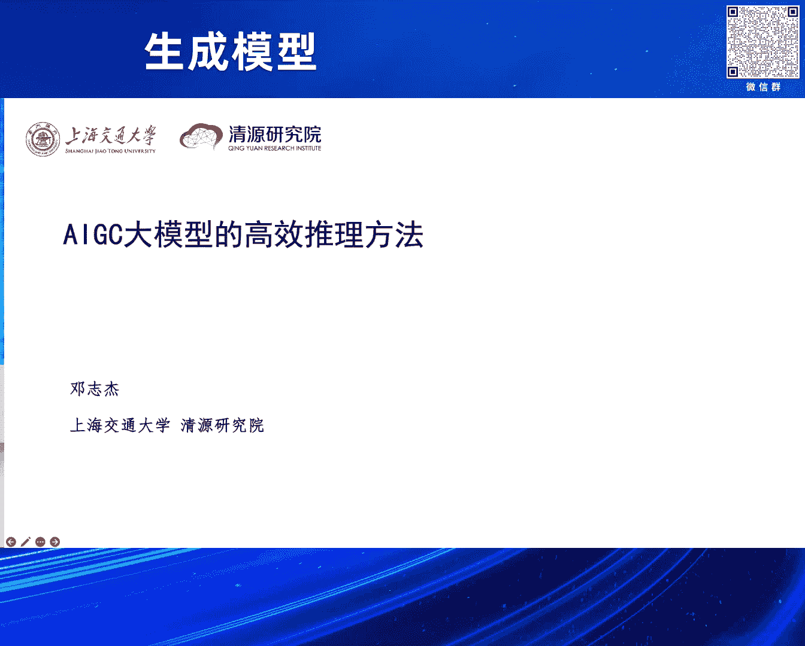
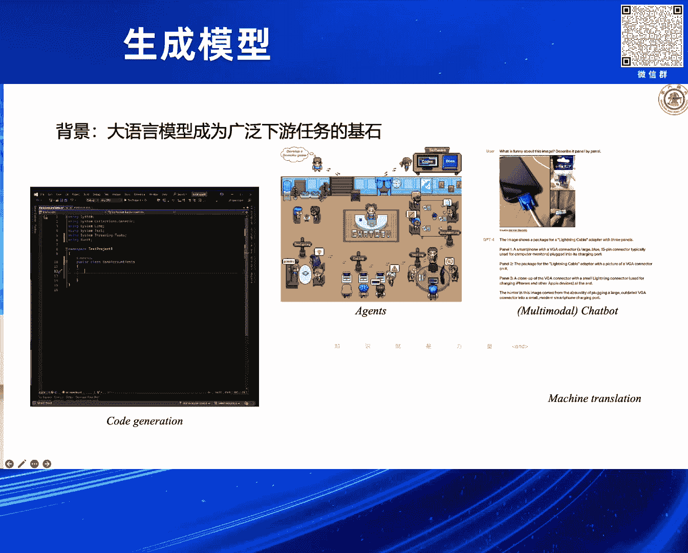
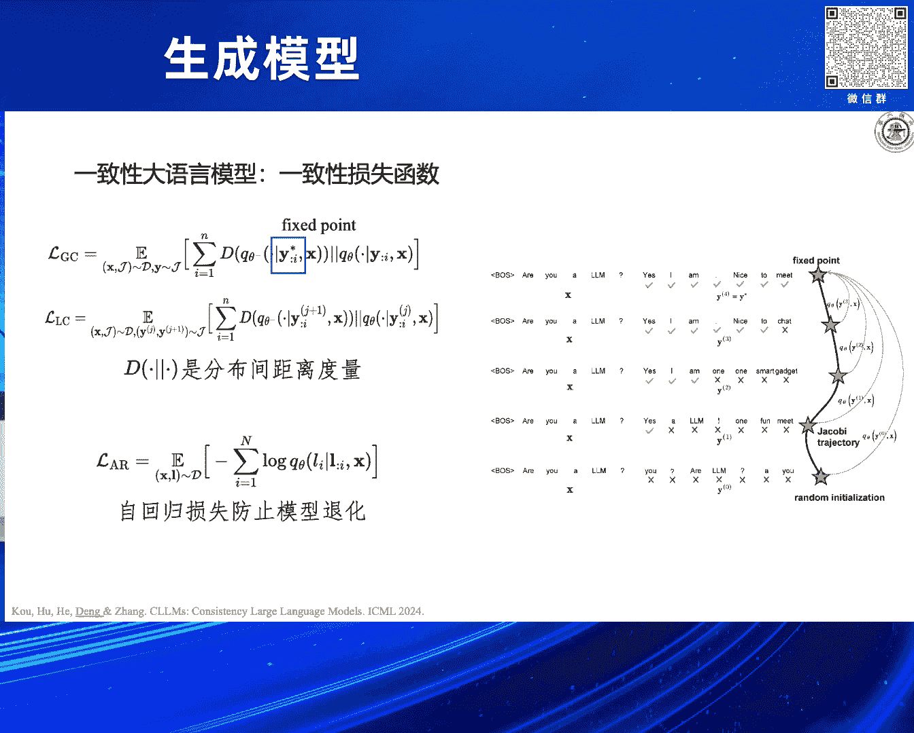
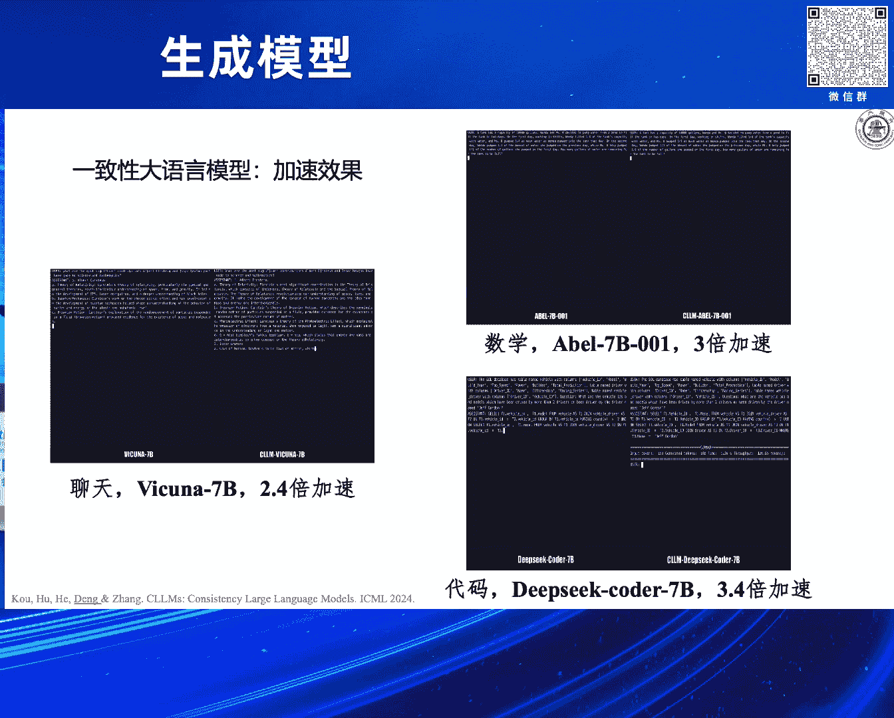
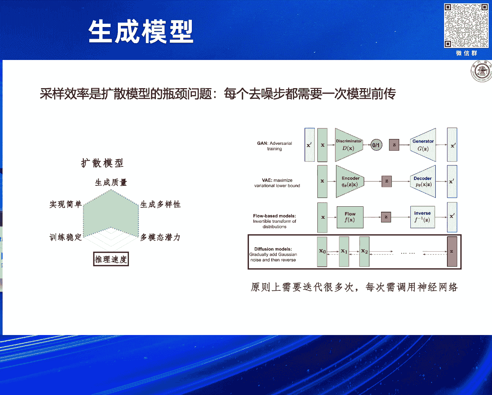
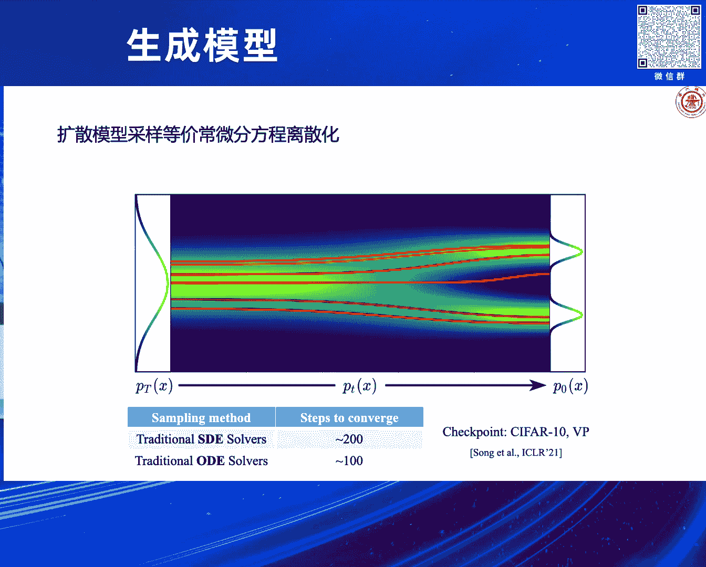
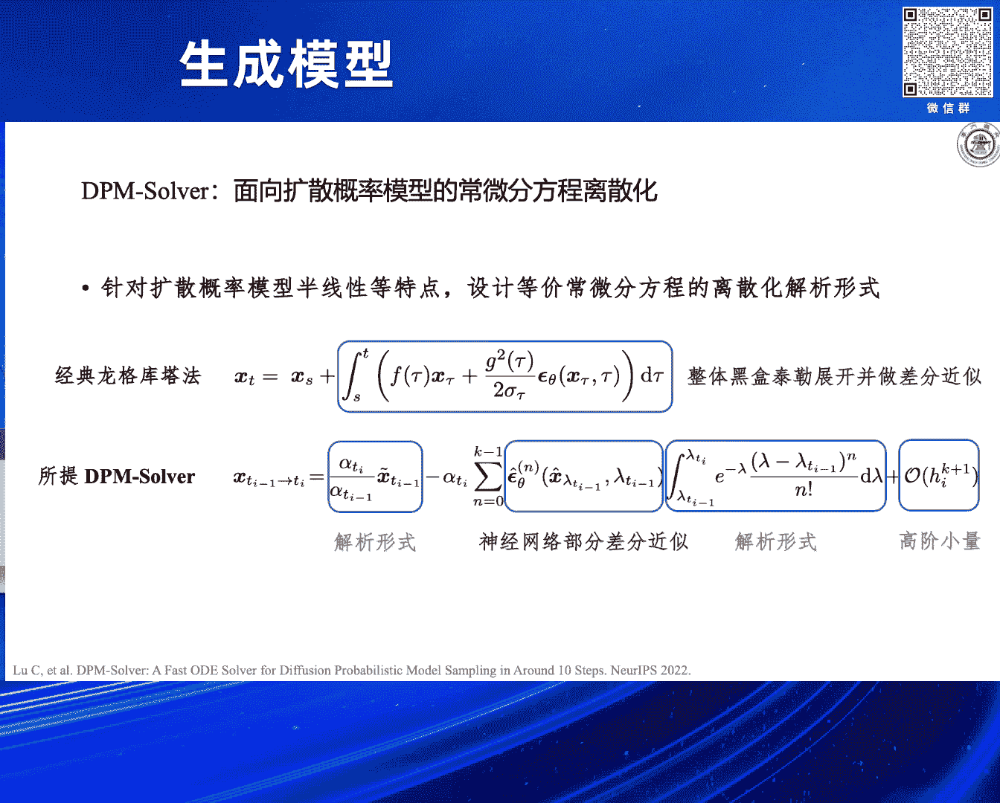
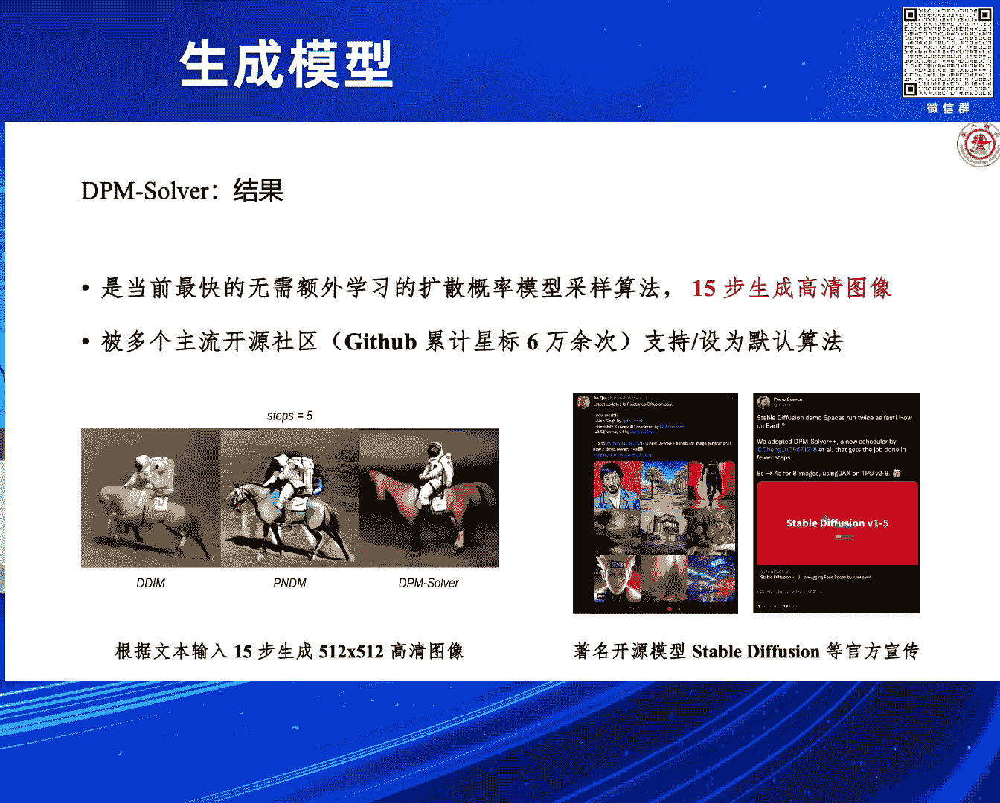
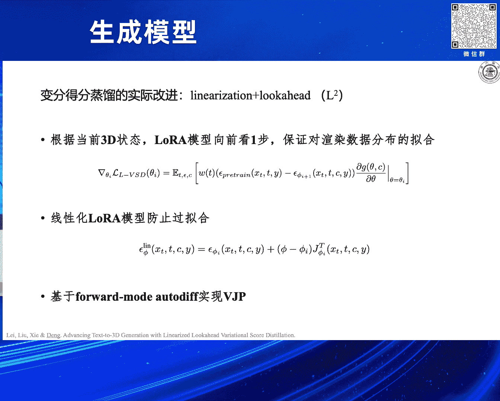

# 2024北京智源大会-生成模型 - P5：大模型的高效并行推理方法：邓志杰 - 智源社区 - BV1DS411w7hz

好 感谢主持人，感谢支援组委会的邀请，让我有这样一个机会来给大家分享，我们在大模型的高压推理方面的，一些初步的工作，以及一些比较粗浅的想法，我是邓志杰，来自上海交通大学清源研究院。

那么我们本次报告的背景，其实就是这两年，我们所遇到的时代的背景，大圆模型已经成为了，广泛的现有任务的基石，然后也激发了广大的，我们的研究的兴趣，以及工业界的兴趣，另一方面，就是以大的扩散模型为代表的。

这类模型在图像，尤其是视频生成上，所产生的带来的巨大的影响力和价值，电信的工作，就包括我们二手轮翔的，over AI做出来的SORA，还有我们秦华的和声速公司，联合做的维度，这样的一类模型。

那么我个人是觉得，这两类模型，其实可以统一在，AIC大模型这样的一个架构下面，并且对于这两类模型，或者说对于AIC大模型，我们也渐渐的发现了，他们之间的一些趋势，发展的一些趋势，那么第一个就是。

架构趋于统一了，transformer在大模型的架构使用上，具有绝对的优势的地位，那么尽管有一些后来的挑战者，近期也会有一些新的工作，像Mamba2等等，但是目前来说。

transformer的地位还是无法撼动的，那么在学习方式上，刚才各位老师也讨论的，我们存在多个主流的方向，那么一类就是以在语言上，以next token prediction为代表的。

这种自回归的模型，另一类就是在图像上，我们对图像做扩散，扩散建模，扩散这样的模型，学习方式上目前来说还没有统一，但可能会有一个统一的趋势，那么第三点就是，我们相当于大一部分的人。

还是比较相信scaling node，然后scaling node也就是说，我们持续的给我们的模型增加算力，增加数据，增加它的参数量，可以带来更好的推理，生成的效果，那么我们作为普通的研究人员。

或者是很多是学生同学，我们面对这样的时代，我们可能也会想玩一玩这些大模型，我们可以把模型下到我们本地来，我们不说讯息了，我们可以把它跑一跑推理一下，但是我们会发现，我们会碰到非常多的挑战，比如一开始。

我自己弄了一个3090的显卡，我下了一个模型，发现加载都加载不进来，直接om了爆了，后面我们就加了很多trick，给它把它搞好，搞好之后，我们就拿模型来生成，生成之后发现它的token，一个一个往外蹦。

生成一段长的回复，它可能会需要一分钟的时间，那么这是比较早，在去年的时候，那么这样的一种低效的推理，是会导致非常差的用户体验的，所以说从那时候开始，我们就在考虑，如何的把大模型的推理。

低效这个问题给解决了，这个问题实际上来源于两个方面，第一个方面就是，现在的模型它本身也是越来越大，因为随着skilling node的扩展，模型越做越大，那么另一方面，我觉得更重要的。

就是我们从算法的角度分析，我们发现像大圆模型或者扩散模型，它都会依赖一个顺序推理的过程，像圆模型里面，我们生成的词是一个一个自回归的，往外蹦，那么在扩散模型里面，我们也是从纯噪声出发。

不断的把噪声里面的，把这个图像上的噪声给去除掉，生成出一张图像，也就是说我们需要一个，顺序的漫长的推理过程，才能实现一次推理，那么这个过程会进一步放大，我们模型自身大所带来的开销，导致整个高部署的成本。

以及比较差的用户体验，所以说围绕着这个问题，我们也做了相关的一些工作，那么这里也会讨论一些，这个领域里面的一些新的进展，那么我会主要分三个方面，第一个方面是围绕着大圆模型。

我们会考虑把大圆模型的顺序推理，改成变形的推理，当然不是纯粹的变形，只是我们在算法上做一些调整，用一些新的机制，那么另一方面就是会讨论，对于大的扩散模型，我们如何对它进行低部署的推理。

那么这里面会涉及两部分，也是一方面是对于扩散模型采样器的设计，另一方面我们就从征流的角度出发，把多部署的模型征流到低部署，最后我也会简短的花一点时间，来介绍一下我们在模型结构。

以及缓存优化等方面的一些进展，那么可能大家都对大圆模型的，推理过程有一定的了解，可能比较熟悉，但是我在这里给大家简单回顾一下，那么比如说我有这样的一句prompt，三个词，我想输到语言模型里面去。

让它往后生成，然后帮我填充，那么首先我就把它放到模型里面去，它会生成出后一个词，那么这个阶段，我们一般一个比较大家认可的术语，叫做prefill，就是我把promptprefill到我们的模型里面去。

这样一个阶段，后面其实就是一个不断重复的，把刚才生成的词，接到我们的输入后面去，往后生成下一个词，这样的一个过程，那么这个过程，我们比较通用的把它叫做 decode phase。

这个decode phase是自回归式的，一个一个来，那么prefill phase是一蹴而就的，是并行的，就是这三个词，artificial intelligence ease，这三个词是同时处理的。

什么时候这个过程停止了，基本上有两个准则，一个准则就是它生成出结束符us，另一个准则就是它到达了，这个模型的生成上限，比方说2048它截止了，我们分析一下，这个推理，或者说生成过程里面。

它的计算开销时间花在哪里，那么我们说prefill phase，它是并行的，是一蹴而就的，所以说它的时间，我们先可以认为是比较小，如果说我们要生成出来的话，也就是decode phase是很长的。

那么整个的推理过程就很慢，所以很多时候，我们的计算开销花在decode phase上，那么另一方面，就是decode phase，我们会注意到，比方说我们要生成feature这个词，它会看什么。

它会看前面的这四个词，它会看用的是，transformer里面的自注意力机制，对吧，要生成的词会看前面的词，所以它这个地方就要看四个，那么我再看下一个词，它要生成off，它就会看前面的5个词。

就是说它不断的往后生成，我们自注意力机制，它的复杂度是不断的提高的，也就是说到后面，它的开销是越来越大的，那么这一点是可能会导致，我们的语言模型生成，越往后越慢，带来比较大的开销，是比较显著的一个地方。

那么解决这个问题，一个典型的技术就叫KVCatch，或者说现在已经是一个标准的，技术了，也就是说我用空间换时间，因为什么呢，我在后面生成，不管是生成future，还是生成off，我其实都是用到前面的。

artificial intelligence意思，这三个词我都要附用的，就是相当于说，我要把它算很多遍，没必要，我就可以算一遍之后，把它对应的，自注意力里面的一些状态存下来，存下来之后。

我在后面需要用到这个地方的时候，需要看他们的时候，我就用它的状态，我就重新算了，那么这样的一种方式，就可以相当于空间换时间，节省了我们的flops，节省了计算量，那么对于刚才新生出来的词，我把这个字。

我把它的K和V的状态，也可以再丢到KVCatch里，不断的把我KVCatch变大，填充的更大，再往后生成，那么这样的一种有KVCatch的，大圆模型的推理，有两个主要特点，第一个特点。

就是它的prefix，其实是计算密集的，因为如果说我的prom很长的话，其实我就可以很充分的，把我GPU打满，把它的变形能力给激发出来，但是大圆模型它的decode face。

是memory IO bound，比如说受限于我们GPU内部的，memory IO，其实它是flops是跑不满的，主要是把它Memory IO的带宽给跑满了，带宽其实是在我们的GPU的主存。

和它的一个高速计算的存储，就叫做HBM，主存和HBM之间的通讯，这个是比较慢的，相对来说比较慢的，所以实际上真正限制，我们的大圆模型推理的，其实是带宽，主存和HBM之间的带宽，那么我们还有一个特点。

或者说是一个观察，就是说我prefill几个token，我prefill几个token所花的时间，可以认为是跟我decode的，一个token的时间差不多的，差不多的，这就是因为我们的GPU。

它这个flops是够的，它变形计算能力够，那么基于这样两个观察，我们就在想，我们能不能通过某种方式，把我们的decode face里面的memory IO，把需要的量给降下来，比方说我现在生成10个词。

需要10次memory IO，我能不能比方说给它降成三次两次，如果降下来的话，这就可以显著的提高，我们生成过程的速度，解码过程的速度，那么一个典型的做法，叫做投机解码，它就是为了实现这个目标。

它的一个想法是这样，就是说我比方说，我要生成出后面的一段，我喜欢做什么样的，我有什么爱好，这样的一段话，一段token，它有一个假设，它说我要生成的所有token，不是每个token都很难的。

不是每个token都有很强的寓意的，肯定是有些废话token，对吧，或者是就像站位符一样的token，那么我是不是可以把这样的一些token，我放到我的一个小模型上去生成，小模型我把它叫做草稿模型。

draft model，这个草稿模型，比方说，我就像我草稿模型，去对我这个问题做回答，生成出五个词，生成五个词之后，我这大模型用来干嘛，我大模型用来去评判，我去判断我是不是要接收，小模型生成出来的提议。

它这个proposal，如果说不接收了，我这个大模型还可以给它提供一个，对于它犯的第一个错的改正，也就是它这的一个play，这里面用的一套准则，是基于这个寄居心采样，有严格理论证明可以说。

我们通过拒云采样，采样出来的token的分布，是符合原来的遵循自回归的，token分布的，然后我们大模型，去对小模型的proposal，做验证的过程，其实是并行验证的。

这就等加于是做一次prefill phase，去做一次prefill，所以说从这个角度来理解，我们将生成三个词，它所对应的decode phase的时间，转变成做一次prefill的时间。

一次prefill和三次decode，它们对应的memory IO交换，我就要少三倍，所以说因为我生成过程，是被memory IO bound的，所以说我这个速度就可以成倍的提高，当然这是理想情况下。

实际我们也会碰到一些不理想的问题，包括什么呢，包括我们在这会谈论到的，我们投机接马要工作，需要哪几个必要的条件，那么一个关键条件就是我们，draft model小模型够不够小，它得够小才能够快，对吧。

另一方面就是我一次proposal多长，我一次proposal几个词，我proposal一个词，基本上就没什么意义，我proposal太长了，我可能前面它接收的，也没有到不了那么长。

这也是我们一个可以调的，可以选择的地方，那么还有一个比较关键的就是，我小模型proposal出来的token，被大模型接受的概率高不高，也就是说我小模型能不能，很好地猜中我们大模型的心理，猜中它的分布。

这三个因素是比较关键的，这是我们自己画的一些，它所带来的期望加速比的图，对于这三个影响因子来说，所以其实对于proposal的长度k，我们是可以做调参调的，然后模型的大小，也是可以我们来设定的。

你这里面其实比较关键的，我们要提高我们的小模型，猜中大模型的分布的准确率，也就是token acceptance rate，我们要来提高这个东西，我们就观察了一下，现在的投机解码的一些部署的系统。

我们会发现两个机会，就是来提高token acceptance rate的两个机会，那么一个机会就是我们发现，我们的投机解码过程里面，我们的小模型给出来了一个proposal之后。

其实我们大模型会检测出它的第一个错误，然后白送它一个，这个应该怎么生成这件事，告诉它白送它一个正确token，token实际上在投机解码里，就是被用来了，我们往后接着做生成了，但我转过来想。

这个信号实际上可以拿很好拿过来，帮助我们来做小模型的校正，那么我就教小模型，你下次不能再犯这个错，对吧，我小模型相当于就在不断的，这个过程里面提升自己，也就是我这里所说的，我们大模型可以免费的提供信息。

告诉小模型怎么改进它的token，acceptance rate，另一方面我们刚才一直强调的，投机解码的系统里有很多空的flops，很多空的flops，我这个有flops我可以来train模型吗。

所以我们就做了这样一件事情，叫做在线的投机解码OSD，那么我们把两部分做一个结合，我们在投机解码的这里面，做了一个draft model的在线的帧流，从比较直观的角度来说，我们就做的这样一件事情。

那做法上也非常简单，我们可以在online的serving的过程里面，我就不断的记录小模型哪个地方犯了错，大模型给它的一个校正是什么，我用一个buffer来存，然后每过一段时间。

或者说我的buffer满了之后，我就跑一次帧流的一个过程，帧流的一个过程，帧流其实跟我们的做语言模型的，teacher forcing的training是差不多的，差不多的，然后train一下就可以了。

那么它有一个很显著的好处，一会我们在实验结果里会发现，我们假设是一个open domain的情况，然后我们会有一个比较稳定的，一个query distribution，就是说我作为一个用户。

来用大模型的时候，实际上我往往倾向于问一个特定范围类的问题，有可能今天下午我在改论文，我就可能问的就是，怎么叫他帮我改语法错误，或者是帮我翻译，有的人他从事的是金融，或者数学相关的工作的话。

就可能会一直问的是数学的这种问题，也就是说我们的用户，其实会有一个query distribution，query distribution是比较窄的，不会像语言模型学习的。

distribution那么大，所以说在这种情况下，我们OSD就可以快速地适配到，用户的query distribution，更好的猜中用户的心理，有这样一种感觉，那么我们首先模拟了一些在线部署的场景。

比方说我们会假设我们的系统，会用到Spider或者GSM8K，这样的一些benchmark上去，那么随着我们对投机解码系统的不断的query，不断的跟它交互，我们的模型蓝色的线。

表示我们的模型的猜中的概率，它就会不断的提高，这就是很符合我们预期的一个事情，因为我们做了在线征流，如果baseline就是用offline的这种模型，就是不做征流不做在线。

那它就是一个比较静态稳定的准确率，不会有提高，那么这个工作里面，我们还做了一个比较有意思的探索，就是我们发现我们这个draft model，也没有必要一定是一个，我可以是多个。

尤其是在一些复杂的query distribution的场景下，比方说我这个模型可能将来面临，被多种语言的人来访问，那我就可以其实跟每一种语言的人，我部署一个draft model。

如果说大家会问多个主题的问题，我可以为不同的主题部署一个draft model，部署一个小模型，然后我们也模拟了这样的一些场景，我们会发现在这种混合的场景下，不同的小模型不同的draft model。

它的准确率也会持续的提升，那么最终我想可能我们可以，拓展为一种基于用户的路由，为每一个用户我可以部署一个draft model，最终可以实现就是，在这个用户他的手机上部署的draft model。

更能猜中这个用户的心，当然我们也跟一些比较大家公认的，Baseline做了一些比较，包括MEDUSA，然后我们其实也可以跟MEDUSA做结合，然后我们做了一些观察就发现，小模型对哪些词能猜对。

提升比较大，猜对的概率提升比较大，我们发现跟这个任务其实是特别相关的，比方说spider，它是一个文本到Cycle语句的这样的一个任务，你就会发现它能猜对的词，好多就变成了slack。

或者是跟这个任务特别相关的，然后包括Jason Bucket，他就会很容易猜对一些符号，所以说小模型确实是在猜对一些，可能是一些相对来说，信息密度比较低的这种token。

这样的话我就可以释放大模型的生成的压力，帮他做得快一点，那么在刚才这样的一个工作里面，我们仍然考虑模型，语言模型自身仍然是顺序解码器，尽管我们用了一个小模型，然后用大模型去做一个并行的验证。

但是小模型和大模型在这个里面，它仍然是顺序的，那么我们会受限于这类模型，语言模型它是从自回归的这种方式里面去学的，那么我们可能就有一个比较跳脱的想法，就是我们的语言模型能不能一次于此，多个token。

我跳出刚才这种范式，当然这个里面就有一些初步的探索，这个探索叫做Jacobi decoding，这里面其实有苏扬博士的深意，所以它是确实是很值得我们学习的，苏扬博士的一些工作，他是说什么呢。

我们如果想同时从一个大圆模型里面解码出n个token，多个token n大于1，实际上等价于我同时求解一个有n个方程的方程组，尽管说这个方程组就长这样，尽管说这个方程组它的第一个方程的解。

第二个方程的解依赖于第一个的解，第三个又依赖于第一个和第二个，但是我们仍然可以用并行的求解器，并行的不动点迭代求解器来求解，然后可以从理论上证明，我们的步数可以不超过n，也就是说我要剪。

我要生成出n个token，我可以求解的步数是小于n，就可以把它求解出来，小于等于n，并且我求解出来的token的严格会服从于我们想要的分布，比方说如果取的是ArgMax，我们就是跟Gradient。

跟这个圆模型Gradient生成的分布是一致的，可能从公式上比较难理解，比较晦涩，我们可以看直观的图，就是对于我们有一个prompt，有一个prefix，输到模型里面来，我们先随机的拆n个token。

随机的把后面n个token给拆出来，拆出来之后，我们就把它们一起丢到语言模型里面去做一次迭代，得到一个输出，然后输出里面跟输入的token如果是一样，我就给它固定下来，然后我就把后面的token。

我再输到前面去，再输到语言模型里面去，再做一次迭代，最后就会得到一个不动点，这就是其实做起来就很简单，所以很简单，然后它用的时间其实是类似于我们之前说的prefix一次的时间。

相对来说它跟decode一次的时间也差不了多少，所以说总共它的时间也不会引起太大的开销，但是2013年的一个工作做出来之后，说在上面可以用这个方法，可以相对于AR有1。05倍的速度提升，不是很理想。

那么它的原因主要就是因为模型其实在训练的时候，它没有学过怎么预测多个token，比方说它前面的词，前面有两个词没预测对，它后面的词它不可能预测的，就是概率非常小，非常小，那模型没有这个能力。

我们就想我们得把模型这个能力给它给它给它习得，给它学会，我们可能就需要调这个模型，那么我们就想设计怎么样的一种学习目标来调这个模型，我们还是从这个jocoby decoding不动点迭代的角度出发。

我们如果看这个图上右边是jocoby decoding的一个轨迹，它是不动点迭代的一个轨迹，其实很类似于我们的Diffusion model里面，ODE采样的轨迹，很像确定性的。

我们就想我们的终极目标其实就是让模型直接从随机的初始化，映射到它最后那个不动点，就学这个映射，就学这个映射，但这个映射如果直接以这个作为nulls function去训练，训不出来，我们也做了一点尝试。

因为这个问题太难了，你一次往后猜10个词20个词，这还得了，就是这个很难猜不对，那么我们就想有没有一些折衷的方案，我们就从consistent model。

也是苏杨博士做的对于Diffusion model加速的工作里面，得到了一些灵感，我们就想我能不能把这个轨迹上的任意一个点，都映射到它的fixed point上去，我们这样的话我就可以定义一组损失函数。

一组学习目标，那么这一组学习目标，它就有一个很好的性质，就是说我从最后我就要往fixed point预测的话，这是很简单的，其实我就往后预测一个词两个词就够了，这是很简单，但是越往前越难。

它就有一个从e到null这样的一个变化，我觉得可能这个变化对于原模型来说，或者说对于大模型的训练来说，其实是可以给它起到一点的引导作用的，可能会有一些课程学习这样的一种感觉。

所以最后我们就用了这样的一个学习目标来学习，我们有两种选择来定义一致性的损失函数，Consistent loss，Consistency loss，一个就是我刚刚说的，直接就从中间的任意一个状态。

不同点迭代状态去预测不同点，另一个就是很类似于，Consistent model里面的loss，就是说我找两个相邻的不动点，然后我的目标就是把它俩预测到一起，让它俩的预测一致。

这是我们的两种loss function，但我们发现其实还有一个比较关键的点，就是这里面我要把自回归的损失我要加上，如果不加上自回归的损失，模型很有可能会崩塌，它就全生成出同样的一个token。

或者说可能找到一些捷径在里面，所以说我要用自回归的损失，来矫正它，这是最后我们能够达到的效果，我们这是选了几个case，但是我们还有做了其他的一些case，基本上来说我们对于现有的模型。

比方说Vecula或者是DeepSeq Coder，拿过来我调一下，不需要调很久，后面我们有时间，简单调一下，就可以达到用我们的loss function来调，调完之后就可以达到，基本上两三倍的加速。

然后同时它的生成质量是不会下降，不会明显下降的，也就是10%~5%以内的下降，这个标的就我们的加速时间和性能，就一个系统性的比较，之多来说是有3。6倍的加速，我们知道现在市面上，可能在大元模型加速上。

比较权威的一个方法就是Midusa，Midusa它的第二个版本，Midusa它的名字就是，这个名字我们就能猜出来，它这模型是有多个头的，多个输出的头，它就需要对模型架构上做改变，然后这个头其实很重。

然后它要逊很久，我们来说的话我们就不需要改模型，我们需要改一下模型的训练的objective，就可以了，在生成质量上，我们也可以达到基本上不怎么下降，比方说原始的我们的，MT Bench上是6。5。

我们训完之后也就6。4，有一些一点点，这是我们训练的开销，我们训练的开销，我们是以域训练，这个模型域训练它用的token数，作为基准，我们做的微调相对于域训练，这个token数它的比例是多少。

基本上都是小于1。2%的，最后我们也分析了一下，就是我们做的一致性大圆模型，它所带来加速的根源是什么，我们找了很多case来看，我们发现其实主要有两个根源。

一个根源我们叫做fast forwarding，就是说我一次可以预测对多个token，在这个图的右边大家可以看到，我可以一次制作预测出三个token，另一个叫做stationary token。

也就是说在前面还有预测不对的情况下，我可以提前把后面的某个词预测对，但这个情况是比较少的，相对于fast forwarding是比较少的，因为这样的一件事情确实是很难，我们第二部分我们就会介绍。

我们在大圆模型以及我们的相关进展，包括我们做的一些工作，在大扩散模型的低部数征流方面做一些工作，扩散模型它的推理慢，每一个去造步都需要一次模型前传，我想我也不需要给大家重复了。

之前大家会比较关注的一个点，就是从设计扩散模型的采行器这个角度出发，来加速扩散模型的推理，当然我这边用的其实是李中原老师的PPT，因为有一个视角，就是我们的扩散模型，它有一个它的反向的SD过程。

有等价的一个常微分方程，有个常微分方程，那叫做概率流常微分方程，这也是宋阳博士在他20几年的文章里面给出来的，我们发现常微分方程和它对应的随机方程，它们的边缘分布是一样的，但是常微分方程它是更加平滑的。

它平滑那就给我们做在它上面的一个快速采样提供了机会，我们可以用非常快的，或者说一个比较大的跳跃步，在常微分方程上去走，所以现在有很多基于扩散模型的采样，从常微分方程理想化角度来做的一些工作。

那么在21年的时候，大家发现我们就即便是用传统的ODE solver，其实就可以相对于SD solver，有一个很大的速度上的提升，可以减少推理部署减少两倍。

甚至说后面我们就可以专门为Diffusion model，设计适合于它的ODE solver，那么这里面代表性的工作就是，清华大学做出来的DPM solver这个工作。

它就是面向扩散概率模型的常微分方程理想化，它利用了扩散概率模型它半线性的特点，然后基于它的展开等一些技术，来设计它等价的常微分方程的理想化的几个形式，然后最后再可以用一些差分来进行里面的一些计算项。

最后得到DPM solver，DPM solver它的效果特别好，然后主要是也被我们的社区广泛的采用，像这些主流的Celibate Diffusion，或者是DALY可能都会用到这样的一个。

DPM solver这样的一个高效的采用算法。

我就以DPM solver为代表，介绍了从采用器设计的角度，来加速扩散模型的方案，我们更多会讨论的就是从模型征流的角度，我们怎么实现低部署的推理，实现扩散模型采用的加速。

我们最早出现相关的工作叫做渐进征流，Progressive distillation，它也很直观比较好理解，就是说我原来比方说我需要做四步采样，才能从造生恢复出X的话，我现在我就可以把它中间的每两步。

征流到另一个模型里面去，直接让另一个模型基于ypsilon，预测出两步之后它的状态，或者说从状态到ypsilon之间的差值，就是它要走的走多少，然后我做了这样的一次征流过程之后。

我就可以把四步的一个模型，四步的一个采样过程，征流为一个两步采样过程，如果说我再重复一次的话，就可以把两步征流成一步，这样的话我就可以渐进的，减少扩散模型的征流的，渐进的减少它的采样的时间。

之后CVPR2013上的工作就，进一步的改进了这样的一个，进一步的征流的方式，为它引入了CFG，然后做到了更大的模型，做到了纹生图的长径里，做到了影空间的扩散模型上等等，把这些必要的技巧都引入进来了。

但是这类方法它还是有很大的一个问题，就是它需要征流多个模型，就是对于不同的采样部署，比方说四步或者八步，它一般都是训练专门的一个，八步模型和一个四步模型，就是它要多个模型。

然后它的征流整个成本还是比较高的，可能需要上千张显卡来做这个征流，那么有一个比较好的解决方案，就是从共享这几个不同部署的模型的角度来说，有一个比较好的解决方案叫做一致性征流。

那么一致性征流它是从这个角度来理解的，它是想我们如果考虑从Diffuse Model里的采样，那实际上我们是在对我们的概率流ODE，做理想化，然后这个概率流ODE，它实际上定义了一个。

从噪声到我们的观测数据的一个E印射，我们之前是需要用一个流程，来把这个印射给跑完的，用一个Sampler来把这个跑完，我现在就想，我能不能直接用一个模型来建模这个印射，我实际上这个模型的输入是。

这个ODE轨迹上的一个状态，让它的输出直接是一张干净的图像，在这个ODE轨迹末端的干净图像，如果说我能构造出这样一个模型，那我就可以实现一步采样的这样一个目标，就是把采样部数尽可能地降到了最低的。

那它从形式上来说，我们就会发现我们需要定义这样一个模型，Fθ，它的输入是我们的一个ODE轨迹上的一个状态，那么理想情况下我们只需要把最终那个状态给输进去，实际上为了我们的这个模型可以训练。

然后可以服务于多步采样，我们也可以考虑把ODE轨迹上中间的一个XT给输进去，反正我们就是让这个轨迹上的所有点，都能印射到X0，印射到一张干净图像上去，然后这个Fθ这样的一个函数。

它的参数化有一个比较有意思的技巧，因为我们会发现，如果说这个Fθ它的输入T是0的话，其实我们就可以直接把它同时输进来的这个XT给return出去，因为就表示我已经就是在这个ODE轨迹的末端了。

就是最后那个时刻了，所以为了实现这一点，就是一键一钟流量，从模型构建的角度就做到了这样一个事情，它就是做了我们的这个输入数据X，和我们额外的一个建模模型Fθ，大Fθ之间的一个差值。

那么它们之间的这个差值的wait，就可以保证在时间不是0的时候，情况下我就把X输出出来，那这个模型的训练，是可能初看它的形式有点复杂，但实际上也比较好理解，就是我们先把一张干净的图像X0加造。

加到XTpair这个时刻上去，然后我现在不就是考虑XTpair在哪个ODE轨迹上吗，那为了确定这个ODE，我就要拿一个预训练好的deferred model来走。

因为这个预训练好的deferred model就确定了一个ODE，那就让它往前走一步，走到XT这个位置上去，然后我的学习目标就简单了，我就只需要让我们的这个XTpair和XT，放到我们的模型里面去。

都能预设到同一个初始状态，那就说明它们是在同一个ODE轨迹上了，所以这就定义了一致性帧流的损失。

一致性帧流的损失，那么这个结果其实是去年来说是，一步生成的SOTA的结果，在Sepherton和ImageLight上。

ImageLight64上，然后它也有很多的应用场景，那么今年也是清华大学做了一个工作，就把它给拓展到了影空间，在影空间上做了一个一致性的帧流。

我们把它叫做Latent Consistency Model，然后它最后实现的目标就是，它四步就已经生成的很好了，然后在一步和二步的情况下，仍然可以生成，但效果我们也测了一下。

一步和二步的情况下没有那么理想，所以我们也做了一个工作，也是延续影空间的一致性帧流，我们就把它拓展成了多步，我们就想其实我们直接让我们的模型学习，从照相到图像的一致性映射，这个问题本身也挺难的。

那我可以考虑我首先将，我们要建模的OD轨迹我给它切段，比方说我一开始给它切成十段 十六段，那么在每一段里面，我让它学习一个一致性的映射，然后我不断地通过减少段数，比方说我一次让十六段变成八段。

然后逊一会之后我再让它变成四段，这样的话我就可以有一个，相当于热启动的这样一种感觉，我们发现这样的一种方式，可以提升模型的收敛，改进模型的收敛，然后我们还使用了一种。

Training Data Free，就是我不需要Training Data，来做帧流的一种方案，其实说白了也简单，就是我们从教室模型的采样，从它出发来做帧流，最后我们引入了一些偏好学习。

因为现在大家会比较强调，符合美学符合一些伦理道德，这样的一些要求，所以我们引入了偏好学习的一些损失。

兼顾了加速和对齐两个方面，这是我们最后得到的效果，然后我们是不需要训练图片，统一的一个多部生成模型，然后在两部的情况下，就可以实现高质量的，1024分辨率的图片的生成。

比SDXL和Hyper SD要好很多，然后也复论到了一些产业界里面去，在这个模型的拓展方面，也和Control Light做了一些结合，发现效果也不错，然后我们还可以做到中文的生成。

包括对于中文的一些语境的理解，就是我给它一些中文的诗句，像蓝水箱这种感觉，这种可能就不单单是汉字层面，就是我对这个语境有一些理解，说到帧流，其实我们也绕不开一个话题，叫做得分帧流。

它也是我们从模型加速的角度也好，从2D到3D帧流的角度也好，就绕不开的一个算法，然后以及它的一个改进算法，叫做变分得分帧流，它是通过引入变分段的方式，缓解了原始的得分帧流的一个巨大的问题。

然后我们会发现变分得分帧流里面，它有两个模块，一个就是原始的，而已有的一个扩散模型分布，另一个就是我需要额外引入一个，用NORA加持的一个，拟合渲染图像分布的这样的一个模型，这两个模型。

就是这个NORA模型和我们的3D的状态交替优化，我们发现，这样的一个优化过程，在实际里面我跑代码发现，它就存在一个比较imperial，就比较现实的问题，就是收敛比较慢。

然后也需要多个阶段的训练，我们就在想能不能把多个阶段，我给它归约到一个阶段，让它一个阶段就能做得很好了，那么我们发明了一种就是向前看一步，这样的一个，我发现把简单的思想引入进去。

我就先把我们的NORA模型，在我们当前的3D的状态上，我多训一步，我发现确实可以改善，变分得分帐流的一个收敛，但是它会存在一个过拟核的风险，所以我们又提出，把NORA模型做一个线性化，给它线性化一下。

它变成一个线性模型。

就不容易过拟核，最后我们有一些trick，来高效地实现这种线性化，最后我们得到的结果就是，我们基本上一个心理学家就可以，比较明显的忧郁忌忧的方法，包括VSD还有ESD这些方法。

最后我们再讨论一下，在模型结构以及虚拟状态等等，这些其他方面的一些优化方法，这里面很多就是，比较出名或者经典的一些工作，就是给大家简单的分享一下，模型结构上其实我们一直都在想，提高模型的表达能力。

但是现在你单纯的把模型加深加大之后，它很慢，所以有比较出名的，大家通用的一个机制叫做专家混合，它里面关键就是，我比较悉数的激活这些专家，我在保证模型的能力的同时，我可以降低它的计算开销。

这里面的代表就是，Mixtro，然后Qianwen，然后DeepSeq，它们会代表的一些MOE的模型，那么深度混合是对于MOE的一个改进，它认为MOE它这样，因为它这样可能会导致，不同专家的Node。

不同专家的负载不均衡，不均衡我们怎么，就可能会拖慢整个系统的速度，所以说这个MOE就从专家的视角来出发，来做这个rotate，来做token的选择 选定，它保证负载均衡。

但是它有一个问题就是比较难做cosmodeling，就是来做我们通常所说的language modeling，从前到后 从左到右这样的一个因果顺序，比较难建模，我们做了一个很初步的工作，我们发现什么呢。

我在MOE里面，我就加一组空专家，然后我就把MOE选topK，这个K我加大一点，我就可以保证，对于不同的token，我可以自适应的选择专家数，如果它全选了空专家，那这个相当于这个token。

我就需要零个专家来处理，零个真实专家来处理，如果它是全选的真实专家，那就需要比方说四个真实专家来处理，从这个角度来说，我们就可以极大的增加模型的灵活度，然后我们再通过一些负载均衡的损失。

来保证空专家的使用率，最终可以保证我们优于MOE，在负载利用率上是优于MOE，然后我们的建模灵活性是优于MOD的，因为它不能做cost的这种建模，对于Mixture 8*7B，我们简单的微调了一下。

就可以在性能不降低的情况下，降低20%的flops，Inference的flops，那么在Token序列上的优化，这也是一些已有的工作，一个典型的工作叫做Tome，它就是基于相似度。

对我们的Token序列做合并，降低我们Transformer里面，Token序列的长度，从而提高它的推理效率，近期有一个比较出圈的工作，就是Virial Token With Draw。

它是说我在VOM视觉语言模型里面，在后面我其实可以把那些视觉Token全扔掉，尤其是16层之后，全扔掉之后不影响性能，这也是比较有意思的一些现象，在KV开始上的优化，我们也从，这都是比较出名的工作。

包括我们可以对Query做分组，降低KV开始需要存储的内容的量，存储的状态的量，还有就是DeepSeek，他们做的多头的Natent Retention，它就是通过低质映射。

把KV开始投影到DV的向量上去，存这些DV向量，从而有效地降低还存，其他的方法还包括，Streaming LLM和HRO，这也是今年做出来的比较好的一些工作，那么以上基本上就是我想分享的一些内容。

对于未来的一些研究方向，我觉得在AIGC大模型的各套推理方面，我们还可以做很多基础上的研究，尤其是从模型架构，模型的学习或者训练方法，以及采样算法上，其实还有很多工作可以做。

那么我个人认为可能比较重要的两个场景，一个就是会到多模态这样的一个场景里面，另一个就是视频生成，学习世界模型这样的一个目标。

以上就是我的分享，谢谢各位专家，也希望大家批评指正，謝謝大家。