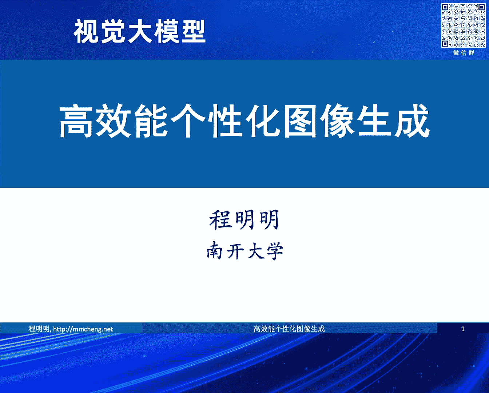
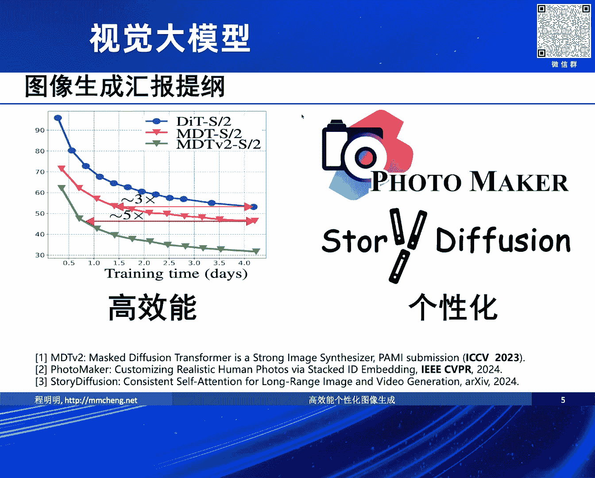
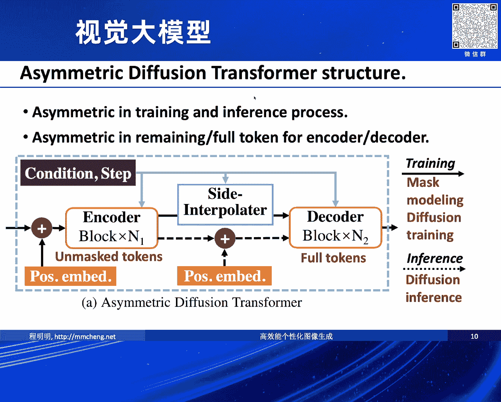
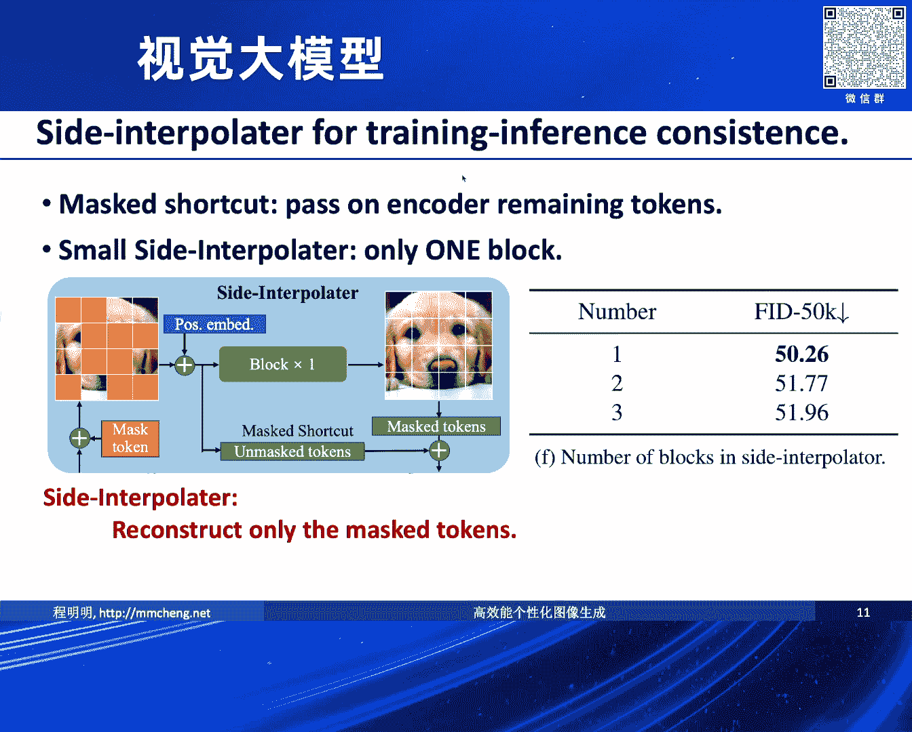
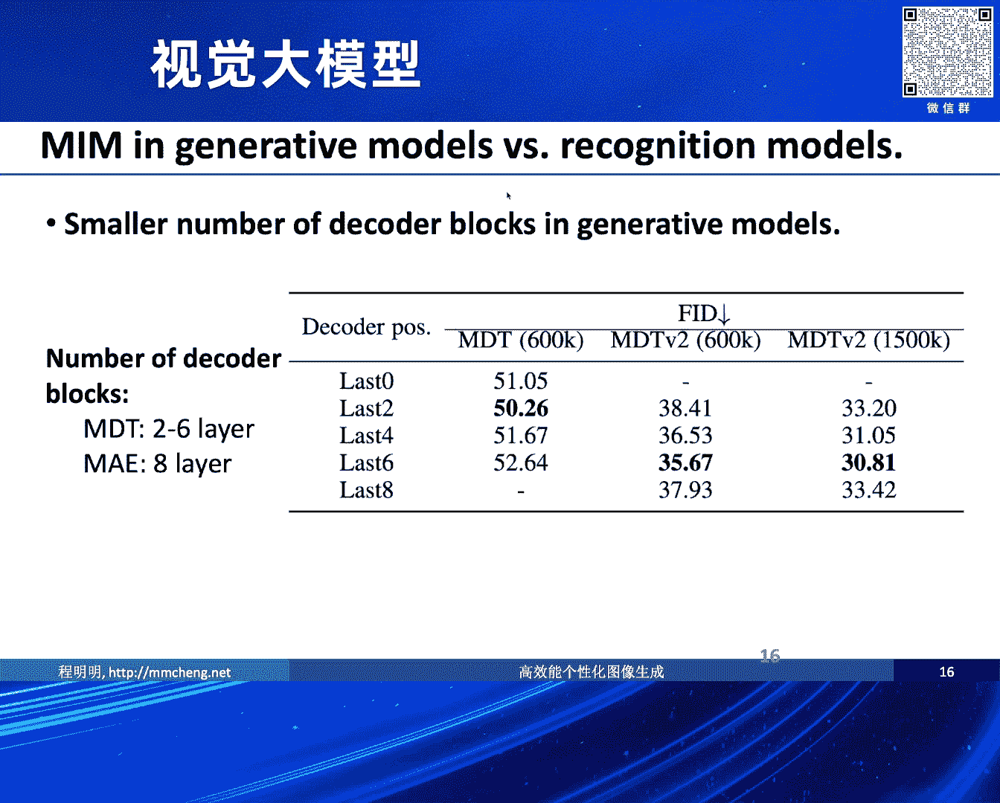
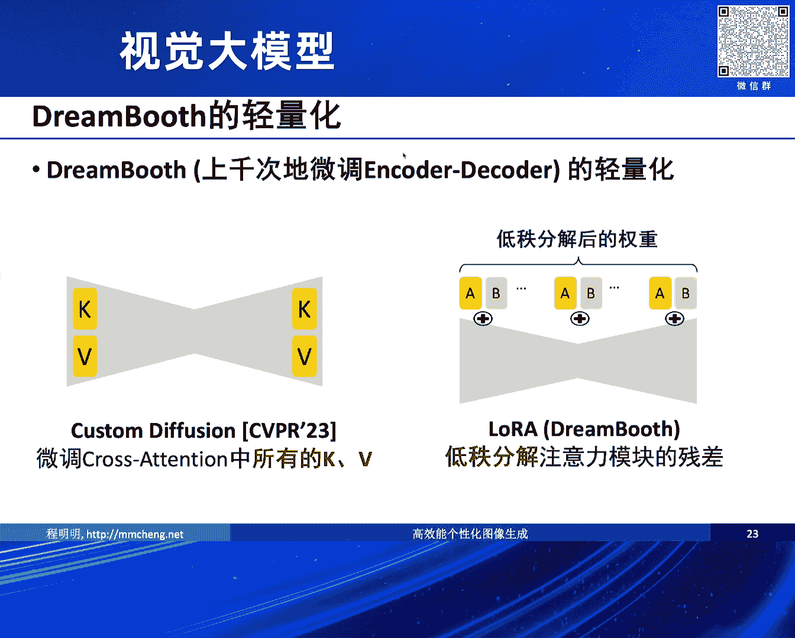
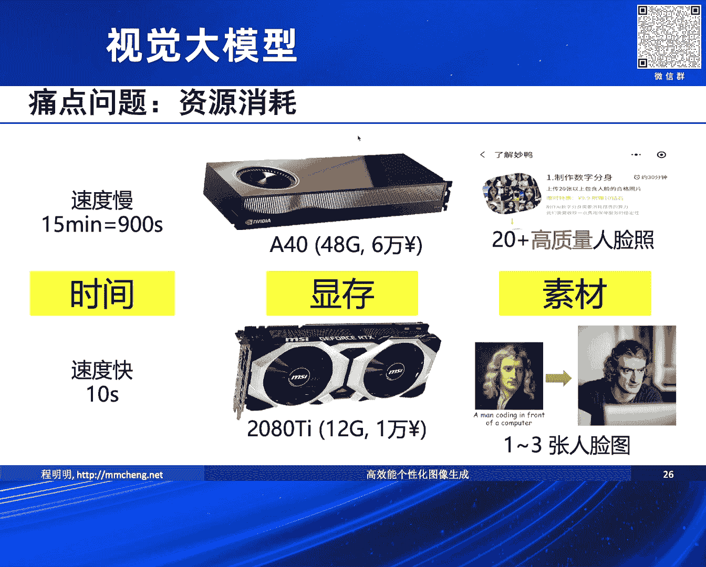

# 2024北京智源大会-视觉大模型 - P5：高效能个性化图像生成：程明明 - 智源社区 - BV13x4y1t7sb

非常高兴有这样一个机会给大家汇报一下我们在。

高效能个性化图像生成这一方面的一些工作。

其实提到这个图像生成，我们其实想去做这个事情时间已经非常久了。

早在大概十多年以前，我们曾经就试图去做一些关于，怎么样去用文字去生成一些图像，之前跟严老师沟通，严老师那时候也做过一些类似的探索，其实在十多年以前这个问题还是挺难的，因为那时候没有大量的GPU。

也没有海量的数据，当时我们去做的是用这个，后来发现这个实在是没法弄，然后就变成画一些简单的sketch，然后变成用搜索 从互联网上搜索图像，最后进一步地去合成，当时这个工作就受到了很多的关注。

当时很短的时间内在vimo那个平台上，就有100多万的浏览，后来我们还拿到了法国政府办的一个论坛的一个奖，当时还以为是个诈骗电话呢，后来真是邀请我们去法国巴黎参与领一个奖，但是这个事情的话呢。

可能和现在，当然可能对现在的这样一些文生图呢，只是说我们早期试图去做一些探索，但是可能跟现在从结构呀，从这个方法上有非常大的区别，现在的这些方法大家也都比较熟悉。

基本上都是基于Diffusion的这样一个模型，由于刚才其实几位老师在介绍的过程中，已经讲得比较多了，然后这里我就不赘述，我今天给大家汇报的其实是，关于我们在高效能，个性化图像生成方面的三个工作。

一个是说目前来讲，其实好几个报告的讲者都提到了说，我们现在的这样一个Diffusion，这一系列的模型训练起来，整个的对资源的消耗，是非常非常之巨大的，我们有一些跟杨老师合作的。

做训练加速的这一块的一些工作，另外一块呢就是，我们也希望我们的这个图像的生成的模型，它不光是说生成一个比较可爱的，或者说生成一些，可能看着比较高质量的，另外呢我们也希望它有比较强的，这种个性化的能力。

因为我个人感觉从应用的角度来讲，现阶段我们的这个图像的生成的模型，可能要去做一些非常严肃的事情，或者说一些非常精确的一些，符合物理规律之类的事情，可能还有一定的困难，更多的我个人感觉在应用的层面。

可能更多的还是泛娱乐化的这些应用，可能会更贴近于可能近期的一个实现，所以在这种情况下可能用户的这种参与感，或者用户本身在里边能够取得这个，个性化的这些东西可能会比较关键，这是我们大致的一个判断。

然后从这一点来讲的话呢其实，我们去尝试去理解现在的这样一个，图像生成的模型的时候呢，我们其实会看到其实，现在很多的这些视觉模型有一部分呢是，早期的我们可能想学习各种各样的表征，比如说通过这个。

VE啊通过各种各样的一些方法，我们想去学习各种各样的表征，去理解图像，然后近期的话呢可能更多的人，在尝试说我们通过，这个文字或者通过多么态的信息，然后去做这个生成，这个理解和生成呢，这两个呢应该是。

原则上来讲这两个应该是能够去相互促进的，基于这个观察的话呢我们会发现其实，现在的这样一个，Diffusion这一系列的模型，比如说这个DIT，Diffusion Transformer的这样一个模型。

我们会发现它去，当我们去利用这样的一个模型去训练，它如何去生成一个高质量的图像的过程中，我们会发现其实它需要的这个迭代是非常非常之多的，比如说这是，这里边有一个简单的例子，就是我们试图用。

图像的生成模型去生成一个，去训练它去生成各种各样的一些图像物体，比如说这是一个生成小狗的一个例子，会发现经过好多次的迭代，DIT的话呢依然，虽然它的细节是很容易搞清楚的。

就像最开始我们给大家展示的那个图一样，它其实Diffusion的模型特别擅长去处理，独立的这样一个主点的这样一个噪声，它去去除这样一个局部的噪声是非常容易的，它可能最开始设计的时候就是考虑的那种场景。

所以可以看到经过非常少的迭代呢，这个小狗的图像里边的各种各样的细节，各种各样的局部，其实都挺好的，但是呢你可以看到对于人来讲的话呢，它其实有很大的问题，比如说它少了一只眼睛或者少一个鼻子。

这个的话呢就是它缺少了一些结构化的信息，所以我们就是说它观察到它缺少这种，Context的这样一个Relation的这样一个建模的能力，因此呢我们希望说，既然由于这个缺少这样一个建模的能力。

导致它可能训练需要的时长会非常的长，那有没有可能我们去强化它这块的建模的能力，进而去增强它的这样一个训练的一个效率迭代的收敛的一个速度，那从这个角度来讲的话呢。

我们就在想说有没有可能把这个Mask的Autoencoder，MAE的这样的一些能力给它引入进来，去强化它的这样一个结构化建模的一个能力，MAE呢大家可能都比较熟悉。

它是何凯明提出的一个去做语意表征学习的这样一个工作，然后呢这样的一个工作从它的这个，从它里面最重要的这个图，大家就很容易能够看出来就是，它是一种无监督的，对于出入的图像它随机的Mask掉一部分。

然后它试图去通过这个，没有被Mask的这些部分去提取一些特征，然后进而去恢复被Mask的这样一些的区域，从这个试图大概大家不难看出就是，这样的一个模型在学习图像的视觉表征的过程中。

肯定需要去建模这个图像里边不同Patch之间的相互的关系，如果没有这个对Patch之间上下文信息的这样一个建模，它是不可能把中间的其他的空洞给补起来的，所以我们认为这样的一种能力呢，它能够很大程度上去。

强化我们对这个Patch之间，上下文关系的一种建模，基于此的话我们就提出了一种新的一个工作，就是说我们希望能够把刚才我们的MAE，Mask Autoencoder的这样一个机制。

引入到我们这个Diffusion的训练的过程中来，希望在这个training的过程中，我们希望把这个Mask Modeling的机制引入进来，这样的话它能够去加速Diffusion模型在训练过程中。

对上下文建模的能力，进而加速它的这样一个模型的收敛，在Inference过程中我们也希望说这个过程尽量的平顺，跟以前的Diffusion一样，然后它不额外地增加推理的速度。

左下角是我们这样一个方法的大概的流程，对于一个Noise的Latent的表达，然后我们做一个Mask的这样一个机制，然后Mask剩下的这样一部分，没有被Mask的Latent的表达。

然后我们可以去把它送到一个非对称的Diffusion Transformer，为什么提它是个非对称的呢，是因为它在Training和Inference阶段是有点不太一样的。

在Training的阶段我们不给它完整的Latent，然后我们希望通过Mask Autoencoder的机制，让它去做一些推理，这样的话加强它表征里边可能相互之间的这种联系，Context的这种联系。

在推理的阶段我们就像一个正常的Full Latent一样，整个把Latent的表达全部送给它，然后希望它正常的去能够去根据这样的一个Latent，做这样一个图像的生成。

对于Asymmetric的Diffusion Transformer来讲的话，刚才我们也提到了，它主要是在Training和Inference阶段不太一样，Training的阶段它是需要去做这样一个。

对Mask调区域的Inference，然后在Inference阶段就直接就过了，相当于它还是像原来的Diffusion那样一个结果，当然在这个过程中我们会发现，可能需要的在我们刚才讲的。

重构它的这样一个Mask调区域的过程，我们把它叫Set Interpreter，然后会发现它不需要太多的Block，然后就横一个不太大的Block，去尝试去建模它的上下文的关系。

更多的是引导它的视觉表征，训练的过程中关注可能其他的这样一些，Patch之间的信息，关注Patch之间的这种一致性，这样的话就构成了我们刚才所说的。

Mask的Diffusion Transformer的这样一个工作，进一步我们其实也发现说，因为我们刚才提到了很多次，所谓的上下文的信息的建模，一提到上下文大家可能会很容易联想到。

在视觉里边我们经常一提到上下文，就不免跟另外一个词会强相关，就是跟多尺度会强相关，我们通常来讲可能一说上下文，就会需要有个特别大尺度的信息，然后去理解所谓的上下文的信息。

因此我们近期对MDT的这样一个模型，做了进一步的提升，就是把多尺度的建模的能力，通过一些Scape Collection，通过这些Dance Collection，把多尺度的建模的能力。

给它进一步地加入进去，加入进去之后我们会发现，整个的这样一个MDT的模型，相对于之前的DIT的这样一个模型，我们去做这个图像生成过程中，我们会发现它的训练的速度，不论是迭代的次数，还是实际的耗时。

都会得到非常大的增强，比如说MDT的这样一个V1版本，我们相对于DIT增加了三倍的，这样一个速度的提升，然后另一方面就是说，如果我们进一步地去考虑，这样一个多尺度的连接，能够进一步地将模型的训练的。

这样一个效率提升大概五倍，整体上来讲，比如说我们要达到同样的Quality，基本上我们可以提速大约十倍以上，这个还是一个非常大的，这样一个速度的提升。

利用这样一个方法，我们也在Paper with Code上，做Emulate这样一个，图像的生成的任务上，我们也拿到了比较高的分数，拿到第一的这样一个分数。

刷新了之前的一个记录，可以看到有了这样的一个，Mask Diffusion Transformer，它能够在很大程度上，加快模型的这样一个收敛的速度，能够让这个Context建模的能力。

Mask Auto Encode这样一个Context建模的能力，和Diffusion非常强大的，对细节的这样一个生成的能力，进行一个结合，另外也可以看到，整个只需要一个非常小的。

这样一个模型就可以完成。

另外一个就是我们会发现，Position Information等等，也做了一些Ablation Study，详细的细节我就不展示了，就是说这里边有挺多的。

关于结构的设计的一些细节的信息，在论文里边也有，另外一个就是我给大家想汇报的一个，是关于个性化的图像的生成，关于个性化的图像生成，我们今年年初的时候做了两个工作，就是开源了两个工作。

一个是叫做Photomaker，这个是我们跟腾讯合作的，另外一个是Storytelling，是我们跟头条去合作做的一个工作，这样一个工作被LeCun转了之后非常火，大家好多人去尝试。

就是曾经一度在Hug & Face上，第一和第二的都是我们这个方法，第一是我们这个方法生成自然图像的，第二个是我们这个方法生成风格化图像的，然后在GitHub还有在Paper with Code上。

都有比较多的这样一个信号，或者是大家的关注，这个工作其实受启发于我们CPR，去年的Best Student Paper叫Dream Boost，它是做个性化图像生成的一个非常重要的工作。

它需要它可以给定一些少量的一个example，然后能够让模型在生成的过程中，能够去更多的生成个性化的，跟这个Sample相关的这样一个图像，当然刚才俊男也演示了ZeroShot的能力。

当然这个工作可能有了这样一个图像的话，它可能跟个性化的，它个性的信息可能会更多一些，当然针对这样的一个Dream Boost这样一个方法，它需要对输入的ID图像，进行很多的这样一个迭代。

需要的时间是非常长的，它的这个方法的话，它直接去从Sample图像里边去抽取个性化的信息，然后再去某种意义上需要微调整个这样一个生成的模型，所以它整个的时间是非常长的。

虽然后面也有很多的一些方法尝试去加速，但是毕竟你需要微调整个的这样一个模型，它的时间还是很难避免的，这个事情还是在过去的一段时间受到了非常多的关注，在GitHub上也开源了很多特别相关的一些工作。

可以看到这些工作都有上千个star的星标，也受到了大家的广泛的关注，另外一些就是说，工业界也生成了很多相关的一些应用，比如说加利用大家利用Dream Boost这样一些能力。

和结合Laura等等催生的巨量的这样一些应用，国内比较传闻的就是这个妙牙相机，它可能需要人去上传大概，20来张比较高清的高质量的一些图像，然后有了这样一些图像之后呢，它就会给你生成这样一个模型。

这样一个模型之后呢你可以去，定制化地通过做一些文生图，比如说生成跟自己相关的文生图，当然我们看到一方面是有很多这样的工作，但另一方面呢这样的工作依然存在着不少的挑战，这些挑战呢其实最主要的一个表现呢。

就是它的资源消耗，如果我们希望去微调整个模型的那一类的这些方法呢，它的这个资源消耗呢通常是比较多的，比如说在这个刚才说的那个妙牙相机，它就提到说建议用户上传20多张这个高质量的人脸的照片。

然后呢可能需要等半个小时之后再来看结果，它背后呢需要很多张这个高大显存的显卡，然后呢而且等的时间呢通常按小时半小时算，或者至少几十分钟算，然后我们当时就希望说做一个这个速度用户可以接受吧。

就是比如说我们10秒钟的时间，这也是为什么那个在Hack and Paste上会那么火，因为大家可能大部分用户如果说你要去等半个小时才能出结果的话，大部分人是等不起的。

另外呢我们这个方法呢它对这个显存的消耗呢也不大，可能一个消费级的显卡就能做，然后另外还有一个就是这个方法呢对这个输入素材的这个质量，它要求并不是很高，当然同期呢也有很多其他的一些工作。

试图去避免这个test time optimization，测试时对整个模型的这样一个优化，包括这个Adobe啊OPPO啊Google啊MIT啊等等，当然同期有很多的这样一些工作。

但是呢这些工作里面开源的相对比较少，另外呢它生成的质量相对会比较低，然后它的姿态呢比较单一，后面我给大家介绍方法的时候也会详细地去汇报，为什么会产生这样的一些问题。

大家可以看一些example大概也能理解，说这个问题里边我说的这个生成质量比较低，姿态比较单一的这样一个表观上的一些特点，一些一些一些样例吧，这类工作的话呢它之所以有这样的一些问题呢。

是因为它输入的图像和target的图像呢往往来自于同一个图像，比如说你看这个输入的这个图像，我们从这个输入的图像里边呢去提取一些vray的这个表征，然后呢根据这些vray的表征在训练的过程中呢。

我们希望它去生成一个，根据这个vray表征去生成一个target图像的过程中呢，其实这个vray的这个表征和这个target图像，它本质上来源于同一个图像单一的这样一个embedding。

这个单一的embedding呢可能会存在一些问题啊，就是说我们是希望它去记住个性化的信息，就是它能够去用到这个图像里边，我们所表现出来的这些所谓的个性化的信息，具体来说像这里边我们就想利用这个人的特点。

但事实上呢其实整个模型其实它很难去确定出来，你到底是想要的是这个人呢，还是想要这个人的姿态呢，还是说这个人的这个图像照得很不清晰，你想要这个很不清晰的这种风格呢，其实它是很难去把这个事情搞清楚的。

所以呢它这个方法呢在很大程度上它缺乏这个变化性，也很难去改变人脸相关的一些姿态啊，一些其他的一些属性，因此呢生成的这个结果呢相对比较单一，然后呢我们的一个方法呢就是说我们希望它能够去。

处理就是输入的这个图像，就是我们输入的这个图像embedding，我们从这里边不是一个图像，而是一组图像得到一个stack的idembedding，我们希望从这一组图像里边。

它关注到跟这个人个性化的信息，比如说人脸的属性等等的这样一些个性化的信息，然后进而呢输出的这个图像呢，这个不完全是刚才那个一一对应的那个图像，这样的话避免了这个对这个姿态呀，或者图像退化的一个记忆。

然后更多地去关注这个人脸的一个属性，我先给大家看一些这个结果啊，就是说有了这样的一些模型之后呢，就是有了这样一个能力之后呢，我们可以很容易地去根据少量的这个sample的image。

去定制化地去生成跟这个人相关的，或者说具有这个人的人脸属性的一些这个图像，可以像右边呢我们就可以生成说，亨特带着一个a man wearing a Christmas hat。

然后带着一个圣诞帽的一个场景，甚至可以生成一个a boy，或者我们关键词换成一个boy，然后呢这个生成他小时候的小孩的这样一个照片，我个人觉得这个还是蛮像的啊，我估计亨特自己也没有这样的一个图片。

小时候也没拍过这样的图片，这是另外一个例子就是，就是说这样的一个方法呢，因为我们是从多张图像里边去关注人脸的属性，所以呢话呢他没有去记住，可以看到这个例子里面他没有记住这个图像的退化。

当然这个是樊高的图像，樊高我们也不可能要求他去拍一个高清的照片了，他高质量，像这个其他的一些app里边要求他拍高质量的照片，那可以看到就是说这里边没有记住更多的这个，这个图像退化的信息。

像油画里边你可以认为是一个非常低质量的这个，这个自然的图像，然后呢我们可以说这个，在电脑前面写代码呀，或者骑着摩托车呀，可以生成很多的这个具有个性化的这样一个图像的信息，甚至不一定得是图像啊。

甚至是一个三维的模型，一个石膏的像，然后石雕像，拍一个照片也能够去体现这个人的个性化的一些信息，生成比如说这个柏拉图，穿着宇航服呀或者戴着耳机的这样一些图像，而且呢当我们去给定。

就是我们有这个multiple的这样一个图像去表征，这个人的这个ID的时候呢，很多时候呢，训练的时候我们当然是用同一个人的一组图像去做的，希望他能够关注人的这个ID的属性，但是在测试的时候呢可以。

可以不是仅仅只有一个图像的这样一个，一个ID对应的这个图像，在测试的时候呢可能是多个，比如说像把这个演员和某一个卡通的人物做一个合成，就能够比如说。

合成出来这个人去演比如说《白雪公主》的时候的这样一个照片，从方法层面来讲的话呢就是说，我们的这样一个方法呢是，多张图像迭代送入到一个Stack ID Embedding。

给定多张图像然后呢从这个通过Image Encoder去提取这个Image Embedding，然后呢进一步呢把这样的一个Image Embedding呢，跟这个文本里边的这样一个关于图像的这个。

这样一个描述结合得到一个Stack ID Embedding，这样的一个Stack ID Embedding，就说替换掉里边原来我们，往那个文本里边插入的这个普通的这样一个视觉的表征。

就能够去让它去影响这个Diffusion的模型，我们这个这样的话呢我们就不需要说每一次给到一组图像，我们都要微调整个Diffusion模型。

而是说我们希望说我们的这个关于图像里边的信息都成为这个Stack ID Embedding，输出的里边的包含这些信息，不用每一个人再去根据这个图像再去微调整个模型。

因而呢它的这个速度可以得到很大的这个提升，可以包括这个测试的时候呢就可以用多张的图像去做成不同人的这个ID的混合，很多时候呢另外就是说，我们还需要有一个这个自动的生成数据的这样一个流程。

为什么呢因为我们希望得到很多关于同一个ID的不同的图像的这样一个数据，当然现有的这些数据体并不足以去支撑我们去做这样一些事情，因此呢我们搞了一个数据组装的一个流程以人为主体。

具体来说呢我们就从互联网上下载，用人名去下载很多的图像做一些过滤，然后做一些人脸的ID的验证，然后做一些这个分割裁剪并添加这个文本的描述，这样的一些工作呢都还比较常规吧，就是利用现有的这些工具。

我们去组合出来一个数据集，让这个数据集是以人物ID为中心的，里边大概有一万多的这个，1。3万张的这样一个人物的ID，大概是一万的这个图像，也不是特别大吧，用这样一个东西去训练我们刚才所说的这个方法。

去得到这个人物属性的ID的这个，Stack的ID Embedding，这样的话呢我们能够在保证快速的同时呢生成的结果，具有高的生成质量，ID的保真度，还有这个人脸的这样一个多样性。

这是一些评测的一些结果和User Study，我就不详细地去展示了，可以看到就是说有了这样一个ID，有了这样一个方式之后呢，相当于说它能够去记住这个人的关键的一些属性啊，我觉得感觉跟这个。

跟这个我们人对这个人物的这个关键属性的理解，还是比较一致的，然后甚至可以去换一些这个提示词，然后呢甚至可以去，只有一两张的这样一个图像，不用太高的质量，也能生成非常高质量的这个图像。

可以看到就是说比如说像这里边，像梵高的这个图像，这基本上只有少量的这个人物ID的这样一个信息，然后我们就能够去生成非常高质量的，牛顿的一些图像呀，甚至更多的，我看好像时间剩的不算太多了，我就讲得快一点。

这里边甚至可以通过这个Prompt Waiting的机制，我们可以把多个图像，比如说20%的奥巴马，80%的拜登等等，去可以做一些混合，多ID的混合，有了这样一个混合之后呢，也可以玩出更多的花样。

整个在ID的表真度呀等等，我们会有一些优势，除了速度和资源的这样一个消耗以外呢，这样的方法呢，还对这个输入图像的质量和清晰度，没有太严格的限制，没有把这些图像的退化给学进去，我们在这个实验的过程中。

没有发现特别明显的这个overfitting，然后也能去做一些很强的一些风格化的生成，这是一些风格化生成的几个，我给大家就简单的展示一些事例就可以了，最后一个工作是这个Story Diffusion。

这个Story Diffusion呢，我们也试图去做一些这个，视频的生成的一些结果，在这个就是我们也希望能够生成一个，具有一定一致性的这样一个动画，或者长一些的这个视频，这个工作这次又被乐坤给看到了。

然后又帮我们转发了一次，然后特别感谢啊，免费地帮我们做了一个广告，然后这个也是在非常短的时间内，这个5月4号的时候它转发了一下，很快可能一周多就大数超过了3000，然后呢。

那我们是期望说用较少的资源做比较长的视频，刚才几位也做了详细的分析。

我就这里就不展开了，我们大概的这样一个方案呢，对已有的方法我就不转开了，然后我们大概的方案呢，就是一个两阶段的视频的生成方案，期望呢能够用较少的资源，去生成比较长的一个视频，这里边大概包含两个部分。

我们第一步呢是希望能够生成一些，关键帧，然后呢把这些关键帧呢串起来，给它得成一个视频，当然要从关键帧能够串成视频呢，你这个关键帧肯定得具有一定的一致性，否则的话呢你可能A图还是张三。

隔了5帧隔了20帧就变成李四了，那基本上没法串起来，所以呢我们需要有一个比较强的，这样一个一致性的图像生成的一个策略，另外呢就是说关键帧去串成一个视频呢，它不光是说时间维度上的一个超分。

以前我们一般讲关键帧的时间维度的超分呢，比如说从20帧超到30帧，这个图像生成呢它可能相当于说从这个，个位数的从一帧两帧超到60帧，或者甚至更长更夸张，所以我们需要建模更强大的插帧的一个能力。

简单来讲就是说比如说给定一段故事，一段文字来描述一个视频，然后可以把这段文字呢生成，分割成若干句话，每一句话呢它会生成一个关键帧，当然在这个关键帧的生成过程中呢。

我们提出了一种叫做特征保持自注意力的机制，相当于说根据其他帧，它同期生成的其他帧，得到一种特征保持的自注意力机制，使得我们整个生成的不同帧之间，具有比较好的这样一个相似性和相关性。

另外一方面呢就是说即使有比较，还不错的这个相关性，比如说像左边，我们用这个一致的这样一个，Attention生成的一些两个图像，这两个图像呢如果我们要通过，插值的方式把它变成一个视频的话呢。

如果用传统相对来说，类似于光流的这样一个方法，它结果会是非常差的，是因为其实左边这两个图像呢，虽然应该算是同一个人，还比较一致的一个图像，但是呢，它没法做到像素级的光流的，这样级别的这样一个对应。

因为它可能很多地方遮挡了，很多地方看不见了，所以你试图去用这些方法，去插帧的时候呢，它肯定那个视频就没法看了，我们就提出了一种新的方法，叫Motion Prediction，Predictor。

这个Motion Predictor呢，就是它的其实，希望它能够去建模这个，大幅度的一些动作的变化，比如说在现有的一些视频生成模型中呢，其实超分的过程中呢。

很多时候我们通过这个Temporal Attention等等去，在每一个空间位置呢独立地去计算，然后呢，它其实很难建模一些全局的信息，和大的一些动作，我们这个方法呢相对于说，直接在语义空间里边做插帧。

然后语义空间中插帧完之后呢，我们把这个表征呢再投射到这个头像空间，这样就避免了对线速级的这样一个，对应关系的一个建模，能够去建模比较大的这样一个幅度的动作。

然后整个的这样一个方法呢，就是可以利用原来的一些很多的数据，去做一个训练，这是一些结果的展示，就是说可以看到它生成的这个人的一些动作呀，人脸呀没有一个非常大的扭曲。

然后能够做比较不错的这样一个视频的生成，这是更多的一些转场视频的这样一个生成的能力，它可以把不同的这个关键帧给它插起来，变成一段这个视频，当然可以看到也有一些不尽如人意的地方，比如说右上角那个图像。

就是虽然可能两个关键帧之间看着还比较一致，然后但是呢在转场过程中，它那个发型也好像也发生了一些变化，但是呢如果说是我们要求不高的话，如果我们拿它来做一个，比如说连环画生成的话，那这个一致性就非常好了。

就是我们如果从娱乐画的这个体验来讲的话呢，如果用它去生成一个连环画，这个还是结果非常惊艳的，然后呢比如说做一些卡通的风格呀，甚至引入一个reference image，做一些定制化的连环画的生成。

甚至可以用它来讲个故事，比如说以前去创作漫画，这个漫画师需要一帧一帧的，一个图一个图地去画，其实是挺麻烦的，那我们现在可以去自动生成一段文字，然后再自动给这段文字配一段这个图像，然后呢就生成一个连环画。

相信这两个连环画呢，大家可能大家大概瞄一眼也知道是什么故事啊，这个会非常的图文兵貌，最后呢做一个简单总结就是，我们这个我感觉啊图像的生成，可能最早是通过文娱的行业，走进普通的用户。

然后大家觉得这个事情有趣好玩，然后呢这个要解决两个最重要的核心的问题，一个是这个高效能的问题，因为你要面向很多的用户，你这个效能太低了这个卡受不了，钱包受不了，另外一个就是个性化，就是让大家觉得好玩。

你得跟这个人有关系，你不能说是只是看别人玩，自己参与不进去这个，可能会是一个比较麻烦的事情，另外就是说我们在视频和连环画的，这个高效的生成的时候呢，要关注这个一致性，然后呢另外就是说。

大的这个动作之间的差真，然后感觉这个AIGC呢，有望在很多的领域，比如说这个漫画的创作领域，能够很大程度上的解放生产力，但另外一方面呢也给社会治理啊，带来了很多的挑战，以前我们经常说这个有图有真相啊。

未来现在可能有视频都没真相了，也还是挺吓人的，好 最后感谢大家，我们的这个工作呢都已经开源了，谢谢，好的 谢谢，那个你们可以开始准备了，好 那，我们给时间。

一到两个问题吧，我这还有那个可能屏幕给切了，再把那个，对对对，那个第一个工作非常有用啊，就是我知道有很多公司的话，已经在用这个东西去做这个视频的生成了，是是是，那个极大的能减少对卡的需求。

对对 而且效果确实很好，我们大概两个问题，好吧，这位戴墨镜的吧，谢谢教授您的分享很精彩，我有个很好奇的问题啊，就是你提到了你们的motion predictor，刚才那个包总他们也提到了。

他们做的那个4D的那个，但我看到你们的训练的数据，好像主要都还是2D和2D结合文字为主，为什么没有大量的使用3D的数据来训练，这个对于motion的prediction，不是应该更自然吗。

我们有很多视频的数据在训练，是3D的吗，还是只是视频，就你们会经过像MonoDepth或者说，都是视频的，对我就很好奇，为什么不会直接引入3D的数据呢，可能这个事儿可能也跟这个就是，是不是开源的也不足。

对对对对，就是相当于说，其实我们在高校吧，可能一般来说也不太倾向于，去做一个特别大的系统，把所有的部件都弄得，说这个事情最好，我们就一定要用这个事情，我们可能更多的是希望，找到一两个突破点。

从这两个突破点去展示某种，技术可能对这个事情会有帮助，不一定会试图去尝试说，这个流程里边，比如说ABC三个步骤，每个步骤都有更好的解决方案，然后我们都去做，这个从资源消耗上来讲，我们从高校的角度来讲。

其实对我们来讲是不友好的，然后工作量也会相对再大一些，所以我们更多的是找一个，大家觉得还不错的一个baseline，在这个baseline的基础上，我们去把我们的想法加进去，然后看我们这个想法。

最后对整个baseline的这样一个改变，另外从高校的角度来讲的话呢，从这个比如说最终，你去论述你这个成果的过程中，如果你引入了太多的，你把这个步骤也变了，那个步骤也变了。

最后大家说不清楚你到底整个这个，最终的性能的提升，是因为哪个原因提升的，所以这个也是我们可能，高校去做一些工作的时候，可能跟企业界，企业界是说我这个产品，性能越好越好，那我可能不用去论述清楚。

我这个东西到底是因为哪个，不用搞得那么清楚，到底是因为哪个原因搞得那么好，对，那最后一点，那或者换个方向问这个问题，可以请您评论一下，就是如果说我们有充分的3D的数据，会对我们这样的模型。

有什么样的改善吗，我个人觉得如果有更多的这样一些数据，然后包括你也有足够的这个训练的资源，应该是有很多的这样一个改善的，比如说像这个，我们右上角那个视频的生成的过程中，大家可以看到就是说。

可能是因为我们没有太多的，这个3D的一些信息在里边，可以导致你看那个人在变化的过程中，我看一下这个再播一下，就是这个人在变化的过程中呢，你会明显的感觉到他的这个3D不太对，对。

