# 2024北京智源大会-视觉大模型 - P2：OPEN-SORA高效低成本视频生成模型：申琛惠 - 智源社区 - BV13x4y1t7sb

各位朋友大家好，我今天非常荣幸可以来到这里为大家分享我们OpenSORA的模型，幻灯片它右侧展示的是我们第一个开源版本，也是今年3月刚刚公开所展示的生成的海滩，然后我们希望可以通过这个模型。

让更多的中小企业可以以比较低的成本参与到视频生成模型当中，OpenSORA这个项目是在尤阳教授的指导下进行的，这张照片是尤阳教授在伯克利打边的时候拍的。

然后他身边是几位伯克利在高性能计算和视觉领域的教授，可以说这两个领域对我们OpenSORA的项目都是有非常密切的关系。

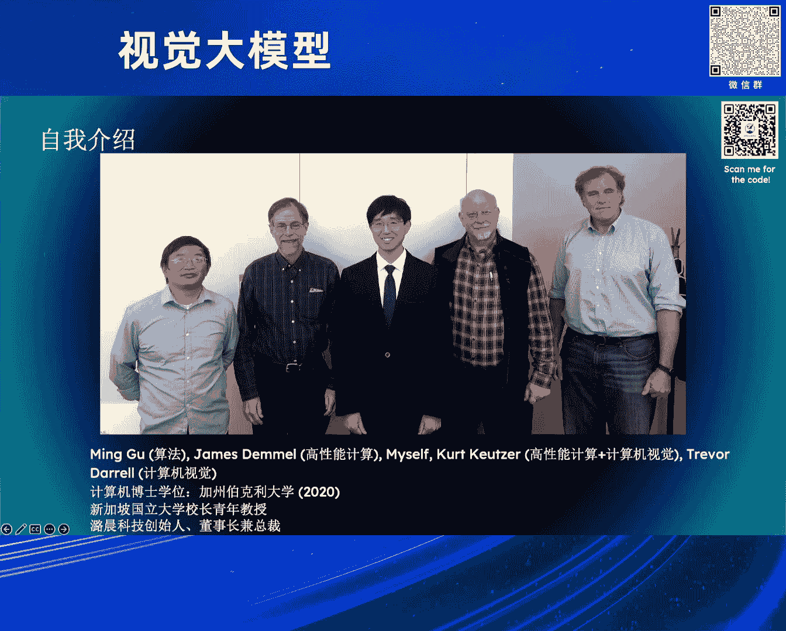

先简单讲一下我们今天的大纲，我会首先简单的介绍一下SORA，然后为什么我们想去做OpenSORA的项目，然后接下来是对OpenSORA的一些技术解析，然后当然就是要做到低成本高效率的训练。

当中也用到了路程科技Colossal AI的一项加速工作，最后我们会给大家展示一下我们最新版本，也就是其实是下周即将公开的V1。2版本的推理资源的测速，最后是与大家分享一下我们的模型效果。

在这边也是主要是想抛砖引玉，因为我们认为在视频生成目前其实还是处于一个非常早期的阶段，虽然市场上我们已经有了一些商业化的产品，但是要做到一个非常成熟的生成的模型还是有一段距离。

目前可能还是离不开大量的剪辑和编辑工作，希望通过我们OpenSORA的初步探索的成果，能够激发大家兴趣然后进行深入的讨论。

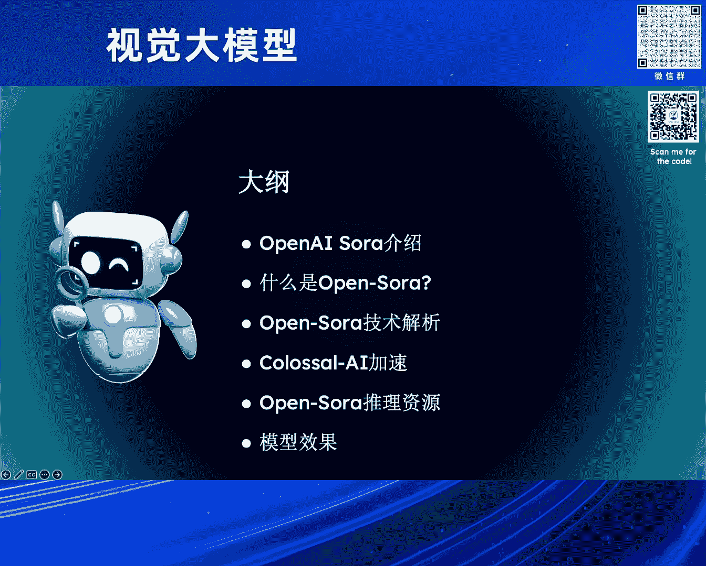

首先我简单介绍一下OpenSORA，我相信在座的各位对OpenSORA都已经非常熟悉了。

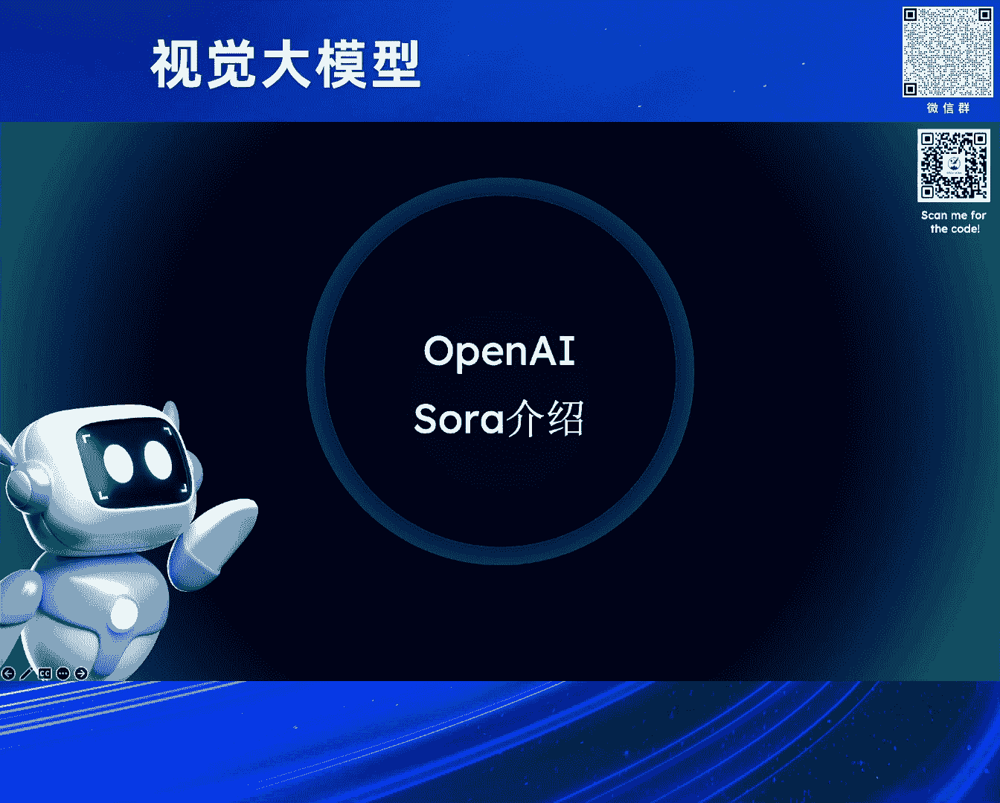

它是一个OpenAI开发的生成式文本到视频生成的模型。

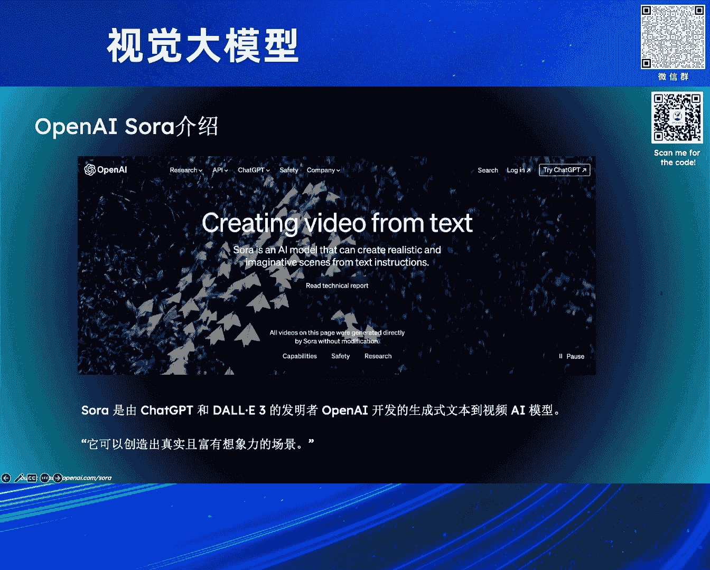

其实在它之前的话市场上已经有了一些模型，比如说RunwayML， Pica， StableVideo，但是在OpenSORA出现以后，它从视频的生成时长甚至质量来说都已经远超当时的模型。

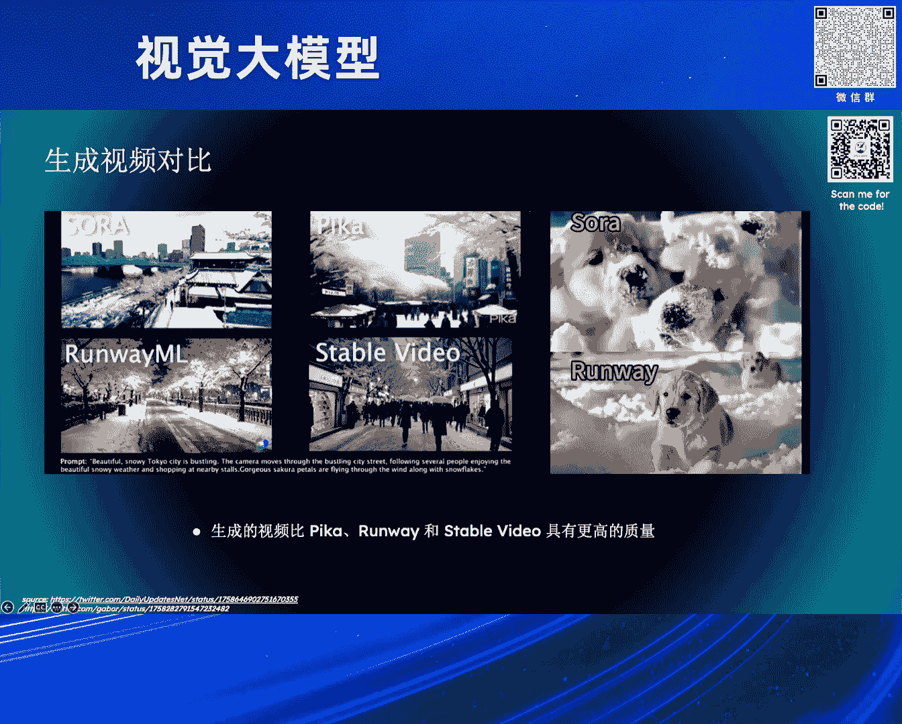

然后达到非常令人惊讶的效果，大视频模型生成的应用前景也是非常的广泛，包括到游戏、艺术、媒体制作、药物研发、广告、教育各种行业。

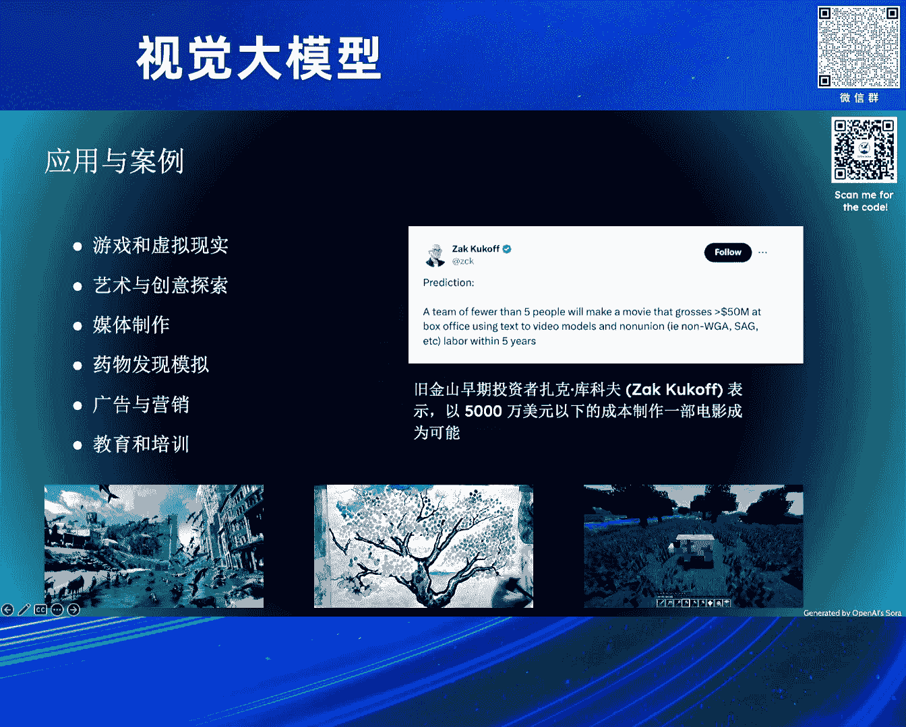

然后我们可以看幻灯片右边这张图，是扎克·库科夫在Twitter上的一则发言，就是说视频模型使我们以低成本制作电影也是成为一种可能，虽然说OpenAI的SORA效果非常好。

但是SORA目前是没有公开的版本的，一方面可能说明SORA大视频的技术并没有完全成熟，另一方面可能也是说它的使用消耗成本是非常高昂的，即使它的功能非常强大。

它封闭的特性也导致说目前我们不能对它的应用场景或者模型进行进一步的用途拓展，因此我们就开发了OpenSORA这个模型。

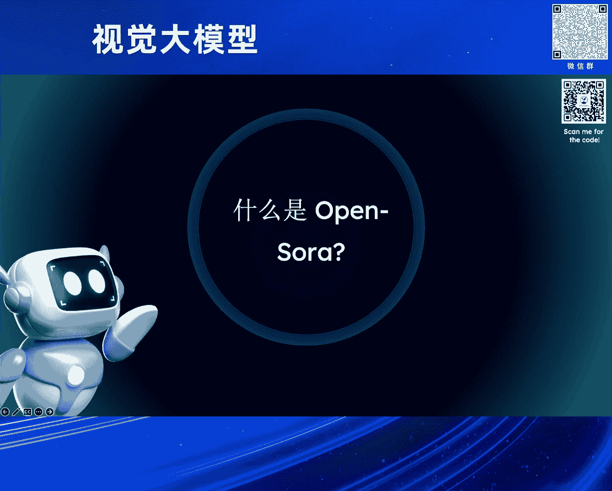

首先需要说明一点就是OpenSORA跟OpenAI的SORA它是完全不同的两个模型，然后我们做的是根据OpenAI SORA技术报告中的一些技术来做了一个类SORA的模型。

然后希望也可以帮助大家更好的理解如何去复制这样的模型，或者就是说在自己的产品中可以体验类似于SORA这样模型的效果功能。

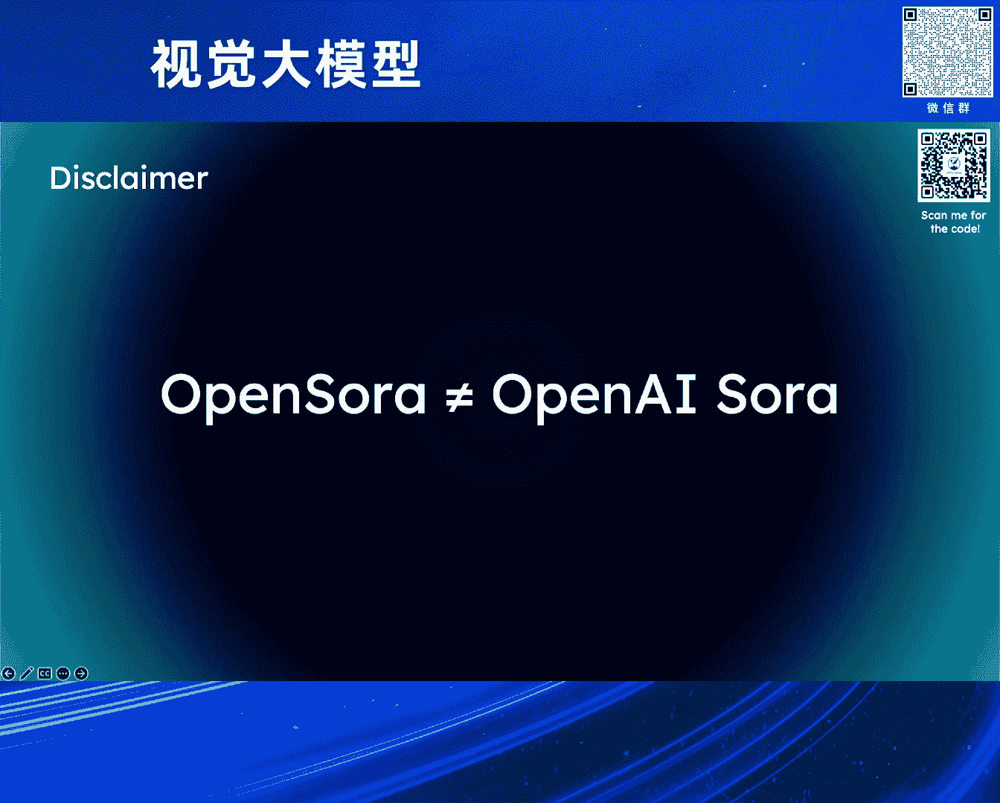

OpenSORA是首个开源的类SORA视频生成模型，然后我们主要目标就是说用低成本完全开源的方案把它的模型引入社区，我们公开了模型结构已经训练好的模型参数。

完整的训练流程我们的数据预处理流程也提供了一些视频生成的教程，方便大家可以直接使用我们的模型进行体验。

接下来我来简单的讲解一下我们OpenSORA第一个版本中用到一些技术。

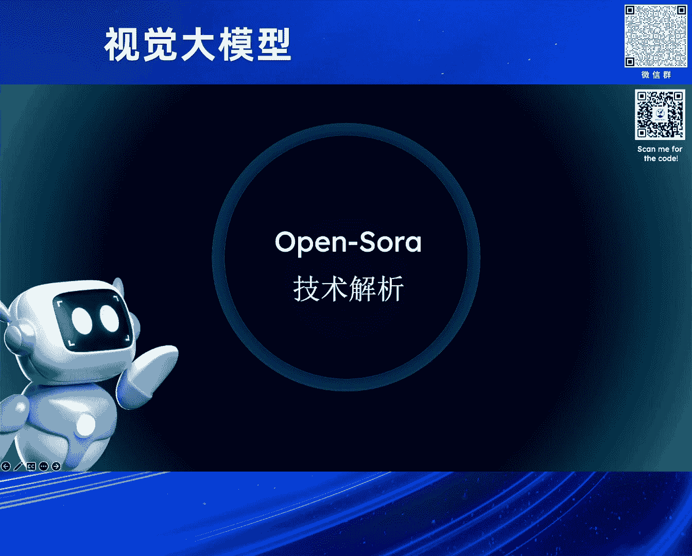

分为以下三个框架，首先我会分析一下模型的架构设计以及我们的模型的背后的原理，然后在第二就是来讲解一下我们的类SORA的训练方案，第三也是非常重要的一个部分就是数据的预处理。

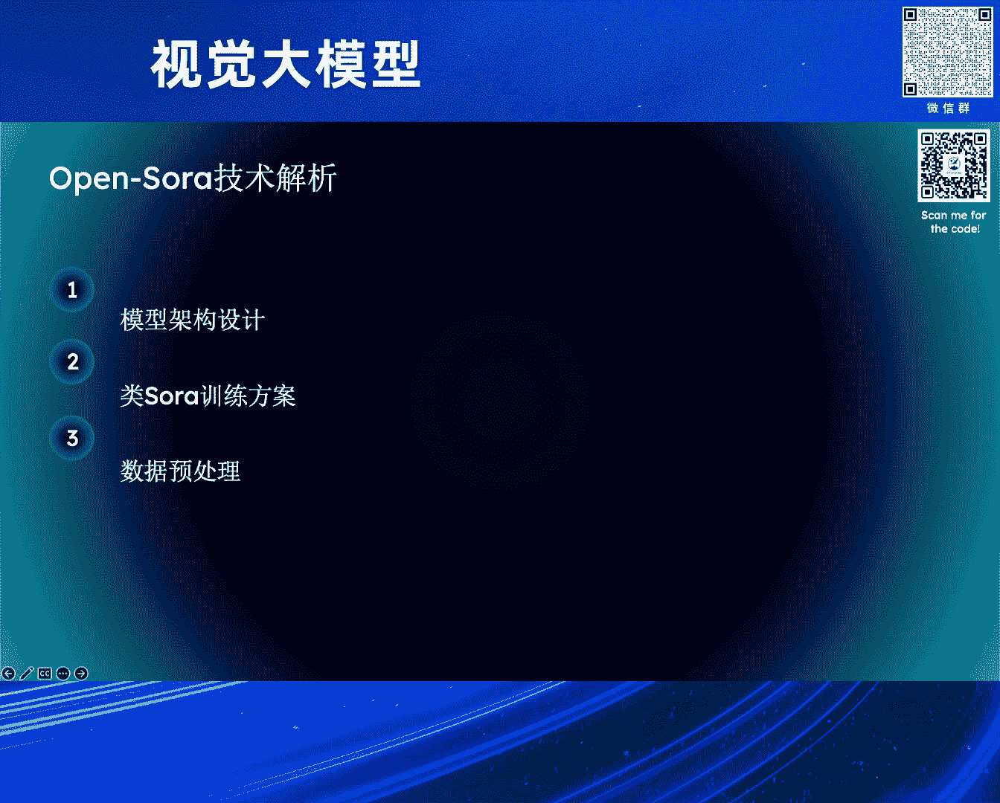

因为数据对于视频模型的训练来说是非常的重要的，那首先模型架构我们也是用了基于DIT的架构。

但我们因为需要降低这个模型训练的成本，所以我们首个版本直接用到了Pixel Alpha作为模型的初始化，那大家可以看这个幻灯片左边的这张图，是我们第一个版本的模型架构，可以看到我们除了这个。

因为Pixel Alpha它是一个纹身图的模型，但是我们在这个Spatial Attention就是空间的自主力后面多加了一层时间的自主一律机制，通过完全将空间和时间进行分开处理。

我们可以大幅度的降低这个模型的成本，那右边的这张图是我们对于DIT和我们的SDDIT的架构进行的一些测速，可以看到当这个Token数量增加，就是这个SDDIT它在吞吐量上是有非常大的优势。

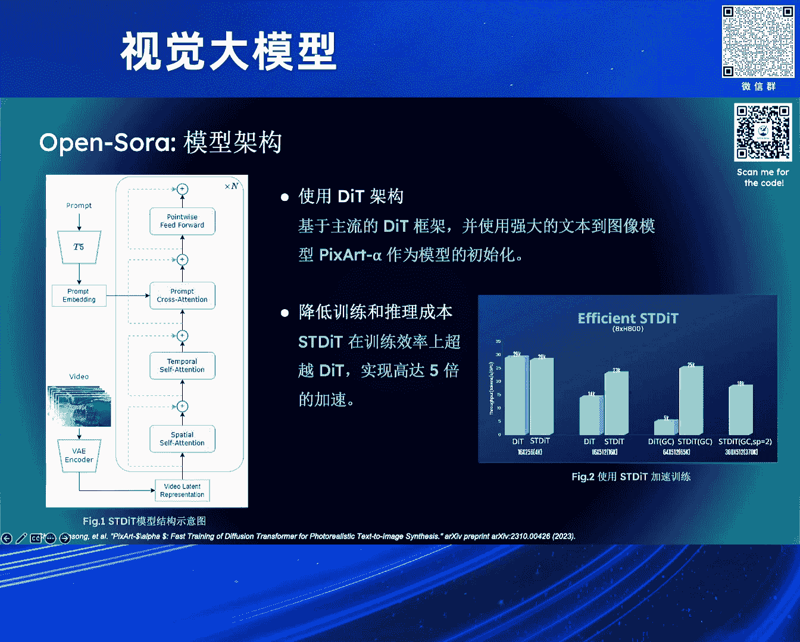

那接下来会讲一下OpenSORA的应用原理，相信大家都看过SORA的技术报告，那其实我们的原理大家应该也不会陌生，就是我们会对视频和这个文本的控制信息都会进行一个Encoder进行编码。

然后把这些编码的信息传入到SDDIT中进行训练，这个是我们的训练阶段，然后推理阶段就是和Diffusion Model非常相似，我们就是从这个编码器的潜在空间中进行随机的采样。

然后再把这个采样到的噪声输入到SDDIT中让它进行降噪，然后去噪以后这个特征再经过我们的VAE的这个解码器来生成我们最终的这个视频。

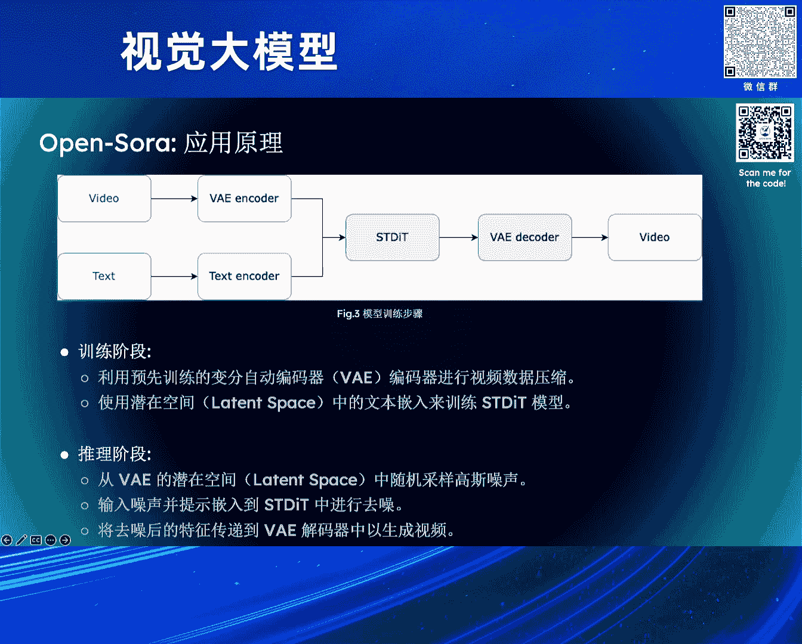

那接下来是训练细节的部分。

其实就是SORA的这个方案，他们的训练成本可能推测是在数千万到数亿美元，这个时刻其实大部分企业都没有办法参与到这个视频的模型开发中，那我们的目标是说要将成本控制在一万美元左右。

我们其实这个训练主要分为三个阶段，第一个阶段就是说大规模的图像域训练，第二个阶段是说我们进行视频的域训练，但这个阶段是说我们的视频它的分辨率会更低一些，然后可能它的质量也没有那么好。

就让模型简单的具有一个视频对视频的理解，然后第三阶段才是在进行高质量的视频数据进行微调，让模型在视频上面表现进行显著提升。

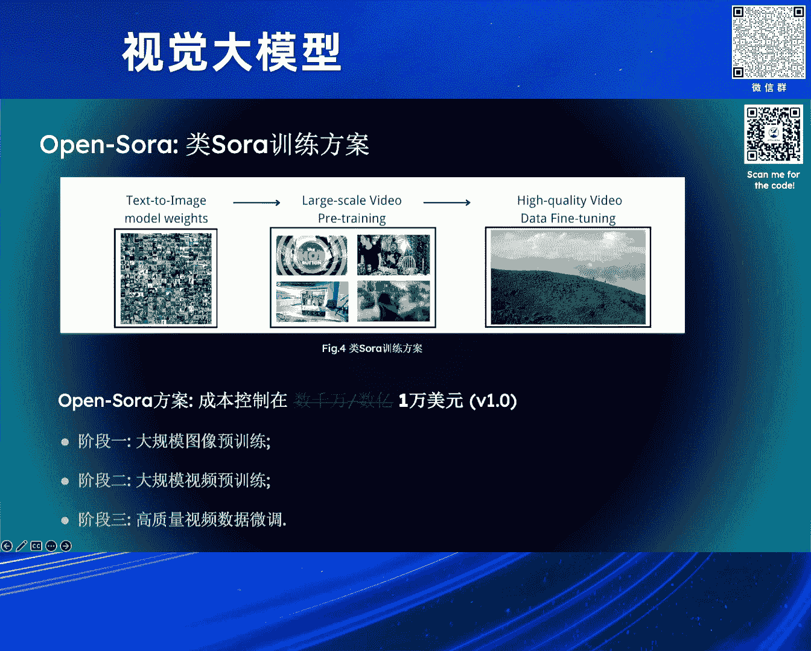

其实第一个阶段的话我们是之前也已经提到过，直接把这个已有的纹身图模型作为初始化，这样可以大大降低我们这个模型训练的成本，然后当然也是目前也是有很多不少新的工作，有不少新的纹身图的模型。

大家如果想要做这个LaySORA的开源方案的话，也是可以直接拿过来用的，然后当时是我们开完第一个版本的时候，并没有可用的高质量时空的VAE。

所以我们就是把Stable Diffusion这个空间上面的VAE，拿来直接进行使用。

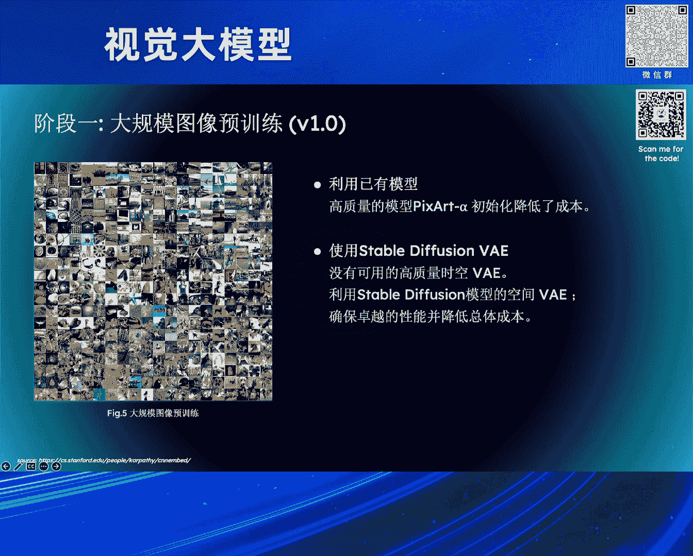

这个也帮助我们降低训练成本，然后第二个阶段就是我们在这个阶段大概，第一个版本是经过了2800多个H800的GPU小池的训练，然后成本大概在7000美金的样子。

主要就是说我们的SDDIT的架构就是引入了时间注意力的模块，那可以说就是纹身图模型呢，我们之前已经有了这个Spatial Self-Attention，它的能力假设我们可以把它看成是一个初中生的水平。

那我们新引入的这个Temporal Self-Attention，其实是需要完全从头开始训练的，它类似是一个婴儿的水平，那我们目标就是说在这个一起进行训练以后呢，让两者都可以达到大学生的水平。

然后其实我们在这个时候就是直接进行了大规模这个数据的混训，然后就是说我们发现这样子模型学习的速度还是非常的快的，然后尤其也可以看出就是说这个这种大模型它在学习上面。

就是尽管就是说它不同的框架这个能力是不太对等，但是也可以进行快速的学习达到水平的快速增长，那我们也用了多样化的数据训练来增强这个模型的泛化能力，稍后讲数据的时候我也会分享我们用到的数据集。

然后我们对于这个不同的分辨率呢也进行了优化，以达到就是说我们在有限的计算资源，可以这个情况下可以更加有效的训练我们的视频模型。

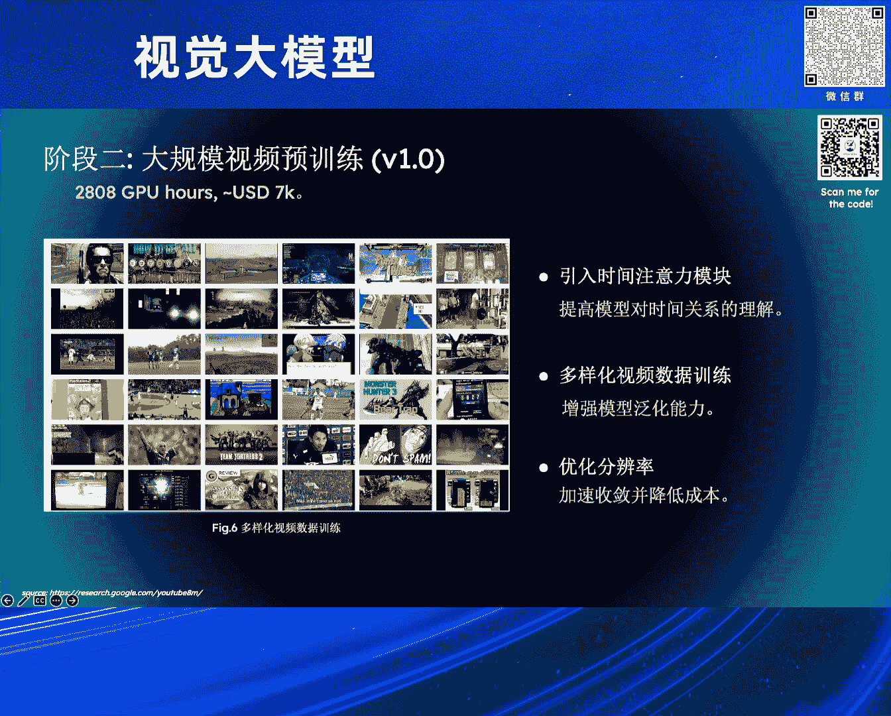

阶段三呢就是说我们用这个更高质量的视频数据进行微调，这边呢我们也用了将近2000个GPU小时的样子，然后这一步呢就是跟第二步的最主要的区别就是说，我们这个视频的质量它的这个像素以及时间都会更高更长。

然后在这一步呢我们就可以达到这个视频从短到长，从低分辨率到高分辨率，然后从低保真到高保真度的这个视频的学习，那其实我们借鉴于UL2这个技术，这个也是自然语言中一个技术。

就是说把这个Transformer的训练呢也是灵活的应用了不同的研码策略，其中可以说对比如说前K帧末尾的K帧或者其中任意的K帧进行研码，来训练我们的模型。

这样子呢也使得说我们的模型可以非常灵活的应用到不同的场景，包括就是说基于一个图像来生成一段视频，或者生成一个循环视频或者视频到视频的生成，以及就是说一些视频方面的剪辑的性能。

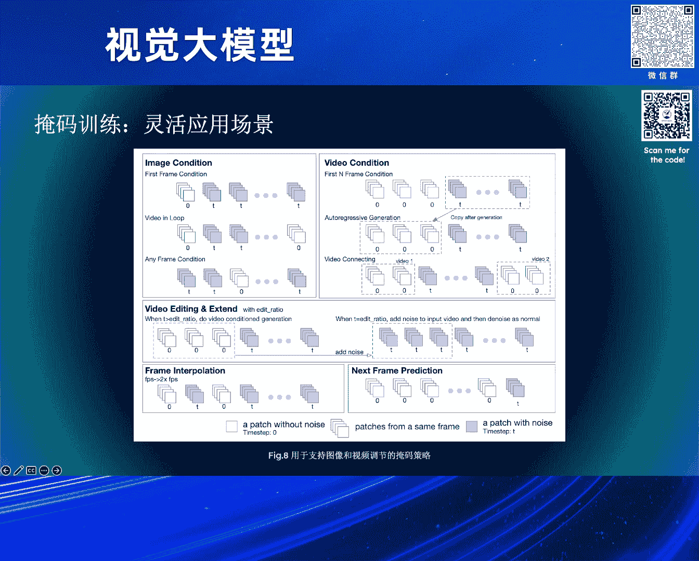

然后我们用了一个五元组，就是你可以看这个最下方这个视力就是我们五元组来定义就是不同的应用场景，就是使得我们这个在推理阶段有非常高的灵活度。

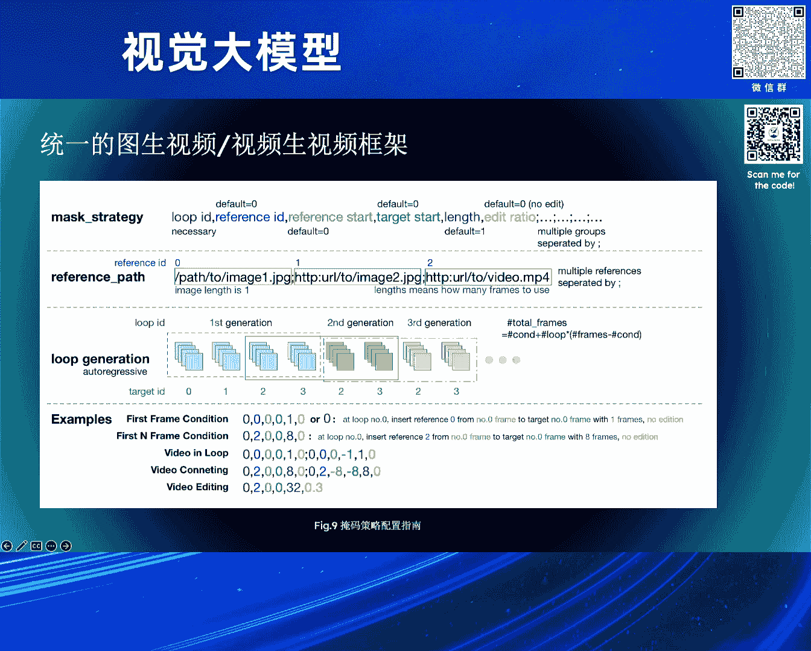

那这边呢我也再来讲一下，就是说我们如何去支持这个不同分辨率和高宽比的这个视频训练，因为SORA它的那个技术报告中提到，就是说用原视频的这个分辨率宽高比来训练呢，可以非常有效的改善这个画面构图。

因此呢我们其实用了一种分统训练的这个策略，其中就是分统主要是根据这三个，看大家看左边这边Resolution，None Frame，Expiration，就是分辨率然后视频的帧数以及它的高宽比。

来将视频进行一定概率的分类，然后我们提出两个参数就是说Key Probability，这些视频它都有一定的概率，用它的原本的这个分辨率宽高比来进行训练。

然后同时Batch Size呢也有助于我们更好的平衡，就是不同这个Resolution它的这个训练时间，来更好的利用我们这个GPU进行训练。

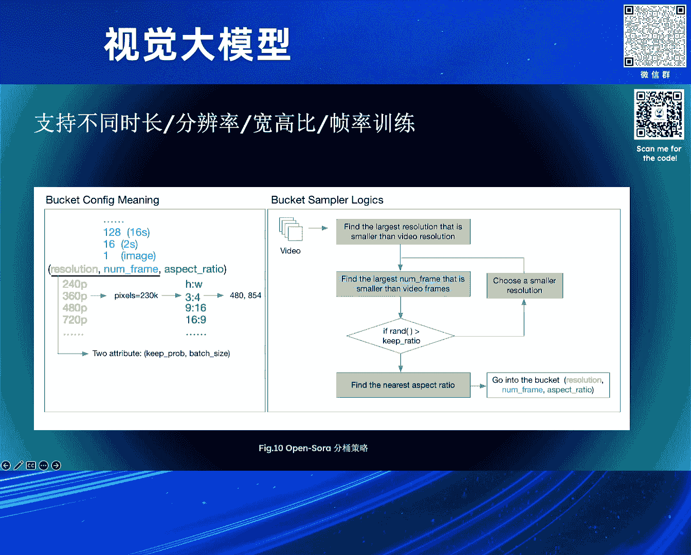

接下来第三个板块我要讲的就是我们的数据处理。

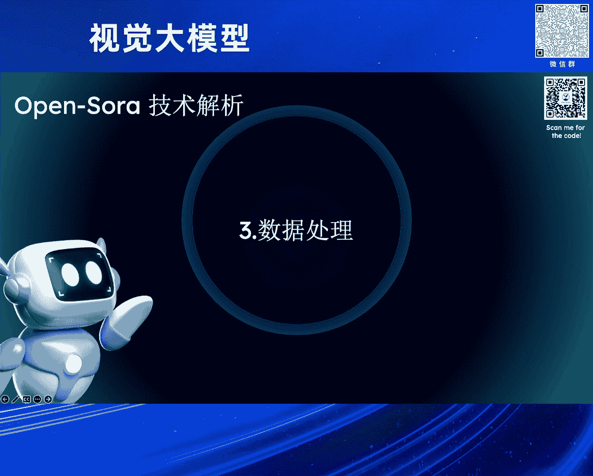

这边是我们OpenSORA这个第一个版本，所用到的一些数据集，然后其实我们的数据总量是非常的大，大概在100TB的样子，这对于我们的存储而言其实是一个非常大的挑战。

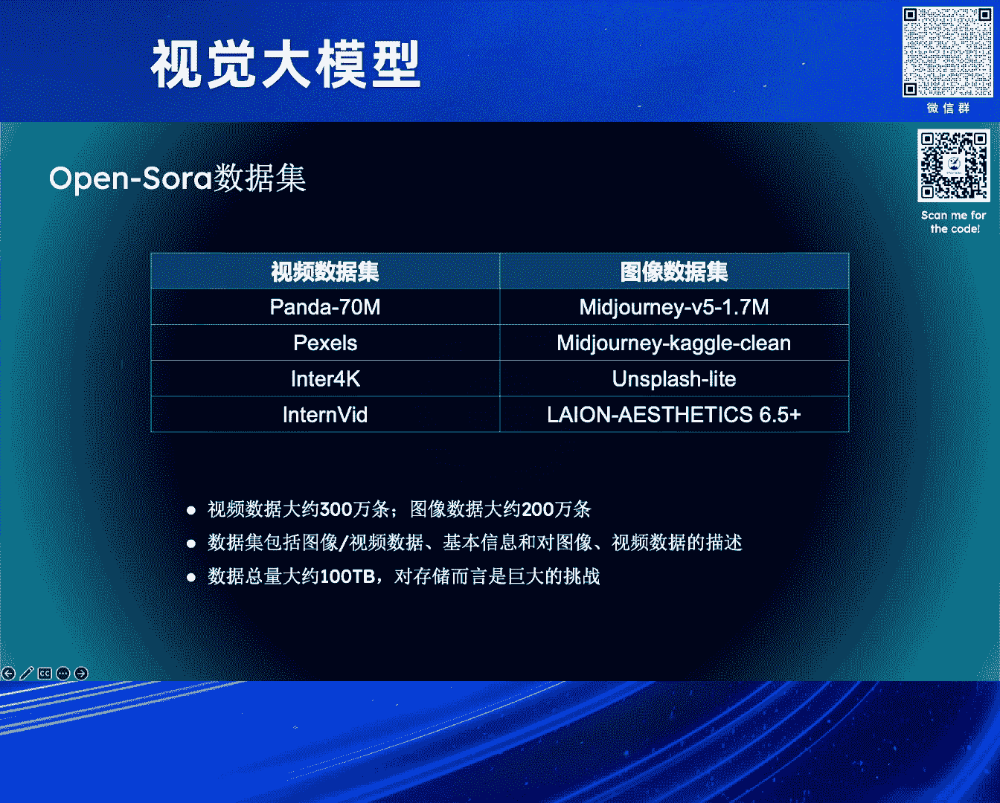

我来简单分享一下我们这个数据的收集流程，大家可以看从图的最左边，就是我们其实点是一个视频一个Video，然后我们会对这个视频的场景进行检测，把它分割成不同的这个短的视频，然后我们会对它进行美学打分。

就比如说你看这个EtherGX Go 4。5或者6。5，以及我们会对它进行这个光流分数的打分，以及视频中这个有的这个文本信息进行检测，就当这些处理就是我们都觉得它的质量令人满意之后呢。

我们才会进行下一步，也就是说对于这个视频描述进行标注，然后当有了标注呢，我们也会再进一步去看，就是我们这个视频描述的这个标注的内容，是否和视频有一个有效的对齐，然后再之后我们也会去检测这个镜头的移动。

以及一些就是那种各类的这个数据清理的流程，然后以达到说我们的训练数据，它是具有高美学分数大的镜头运动，以及这个强的语意一致性这样子的特点。

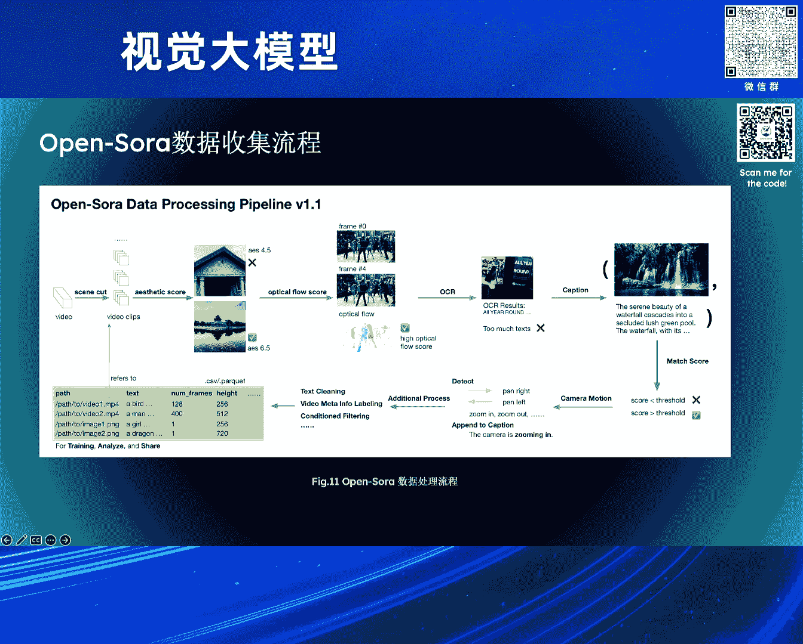

来训练出更好质量的模型，那这个对视频的这个描述的标注呢，其实openai的soron，他们是用到了GPT-4V这个模型来进行生成，但是如果我们也用这个的话，这个成本肯定是非常的高昂的。

所以我们用的是一个开源的，Lava 1。6来进行一个自动标注，然后后续的话，我们也是通过这个Match Score这个分数，来确保说我们这个生成视频描述的质量是过关的。

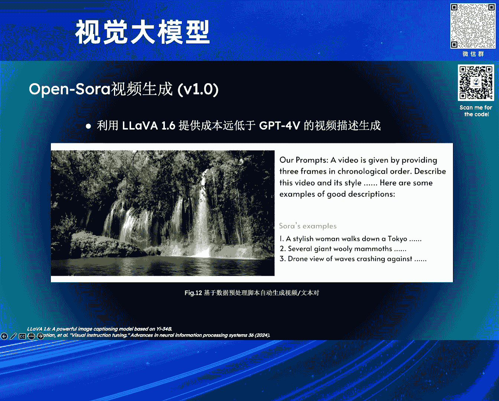

然后接下来我来分享一些我们这个数据上面遇到的挑战，其实最典型的就是这四个，就是一个是高节点负担，据说我们训练的数据可能单个数据集里面，都是上达上万条简短的这个视频文件，小文件但是数量非常的大。

就会造成这个高节点的负担，然后此外就是不断增高的需求，因为我们在快速的进行这个模型的迭代，目前我们已经开源了两个版本，然后也是将在下周开源我们的第三个，也就是Version 1。2的版本。

其实我们发现说我们这个数据的规模，在以每个月50TB的级别进行增长，然后第三点就是高性能需求，就是我们训练模型需要非常快速的去读取，这个大量的视频数据，所以我们需要这个低延迟的性能。

同时我们每训练一定的阶段，都会对这个模型的checkpoint进行一个存储，这个写入存储也是需要高带宽的这样子的性能，然后最后一点就是高切换成本，就是假设说我们在这个我们的存储。

如果想要在多云或者多机群训练场景下，进行数据同步或者数据迁移的话，因为我们这个数据量是巨大的，所以我们的时间成本也是非常的高。

那其实介绍完整体的模型算法，这个整个的流程以后呢，就是我们要考虑如何把这个成本降到最低，那其实我们如果说要去租借一台H800呢，就是每个月的成本可能会达到8万到10万人民币，那假设如果用到8台呢。

可能租金就要高达80万，所以我们如果想一次性的把实验成本尽可能的减小呢，其实我们第一个版本只用到了8台H800，64个这个GPU进行了非常短的这个训练时间，就是把速度和效率提到最高。

然后我们的这个低成本的训练。

其实离不开Cloudflow AI的这个加速的，Cloudflow AI呢也是路程的团队在高性能计算领域的一项优秀工作，它是一个专门为大规模的AI模型的训练和推理，而进行设计的一个深度学习系统。

它的目标就是说我们要最大化这个计算效率，而且最小化部署成本，就是说在不用大幅度改动就是已有的代码，其实我们只需要进行几行的代码的改变，就可以很便捷的运用到这个系统。

然后它现在大家可以看右边就是支持这个不同的平台，那它主要是分成这样子的三层，第一层就是高效内存系统，第二层是N维的并行系统，第三层就是这个低延迟的推理系统，这样我们就可以最小化我们的部署成本。

好我们先来看一下就是第一层的结构，其实我们用到的是一个易购内存的这个系统，那简单的来说就是说当模型特别大的时候呢，因为我们这个GPU内存空间非常的有限，所以我们可以灵活的利用到CPU或者硬盘中的空间。

来进行实时的这个数据交换，然后让这个单卡训练比较大的模型也成为一种可能。

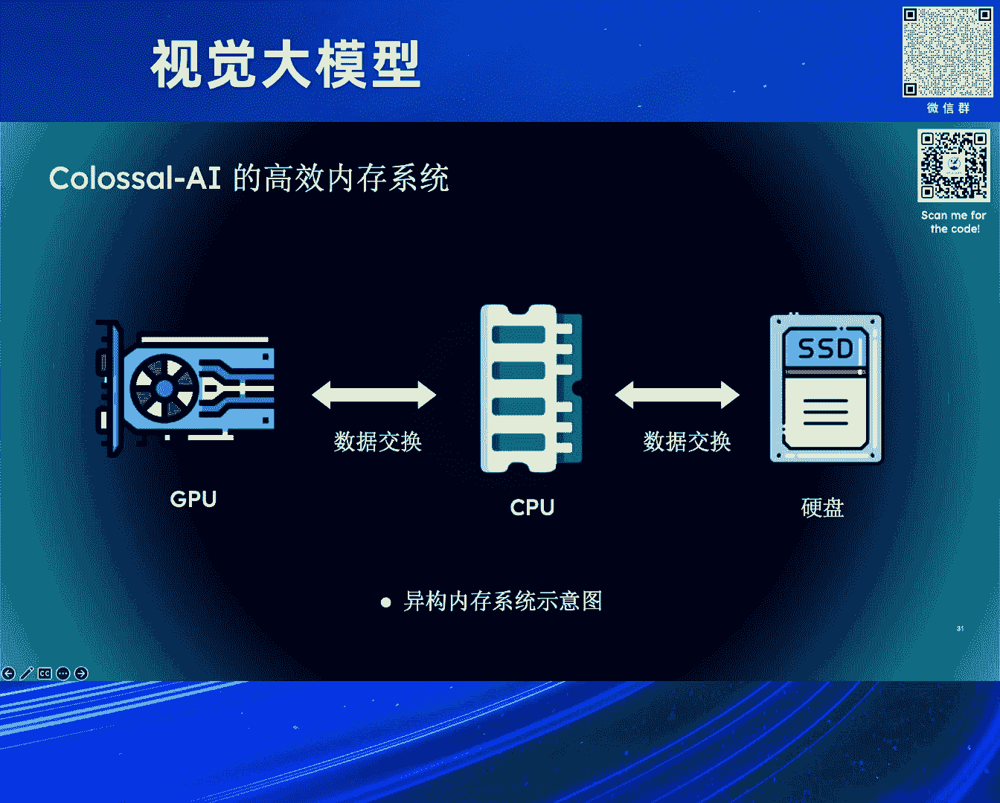

然后我们的高效训练策略呢，其中也用到了非常多的并行策略，就比如说前面的这个左边流水线并行多维张量并行，都是模型并行的一些方法，当然我们的这个多维张量其实也是有，就是对于数据的这个激活的一些优化的方法。

然后最后面的训练并行呢，其实这也是这个视频训练的一个难点吧，就是说常见的一个困难就是我们视频随着这个分辨率的增加，以及训练时长的增加，它的token数量可以达到百万级别。

那就是要如何兼容这个非常长的序列，序列在模型上进行训练呢。

可能就需要用到这个序列并行的策略，不好意思。

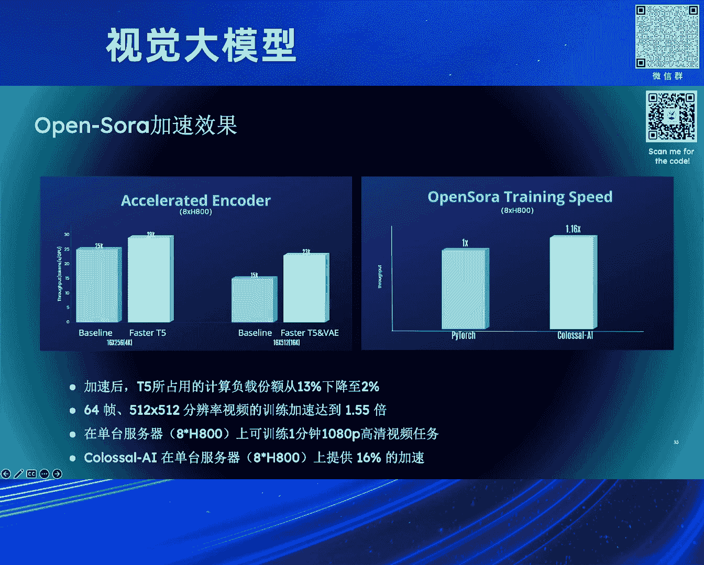

当然就是这些各种并行策略就是，大家都不用去担心，因为其实这个CloseAI的系统已经它在内部就是把这些优化都已经做好了，所以研究人员其实只需要去关注这个模型它的设计和训练就可以。

就不用关注这些分布式计算的内容。

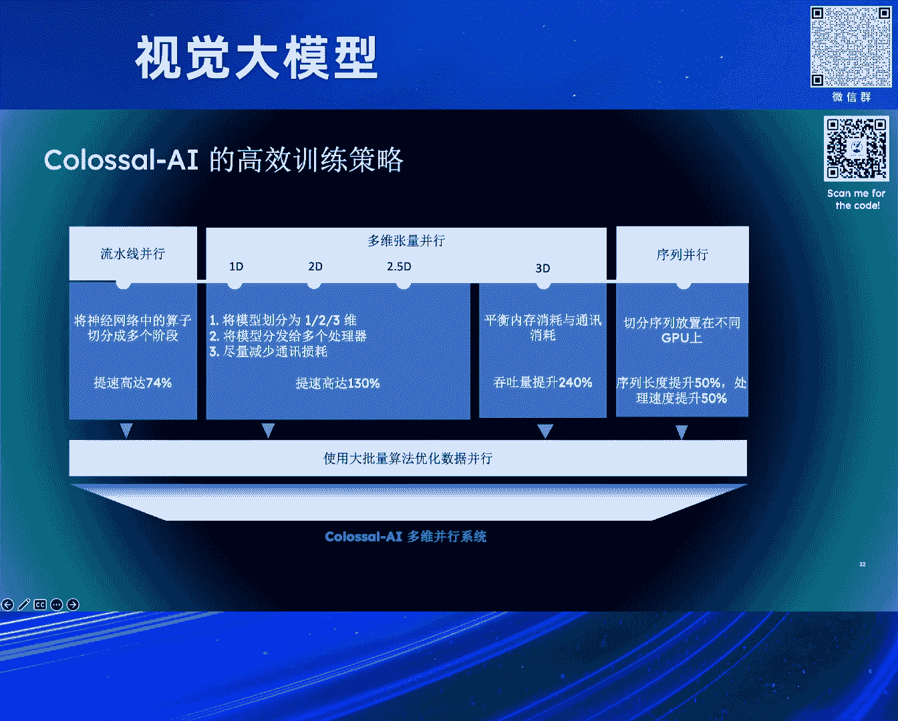

那这边是我们OpenSORA在CloseAI上面的加速效果，CloseAI其实我们这边左边的图呢，其实对我们的文本编码器和这个视频的编码器也是进行了一些加速，提升了它的吞吐量。

然后也把T5所占用的计算资源呢，进行了这个份额让它显著的下降，我们可以在这个64帧512的分辨率视频的训练，给它达到加速55%，然后在单台服务器上面也可以训练长达一分钟的高清视频。

然后这个提速也达到了16%。

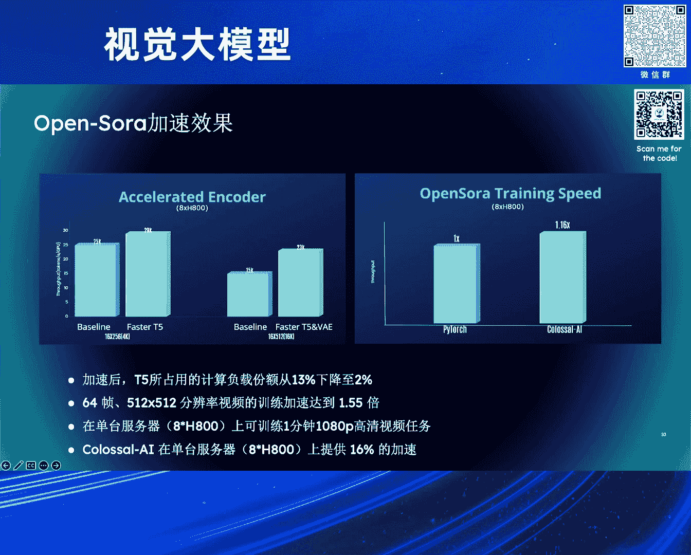

接下来想要给大家分享一下我们最新的这个V1。2版本的推理资源的测速。

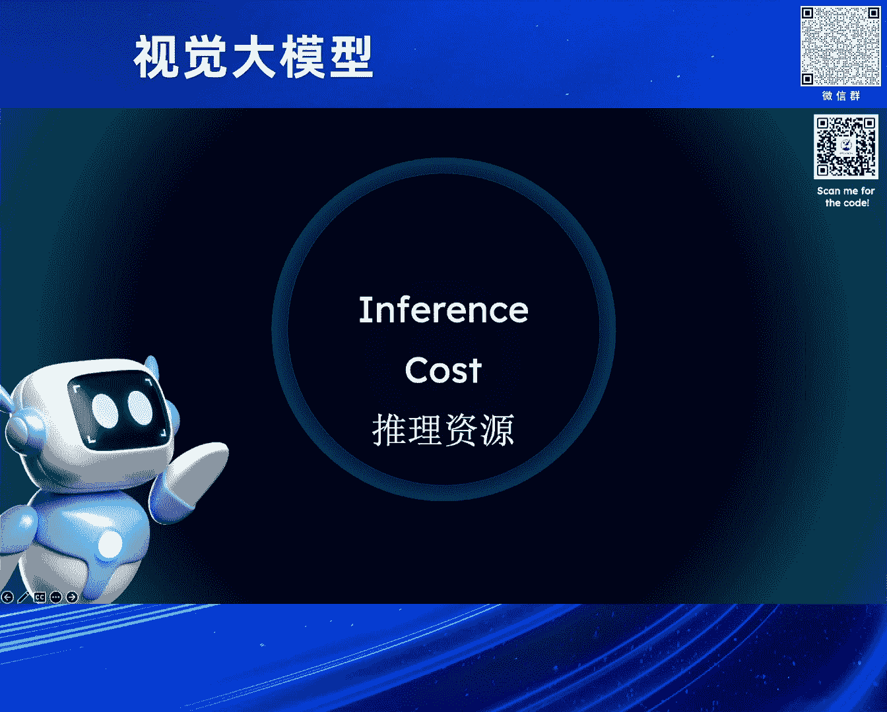

这边是我们的1。1比0大小的模型，然后如果大家看右边的这个表格，就可以看到说这个1080P高清视频，如果我们想要生成16秒的视频的话。

其实这个我们的token数量就已经达到了一个million就是百万级别的这个长度，而且这个其实已经是基于我们的VAE对于时间上已经进行压缩了，就是如果我们没有压缩的话，这个序列还会更长。

然后左边的是我们这个在单台机器上面进行推算的一个延迟，其实说这个时间还是非常的惊人的，如果大家看这个8秒最高清的这个视频生成，它甚至可以达到800秒，而这种非常长的延迟呢。

也是为这个视频投入应用带来了非常大的挑战，但是也可以看出就是说我们在相同的分辨率，这个视频生成长度的增加和这个它实际生成所需要的时间，我们自己的测试发现它其实是一个线性的关系。

然后这边是我们这个对于存储需求的测试，这个存储需求这个测验的效果。

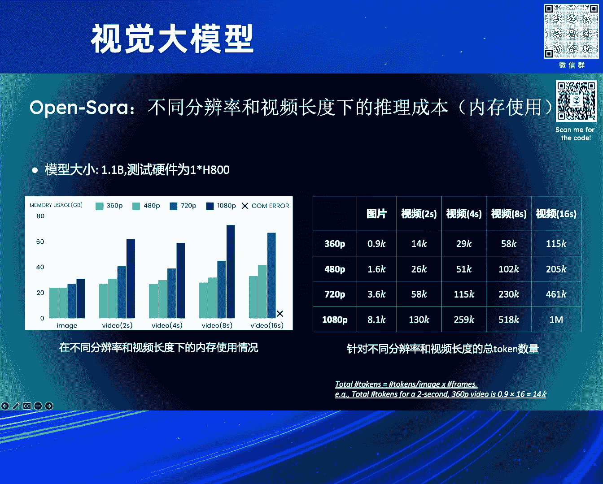

然后接下来这边呢是我们3Billion大小的模型的这个测试效果，左图是它的这个推理就是时间的延迟，而右图是它对这个存储的消耗，但是就是说随着模型的增大呢，就是如果我们用这个单单的一个H800的GPU。

需要注意一下这边其实我们测试只用到了一个H800的GPU，它其实是没有办法容纳就是我们特别高清的长时间的生成的，这也就是说我们就是在这个视频生成用到多卡并行。

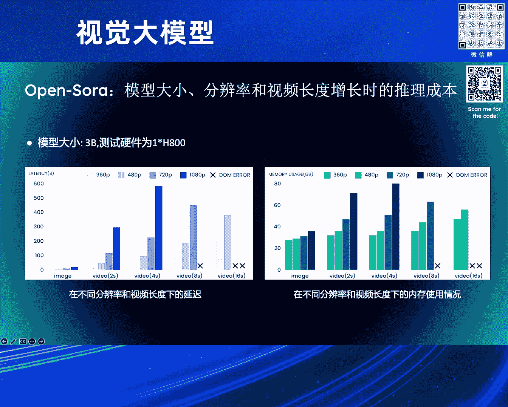

进行生成部署是非常的重要的，那有了之前的这些观察呢，其实我们这边如果就是做出一个假设，就是说我们这个视频生成的所需要花费的时间，假设与我们这个视频本身的时间长度。

它的这个Space也就是它的这个视频的像素，以及这个我们模型的参数量大小，假设它是呈线性的关系，也就是说我们之前所观察到的这些现象呢，那就是说如果我们做出这个假设。

如果OpenAI的SORA它是一个30bit的大小的模型，如果它想要生成一分钟的高清视频，那它可能需要12个小时，但是根据现在就是网上一些信息，说它生成一分钟的视频大概需要一小时到两小时之间呢。

那我们推测说它SORA这个模型参数量，很可能是在3bit到7bit之间。

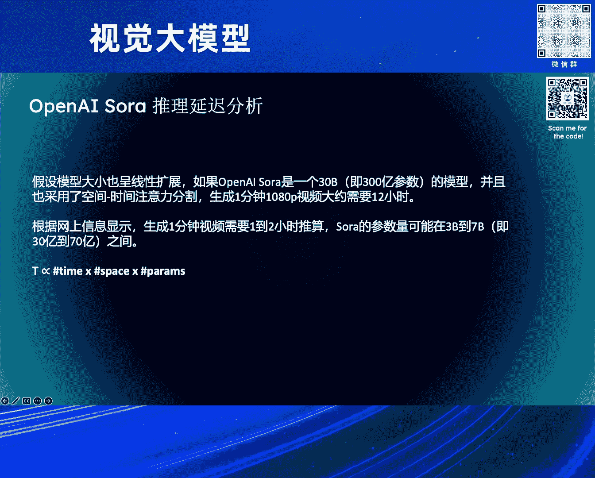

但也是在这个假设成立的前提下，好就是那接下来呢我展示一下我们的Demo，我们的Demo其实是跟这个OpenAI是没有办法去比的，那主要是以下两点原因，就是说我们是在一个低成本的条件下完成的训练。

OpenAI它使用到了大概2000到4000个H100的GPU，花费了可能将近5000万美元到2亿美元的训练成本，而我们其实用了只是不到大概1万美金这样子的一个范围的成本进行试验。

所以在这样非常有效成本下呢，就是我觉得我们取得的效果是可以接受的，而且通常说这个训练数据它的质量越高，生成的视频质量也会非常的好，我们之前采用的分阶段的训练呢，其实也是一个降低成本的一个方法。

就是说先用一些质量没有那么高，可能甚至就是这个像素也更低的这个数据进行训练，然后最后再进行高清来拉高它的这个视频生成效果，但这一套方法其实在这个自然语言大模型训练领域呢，也是已经实行多年了。

就比如说当年这个BERT的训练也是分为两个阶段，先用128个token进行生成，然后后面再把它提升到512个token来这样增强它这个模型的生成效果，OK就是说我们目前呢。

这个最新版本就是可以生成单次生成大概是20秒的视频，那其实我们针对于我们最初版本这个只能生成两秒，有了显著的提升，然后用到说如果我们视频基于之前视频生成的这个延续性生成的，可以长达数分钟。

所以OK那我们先接下来直接看一下这个演示吧。

这个是我们已经公开的最新版本的这个不同比例的生成。

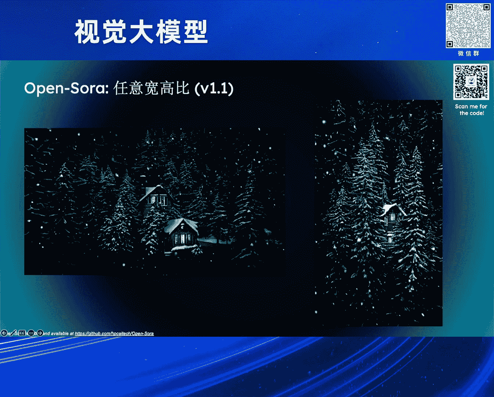

然后我们可以生成较为高的分辨率。

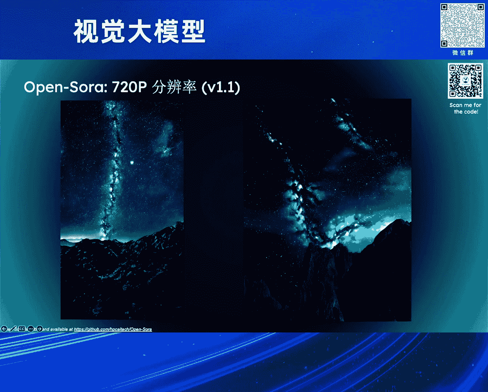

当时是可以生成720p，但这个是我们之后下周将要开源的这个模型的一些生成效果。

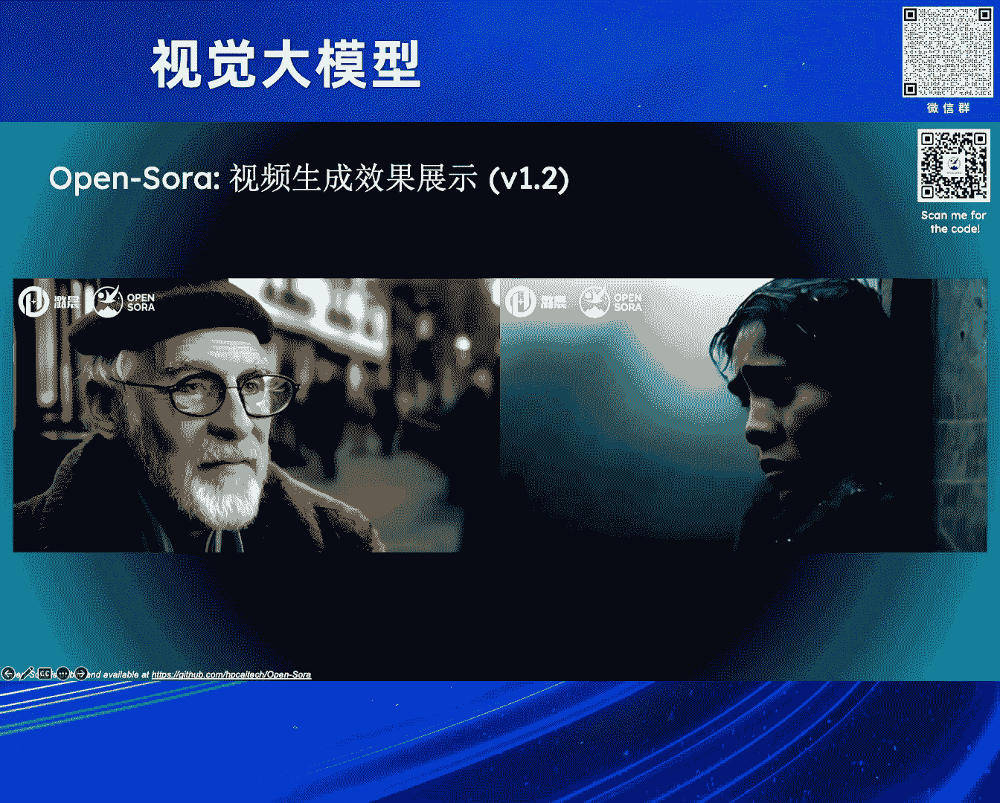

然后我们之前的模型也可以做视频编辑，然后可以基于图像来生成视频，然后当然也是可以直接进行图像的生成，那其实我们在Github上面呢，就是获得新标数量的增长也非常快，自从我们今年3月开源到目前了。

其实已经获得大概1。1万新标，用户群体遍布全球，然后这个是我们社区的一些使用案例，是我们最初的版本的一些效果，虽然只有短短的两秒，其实我觉得当时在这个低成本的前提下，效果还是不错的。

然后这个也是这个社区用户，这个一个使用案例，就是说只是经过一些简单的这个文本提示，也可以达到一定的生成效果。

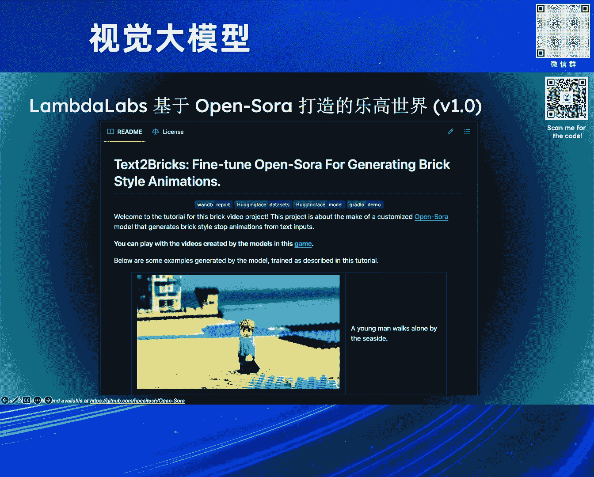

那我们的未来计划就是说，首先在模型方面，我们肯定是进一步想要增加模型的大小，来提高生成质量，然后开发这个时域的变分自编码，其实就是我们下周这个版本，应该会直接公开这个已经最新的版本投入使用。

然后接下来就是说我们的数据呢，因为我们就是之前几个版本，它在人像上面的生成质量只是不是非常的好，因为主要也是因为这方面数据的欠缺，所以目标是收集更多像这样人像数据，来完善这个生成人类相关内容的这个能力。

然后会进行更精确的美学评分，或者也是进一步的优化，来加强它这个视频的生成的强度。

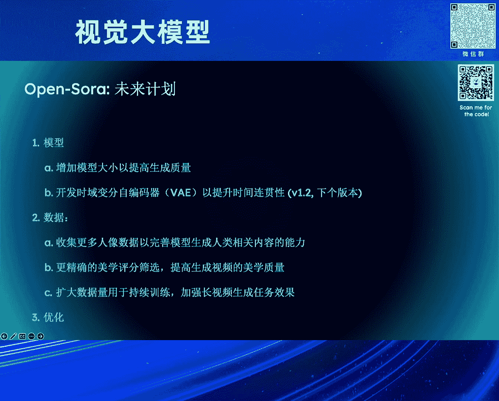

以及它的质量效果，那非常感谢大家的聆听，也欢迎大家在我们的GitHub上面自由探索，就是目前呢我们也在招聘实习生和全职人员，如果大家对这个项目或者路程感兴趣呢，也欢迎加入我们。

祝大家有快乐的一天 谢谢，好 非常感谢那个，我们再回答几个问题可以吗，非常感谢那个程慧，那么我觉得就是说，像开源的这种project的话，跟公司的project其实最大的一个差别就是说。

所有的细节都可以分享对不对 是吧，然后就是如果是企业界的话，因为其他的因素考虑的话，一般有些东西是没有办法去分享的，所以在这的话我大概给两个问题的机会吧，对 给那个话筒 最左边那个。

你好 想向您请教一下。

就是在做的过程之中，就是我们对于不同的图像，因为刚才最后您有提到说，增强人像这块的主要能力，那这个其实就是代表的是，我们对于图像内容的不一样，导致我们对于图像最后所形成出来的生成结果，是有不同差异的。

那么我们是不是有做过，针对于不同类型的图像，去做一个评估，就是从什么样的情况下，我们需要什么样的资源，在什么样的架构的成功下，我是可以去启动起这样的一个。

围绕着这种图像内容的一个skilling load的一个起点的，在这个没有来之前，比如说我5G的人像数据没有来之前，我这个实际上是没有skilling load的一点意义或者概念。

那这个实际上其实对于我们再去准备一些，专业垂直证据里头的一些图像，或者是视频的生成上面，可能会有一些指导意义，所以我就想请教一下说这个事情，在我们OpenSORA在去做这个过程之中。

有没有针对于具体的某些内容，然后对它去进行一些这种资源计算的一个评估，可以稍微简单一点，好非常感谢，就是您的问题是说我们的在数据处理方面，有没有就是对它的不同的这个数据的内容来进行分类。

来进行这样一个处理是吗，对于不同的内容进行分类，然后基于这个分类来去进行资源使用水平的评估，其实我们如果您说到这个资源使用水平的话，差别最大的其实是。

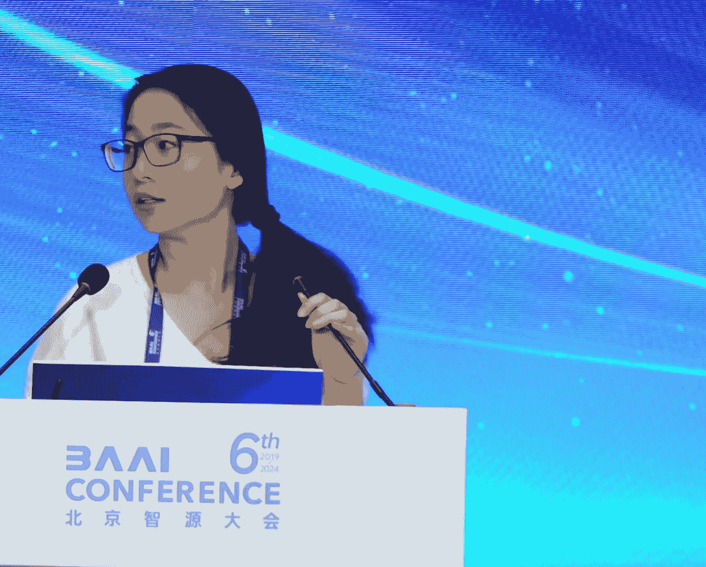

它的意思可能是不是说你把数据分成几堆，就是每一堆的话就是可能用的，就是用特用就是相当于是数据的Sampling的Ratio，是不是有一个这样的一个处理，其实数据Sampling Ratio就是我之前。

可以再分享一下我之前的slides吗，我们有一个这个数据的这个Bucketing Configuration的一个，或者我就简单讲一下，其实还是没做是吧，就直接拿着那个就直接拿这个数据就直接用了。

对就是说我们也做一些简单的处理，就是说这个根据它的这个不同的Resolution，然后会让它有一定的概率用这个，但是就是说我们用更高的Resolution的时候，我们也会耗费就是更加高的计算资源。

所以在这一方面我们是也是进行了一些测速，就是说确定说我们每一个不同的Resolution，我们会用到不同的Batch Size来说，我们训练不同的Resolution，它可以达到一个计算资源的平衡。

然后在对数据质量的评估，就是我们其实现在是一个非常笼统的一套流程，就是进行了这个美学分数，就是光流分数的这一部分的统计，因为时间问题的话我就不，等下还有Panel环节可以问。

但我觉得有个问题可能会大家比较感兴趣，就是说因为你前面的模型Train的时候，是用2D VAE Train的，但是你现在这个V1。2的时候，你是用那个就是相对于3D VAE做的。

那么这时候的话你其实你这个Continue Training，就是以前的Checkpoint的话，它就转过来的时候的话，其实它的那个就是Latent Space它就变了。

你这个地方在做Continue Training的时候，是有一些什么Trick没有，不知道我说明白没有，这个其实我来讲一下我们最新版本的，这个VAE的训练，就是直接做了一个VAE的Adaptation。

然后这个方法其实我们是受这个Pixel Sigma，这篇论文的启发，它当中就是也是做了一些实验，然后发现说这个Diffusion模型，它对这个VAE的Adaptation，其实是非常快。

然后适应性非常好的，当然就是说，所以你想把那个模型的参数那边先，比如说有一些地方先Fix住，先做一段是Adaptation是吧，就是说其实我们，比如说我们已有这个模型，然后我们新训练这个VAE。

那我们可以把这个VAE拿过去以后，做一个这个模型和VAE在一起的混训，然后让它做达到一些Adaptation，就是适应这个VAE的这个，这个它的这个效果，然后就是说因为目前。

其实我们也没有太多的这个计算资源，去做很多的试验，所以我们的这个策略，其实也是基于说，对于一些论文它提出的方法，就觉得可能不错，然后就直接投入到我们的训练当中。

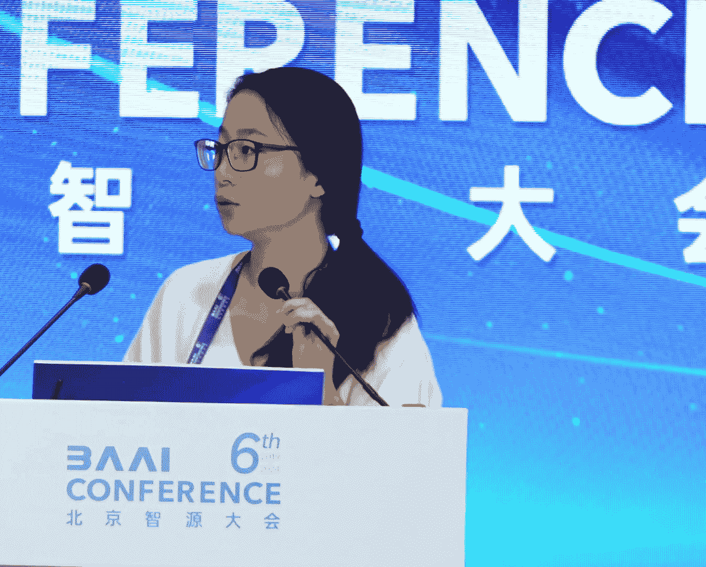

OK 这可能是一个非常关键的一个细节，好 那我们再次感谢春慧，好吧，好 谢谢，谢谢，好。