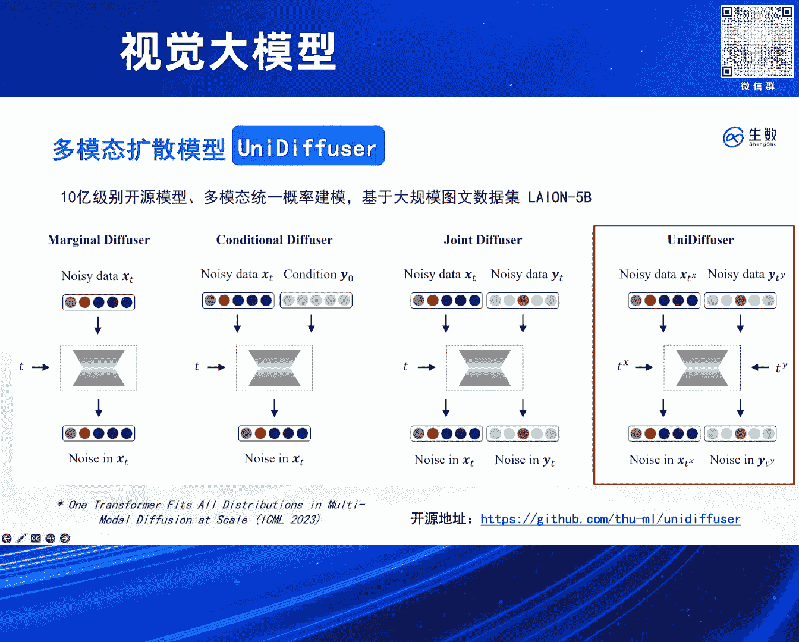
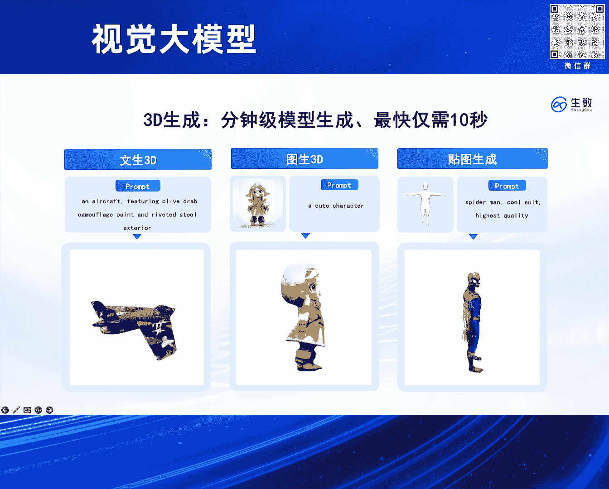
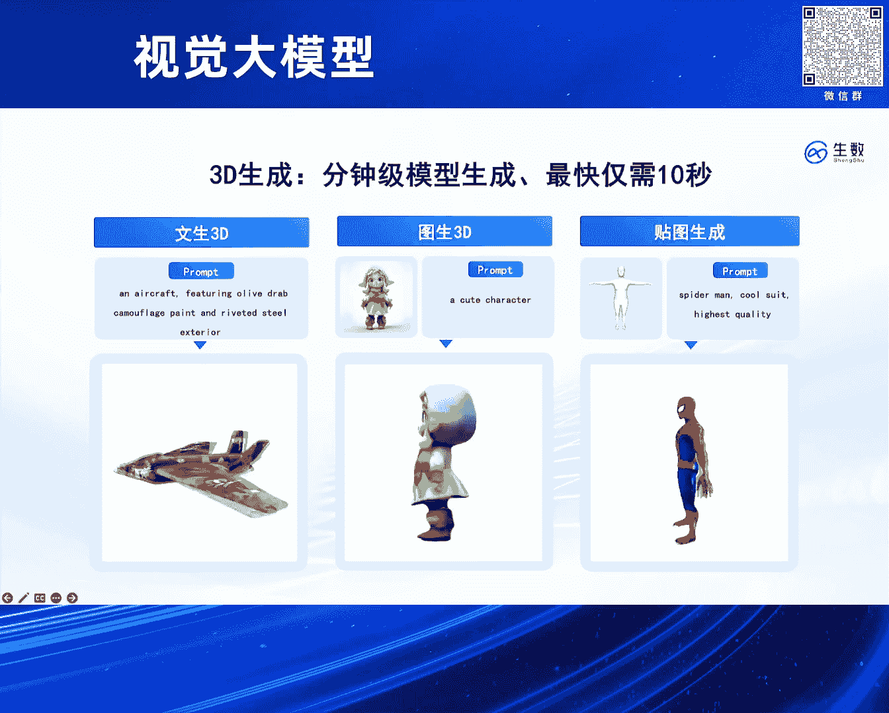

# 2024北京智源大会-视觉大模型 - P3：高保真 4D 重构模型 Vidu4D：鲍 凡 - 智源社区 - BV13x4y1t7sb

(掌声)。

大家好。

今天和大家分享一下咱们生成式AI的一些实践，特别是我们视频大模型V2，在这种4D上面的一个生成的潜力，对 然后介绍一下我自己，我是生数科技的抱凡，还是先从这个V2的一个整体的技术路线开始讲吧。

就从它的一个比较底层的架构开始，当时我们是在两年前左右吧，可能两年前4月份开始做这个UVIT的架构，它应该是比这个OpenAI Solar后面DIT还要更早发表一些，大概是比它早发表三个月左右吧。

然后它其实也是一个扩散模型和Transformer融合的一个架构，对 它类似就是把，也是那种一致的思路，就把这个图像打成Patch，然后Patch加造。

然后再用Transformer去对这个Patch做一个去造，对 然后我们的架构其实是一个非常简洁的架构，因为你可以看到，它是把所有的输入都给统一化成一个Token。

就是无论是扩散模型里面的这个条件condition，还说扩散模型里面它这个独有的时间timeT，我们都把它不做区分对待，就统一处理成这个Token。

然后把它们就一起拼起来送到这个Transformer里面去，对 这其实对Transformer的架构几乎不需要任何改变，就是如果大家翻DIT热文可以看到，它对Transformer里面还是做了不少的。

针对扩散模型的一些特殊的设计的，比方说那种在把各个参数变得跟时间相关，就是一个叫做Adaptive Latent Numerization的设计，但在我们架构里面这些通通都没有。

所以基本上你随便拿一个Transformer，就可以在很快的时间把它转换成一个Diffusion Transformer，然后并且我们实验表明就是这种非常简洁的设计，它的效果其实也是非常好的。

然后值得一提的是就是我们也加入了一些这种独特的设计，比方说这种长连接，就是它把这种底层的Broke和这种高层的Broke，做一个这种跨层的连接，然后使得它训练上能有更快的收点。

这在我们大量的实验里面都是被验证有效的，对 然后在做V2之前的话，其实我们已经有了一些大规模的尝试了，在去年1月份左右我们，发表这个UV Diffuser这个工作，然后它是一个11舱数量的模型。

然后当时是想把这个UVIT架构，然后去做成这么一个多模态的一个统一的一个生成式建模，它大概能做，就它用一个模型，用一个扩散模型，然后可以处理同时处理若干个不同任务，比方说你有这个文本和图像的模态。

然后在它们上进行一个训练之后，然后这个模型就能完成，这样一个模态之间的任意变化，以及说这样一个模态的独立的生成，或者说是联合的生成，值得一提的是。

这个架构呢我们只对扩散模型本身的这种Formulation，做一些最小的改动，其实就是从一个大模态的输入，变成双模态的输入，然后从大模态的时间T，把它拓展成这种双模态的时间T。

并且同时预测这样一个模态上面的噪声，然后也刚刚好就是UVIT非常适合处理这种任务，因为它其实已经把这种所有的输入都统一成了序列，对 然后当时这个架构的话。

基本上是能够对标Stable Diffusion，然后无论是这个数据量，还说这个模型的参数量上，并且也验证了这种，应该说是首次验证吧，这种纯Transformer的一个Diffusion。

能够有非常好的图像生成的效果，这比就是SORA，或者说最近开源的Pixel Art，都要更早一些，对 然后我们也可以看一下就是，把这Union Diffuser架构去。

进一步在更高质量的数据上去学习的一些效果，它也可以支持多分辨率的生成，无论是竖平还是横平，然后这种美学多元的风格，它都能非常好的这么一个掌握，所以它其实也是在工业界。

在实验中被充分认真有效的这么一个架构，对 然后并且这种架构其实也可以有非常好的语义理解能力，就是它能够把这个SolidPrompt里面的每一个细节都刻画到，对 然后基于这种架构的话就是。

它可以在上面去搭一些3D的东西，比方说这种纹身3D 图人3D和这种贴图生成，然后它们来说是，相对于是一个Pipeline里面的两个环节吧，比方说在这种扩散模型基础上，用一些那种VSD那种帧流技术。

然后可以从这个模型里面去帧流出一些这种3D的表示，对 然后在后面的话其实。

除了这种图像的模态。

我们也做了挺多一些3D和4D的工作，比方说这个的话就是你给任意的一段真实的视频。

你可以把里面这种物体的一个4D的表示提出来，然后你可以在这个4D表示的基础上对它做任意的编辑，其实就等效的，我们就对这个段输入视频做了一些非常精确可控的一些编辑。

比方说把视频里面的主体换成一些别的小动物之类的。

把这个猫也可以做这种任意的编辑，比方把它变成带红色帽子的一个小狗或北极熊之类的，然后并且也可以，因为它是一个4D的表示，所以你可以从任意的角度对它做这么一个渲染，除了这种4D的这种物体的编辑。

然后我们对这种场景的编辑也是可以支持的非常好，它是把3D的场景用Gaussian Spreading这个表示，对来进行一个表示，然后它有非常好的这种可编辑性，然后你可以在场景里面给它添加任意的物体。

或者说删除任意的物体这些都是可以做的，比方这个case里面我们就可以在桌子上给它添加一个花瓶，然后其实它背后都是这个Gaussian Spreading的这种3D的表示。

可以看到我们在这个生成式建模上还是有比较充足的耕耘的，无论是从这个底层的基础理论上，比方说我们一些关于基础理论的工作，入选过这种杰出论文奖，或者说被OpenAI的一些项目。

以及说Stable Diffusion这种项目被采用，然后后面的一些这种关于网络架构的一些工作，然后再到后面这种大规模工程落地实践，我们都有一些比较深厚的基础。

然后这些之前基础也就是支撑我们可以做后面这个V2这个工作，然后它是关于这种底层的理论，以及说网络架构，以及说这种工程实践和数据的一个共同的这么一个场处吧，对 然后大家可以看一下。

就是我们V2在最近也是能够支持到32秒的视频，然后它也是完全从头的这么单次的生成，它就是基于一个Diffusion Transformer，然后一次性的把这个32秒视频给它生成出来。

对 然后其实我们可以在这个生成的视频的基础上，再给它加上这种Audio模式，就比方说你通过Video，然后去做一个Video to Audio，或者说从Text to Audio。

然后你可以给这个视频就是做一个比较自然的配音，当然我们现在这管线还是多出来的，就我们后面也会探索就是，这种一次性的视频和音频的这种联合的生成，这种时候可能它就生成出来的音效。

会比现在还要更加自然 更加符合这个场景一些。

包括这种在画室里面的船，对，然后这个例子大家应该也都挺熟悉的，就是OpenAI它也展示过这个开车例子，然后我们可以进一步的在这个例子基础上，把这个背景音 然后和这个汽车的轰鸣声音。

都通过这个Video to Audio，或者说Text to Audio的方式给它补充上，还有这个也是OpenAI展示的，那个在管理的一堆电视机的例子，对 然后我们在最后再提一下这个。

比方说我们有这么一个V2的高质量的视频模型之后，我们后面能进一步做一些什么事情，对 就视频生成模型，它其实有这种大量的真实的想象力，然后其实它可以进一步的去增强这种，3D 4D重建的一致性。

有着这么一种作为世界模拟器的潜力。

对 这个地方我们想解决一个什么问题呢，就是我们给定了一个生成视频之后，我们想把整段视频里面的这么一个3D的表示，给它提示出来，那实际上这种带有持续信息的3D表示，它其实就是可以被称为一个4D。

因为就3D的表示再加上一个持续的维度，它就被叫做4D，然后类似于这种NERF的重构吧，我们是希望给定一段视频之后，把里面这种带有持续的3D也给它提取出来，对 然后在这个工作里面的话。

就是它有这么一个核心的技术吧，叫做动态高斯曲面DGS，怎么理解这个事情呢，就首先我们要去对这种4D的表示，做一个良好的建模，就是一种比较粗糙的方法，就是你每一帧你都可以给它一个3D的表示。

那这样子显然是一个比较低效的做法，这意味着你每一帧的3D表示都是独立的，那所以的话其实对于这种连续视频背后的这种3D表示，我们可以通过对于首帧的这么一个3D表示。

以及说再加后面每一帧的这个3D的一个变化量，去代表这么一个4D的表示，那这个变化量的话，在这个场景下面就叫做warping，可以这么直观理解吧，就是你对这个3D的表示做一些扭曲，比方说你右下角那只猫。

然后它在时间中它做了一些方向的转换，那其实我们是可以把这些转换这种变化量，用这么一种空间扭曲去做一个表示，然后这种空间的扭曲在这里就被称作warping这个事情，然后这个4D的这个重构技术。

它其实跟3D也比较类似，它分为 它有一个最基本的这种重构的Raws，这个Raws其实就是可以类比为这种Nerve里面，对于这种基于这种像素的一个重构，然后它这个里面其实就是对于视频里面。

每个点像素的这么一个重构，就是说你先从这个4D的表示，然后通过体渲染去渲染出这么一个预测的视频吧，然后再把这个预测视频和ground truth的视频，去做一个这种回归的Raws，然后这是一个Raws。

然后另外一个Raws的话，你是要去做这种一些关于这个表示的正则化Raws，就是你希望这个表示能够，4D的表示能够有一些平滑的性质，有一些这种，比方说它在时间上有这种连续，也就是说在空间上有这种。

被分布在表面上的这种平滑性质，所以它需要一个额外的正则化Raws，那这个正则化Raws的话，它是通过那种，你可以这么理解它，这个Raws的效果就促进它能够达到这种，把这种3D的高显的这个点。

然后被比较均匀光滑地分布在，某一个物体的表面，这就是这个工作里面所提出的，两个比较重要的Raws，然后基于这两个Raws，我们可以对这种3D的视频，做这么一个重构，比方说这个左上角呢。

它其实就是一个4D的表示的，就是它有一个输入是一个3D的视频，它有个输入是一个V2生成的视频。

然后这个V2生成的视频呢，我们可以把它提出这种4D的表示。

就是左下角里面这个，可以看到这个几何的这么一个变化的几何。

它其实就是那4D的表示，然后通过这4D的表示呢。

我们可以把它渲染成上面的，左上角这个猫，然后其实进一步的呢。

我们可以对这4D去做任意的一些编辑，就是这编辑呢。

你可以放到这种游戏引擎里面，去做一些手动的操作，比方说把它一只耳朵给它弄大一些。

比方说这眼睛弄大一些，然后它其实都可以。

后面可以进一步的去做渲染，然后渲染出一些，你所需要的一些新的形态。

对 这是一些更多的例子，所以就是我们从这个V2 4D，这个工作里面看到，就是这种视频大模型，有非常深刻的，这种作为一个世界模型的这么一个潜力，我们真的可能把这个世界上的，各种物理规律都给模拟出来。

然后可能后续再结合上一些，3D或者4D的技术，然后把这些具体物理规律，给它提取出相关的一些表示，对 然后，也介绍一些关于公司的一些东西吧，就是我们在这个多模态大模型上，有比较深厚的基础。

应该说是对现在所有主流模态，都有这种全面的底层的，全上自然的技术，无论是图像还是视频还是3D，然后从这个基本理论到网络架构，到后面的这种工程优化到数据上，都有一些自己的独门经验在里面。

对 然后也欢迎大家来关注我们，这是我们的一个图像的平台吧，然后，以及说后面我们有这么一个3D的平台，大家可以在上面去感受一些我们的技术能力，对 然后最后欢迎大家关注我们。

我们是神鼠科技 谢谢大家，好的，谢谢那个包环，我们给。

我看时间，我们可以给一个问题，这么多问题，好 那就随便来开始吧，老师您好，我想请教一下，在长期看来4D重建和4D生成有多大意义，或者说您刚才提到的模拟世界的一个建立，就是这个事情有多么的重要。

我想问一下这个点，我觉得世界模型还是一个很重要的事情，然后目前看起来它有两条路，第一条你是通过大院模型，先去把这个抽象的知识给它构建好，然后再把它拓展成一个世界模型。

然后第二条可能就是我们把这种物理规律给它构建好，然后再把它拓展成这种世界模型，然后我觉得这两条道路目前都是在探索的状态，但是我觉得它们各自都有可能成为最终世界模型的这么一个收敛的方向吧。

跟那个4D生成这个部分的关联是在哪里，我感觉这样子，就是FIDO4D相当于是把这个视频背后的4D表示都给提取了出来，对就比方说我们给这么一个场景，然后我们可以把场景里面所有人物的背后的这个。

这种3D的表示带有时序的3D表示都提取出来，然后并且呢它也是有这种时序的信息，然后基于这4D表示比方说，我们有这些4D场景之后，我们可以比方说把它放入到这种一些工业的管线里面。

这工业管线里面可能它已经在背后给你用代码制定好的一些物理的规则，然后它其实就是一个非常好的那种强化学习的场景，我们可以在这场景里面，就它其实可以提供大量这种reward的一些反馈吧。

然后在这反馈里面我们可以去训练我们的智能体，对它这种V2C它实际上提供了这么一个非常好的一个模拟的环境，就是它可以从大量的视频里面，把这种模拟的环境给它提取出来。

然后为后续在这个环境里面智能体的训练提供有意义的这种反馈信息，好的谢谢，我插一个插一个问题，我看你现在的话4D那块的话主要还是重点是在objects，对于环境的4D重建这块的话有什么计划吗。

对我们是有计划在里面的，因为对于环境的4D重建，我觉得它在短期的意义更大，比方说这种多机位的拍摄，那你可能以后只需要拍一个机位就可以了，那别的机位都可以给你重建出来，然后我们确实是有探索在里面。

然后其实也是会基于刚刚这种V2C的技术，进一步把它拓展到这种场景级别的4D重建里面去，OK好，那我们可以再来一个问题，好吧好吧可以再来两个，再来一个吧，我虽然是一个外行，但是我很受鼓舞看了这个东西。

因为我是研究骨骼的，目前骨骼除非拍片子，但是在做调整以后再让它重新卖片子，对人体伤害很大，刚才我看到你这个东西，它既然能生成给你一个图片，或者是给你一个什么素材，你能生成4D，好我现在反过来讲。

当你拍了这个人体的后背的情况，或者做一个简单的扭曲，你捕捉到这个信号以后，你倒过来你能给我，它现在的骨骼调理前后的这样一个模拟东西吗，如果能需要多久，这个实际上在这篇论文里面，已经做到这事情了。

就是它在把4D表示提出来的同时，它也可以自动地把这个骨骼给绑定上，所以这也是已经做到一个事情，(太太偷拍問題)，(太太偷拍問題)，(太太偷拍問題)，這個會不會比較難呢，因為你要真正骨骼的話。

是在肉體裡面對不對，你拍照片只能拍那個外表，估計可能這個還是有一定的gap，對對 是的，就是它這個骨骼可能是一個，不像我們真正的那種實際人體的骨骼，(太太偷拍問題)，謝謝老師 謝謝老師，好好好。

這個這個，(太太偷拍問題)，因為我也是在做醫療大模型這個領域的，就是您剛才提到的這個，好像是從中醫入手去做這個事，我覺得取決於說，現在用X光照的那個，比如說頸骨也好，或者是脊柱也好，它的那個數據數量。

如果數量在足夠多的情況下，我理解是通過它現在的這個，4D的這個模型，它是可以去做一個相應的一個預測的，也就是說，當下一次我給單個圖像之後，它最後它是不是可以有一個，360度全息的這個。

這個我覺得是可以的，但前提是有足夠的數據數量，能夠支撐到那個我們這邊，從技術角度上給它去，去進行這個模型的學習，這個其實可能是個挑戰，所以它的意思是說，還是有一張 是吧，然後的話要重建出這個谷歌的。

三維的那個結構出來，我覺得這應該是可恥可能的，好的 那我們最後一個問題，兩位，跟剛才兩位提的有點相似，我個人感覺因為我的年齡嘛，我對你4D這個定義呢有點問題，因為你這沒有一個，你現在還是視頻。

視頻看的還是圖像，就是兩維的，只是加了一個三維是時間，你所說的4D呢，那個3D呢並沒有距離的感覺，你比如說我是搞自動駕駛的，激光雷達是給你4D告訴你距離，你這裡沒有距離的信息，這就跟他剛才說的。

我測量骨頭，這有個距離的信息，我這地方長個包，它多出來了，不是樣子是怎麼樣，3D包括空間的信息，你這裡邊呢我建議你盡量，把這個4D呢用一個別的詞，否則會跟傳統的3D和4D的定義有衝突，謝謝老師的建議。

可以再來一個問題，我請問一下，其實跟前幾個問題都有一些關聯度，其實我就想問一下，目前您這邊看到的一個最大的應用場景是什麼，因為比如說谷歌也好，還是3D還是自動駕駛，但是您這邊看到的最佳的應用場景是什麼。

然後再補充一下，為什麼問這個問題，因為你從技術來講的話，我們和美國肯定還是有一定區別，但我們的優勢是應用落地，所以還是看您這個設計的當初，到底幹什麼用的，所以鮑華你這個得回答，你畢竟是公司。

如果是那個程老師的話，可以不回答這個問題，OK，我覺得我也可以回答一下吧，其實在短期內一個最直接的應用，就是這種相機多視角拍攝，就你看我們這裡有這麼多相機，它其實都是在拍攝同一個場景。

比方說我們能夠做到這種4D的重構，那它已經把這個內在表是完全給它建模出來了，那後續我們從任意一個角度去拍攝，其實都是可行的，就我們其實不需要這種多相機的，所以說VR和XR類似這種應用是吧，對 是。

就大家可能在看電視劇的時候，都會看到比方說，有一個場景是兩個人在對話，然後後面這個鏡頭又轉成了，比方說針對某一個人特寫，其實它們背後都是對應著同一個場景，那如果我們把這個場景的4D表示能夠建模出來。

那其實我們只需要有這個4D表示，那對於任意的相機角度這種拍攝，我們都能夠自動的生成出來，對 然後這會是對這種影視行業創作，帶來這種極大便利，好，因為你這個接觸比較快，我覺得可以再回答一個問題。

就是說你現在的話做這個4D這個的話，是說是把視頻重建出來了，以後的話我再在重建的時候去考慮就是說，每一幀的那個3D的那個，Gaussian Spriting之間的這種constraint，對。

然後有沒有可能就是直接就從書，就從文本的這個書，condition的書直接就能生成，就是直接生成這個3D的，就是這種，意思就是說把3D Gaussian Spriting做了。

lateral variable是不是有可能性，對 現在實際上是有一些工作，但是用的表示還不是Gaussian Spriting，OK，就是有一些那種Nerf或者Mesh，或者一些表示。

它們確實也做了一些非常類似，Stable Diffusion的工作，就直接把那種原生的3D的表示，明白 比如說直接workshop以後的話，lateral variable，對 我們在。

其實我們在昆侖萬惟那邊的話也是這麼做的，質量還非常不錯，是的是的，行 好的，那我們再次感謝鮑懷，好吧 謝謝，謝謝大家，多謝。

