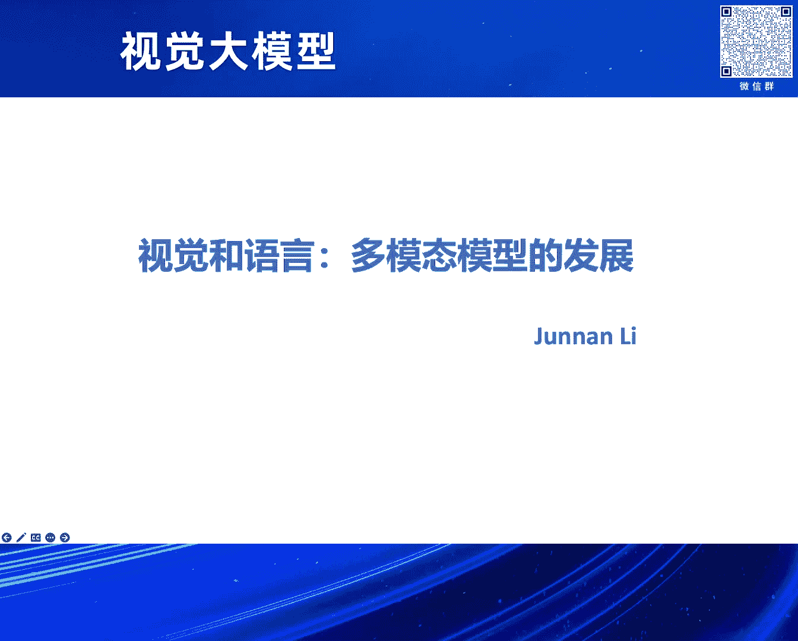
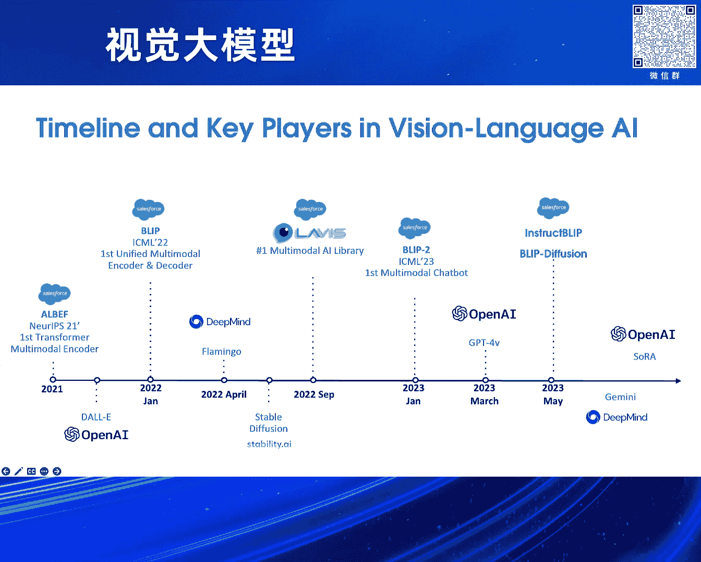
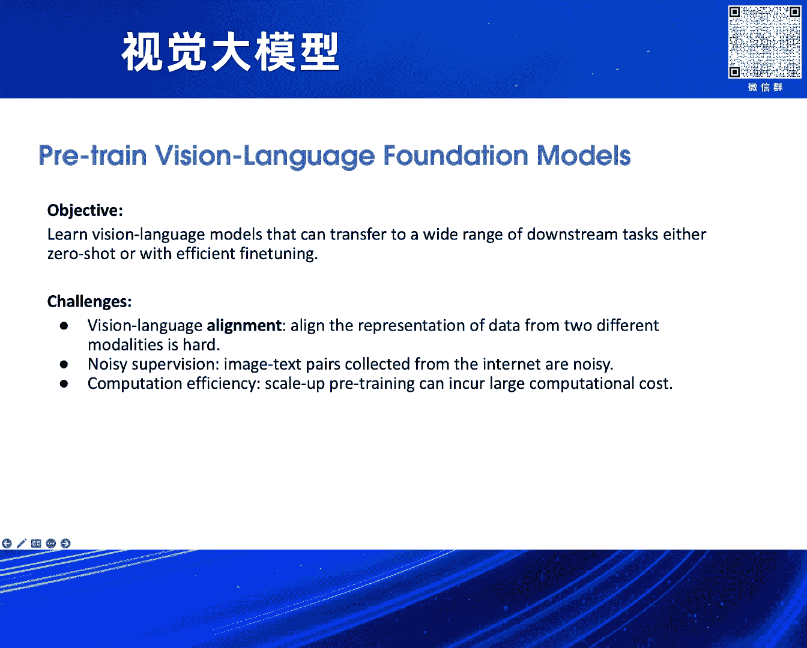
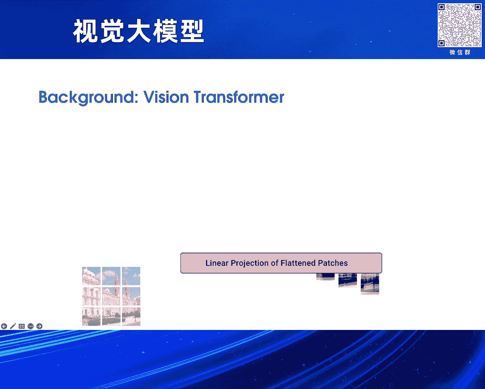
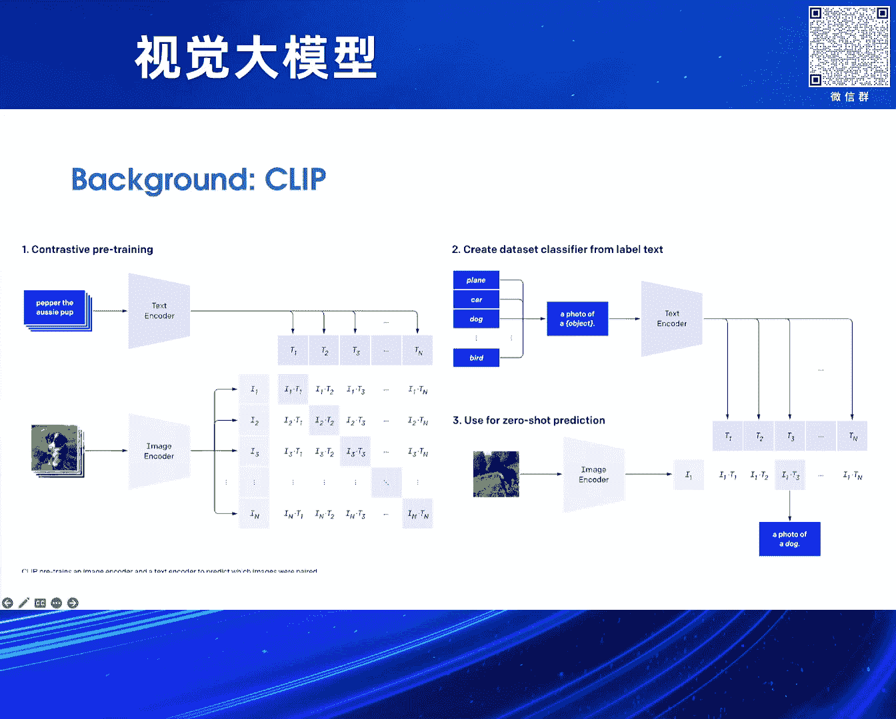
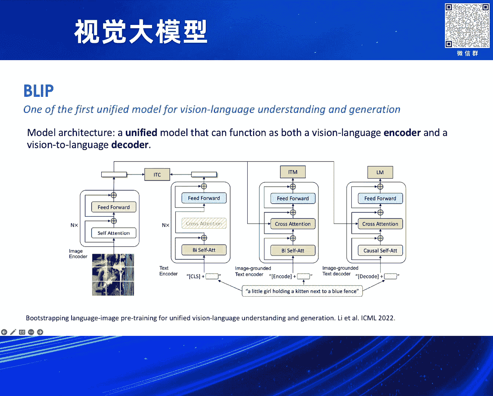

# 2024北京智源大会-视觉大模型 - P4：视觉和语言：多模态模型的发展：李俊男 - 智源社区 - BV13x4y1t7sb

好谢谢。

很高兴今天有这个机会跟大家分享一下我们的之前的一些工作，我这里列了一个大概的，大概从2021年整个多贸态大模型的一些重要的工作历史的脉络，然后这个里面有我们在Salesforce做的一些工作。

包括最早的我们做的这个LBAV是相当于第一个基于Transformer的一个多贸态的encoder，然后之后我们做了这个Bleep Series。

就是把这encoder转成了既可以做理解也可以做图像到语言的生成，然后之后我们Bleep2相当于在GB4V出来之前。

我们是第一个可以做这种Zero-Short的一个基于大语言模型的这样一个多贸态的大模型，然后其中我们还有一个Lavis这样一个开源的library。

然后再之后我们把Bleep2又扩展成了Instruct Bleep，包括我们在图像生成领域我们也基于Bleep的思路去做了一个工作叫Bleep Diffusion。

所以我今天会基于我们这个脉络去讲一下我们中间的一些工作，然后会穿插一些相关的其他的工作的一些背景，好，那我们先看一下，抱歉我这个可能大部分是用英文的，我会用中文来讲。

我们先看一下我们所谓大的多贸态的Foundation Model，它有一些什么挑战呢，首先我们要做这种Pre-training的Foundation Model的目的。

就是说我们希望这样的视觉语言的模型，它可以用非常低成本甚至Zero-Short的办法去泛化到一些其他的下游任务上面，我这里主要列了三个挑战，第一个挑战就是这个语言和视觉的对齐。

因为说这两个模态是完全不同的两种信息的信号，所以我们怎么把它们这两种不一样的数据对齐在一个模型里面是非常有挑战性的，第二个挑战是从数据层面来讲，我们经常会有这种很大量的有噪声的图片和语言的数据。

那怎么从这种数据里去有效的学习是第二个挑战，第三个是从计算资源来讲，这种Scale-up的Pre-training是非常耗费计算资源的，我们也有一些方案去解决这个问题，先介绍一下背景。

最开始的Vision Transformer也就是VIT的出现，相当于把Transformer这个Architecture领入到视觉领域，然后它通过Scaling-out实现了很好的效果。

它的基本的框架就是我们把一个图片分成这一个一个Patch，然后用Transformer去处理它，之后OpenAI又做出了这个Clip这个工作。

相当于是一个一直到现在还非常被广泛使用的一个Transformer的，Vision Encoder的框架，它的做法就是用一个叫Contrastive Learning这样一个Loss。

它会有这种Pair的图片和文本的数据，然后它通过让相似的图片和文本之间有更大的这种相似度，来预训练它的模型，然后这里我们提出了Align Before Fuse，也叫Albev这样一个工作。

它是第一个能够把图片跟文本一起Encode，在同一个空间里面的这样一个Transformer，相比于Clip，Clip它是一个单独的VIT，还有一个单独的Text的Transformer。

我们是一个更融合的这样一个结构，我们这里提出的一个概念就是，我们先希望把图片和文本做一个Alignment，然后我们再另外有一个Encoder去把它们做一个Joint，这样一个Fusion。

我们这里提出了三个Pre-training的Objective，第一个就是跟Clip相似的这样一个Contrastive Learning，它的目的就是把单独模态的图片跟文本去做一个Alignment。

然后接下来我们会把这个Feature再过一个额外的，我们叫Multi-Model Encoder里面，它会用Cross-Attention去把图片的信息，把它融合到文本里面。

这里我们提出了额外两个Loss去训练Multi-Model Encoder，第一个我们叫Image Text Matching，它是一个二分类的任务。

也就是说当你给定一个图片和文本的这样一个Pair的时候，它会去判断这个Pair是一个Positive，就是它俩是不是对应的，还是一个Negative。

然后这里我们额外有一个Hard Negative Mining的办法，就是说我们会去选非常难的这种Negative，它看起来很像，但实际上它俩并不是来自同样的一个信息源。

然后第三个Loss我们是基于BERT，改成了一个多模态的这样一种Mass Length Modeling，也就是说我们会掩盖掉一些词，然后让模型去基于图片和文本共同预测这个词。

我们在这个论文里面也理论上证明了，这三个Objective可以共同去，最大化文本跟图像之间的一个互信息，从而使得我们最后得到一个非常好的多模态的融合的效果。

接下来我们Bleep的工作是把LBAV的思路继续延伸下去，把Encoder把它改成了一个可以做文本生成的这样一个Decoder，所以我们这里叫一个Unified模型。

它既可以做Encoding也可以做Decoding，然后我们还是用同样的三个Loss，只不过最后一个Mask这个研码的Length Model。

我们把它改成了一个Auto-regressive的这样一个办法，这样它就从一个Encoder变成了可以去不断地生成下一个词的这样一个Decoder。

然后在Bleep里面我们还提出了这样一个对数据处理的办法，这个我们叫Caption and Filtering，它具体来讲就是有两个比较简单的模块组成。

第一个就是我们会去根据图片去人工的生成很多的这样一些Image Caption，然后另外我们还会有一个Filter的模型，去从你生成的Caption包括从网上原始的Caption里面。

去筛选出来质量比较高的这些，然后这两个模型其实都是可以通过我们Bleep的Loss训练得到的，所以我们可以通过这样迭代的方式去不断地迭代我们的模型和数据，实现一个不断地增强的效果。

然后我们这里还有一个比较关键的发现就是，当我们生成这种人工的Caption数据的时候，我们需要有一些Trick去保证它的多样性是足够的，因为就算它质量很高，但如果它多样性不够的话。

我们发现它对于这个模型的训练也是起不到一个很强的正面的效果，然后接下来在我们Bleep这个工作之后，Large Log Model就迎来了一波比较关键的发展，然后这个里面其中GP3就是最关键的一个模型。

它是第一个展现出来，当你用大规模的数据去训练的时候，你的模型是有一定的Zero-Short的泛化能力的，你只要用合适的这种Prompting的提示词去Prompt你的模型的话。

它就可以去解决很多你没有去Find Tune过的这种下游的任务，所以我们接下来的一个思路就是我们怎么利用这种大语言模型，去增强我们多模态模型的能力，然后我们第一篇工作其实是用了一个比较简单的办法。

我们并没有去训练这个大语言模型，我们做的是我们想看能不能直接把图像的信号转化成语言的信号，然后直接让语言模型去理解，所以我们这里做一个工作叫Plug and Play VQA。

这个思路就是说我们想把一个图片转成一些Caption，然后让这些Caption给到一个大语言模型，然后让它直接去做一些任务，这里我们提出一个比较关键的技术，就是我们会根据你用户提出的问题。

去生成一些跟问题最相关的Caption，我们会用到我们Bleep模型里面Matching的模块，我们会去找到跟你这个问题最相关性最高的一些图片的区域，然后去采样这些区域去生成一些Caption。

这里面能看到当你问题是问到一个特殊的物体的时候，我们这Caption也会基于这个特殊的物体去描述，然后当我们把这样一些Caption给到一个大语言模型。

比如说GDP3或者我们这里用的一些T5的模型的时候，它就可以根据纯文本的信息去回答你的问题，所以这个算是我们首次验证了，大语言模型在多模态理解里面的一些它的这种力量。

接下来我们Bleep2的工作就是我们能不能做一个End-to-end的模型，我们直接把视觉的模块跟大语言模型的模块连在一起，然后这里Bleep2解决了4点关键的挑战。

第一个就是我们可以让任何这种被冻住的，就是我们不需要打开去训练这个大语言模型，但是我们可以让它去理解视觉信息，然后同时我们还可以很高效的利用到任何已经被。

protune好的开源的这些Vision Transformer，比如说Clip比如说智源的一些VIT我们都可以利用，第三点是我们提出了一个算法去使得我们可以在，不打开这个VIT和语言模型的情况下。

使得它们之间的这个模态的差异能够被弥补，然后通过这些我们能够实现的就是一个Zero-shot的，一个图片到文字的这样一个生成，然后它也可以利用到大语言模型的能力去，follow一些这种自然语言的指令。

然后最后我们这个算法是非常高效的，我们可能只需要16张A100的卡就可以，利用到很多这些Billion Scale的Large Language Model，这个里面我们提出的一个关键的技术点。

就是说我们有这样一个Qformer的模块，它是在一个Vision的Encoder，就是一个VIT和在一个LM之间的这样一个模块，它是参数量不大只有不到200个Million。

但是它可以实现的就是把视觉的信息，很有效的转化成语言模型能够理解的信息，然后并且能够在语言模型给定不同Prompt的情况下，利用到这些视觉信息去给一些输出，我们这里会有两个的训练阶段。

第一个训练阶段我们只拿VIT和Image Encoder和Qformer，一起去训练它们两个，然后我们在冻住VIT的情况下，我们希望让Qformer能够提取出来，最和语言相关的这部分的视觉信息。

这是第一个阶段，然后第二个阶段我们会让Qformer，跟语言模型也连接起来，然后我们去End-to-end train这个模型，但是这个过程中我们语言模型是不会打开训练的。

然后第二个阶段我们相当于让Qformer，通过很高效的办法就能把它第一个阶段学到的这些信息，让语言模型能够理解到，我们第一阶段的训练的objective。

其实是跟我们之前I/O BAP或者Bleep是一脉相承的，就是我们有三个这样比较有效的训练的Loss，就是Contrastive Loss，Matching Loss。

还有通过Image去生成Text这样一个Image Captioning的Loss，然后这里可能我就不会讲特别具体的框架，但是我们通过一种Attention Mask的设计方法。

使得我们可以同时优化这三种Loss，然后我们也在实验中发现，其实每一种Loss对于它Qformer学习图片信息都是比较有帮助的，然后经过第一阶段我们实现了一个目标。

就是Qformer已经能很好的把图片的信息转化成语言空间的这样一种表征，那么经过第一阶段的训练，我们在第二阶段就可以拿入任何的这种大语言模型，比如说这个里面当时可能还没有说现在这些Lama这些模型。

我们用了一个是当时Facebook的一个OPT模型，包括Google的一个Flynt 5的模型，他们两个一个是Decoder only的，一个是Encoder decoder的模型。

但是我们都可以用同样的方法去处理，就是我们会把Qformer的输出，它在这个里面比如说它是32个Qray的话，每一个Qray都会有对应的一个输出，你可以把它的输出理解成某种视觉的Token。

这个Token可以和语言的Text Token合并在一起，然后直接喂给这个语言模型，然后我们通过一个比较快速的第二阶段训练，就可以让这个Qformer很快速的适应到不同的语言模型上面。

使得它的输出能够被这个语言模型理解，然后我们这个里面training的这个loss，就是比较简单的给一个图片我们会生成它的描述，这个就是我们当时实现的一些demo。

这个当然可能现在看起来不是特别impressive，但是在当时在思维出现之前，我们是第一个能够实现这样能力的，就是给定一个图片，我们在不同的prompt下面能够follow这个指令去输出一些问题。

包括我们也可以做这种多轮的针对图片的这种问答，然后这个是我们当时科技一些其他模型，包括可能比较出名的就是deep mind的flamingo，它同样也是一个这种多模态的大模型的一些比较。

你可以看到非常明显的一个比较，就是我们所需要的训练的参数量是非常少的，只有100多个million，但是我们能够很有效的利用到这个总模型的参数量，虽然我们不需要训练它。

但是我们通过这种我们比较高效的办法，能够实现在相对少的计算资源的情况下，在这种不同的downstream的benchmark的性能上面，都会超过flamingo，包括一些当时其他的一些模型。

然后Bleep2也是开源出去了，然后有一些其他工作也在follow我们去做进一步的提升，接下来在语言模型这个空间里面又发生一件事情，就是instruction tuning。

可能现在大家会叫它SFT或者post training，它最开始被提出的概念就是，当我们有一个预训练好的语言模型的时候，我们可以通过提示词的办法，但是我们也可以通过构建一些不同的这种任务。

然后当我们把这些任务集合在一起的时候，它就形成了这样一个有输入有输出的这样一个instruction tuning的数据，然后当我们用这样的数据去进一步训练模型的时候。

我们会发现它对指令遵循的能力会得到非常大的提升，这里面代表性的工作有就是instruct gpt，还有Google的flame t5。

他们有提出一些不同的这种instruction tuning的数据库，我们多么泰这边我们就有同样一个思路，我们能不能也用这种instruction tuning的办法。

去增强我们Bleep2模型它的指令遵循的能力，包括在不同场景上的泛化能力，所以这里我们就做了一个这种vision language的instruction tuning，具体的做法就比较简单。

我们构建了这样一些图片问题和答案的数据，我们构建的办法就是从开源的数据里面去整理去收集去筛选，形成了这样最终一个数据库，这个是我们当时构建的一个数据的办法。

然后我们用这样的数据去继续指令微调我们的模型的话，我们会发现确实它在很多任务上面都会得到一个性能的提升，这个里面我们可以在同等语言模型的情况下，跟Bleep2包括跟Flamingo做一个对比。

当时已经出了这个Lama一代，然后基于Lama一代有一个Vikuna的模型，所以我们也把Vikuna作为decoder语言模型的代表加入了进来，我们能看到在不同的这种zero-shot的这种泛化场景上。

我们的Instruct Bleep是会取得进一步的一个提升的，然后包括我们这个模型不光是可以做这种zero-shot的生成，我们也可以在一些比较小的下游任务上面。

通过比较快速的微调取得一个Sota的效果，然后这个里面是当时我们做了一个可能Instruct Bleep和其他的这些，包括GPT-4和一些其他Kaian模型的一些效果的对比。

我们在一些这种例子上面是能够达到接近于GPT-4v的一个效果，好 接下来我可能会再讲一下，我们在从语言到视觉生成的这样一些工作，这里稍微提一下这个背景，就是Diffusion Model的出现。

就是极大地增强了这种领域研究的一个热度和模型的能力，Diffusion Model它做的事情其实就是一个去噪音的事情，它会学到一个从噪声到一个图片的这样一个过程，然后最开始引领这个领域的一个论文。

就是Latent Diffusion Model，它是通过把图片转成到这种影视的空间，然后在影视的空间去做Diffusion，这样能极大地提升图片Diffusion这个过程的一个效率和最终的结果。

然后基于此就出现了Sable Diffusion这个工作，这个Kaian的模型它通过大量的数据，把Latent Diffusion Model Scale Up起来，取得了非常好的效果。

在这个里面我们发现Sable Diffusion有一个弱点，就是说它只能通过文本的提示词去生成图片，但是我们想能不能有办法让多模态的提示，比如说我们用文本和图片一起去控制我们要生成的图片。

所以我们这里Bleep Diffusion这边工作就是想，把图像的控制信号引入到生成里面，然后可以去控制生成图片的主体长成什么样子，这个里面我们采用了一个也是一个两个阶段的训练方法。

第一个阶段我们沿用了Bleep2，我们希望学到一个这种Multi-Model的Encoder，它能够把图片跟文本做一个共同的表征，表征到同样一个空间里面。

所以我们沿用了Bleep2里面我们学到的Qformer，它既可以输入文本也可以输入图片，然后可以得到一个多模态的表征，然后第二个阶段我们就会把多模态的表征，给到一个Diffusion的模型里面。

然后把它跟本身的文本的Prompt结合在一起，然后我们的训练办法就是说我们会把一张图，它原本的图比如说是长成右边那个火车的样子，我们会把里面的主体把它拿出来，然后替换掉另外一个背景。

这样的话我们学到的一个就是Diffusion Model，会根据你输入图像的主体去生成一张新的图像，然后我们发现通过这种训练方式，它能够学会很好的这种泛化性，有很大的原因也是因为我们在第一阶段。

有一个非常好的这种泛化性很强的这种多模态的，Encoder去表征这个图片和文本共同的这样一个空间，这里我们有一些功能可以被我们的模型给开发出来，第一个就是一个ZeroShot的一个个性化的生成。

比如说我们给一张猫的图，我们就可以给不同的文本的提示词，它就可以通过这张图去生成，猫在不同情况下的一些其他的一些图片，这个完全是没有经过训练的，全都是ZeroShot的一个效果。

然后包括车或者玩具也都可以，我们还可以把它跟一些其他的技术，比如说ControlNet结合在一起，这里我们输入的图比如说是这个茶壶，我们额外有一个ControlNet的输入是这个沙发。

这个沙发我们提取出来它的深度图，我们可以去控制输出的一个深度和结构，但是整个的输出的这种style是通过我们茶壶来控制的，包括我们这个输入也可以，ControlNet的输入不局限于深度。

我们可以用不同的比如说编或者是一些其他的办法，去控制这个输出的结构，但是整个它输出的风格和主体，是可以通过我们的另外一张图片去实现控制的，然后这个里面可能有一些其他的例子。

就是说做style这种风格迁移，我们左边比如说有不同的这种结构化的控制，我们上面有不同的这种风格的控制，我们其实可以把它用各种方式去组合在一起，然后我们还可以跟另外一个技术叫做pix2pix。

去结合起来去做一些这种通过主体去控制的一种编辑功能，比如说我们现在有两张图，一张是这个左下角的机器狗的图，然后我还有一张是我自己的狗的图，我想把我自己的狗换到机器狗上面。

我们就可以用我们的技术去实现这样一个功能，同时右边比如说我们可以把蛋糕换到汉堡上面，就是通过这种办法我们可以实现一种可控的去编辑图像的功能。

然后最后我们还可以实现一些主体之间的这种interpolation，就是一些融合，这里我们比如说我们有4个不一样的小动物，我们通过一个线性差值的办法，就可以取得它们之间任意两种动物的融合。

这个也可以把动物换成人的话，我们也可以实现人脸的这种融合功能。

好，这个就是今天我要讲的全部内容了。

谢谢大家，好的，谢谢俊男。

那么我们有足够的时间，也不是足够多，大概能两个问题吧。

有没有问题，OK，就后面你讲的那个技术，它和我们那个CPU-Deform的那个control net，它有什么原理上的不同呢，对，非常好的问题。

control net它控制的你可以看到它是结构化的一种控制。

比如说用深度图或者用编去控制，我们这个控制是更偏这种风格或者主体，就是你一个图像你要生成的东西是什么的这样一个控制，这种控制是可以跟control net进行一个互补的，你可以想象。

比如说我用control net去控制，它没法特别精细的把我这个颜色，包括我的这个纹理控制出来，用我们这个办法是可以实现这样的功能的。

也就是说是以前我们用了一个controller要做组合才能实现的功能，你可能这样的一个技术就可以实现，对是这样的，就是我们可以通过一个技术覆盖control net。

但同时control net有一些它实现不了的，也可以通过我们这个去实现，嗯挺好的，谢谢，好，我们再一个问题，后面那个小伙子吧，对，我想向您请教一下，就是这个框架下的图像的理解与生成的统一。

有没有未来的可能性，谢谢，对，我觉得这个是一个现在非常热门的一个话题，就是我们能不能做出一个统一的这种多模态模型，既能做生成也能做理解，其实有一些工作也基于我们这个Bleep里面。

这个Qformer去做过一些类似的探索，我觉得这个里面可能比较关键的一个点，就是我们怎么把图片的信息，用一种离散化的方法tokenize出来，然后我们这样我们的模型就可以继续理解它也能够生成。

我觉得这个还需要很多探索，因为现有的一些工作可能表明，理解和生成是一个会有一些互斥的一些任务，在某种程度上面，所以它可能需要更多的资源和数据去做这样的一些探索，好的，我其实我这边还有一个问题。

就是其实我一直Qformer的话，我一直觉得就是说，就是一直说这个图像的话，去提取出它的那个token的话，到那个language model里面再插进去的话，其实是应该给跟那个prompt是相关的。

恰好你的instruction那个Qformer的话，就相当于说大概是做这件事情，就这块里有没有一个visualization，会不会就是说对于同一张图片不同的问题，它回溯到原始图片的那个位置的话。

是不是有一些就是适应的一个过程，是的，是的，其实我们instructBleep里面就是提取这个图像特征的时候，是会把instruction加进去，然后这个是首先是会提升性能的。

然后我们有试过做一些这种attention的visualization，我们发现在某些场景下确实能看到不同的问题，它会对应激活图片里面不同的区域的。

但是因为本身VIT的这个attention map比较复杂，所以不是所有情况下我们能找到这样一个pattern出来的，OK，然后再一个问题，这个问题是在于我们的这个图片里面，我们是有一个图像的。

我们是有一个图像的，我们是有一个图像的，我们是有一个图像的，我们是有一个图像的，我们是有一个图像的，我们是有一个图像的，我们是有一个图像的，我们是有一个图像的，我们是有一个图像的，我们是有一个图像的。

我们是有一个图像的，我们是有一个图像的，我们是有一个图像的，我们是有一个图像的，我们是有一个图像的，我们是有一个图像的，我们是有一个图像的，我们是有一个图像的，我们是有一个图像的，我们是有一个图像的。

我们是有一个图像的，我们是有一个图像的，我们是有一个图像的，我们是有一个图像的，我们是有一个图像的，我们是有一个图像的，我们是有一个图像的，我们是有一个图像的，我们是有一个图像的，我们是有一个图像的。

我们是有一个图像的，我们是有一个图像的，我们是有一个图像的，我们是有一个图像的，我们是有一个图像的，我们是有一个图像的，我们是有一个图像的，我们是有一个图像的，我们是有一个图像的，我们是有一个图像的。

我们是有一个图像的，我们是有一个图像的，我们是有一个图像的，我们是有一个图像的，我们是有一个图像的，我们是有一个图像的，我们是有一个图像的，我们是有一个图像的，我们是有一个图像的，我们是有一个图像的。

我们是有一个图像的，我们是有一个图像的，我们是有一个图像的，我们是有一个图像的，我们是有一个图像的，我们是有一个图像的，我们是有一个图像的，我们是有一个图像的，我们是有一个图像的，我们是有一个图像的。

我们是有一个图像的，我们是有一个图像的，我们是有一个图像的，我们是有一个图像的，我们是有一个图像的，我们是有一个图像的，我们是有一个图像的，我们是有一个图像的，我们是有一个图像的，我们是有一个图像的。

我们是有一个图像的，我们是有一个图像的，我们是有一个图像的，我们是有一个图像的，我们是有一个图像的，我们是有一个图像的，我们是有一个图像的，我们是有一个图像的，我们是有一个图像的，我们是有一个图像的。

我们是有一个图像的，我们是有一个图像的，我们是有一个图像的，我们是有一个图像的，我们是有一个图像的，我们是有一个图像的，我们是有一个图像的，我们是有一个图像的，我们是有一个图像的，我们是有一个图像的。

我们是有一个图像的，我们是有一个图像的，我们是有一个图像的，我们是有一个图像的，我们是有一个图像的，我们是有一个图像的，我们是有一个图像的，我们是有一个图像的，我们是有一个图像的，我们是有一个图像的。

我们是有一个图像的，我们是有一个图像的，我们是有一个图像的，我们是有一个图像的，我们是有一个图像的，我们是有一个图像的，我们是有一个图像的，我们是有一个图像的，我们是有一个图像的，我们是有一个图像的。

我们是有一个图像的，我们是有一个图像的，我们是有一个图像的，我们是有一个图像的，我们是有一个图像的，我们是有一个图像的，我们是有一个图像的，我们是有一个图像的，我们是有一个图像的，我们是有一个图像的。

我们是有一个图像的，我们是有一个图像的，我们是有一个图像的，我们是有一个图像的，我们是有一个图像的，我们是有一个图像的，我们是有一个图像的，我们是有一个图像的，我们是有一个图像的，我们是有一个图像的。

我们是有一个图像的，我们是有一个图像的，我们是有一个图像的，我们是有一个图像的，我们是有一个图像的，我们是有一个图像的，我们是有一个图像的，我们是有一个图像的，我们是有一个图像的，我们是有一个图像的。

我们是有一个图像的，我们是有一个图像的，我们是有一个图像的，我们是有一个图像的，我们是有一个图像的，我们是有一个图像的，我们是有一个图像的，我们是有一个图像的，我们是有一个图像的，我们是有一个图像的。

我们是有一个图像的，那么我个人认为，我们现在搞视觉模型，应该针对图像本身，那么它现在SORA做的路子，就是把它看成一个，现代象形文字，这个我不知道，因为前几年北大搞了一个，叫CDVA。

现在已经被国际上作为标准了，现在已经被国际上作为标准了，叫VCM，就是一个新的，就是说过去的文字，用20*20的像素，黑白两个颜色就可以表示了，这信息量也很大，但只有6000多个汉字，但是各种不同的体。

你可以草书，你可以行书，你也可以印刷体，各个不一样的，但它都能识别出来，图像将来就是下一代的象形文字，所以说它现在把它变成一个SYMBOL，就是为了把图像，根据图像变成新一代的，积极视觉的文字。

所以我感觉就是说，用PATCH这套方法，实际上只是利用了语言，就是一个时序的模型，但是它没有真正考虑到，图像本身的特征，好吧，谢谢你的建议，我确实没有太多思考这个方向，我会再想一想，好。

你再回答一个问题，其实对于动模态的话，其实我们可能期待的事情是，图文结合的时候，一方面是对图像相关的任务，它的能力可能会提升，另外一个图像，其实我们应该还是期望，对语言模型的话，这块也是有增强的。

但是现在其实大部分的，语言模型的话，其实一般的情况下的话，它的语言的部分，比如说如果你做Funtune，或者说做一个Lama上去的话，可能都会有一些性能的损失，你觉得如何让。

这个Vision Language Model的话，在重新train了之后的话，能够让Vision对Language，能有帮助，这种可能性有没有，我觉得这个是特别值得，研究的一个问题。

然后我觉得这个也是，现在很多组在比较active，去做的一个事情，而这里可能有几个点，最关键的还是数据的问题，就是我们这种多模态的数据，它到底有多少有效的信息，是能够提升模型的智能的，我觉得目前来讲。

大部分的这种网上的这种图片，和文字是不太能够做到这一点，所以我们能不能找到去，更好的数据，比如说视频数据去，还是data的问题，对我个人是这样理解，因为其实人也学习也是一样。

其实我们language的这种提升，其实也是通过reading的形式，慢慢把这个能力，逐步提升上来，好的，我们谢谢俊男，好。

