# 2024北京智源大会-视觉大模型 - P5：高效能个性化图像生成：程明明 - 智源社区 - BV13x4y1t7sb

嗯非常高兴有这样一个机会给大家汇报一下，我们在呃高效能个性化图像生成，这方面的一些工作，呃其实提到这个图像生成呃，我们其实想去做这个事情，时间已经非常久了。

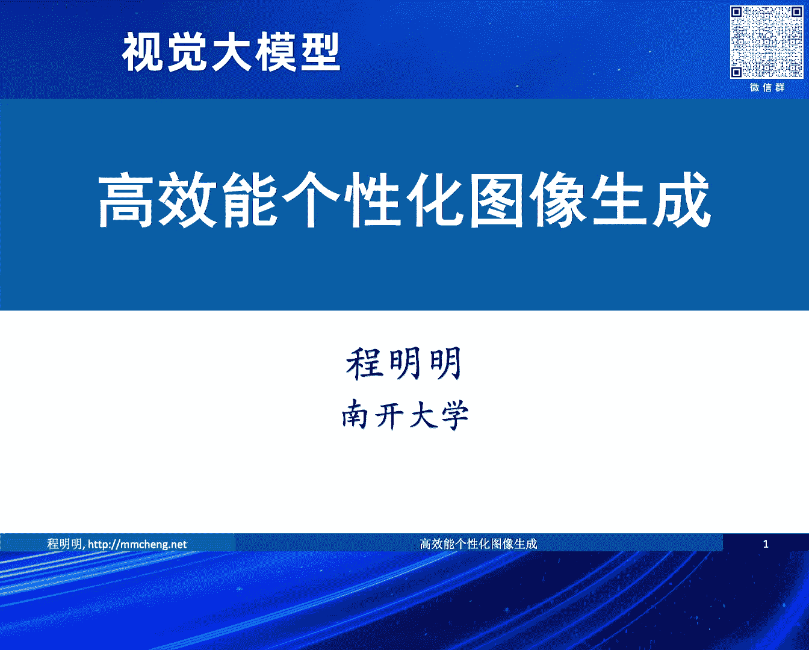

嗯在早在大概十多年以前，我们曾经就呃试图去做一些关于呃，怎么样去用文字去生成一些图像，呃，之前跟杨老师沟通，好像杨老师那时候也做过一些类似的这个探索，嗯其实在在十多年以前，这个问题还是挺难的。

因为那时候没有大量的这个GPU，也没有海量的数据，呃当时呢我们去做的是用这个呃，后来发现这个实在是没法弄，然后就变成这个呃画一些简单的这些sketch，然后变成用这个搜索，从互联网上搜索图像呃。

最后进一步的去合成，然后当时那个这个工作就受到了很多的关注，当时很短的时间内，在这个VIVO那个平台上，然后就有100多万的这个浏览，然后来我们还拿到了法国政府办的，办的一个论坛的一个奖。

当时还以为是个诈骗电话呢，反正后来真是邀请我们去法，法国巴黎参与领一个奖啊，当然这个事情的话呢，呃可能和现在当然可能对，现在的这样一些文生图呢，只是说呃我们早期试图去做一些探索，当然可能跟现在从结构呀。

从这个方法上有非常大的区别，呃现在的这些方法大家也都比较熟悉，基本上都是基于diffusion的这样一个模型，呃，由于刚才其实几位呃老师在介绍过程中，已经呃讲的比较多了，然后这里我就不赘述，呃。

我今天给大家汇报的其实是呃，关于这个我们在高效能，个性化图像生成方面的三个工作啊，一个是说嗯目前来讲，这个其实好几个报告的讲者都提到了，说呃我们现在的这样一个diffusion。

这一系列的这些模型训练起来，这个整个的这个对资源的消耗嗯，是非常非常之巨大的，呃这个我们有一些呃跟杨老师合作的，做这个呃训练加速的这一块的一些工作，呃，另外一块呢就是呃，我们也希望我们的这个图像的。

这个生成的模型呃，它不光是说哎生成一个比较有呃可爱的，或者说生成一些这个呃可能看着比较高质量的，另外呢，我们也希望他有比较强的这种个性化的能力，呃因为呃我个人感觉从应用的角度来讲。

现阶段呃我们的这个图像的这个生成的模型，可能要去做一些非常严肃的事情，或者说一些非常精确的一些符合物理规律啊，之类的事情，可能还有一定的困难呃，更多的我个人感觉在应用的层面，可能更多的还是泛娱乐化的。

这些应用，可能会呃更贴近于可能近期的一个实现，所以呢在这种情况下，可能用户的这种参与感，或者用户本身在里边能够起的这个个性化的，这些东西可能会比较关键，那呃这是一个我们的一个大致的一个判断。

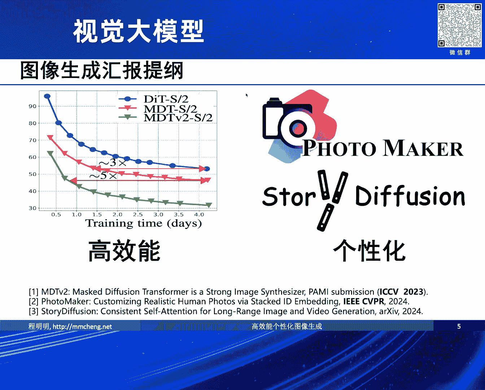

然后从这一点来讲的话呢，其实呃我们去尝试去理解现在的这样一个，图像生成的模型之呃的时候呢，我们其实会看到，其实啊现在很多的这些视觉模型，有一部分呢是呃，呃早期当我们可能想想学习各种各样的表征。

比如说通过这个V呃VE啊，通过各种各样的一些呃方法，我们想是去学习各种各样的表征去理解图像，然后近近期的话呢，可能更多的人呃在尝试说，我们通过这个文字或者通过多模态的信息，然后去做这个生成啊。

这个理解和生成呢，我这两个呢应该是原则上来讲，这两个应该是能够去相互促进的，嗯基于这个观察的话呢，我们会发现，其实呃现在的这样一个呃，呃diffusion这一系列的模型，比如说这个DIT呃。

diffusion transformer的这样一个模型，我们会发现它去当我们去利用这样的一个模型，去训练呃，它如何去生成一个高质量的图像的过程中，呃，我们会发现，其实它需要的这个迭代是非常非常之多的。

呃比如说这是这个这里边有一个简单的例子，就是我们试图用呃，生图像的生成模型去生成一个去去训练它，去生成各种各样的一些图像物体，比如说这是一个生成这个小狗的一个例子，会发现经过好多次的这个迭代。

DIT的话呢，依然虽然它的细节是很容易搞清楚的，就像最开始我们给大家展示的那个图一样，哎他其实define的模型特别擅长去处理，独立的这样一个主点的这样一个噪声，它去去除这样一个局部的噪声。

是非常非常容易的啊，它可能最开始设计的时候，就是呃是考考虑的那种场景，所以呢可以看到经过非常少的迭代呢，这个小狗的图像里边的各种各样的细节，各种各样的局部其实都挺好的。

但是呢嗯你可以看到对于人来讲的话呢，它其实有很大的问题，比如说它呃少了一只眼睛或者少一个鼻子，那这个的话呢就是它缺少了一些结构化的信息，呃，所以呢我们呃就是说他观察到它缺少这种context。

的这样一个RERELATION的这样一个建模的能力，那因此呢我们希望说呃，既然由于这个嗯缺少这样一个建模的能力，导致他可能这个训练需要的这个时长，会非常的长，那有没有可能我们去强化它这块的建模的能力。

进而呢去呃增强它的这样一个训练的一个效率，迭代的这个收敛的一个速度，那从这个角度来讲的话呢，我们就在想说呃，有没有可能把这个mask的auto encoder，MAE的这样的一些呃呃能力哎。

给它引入进来，去强化它的这样一个呃结构化建模的一个能力，MAE呢大家可能都比较熟悉，他是何凯明提出的一个去呃，做这个语义表征学习的这样一个工作，然后呢这样的一个工作，从他的这个呃。

反正从他这个里边最重要的这个图，就大家就很容易能够看出来，就是呃它是一种这个无监督的，而对于输入的图像，它随机的mask掉一部分，然后他试图去通过这个呃，没有被mask的这些部分去提取一些特征。

然后进而去恢复被mask的这样一些区域呃，从这个示意图大概大家不难看出，就是呃这样的一个模型呢，在学习图像的视觉表征的过程中呃，肯定需要去建模这个图像里边，不同patch之间的相互的关系，呃。

如果没有这种对PH之间，上下文信息的这样一个建模，它是不可能把中间的其他的空洞给补起来的，那所以呢我们认为这样的一种能力呢，它能够很大程度上去嗯，强化我们对这个patch之间呃。

上下文关系的一种建模，那基于此的话呢，呃我们就提出了一种新的一个工作，就是说呃我们希望能够把刚才我们的MAE，mask auto encoder的这样一个机制呃，引入到我们这个diffusion的这个。

训练的过程中来啊，希望呢呃在这个training的过程中，我们希望把这个mask modeling的机制引入进来，哎，这样的话呢它能够去加速define模型，在训练过程中对上下文建模的能力。

进而加速它的这样一个模型的收敛，在inference过程中呢，我们也希望说这个过程呢尽量的平顺，跟以前DEFENCE一样，然后它不额外的增加这个学呃这个推理的速度，那个左边呢是我们的这样一个左。

下角呢是我们这样一个方法的一个，大概的一个流程嗯，对于一个这个LYY的一个latent的表达，然后我们做做一个mask的这样一个机制，然后mask剩下的这样部分。

没有被mask这样一些latent的表达，然后我们可以去把它送到一个一个非对称的，一个diffusion transformer啊，为什么提它是个非对称的呢。

是因为它在training和inference阶段，是有点不太一样的，呃在training的阶段呢，我们不给它完整的这个latent，然后我们希望通过MAE。

也就是说通过mask auto encoder的机制，让他去做一些推理，哎这样的话呢，加强它表征里边可能相互之间的这种联系呃，contest的这种联系啊，在这个推理的阶段呢。

我们就像一个正常的一个full latent一样，整个整个把这个latent的表达整个全部送给他，然后呢，希望他正常的去能够去根据这样的一个latent，做这样一个图像的生成。

嗯对于这个ASSEMMETRIC的这样一个diffusion，transformer来讲的话呢，它整嗯刚才我们也提到了，它主要是在这个training和inference阶段不太一样，呃。

training的阶段呢，就是呃整个它可能呃他是需要去做这样一个呃，对mask调区域的这样一个inference。

然后再在这个呃infer阶段就直接就过了，相当于是它还是像原来的那个DEFENCE那样，一个一个结果呃，当然在这个过程中呢，我们会发现说呃这个呃可能需要的这个呃，在这个我们刚才讲的这个就是重构它的。

这样一个mask调的区域的这个过程，我们把它叫这个set intepreter，然后会需要发现它不需要太多的这个block，然后就可一个一个一个不不太大的这样，一个block啊。

去尝试去建模它的这样一个上下文的关系呃，更多的是引导他的这个视觉表征训练的过程中，关注可能其他的这样一些PH之间的信息，关注patch之间的这种一致性，嗯这样的话呢就构成了我们刚才所说的这个呃。

mask的diffusion，transformer的这样一个一个工作，呃，进一步我们其实也发现说嗯，这个因为我们刚才提到的很多次，这个所谓的这个上下文的这个信息的建模啊，一提到上下文。

大家可能会很容易联想到在视觉里边，我们经常一提到上下文呢，就就就不不免跟另外一个词会强相关，就是跟这个多尺度会强相关，哎我们通常来讲可能很一一说，上下文就会需要有个特别大尺度的信息。

然后去理解这个所谓的这个上下文的信息。

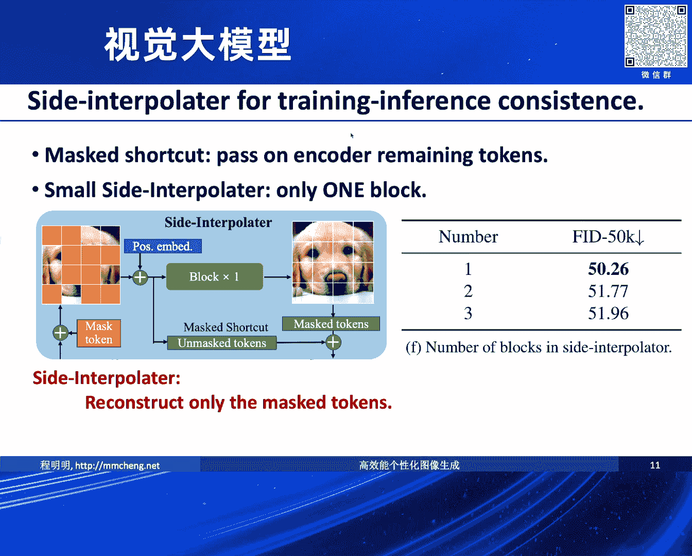

那因此呢我们近期对这个呃模型，MDT的这样一个模型做了进一步的提升，就是把这个是多尺度的建模的能力，通过一些skip collection啊，通过这些单词的这种collection啊。

把这个多尺度的建模的能力，给它再进一步的加入进去呃，加入进去之后呢，我们会发现整个的这样一个MDT的，这个模型呃，相对于之前的这个DIT的这样一个模型，我们去呃去做这个图像生成过程中。

我们会发现它的这个训练的这个速度，不论是迭代的这个次数还是实际的耗时呃，都会得到非常大的这样一个增强，呃，比如说这个呃MMDT的这样一个V1版本，我们相对于这个DIT增加了这个三倍的这样。

一个速度的这样一个提升，然后另一方面呢，就是说呃，这个如果我们进一步的去考虑这样一个多嗯，多尺度的这样一个呃连接哎，能够进一步的将模型的训练的这样一个效率，提升大概五倍啊，整体上来讲。

比如说我们要达到同样的这个quality嗯，基本上我们可以提速提速大约十倍以上，哎，这个还是一个非常大的这样一个，速度的一个提升，这样利用这样的一个呃这样一个方法呢，我们也在这个呃EMNE呃。

在paper with code上，对，做这个EMNET这样一个呃，图像的这个生成的这个任务上，我们也嗯拿到了这个呃比较高的分数，拿到第一的这样一个分数呃，刷新了之前的一个记录呃。

可以看到就说有了这样的一个呃mask diffusion，transformer呢，它能够在很大程度上加快模型的这样一个，收敛的速度，能够让让这个context建模的能力啊。

must auto encoder这样一个context建模能力，和这个diffusion呃，非常强大的，对细节的这样一个呃生成的这样一个能力，进行一个结合，嗯另外呢就是说呃也可以看到。

就是说呃整个这个deep呃。

这个呃只需要一个非常小的这样一个模型，就可以完成。

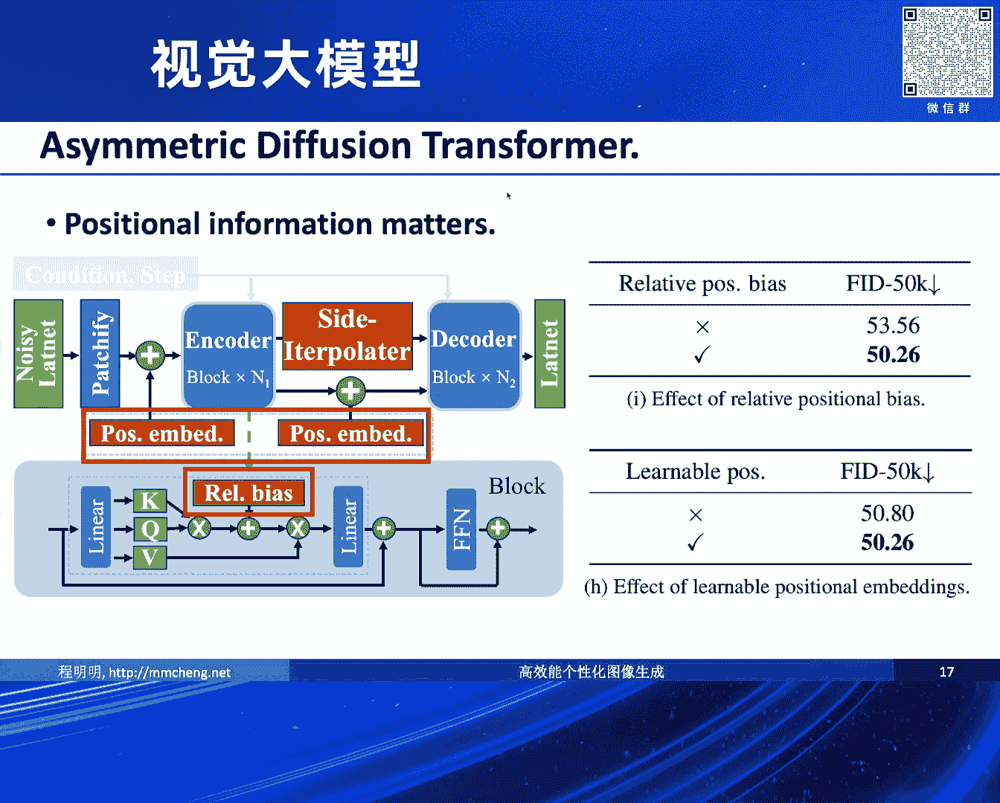

另外一个就是我们会发现这个position information啊等等，也做了一些这个abolition study吧，呃详细的这个细节我就不展示展示了，就说这里边有不是呃。

有挺多的关于这个结构的设计的。

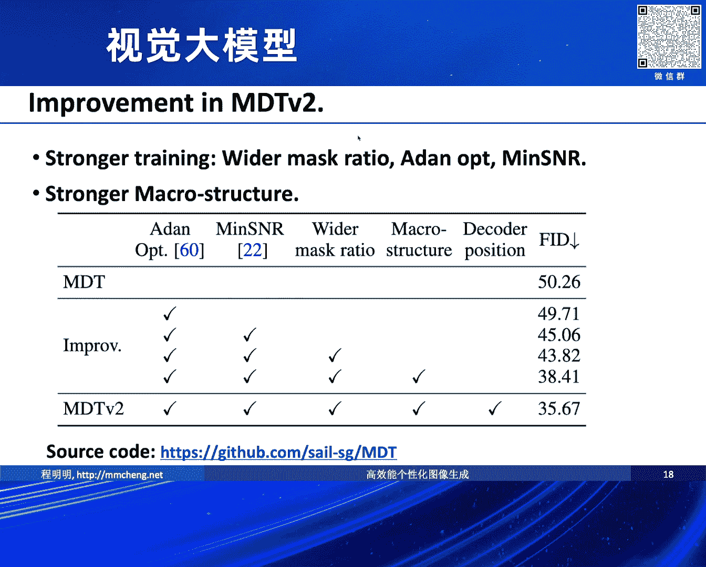

一些细节的信息信息嗯，在论文里边也有啊，另外一个就是呃我给大家想汇报的，一个是关于这个很个性化的图像的生成呃，关于个性化的图像生成呢，我们嗯近期呃今年年初的时候做了两个工作呃，就是开开呃开源了两个工作。

一个是这个叫做photo maker，这个是我们跟这个呃腾讯合作的。

另外一个是这个story feeling，是我们跟那个头条去合作做的一个工作，嗯这个这样一个工作呢，这个被了困，然后转了之后呢，非非常火，大家好多人去去尝试，就是曾经一度在哈根face上。

第一和第二的都是我们这个方法呃，第一是我们这个方法生成自然图像的，第二个是我们这个是这个方法，生成风格化图像的，然后在这个GITHU呀，还有在这个paper with code上。

都呃有比较呃多的这样一个呃信号啊，或者是大家的这个呃关注呃，这个这个工作的话呢，其实受启发于我们这个CPR，去年的best student paper叫dream booth呃。

他是做这个个性化图像生成的，一个非常重要的一个工作，哎，它需要嗯它可以给定一些少量的一个example，然后呢能够让这个模型在生成的过程中，能够去更多的生成个性化的呃。

跟这个实物图sample相关的这样一个图像呃，当然刚才居然也演示了这个zero shot这个能力啊，当然这个工作可能有了这样一个图像的话，它可能跟这个个性化的和这个个性的，这个信息可能会更多一些，呃。

当然针对这样的一个呃dream boss这样一个方法呢，它需要对这个呃输入的ID图像呢，进行很多的这样一个迭代啊，需要的这个时间呢是非常长的，就是它它的这个方法的话呢，他直接去呃。

从这个sample图像里边去抽取个性化的信息，然后再去呃，某种意义上需要微调整个这样一个呃生成的嗯，啊，所以呢它这个呃整个的这个时间呢。

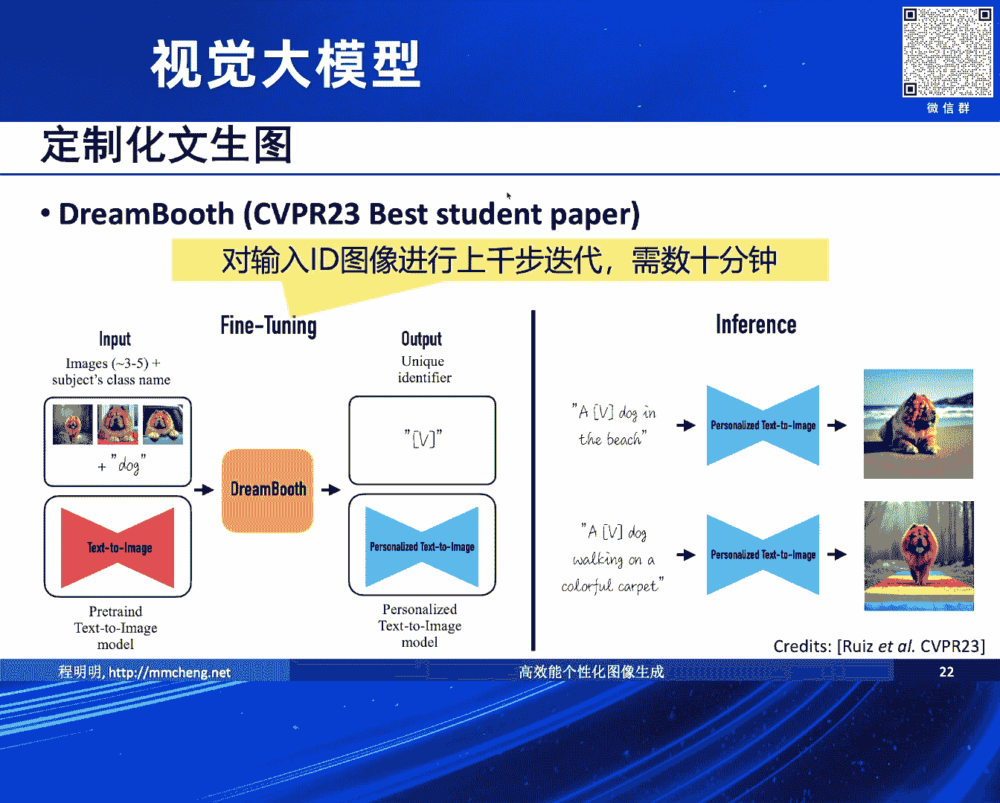

是非常长的啊，虽然后呃也有很多的些方法尝试去加速呃，但是呢毕竟你需要微调整个的这样一个模型，它的这个时间呢还是很难避免的。

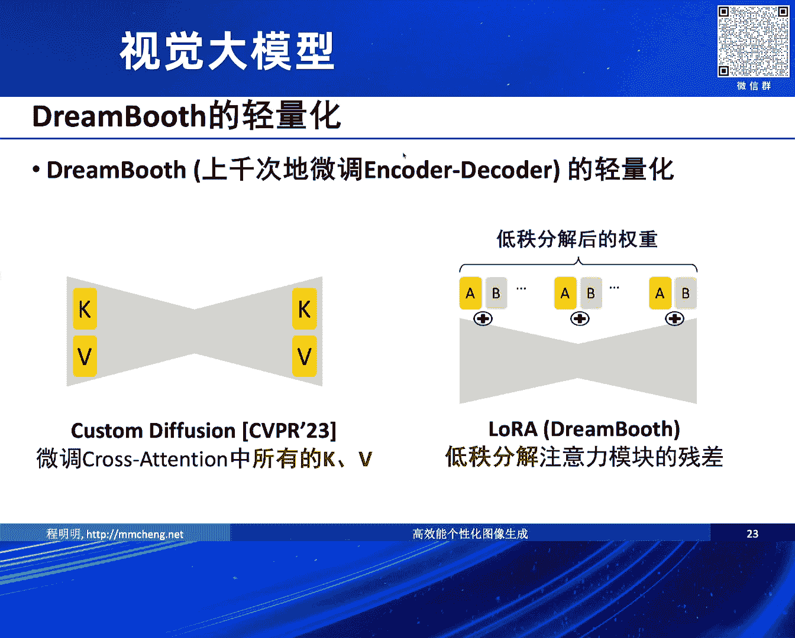

这个事情呢还是在过去的一段时间，受到了非常多的关注，呃，在GITHUB上也开源了很多特别相关的一些工作，哎，可以看到这些这些工作呢都有上千个，star的这个新标也受到了大家的一个广泛的关注，呃。

另外一些的就说呃，这个工业界也是生成了很多相关的一些应用呃，比如说加这个呃，利用大家利用这个dream boost这样一些能力和呃，结合这个LAURA等等，催生了巨量的这样一些应用。

嗯这个国内比较的就是这个妙压相机，它可能需要人去上传，大概呃20来张，这个比较高清的高质量的一些图像，然后有了这样一些图像之后呢，它就会给你生成一个这样一个模型，呃，这样的模型之后呢。

你可以去定制化的通过做一些这个纹身图，比如说生成跟自己相关的哎这个纹身图嗯，当然我们看到一方面呢是有很多这样的工作，但另一方面呢，这样的工作呢依然存在着呃不少的挑战，呃。

这些挑战呢其实最主要的一个呃表现呢，就是它的这个资源消耗呃，这个如果我们希望去微调整个模型的那一类的，这些方法呢，它的这个自然消耗呢通常是呃比较多的，呃，比如说在这个刚才说的那个妙压相机，他就提到说嗯。

你建议用户上传20多张，这个高质量的人脸的照片，然后呢可能需要等半个小时之后再再来看，结果啊，它背后呢需要很多张这个呃高大显存的显卡，然后呢而且等的时间呢通常按小时半小时算，或者至少几10分钟算。

然后我们当时就希望说做一个这个呃速度，用户可以接受吧，就是比如说我们十秒钟的时间，这也是为什么那个在HAGPACE上会那么火，因为大家可能大部分用户，如果说你要去等时半个小时才能出结果的话。

大部分人是等不起的啊，另外呢我们这个方法呢，它对这个显存的消耗呢也不大。

可能一个消费级的显卡就能做，然后另外还有一个就是这个方法呢，对这个呃输入素材的这个质量啊，它要求并不是很高，当然同期呢也有很多其他的一些工作啊，试图去呃避免这个test time。

Opera optimization，测试时对整个模型的这样一个优化，呃，包括这个adobe啊，OPPO啊，google啊，m i it啊等等，但同期有很多的这样一些工作呃。

但是呢这些工作里边开源的相对比较少，另外呢呃它生成的质量相对会比较低，然后它这姿姿态呢比较单一，嗯后面我给大家介绍方法的时候，也会详细的去汇报，为什么会产生这样的一些呃这样的一些问题呃。

大家可以看一些这些example，大概也能理解说这个问题里边，我说的这个呃生成质量比较低，姿态比较单一的这样一个表现，表观上的一些特点，一些一些一些样例吧，呃这类工作的话呢，他之所以有这样的一些问题呢。

是因为嗯它输入图像呃，和target的图像呢往往来自于同一个图像呃，比如说你看这个输入的这个图像，哎，我们从这个输入的图像里边呢，去提取一些微弱的这个表征，然后呢根据这些微弱的表征在训练的过程中呢。

我们希望它去生成一个呃，根据这个微弱表征，去生成一个target的图像的过程中呢，其实这个微弱的这个呃这个表征和这个target图像，它本质上来源于同一个图像，单一的这样一个embedding。

这个单一的embedding呢可能会存在一些问题啊，就是说我们是希望他去记住个性化的信息，就是它它把它去能够去用到这个图像里边，呃，我们所表现出来的这些所谓的个性化信息，具体来说。

像这里边我们就想应利用这个人的特点，但事实上呢，其实整个模型其实它很难去去确定出来，你到底是想要的是这个人呢，还是想要这个人的姿态呢，还是说这个人的这个图像照的很不清晰，你想要这个很不清晰的这种风格呢。

其实他是很难去把这个事情搞清楚的，所以呢他这个方法呢，在很大程度上缺乏这个可嗯变化性，也很难去改变人脸相关的一些姿态呀，一些其他的一些属性，因此呢生成的这个结果呢相对比较单一，然后呢我们的一个方法呢。

就是说我们希望他能够去呃处理，就是输入的这个图像啊，就是我们输入的这个图像embedding啊，我们同的里边不是一个图像，而是一组图像得到一个stack的i d embedding。

我们希望从这一组图像里边，他关注到跟这个人个性化的信息，比如说人脸的属性等等的，这样一些个性化的信息，然后进而呢输出的这个图像呢，呃这可不完全是刚才那个一一对应的那个图像。

这样的话避免了这个对这个姿态呀，或者图像退化的一个记忆，然后更多的去关注这个人脸的一个属性，那我先给大家看一下这个结果啊，就说啊有了这样的一些呃模型之后呢，就是有了这样一个能力之后呢。

我们可以很容易的呃，去根据少量的这个sample的image呃，去定制化的去生成跟这个人相关的，或者说具有这个人的人脸属性的呃，一些这个图像呃，可以向右边呢我们就可以生成说。

i hen带着一个a man，Wearing a christmas hat，然后戴着一个声带帽的一个场景，甚至可以生成一个a boy，或者我们关键词换成一个boy，然后呢。

呃这个生成他小时候的个小孩的这样一个照片，然后我个人觉得这个还是蛮像的啊，我估计亨森自己也没有这样的一个图片，嗯小时候也没没拍过这样的图片，嗯就是呃这是另外一个例子，就是就是说呃这样的一个方法呢。

因为呃我们是从多张图像里边，去关注人脸的属性，呃所以的话呢他没有去记住，可以看到这个例子里边，他没有记住这个图像的退化呃，嗯当然这个这个是梵高的图像啊，梵高我们也不可能要求他去拍一个，高清的照片了。

然后高质量像像这个其他的一些app里边，要求他拍高质量的照片，那可以看到就说这里边没有记住更多的这个呃，这个图像退化的信息，像油画里边，你可以认为是一个非常低质量的这个呃，这个自然的图像嗯，然后呢。

我们可以说哎这个呃在电脑前面写代码呀，或者骑着摩托车呀，可以生成很多的这个具有个性化的这样一个，图像的信息啊，甚至不一定得是图像啊，甚至是一个三维的模型啊，一个石膏的像，然后石雕像嗯。

拍一个照片也能够去体现这个人的个性化的，一些信息哎生成，比如说这个柏拉图呃，穿着宇航服呀，或者戴着耳机的这样一些图像，而且呢当我们去呃，给定就是我们有这个呃multiple的这样一个图像。

去表征呃这个人的这个ID的时候呢，呃很多时候呢也嗯训练的时候，我们当然是用同一个人的一组图像去做的，希望他能够关注人的这个ID的属性，但是在测试的时候呢，可以不可以。

不是仅仅只有一个图像的这样一个一个ID的，对应的这个图像在测试的时候呢可能是多个，比如说像把这个演员和某一个卡通的人物，做一个合成呃，就能够呃比如说呃合成出来这个人去演。

比如说白雪公主的时候的这样一个照片，那就从方法方法层面来讲的话呢，就是说呃我们的这样一个方法呢，是呃这个多张图像迭代，送入到一个stack ADD embedding呃，就给到给定多张图像，然后呢。

从这个通过image encoder去提取这个image embedding，然后呢进一步呢把这样的一个in beiimage，embedding呢，跟这个文本里边的这个这样一个关于图像的。

这个这样一个描述，结合而得到一个stack id embedding，这样的一个stack id embedding呃，替呃就说呃替换掉里边，原来我们就就往那个文本里面插入的。

这个普通的这样一个视觉的表征，哎，就能够去让它去影响这个DEFASION的模型啊，我们这个呃这样的话呢，我们就不需要说每一次给到一组图像，我们都要微调整个defer模型，而是说哎，我们是我们希望说。

我们的这个关于图像里边的信息，都成为这个stack edd embedding呃，输出的里边的包含这些信息，不用每个人再去根据这个图像，再去微调整个模型，因而呢它的这个速度可以呃，得到很大的这个提升。

嗯可以嗯包括这个测试的时候呢，就可以用多张的图像去做成不同人人的这个，ID的混合呃，很多时候呢呃另外就说呃，我们还需要有一个这个自动的生成，数据的这样一个流程，为什么呢。

因为呃我们希望得到很多关于同一个ID的，不同的图像的这样一个数据，呃，当然现有的这些数据集并不足以去支撑，我们去做这样一件事情啊，因此呢我们搞了一个数据数据组装的一个流程，以人为主体嗯。

具体来说呢我们就从互联网上下载，很用人名去下载很多的图像，做一些过滤。

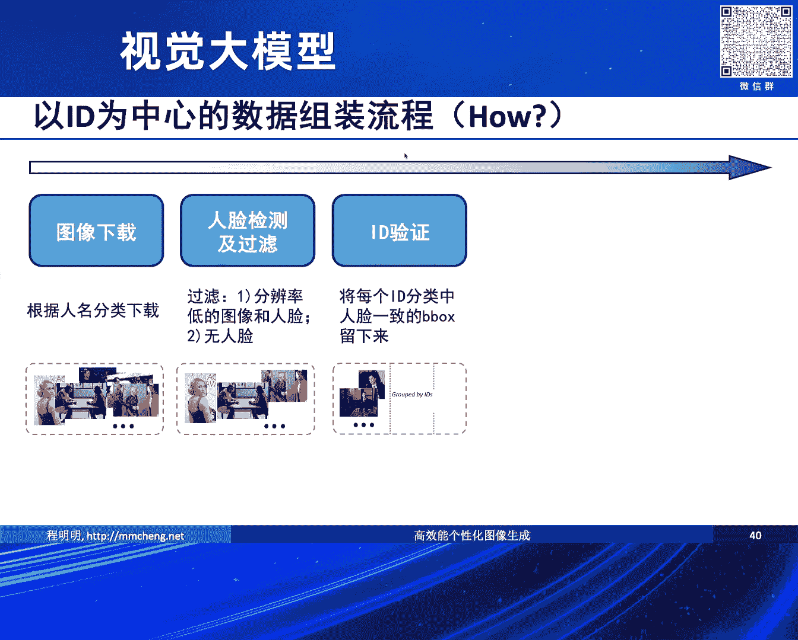

然后做一些人脸的ID的验证，然后做一些这个分割裁剪，并添加这个文本的描述，呃这样的一些工作呢都还比较常规吧，就是利用现有的这些工具啊，我们去组合出来一个数据集，让这个数据集是以人物ID为中心的。

呃里边大概有1万多，这呃一呃1万多的这个呃，1。3万张的这样一个人物的ID，大概11万的这个图像也不是特别大吧，啊用这样一个东西去呃，训练，我们刚才所说这个方法去得到这个人物属性的。

ID的这个呃stack的i d embedding，哎这样的话呢我们能够在保证快速的同时呢。

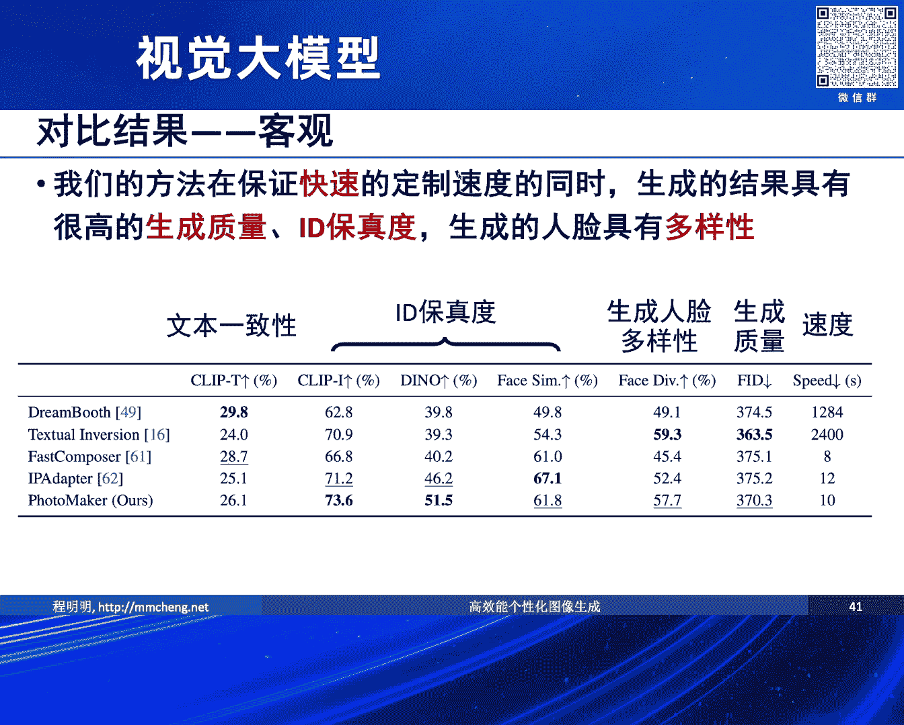

生成的结果具有高的生成质量，ID的保真度，还有这个人脸的这样一个多样性，呃这是一些评测的一些结果和user study，我就不详细的去展示了，哎看看到就说有了这样一个ID，这呃有了这样一个呃呃放之后呢。

相当于说他能够去记住这个人的这个，关键的一些属性啊，我觉得感觉跟这个呃，跟这个呃，我们人对这个人物的这个关键属性的理解，还是比较一致的，然后甚至可以去换一些这个提示词，然后呢。

可以甚至可以去只有一两张的这样一个图像，不用太高的质量，也能生成非常高质量的这个图像嗯，可以看到就说比如说像这里边，像梵高的这个头像啊，这一基本上只有少量的这个人物，ID的这样一个信息。

然后我们就能够去生成非常高质量的呃，牛顿的一些图像呀，甚至更多的呃，由于是呃我看好像时间嗯不剩的不算太多了啊，我就讲的快一点啊，这里边甚至可以通过这个prompt，waiting的机制啊。

我们可以把多个图像，比如说20%的奥巴马，百分之这个80的拜登等等去，可可以做一些混合多ID的混合啊，有了这样一个混合之后呢，也可以玩出更多的花样，呃，这个整个在ID的表征度呀等等。

我们会有一些嗯嗯有一些优势啊，除了速度和资源的这样一个消耗以外呢，这样的方法呢，还对这个输入图像的质量和清晰度，没有太严格的限制，没有把这些图像的退化给学进去明，嗯我们在这个实验的过程中。

没有发现特别明显的这个OVERFITTING。

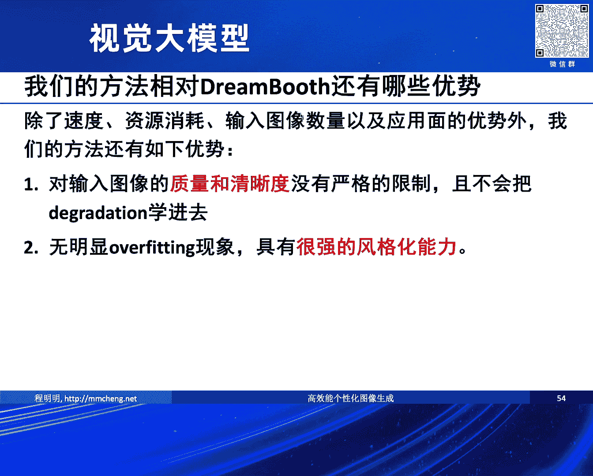

然后也能去做一些很强的一些，风格化的这个生成呃，这是一些风格化生成的节点，我给大家就简单的展示一些事例就可以了，那最后一个工作呢是这个story diffusion。

嗯这个story diffusion呢，我们也试图去做一些这个呃，视频的生成的一些结果，在这个嗯，就是我们也能希望能够生成一个呃，具有一定一致性的这样一个动画，或者长的长一些的这个视频。

哎嗯啊写那个这个这个工作，这次又被乐坤给看到了，然后又帮我们转发了一次，然后特别感谢啊，免费的帮我们做一个广告，然后这个也是在非常短的时间内，这个545月4号的时候他转化了一下。

很快可能一个一周多就大数超过了3000，然后呢，那我们是期望说用较少的资源做比较长的视频，呃。

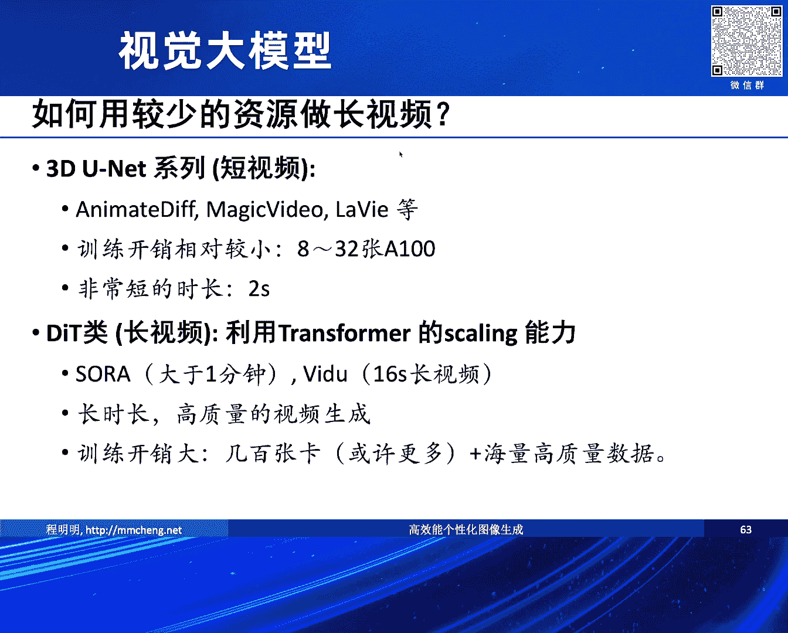

刚才几位也做了详细的分析，我就这里就不展开了啊，我们大概的这样一个方案呢，对对已有的方法我就不展开了，然后我们大概的方案呢，就是一个两阶段的视频的生成方案，期望呢能够用较少的资源去生成。

比较长的一个视频，嗯这里边大概包含两个部分，我们第一步呢是希望能够生成一些关键帧，然后呢把这些关键帧呢串起来，给它得成一个视频，呃，当然呃要从关键帧能够串成视频呢，你这个关键帧肯定得具有一定的一致性。

否则的话呢你可能A图还是张三隔了五针，隔了20帧就变成李四了，那基本上没法串起来嗯，所以呢我们需要有一个比较强的这样一个，一致性的图像生成的一个策略呃，另外呢就是说关键帧去串成一个视频呢。

它不光是说时间维度上的一个超分呃，以前我们一般讲这个关键帧的，这个超时间维度的超分呢，比如从20帧超到30帧，这个图像生成的，那可能相当于说从这个呃个位数的，这个从从一帧两呃。

一一帧两帧超到这个什么60帧，或这种或者甚至更长更夸张，所以呢我们需要建模。

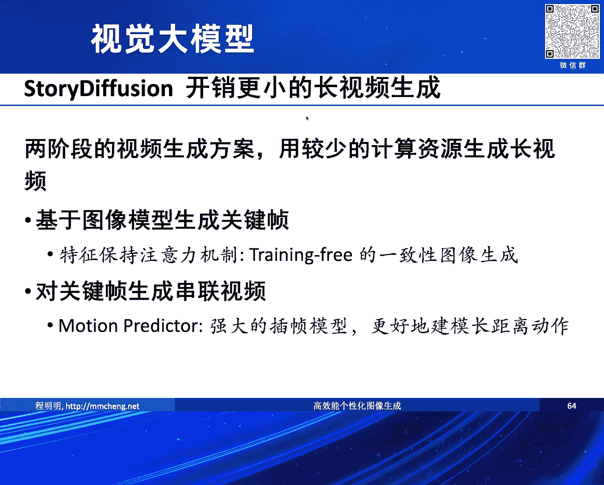

更强大的这个插针的一个能力，那简单来讲就是说比如说给定一段故事，一段文字来描述一个一个视频，然后我们可以把这段文字呢生成，分割成若干段话，若干句话，每一句话呢它会生成一个关键帧。

当然在这个关键帧的生成过程中呢，我们提出了一种叫做特征，保持自注意力的机制呃，相当于说根据其他针呃，它同期生成的其他针得到一种特征，保持的自助意机制呃，使得我们整个生成的不同帧之间。

具有比较好的这样一个相似性和相关性，呃，另外一方面呢，就是说即使有比较还不错的这个相关性，比如说像左边哎，我们用这个坑嗯，这个一致的这样一个attention，生成的一些两个图像。

这两个图像呢如果我们要通过插值的方式，把它变成一个视频的话呢，呃如果用传统相对来说，基于类似于光流的这样一方法，它结果会是非常差的，是因为呃其实左边这两个图像呢，虽然应该算是同一个人。

还比较一致的一个图像呃，但是呢呃它没法做到像素级的光流的，这样级别的这样一个对应，因为它可能很多地方遮遮挡了，很多地方看看不见了，所以你试图去用这些方法去插针的时候呢，他肯定那个视频就没法看了。

哎我们就提出了一种新的方法叫motion prediction，A predictor，那这个mamotion predictor呢就是它的，其实呃希望他能够去建模这个呃，大幅度的一些动作的变化。

嗯比如说在现有的一些视频生成模型中呢，其实呃是超值呃，超分的过程中呢，很多时候我们通过这个TEMPORATTENTION啊等等，去在每一个空间位置呢独立的去计算，然后呢，呃它其实很难建模一些全局的信息。

和大的一些动作，哎，我们这个方法呢，相当于说直接在语义空间里边做插针，然后语义空间中插值，插针完之后呢，我们把这个表征呢再投射到这个图像空间，哎，这样就避免了对限速级的这样一个这个呃。

对应关系的一个建模呃，能够去建模比较嗯，比较大大的这样一个幅度的一个动作。

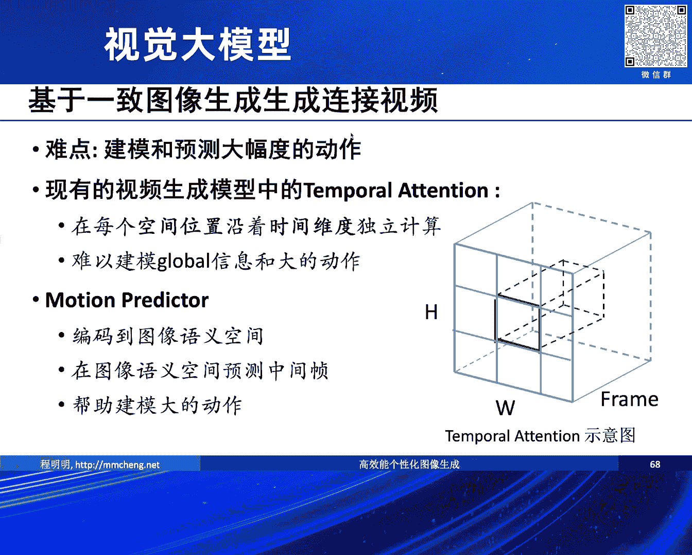

然后整个的这样一个方法呢，呃这个呃就是可以利用原来的一些很多的这个。

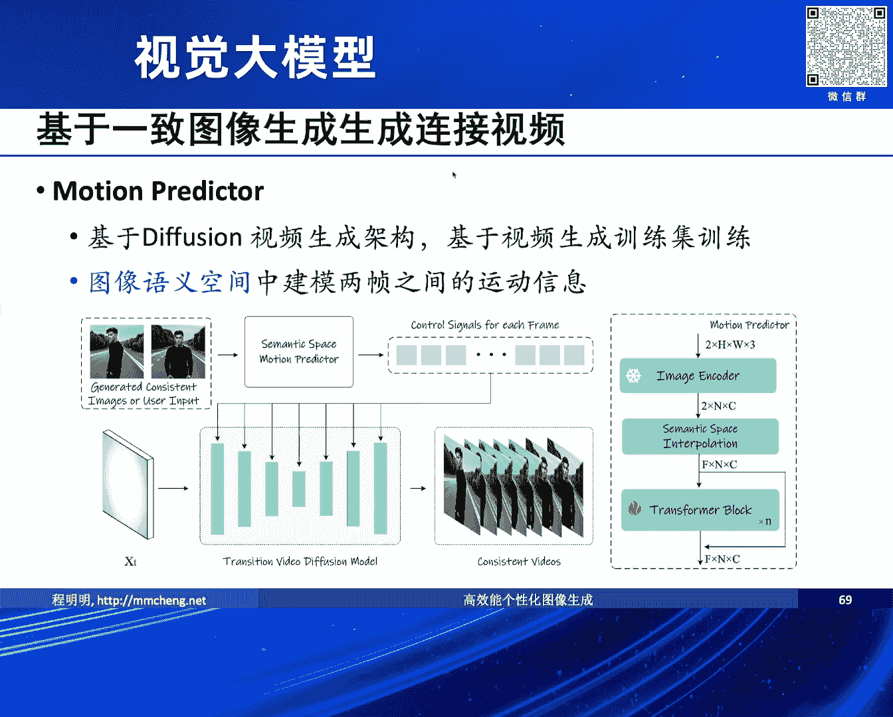

数据去做一个训练，呃，这是一些结果的一些展示，就说可以看到，就是它生成的这个人的这些动作呀，人脸呀没有一个非常大的这个扭曲，然后能够做比较呃，不错的这样一个视频的这个生成哎。

这是更多的一些转场视频的这样一个，生成的能力，哎，它可以把不同的这个关键帧给它插起来，变成一段这个视频啊，当然可以看到也有一些不尽如人意的地方，比如说右上角那个图像，就是虽然可能两个关键帧之间。

看着还比较这个一致，然后但是呢在转场过程中，他那个发型也好像也发生了一些变化，呃但是呢如果说是我们要求不高的话，如果我们拿它来做一个这个呃，这个比如说连环画生成的话，那这个一致性就非常好了，就是我们呃。

从如果从娱乐化的这个体验来讲的话呢，如果用用它去生成一个连环画，唉这个还是结果非常惊艳的，然后呢比如说做一些卡通的风格呀，甚至引入一个reference image，做一些定制化的这个连环画的生成呃。

甚至可以用它来讲个故事，比如说以前去创作漫画，这个漫画是需要一帧一帧的一个图，一个图的去画，其实挺麻烦的，那我们现在可以去嗯自动生成一段文字，然后再自动给这段文字配一段这个啊图像。

然后呢就生成一个连环画啊，相信这两个连环画呢，大家可能大家大概瞄一眼也知道是什么故事啊，这个这个会非常的这个图文并茂啊，最后呢做一个简单总结，就是呃我们这个我感觉啊。

图像的生成可能最早是通过文娱的行业呃，走进普通的用户，然后大家觉得这个事情有趣好玩，然后呢嗯这个要解决两个最主要的核心的问题，一个是这个高效能的问题，因为你要面向很多的用户，你这个效能太低了。

这个卡受不了嗯，钱包受不了啊，另外一个就是个性化，就是让大家觉得好玩，你得跟这个人有关系，你不能说是只是看别人玩，自己参与不进去，这个可能会是一个比较麻烦的事情，另外就是说我们在视频和连环画的这个。

高效的生成的时候呢，也要关注这个一致性，然后呢另外就说呃大的这个动作的之间的插针，然后感觉这个AIGC呢，有望在很大的很多的领域，比如说这个漫画的创作领域，能够很大程度上的解放生产力。

但另一方面呢也给社会治理啊带来了很多挑战，以前我们经常说这个有图有真相啊，未来现在可能有视频都没真相了，也还是挺挺吓人的好。

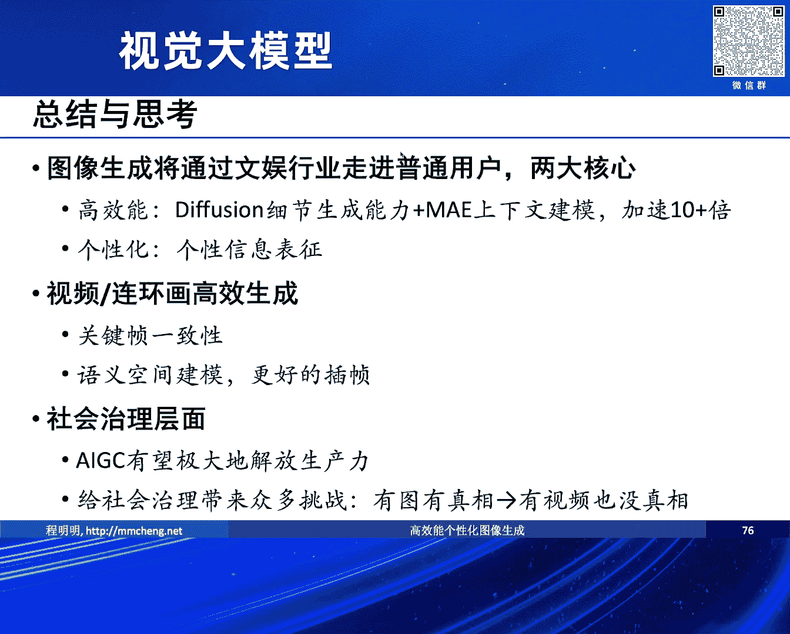

最后感谢大家，我们的这个工作呢都已经开源了，谢谢，好的谢谢呃，那个你们可以开始准备了，好那呃，我们给时间一到两个问题吧，哦对那个我我这还有那个可能屏幕给切了，再把那个代码对对对。

那个第一个工作非常有用啊，就是嗯我知道有很多公司的话，已经在用这个东西去去做这个视频的，这个生成了，对是是是那个极大的能减少对卡的需求，对对而且效果确实很好，我们大概两个问题啊，好吧，这位戴墨镜的吧。

诶呃谢谢教授，您的分享很精彩，呃我有个很好奇的问题哦，就是你提到了你们的motion predictor，刚才那个呃，包总他们也提到了他们做的那个4D的那个，但我看到你们的训练的数据。

好像主要都还是2D和2D结合文字为主，为什么没有大量的使用3D的数据来训练，这个这个对于motion的prediction不是应该更自然吗，哎我们有很多视频的数据在训练，是3D的吗，还是只是视频。

就你们会经过像mono depth，或者说俄罗都是视频的，嗯对我就很好奇，为什么不会直接引入3D的数据呢，嗯可能嗯这个事可能也跟这个就是呃，是不是开源的也不多，对对对对对。

就是相相当于说其实我们在高校吧，可能一般来说也不太倾向于去做一个特，别大的系统，把所有的部件都弄得说，这个事情最好我们就一定要用这个事情，我们可能更多的是希望呃找到一两个突破点。

从这两个突破点去展示某种呃技术，可能对这个事情会有帮助，呃，不一定会试图去尝试说这个流程里边，比如说ABC3个步骤，每个步骤呢都有更好的解决方案，然后呢我们都去做这个，从资源消耗上来讲。

我们从高校的角度来讲，其实对我们来讲是不友好的，然后工作量也会相对再大一些，所以我们更多的是找一个这个，大家觉得还不错的一个baseline，在这个baseline的基础上呃，我们去把我们的想法加进去。

然后看我们这想法，最后对整个base ne的这样一个改变呃，另外从高校的角度来讲的话呢，从这个比如说最终你去论述，你这个成果的过程中，如果你引入了太多的，你把这个步骤也变了，那个步骤也变了。

最后大家说不清楚，你到底整个这个最终的性能的提升，是因为哪个原因提升的，所以这个也是我们可能，高校去做一些工作的时候，可能跟企业界，企业界是说我这产品质性能越好越好，那我可能不用去论述清楚。

我这个东西到底是因为哪个不用搞得那么清楚，到底是因为哪个原因搞得那么好，对呃那最后一点，那那那或者换个方向问这个问题，可以可以请您评论一下，就是如果说我们有充分的3D的数据。

会对会对我们这样的模型有什么样的改善吗，哎我个人觉得如果有更多的这样一些数据，然后包括你也有足够的这个训练的资源，应该是有很多的这样一个呃改善的，呃，比如说像这个呃我们右上角那个图像。

那个视频的生成的过程中，大家可以看到，就是说呃，可能是因为我们没有太多的这个，3D的一些信息在里边，可以导致你看那个人在变化的过程中呃，我看一下啊，这个再播一下，就是这个人在变化的过程中呢。

你会明显的感觉到他的这个3D不太对对。